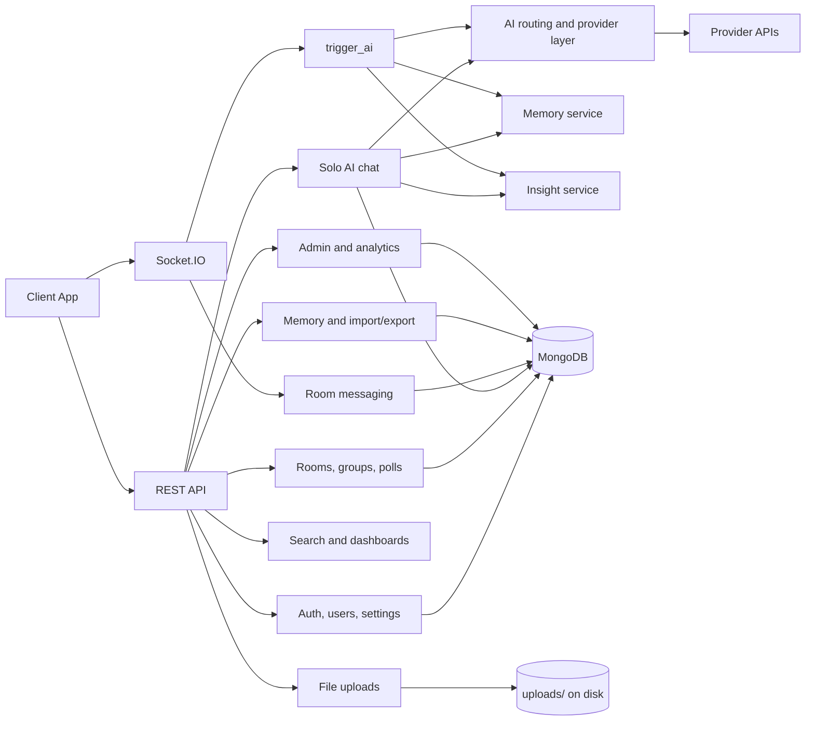

# ChatSphere Backend Project Presentation

## Executive Summary

ChatSphere is a backend-heavy chat platform built on Express, MongoDB, Socket.IO, and multiple AI providers. The repository in this workspace is the live server side of the product, so the backend is the core system: it handles authentication, user profiles, room collaboration, AI chat, memory, insights, file uploads, moderation, analytics, exports, and prompt management.

The most important architectural idea is that ChatSphere is not a simple chat API. It is an orchestration layer that combines:

- authenticated REST APIs for standard product workflows
- Socket.IO for real-time room collaboration
- AI provider routing across multiple model vendors
- memory and insight persistence in MongoDB
- upload and project-context injection into AI prompts
- role-based moderation and admin controls

## What The Backend Does

At a product level, the backend supports these major user experiences:

- account creation, login, Google OAuth, refresh tokens, password reset, and profile editing
- personal conversations with stored chat history
- group rooms with live presence, typing, replies, reactions, pinning, and read receipts
- AI-assisted solo chat through `POST /api/chat`
- room AI responses through the `trigger_ai` Socket.IO event
- smart replies, sentiment analysis, and grammar checks
- durable memory extraction and retrieval
- conversation and room insight generation
- project-specific context injection into AI requests
- file uploads and attachment-aware prompts
- message, conversation, and room search
- moderation reports, blocking, admin prompt management, and analytics
- export and import of user history

## Technology Stack

| Layer | What it is used for |
| --- | --- |
| Express | HTTP API server and route orchestration |
| MongoDB + Mongoose | persistence for users, rooms, messages, conversations, memory, reports, prompts, and insights |
| Socket.IO | real-time collaboration and room AI events |
| JWT | access token authentication for REST and sockets |
| Passport | Google OAuth sign-in |
| Multer | attachment uploads |
| Nodemailer | password-reset delivery |
| express-rate-limit | general API throttling and AI route throttling |
| AI providers | multi-provider LLM access through Gemini, OpenRouter, Grok, Groq, Together, and Hugging Face |

## Runtime Architecture

## Backend Entry Points

The runtime starts in `index.js`, which is the live bootstrap file. It:

- loads environment variables
- connects to MongoDB
- mounts all routes
- configures CORS and JSON parsing
- creates the HTTP server and Socket.IO server
- applies socket authentication
- initializes logging and request IDs
- warms the AI model catalog

This matters for presentation because the backend is not modularized into a separate app layer and server layer. The operational behavior is concentrated in one process, which makes the runtime easy to follow but also means in-memory state is process-local.

## Core Backend Capabilities

### 1. Authentication and Identity

The backend supports both email/password auth and Google OAuth.

Key capabilities:

- user registration and login
- JWT access tokens and refresh tokens
- refresh-token storage and rotation
- logout and password reset flows
- Google OAuth account linking
- profile and public-profile endpoints
- user online/offline presence tracking

Why it matters:

- the system supports normal consumer auth flows without requiring a separate auth service
- socket authentication uses the same JWT identity model as REST
- presence updates make room collaboration feel live

### 2. Real-Time Rooms and Collaboration

Rooms are the collaborative layer of the product. They support:

- room creation and deletion
- join and leave actions
- live typing indicators
- read receipts
- replies, reactions, pinning, and unpinning
- member roles such as creator, admin, moderator, and member
- member management through role changes and removal
- room-level search and export support

The room system is backed by both HTTP routes and Socket.IO. The HTTP API handles canonical room membership and configuration, while the socket layer powers live chat and AI interaction.

### 3. Solo AI Chat

The solo AI workflow is handled by `POST /api/chat`.

It does more than send a prompt to a model:

- validates the incoming message and optional attachment
- loads the user’s recent memory entries
- optionally loads an existing conversation insight
- resolves project context if `projectId` is supplied
- sends history, memory, insight, attachment, and project context into the AI service
- stores both user and assistant messages in `Conversation.messages`
- persists memory updates and refreshes conversation insights

This is the main example of the backend acting as an AI orchestrator rather than a thin proxy.

### 4. AI Helper Endpoints

The `/api/ai/*` endpoints provide lightweight AI features that are not full conversations:

- `GET /api/ai/models` lists available models and exposes the auto-routing option
- `POST /api/ai/smart-replies` returns three quick reply suggestions
- `POST /api/ai/sentiment` returns sentiment, confidence, and an emoji
- `POST /api/ai/grammar` returns corrected text and suggestions

These endpoints are gated by both request limits and user AI feature settings. That gives the product a controllable AI surface instead of exposing every feature to every user unconditionally.

### 5. Memory and Insights

The backend has a durable memory system and a separate insight system.

Memory features:

- extract stable user facts from conversation text
- store memory entries with fingerprints to reduce duplicates
- score memory by recency, confidence, importance, and usage
- retrieve relevant memories for new requests
- mark memories as used after successful AI completion
- CRUD endpoints for reviewing and editing memory
- import and export support for memory and conversation bundles

Insight features:

- generate conversation summaries, intent, topics, decisions, and action items
- generate room insights from recent room messages
- lazily fetch existing insight or regenerate when needed
- refresh insight after important events such as chat responses, room messages, edits, deletes, or AI triggers

This subsystem is important because it turns raw chat history into structured knowledge the product can reuse.

### 6. Projects and Context Injection

Projects let the user attach structured context to solo AI requests.

A project can hold:

- name
- description
- instructions
- context
- tags
- suggested prompts
- attached files

During solo chat, the backend can inject project context into the prompt so the model answers in a project-aware way. That is a practical backend feature because it allows the same AI engine to behave differently depending on the user’s task.

### 7. Uploads and Attachments

The upload flow supports authenticated file uploads with a size cap and MIME filtering.

Supported attachment types include common images and text-like documents such as plain text, markdown, CSV, JSON, XML, PDF, JavaScript, and TypeScript.

Backend behavior:

- uploads are saved to disk with randomized file names
- the upload endpoint returns a stable API URL to reference later
- AI requests validate attachment payload shape before using them
- text files can be read and injected into prompts
- images can be transformed into multimodal payloads for supported models
- PDFs are allowed but are only represented as metadata in this build

### 8. Search, Export, and Import

The backend exposes search and data portability features:

- message search across joined rooms with filters for date, AI messages, pinned messages, files, and file type
- conversation search by title and message content
- export of conversations, room transcripts, memory, and insights
- import preview and import for external chat transcripts

This is valuable in a product demo because it shows the backend is designed for long-term user data, not just ephemeral chat.

### 9. Moderation, Admin, and Analytics

The backend also includes platform operations features:

- reporting users or messages
- blocking and unblocking users
- viewing blocked-user lists
- global admin stats
- report review and resolution
- user search for administrators
- prompt template listing and editing
- message, user, and room analytics

This means the backend is production-oriented. It includes the controls needed to operate a community product, not just the user-facing chat logic.

## AI Orchestration Details

The AI layer is one of the strongest backend features in the repository.

### Model Discovery

The service layer refreshes model catalogs from multiple providers and keeps a process-local cache with a TTL. The backend can expose a unified model list even though the providers have different APIs.

### Auto Routing

The backend can choose a model automatically based on:

- request complexity
- whether an attachment is present
- whether the operation is chat or JSON output
- provider preferences and fallback order

### Prompt Construction

The prompt builder can combine:

- message history
- retrieved memories
- conversation or room insight
- attachment text or image payloads
- project context
- room metadata or user trigger context

### Fallback Behavior

If the selected model fails, the backend can:

- normalize provider-specific errors
- retry with other ranked models
- return deterministic fallbacks for helper endpoints
- persist an error-style AI message in room chat when room AI fails

### AI Guardrails

The backend also includes:

- request quota tracking
- route-based rate limiting
- user settings to disable specific AI features
- attachment validation
- room membership checks
- blocked-user checks in moderation-sensitive flows

## Key Data Models

| Model | Purpose |
| --- | --- |
| `User` | account identity, profile, settings, presence, blocked users, admin flag |
| `RefreshToken` | refresh token persistence and rotation |
| `Room` | room metadata, membership, pinned messages, AI history |
| `Message` | room chat messages, AI messages, reactions, edits, deletes, files |
| `Conversation` | solo chat history, project linkage, imported source metadata |
| `MemoryEntry` | durable memory storage with fingerprints and scoring |
| `ConversationInsight` | conversation or room insight summary and actions |
| `PromptTemplate` | database-driven prompt overrides |
| `Project` | context payload for solo AI requests |
| `Poll` | room voting and poll lifecycle |
| `Report` | moderation reports |
| `ImportSession` | import preview and import deduplication tracking |

## Why The Backend Is The Core Product

The backend is doing work that many chat products leave to the client or to a single model wrapper:

- it owns the full auth and identity lifecycle
- it stores chat, room, memory, and insight data durably
- it handles live collaboration and AI in the same runtime
- it manages prompt templates and model selection centrally
- it applies operational guardrails such as quota, rate limits, moderation, and presence

That makes the server the product’s actual control plane.

## Presentation Talking Points

- The backend is a unified control plane for chat, AI, collaboration, and moderation.
- AI is not a single endpoint here; it is a routed subsystem with memory, insight, project, and attachment context.
- Room AI is real-time and stateful, while solo AI is request/response and conversation-backed.
- The system is built for durability: messages, conversations, memory, insights, and prompt templates all persist in MongoDB.
- The architecture is production-minded because it includes security, throttling, exports, admin tools, and analytics.

## Suggested Slide Order

1. Project overview
2. Backend architecture
3. Authentication and identity
4. Rooms and real-time collaboration
5. Solo AI chat flow
6. AI routing, memory, and insights
7. Projects, uploads, and context injection
8. Moderation, admin, and analytics
9. Operational strengths and risks
10. Closing summary

## Detailed Backend Flow

### Solo AI Request Lifecycle

When a request hits `POST /api/chat`, the backend performs a full orchestration chain instead of a single model call:

1. authenticate the user with JWT middleware
2. enforce AI quota and route-level throttling
3. validate message content and attachment shape
4. load recent memory entries for the user
5. load an existing conversation insight when one exists
6. resolve project context if the request includes `projectId`
7. build the final prompt with history, memory, insight, attachment, and project data
8. choose a model with auto-routing or the requested model id
9. retry or fall back if the selected provider fails
10. persist the user message, assistant message, memory refs, and refreshed insight

This is the clearest example of the backend acting as a coordination layer rather than a simple API wrapper.

### Room AI Lifecycle

Room AI is handled inside the Socket.IO runtime in `index.js`:

1. the socket authenticates with a JWT access token
2. the user joins a room and is tracked in process-local room state
3. `trigger_ai` checks flood control, membership, and AI quota
4. the backend retrieves relevant memories and the current room insight
5. the room prompt is built from room history, attachment data, memory, and insight
6. the model response is written back into both `Room.aiHistory` and `Message`
7. the room receives `ai_thinking` and `ai_response` broadcasts
8. errors still emit a fallback message so the room transcript remains complete

### Persistence Map

| Backend artifact | Stored where | Why it matters |
| --- | --- | --- |
| account identity | `User` | powers auth, profile, settings, and presence |
| refresh tokens | `RefreshToken` | enables long-lived sessions with rotation |
| solo chat history | `Conversation` | stores complete personal AI threads |
| room chat history | `Message` | stores room transcripts, edits, deletions, reactions, and AI replies |
| room AI context | `Room.aiHistory` | keeps a compact prompt history for the model |
| durable user memory | `MemoryEntry` | stores reusable facts for future requests |
| structured summaries | `ConversationInsight` | stores conversation and room insight output |
| prompt overrides | `PromptTemplate` | allows admin-controlled prompt editing |
| imported bundles | `ImportSession` | prevents duplicate imports and preserves import state |
| moderation records | `Report` | tracks pending and resolved reports |

### Operational Tradeoffs

The backend is intentionally practical, but it does make some tradeoffs:

- socket presence and room membership are process-local, so they reset if the Node process restarts
- uploaded files live on disk rather than object storage, which keeps the implementation simple but less scalable
- model catalogs are cached in memory per process, so each instance can refresh on its own schedule
- room AI stores state in both `Message` and `Room.aiHistory`, which improves UX but creates dual-write complexity
- AI fallback behavior improves resilience, but it can also hide provider instability from the end user

### Presentation-Worthy Demo Path

If you want to present the backend end to end, this is the strongest sequence:

1. show auth and profile creation
2. create a room and join it
3. send a normal room message and show read receipts or reactions
4. trigger room AI and explain the socket flow
5. open solo AI chat with memory and project context enabled
6. display the conversation insight or memory list after the response
7. upload a file and show how it becomes prompt context
8. finish with admin and analytics screens to show the operational side

## Closing Summary

ChatSphere is best described as a backend-driven AI collaboration platform. Its main value is not just chat output, but the orchestration around it: identity, persistence, real-time room state, memory, insight generation, prompt management, model routing, and operational control. For a project presentation, the backend is the story.
