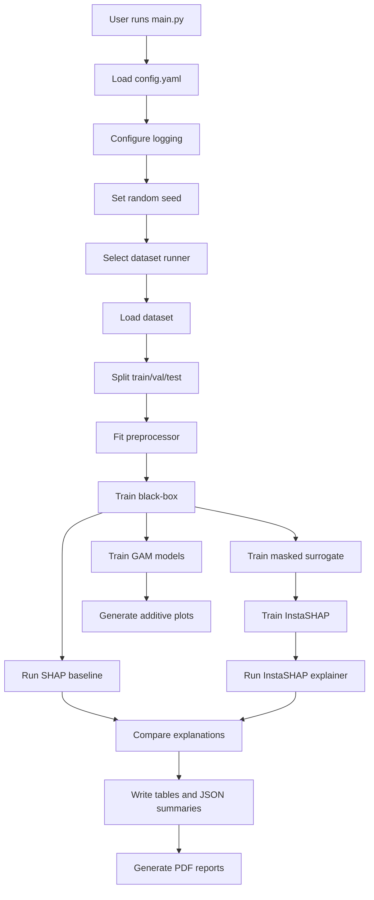
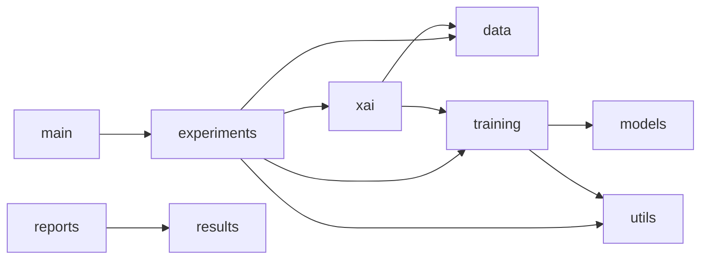
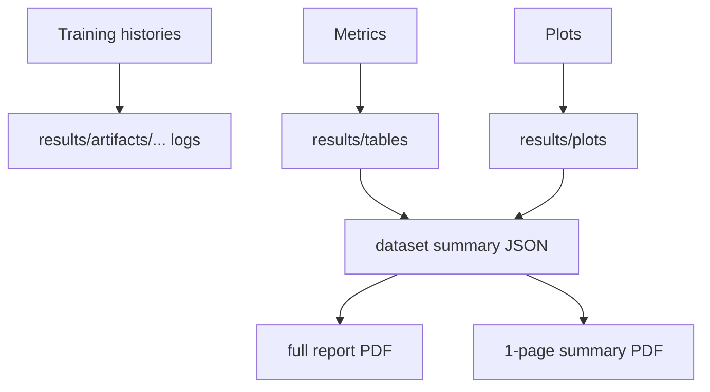

# System Flow Diagrams

## Purpose

This document gives a visual, systems-level understanding of how the project executes.

## End-to-End CLI Flow

## Module Dependency View

## Runtime Artifact Flow

## Why These Diagrams Matter

These diagrams help answer three important questions quickly:

- Where does a new feature belong?
- Which modules are on the critical path?
- Which artifacts depend on which earlier steps?

