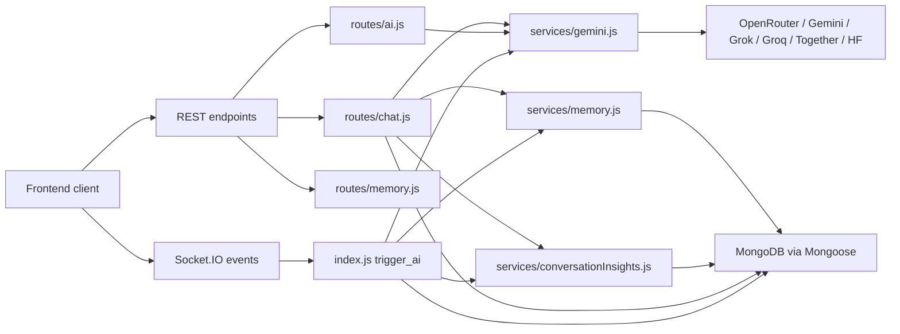

# ChatSphere Backend AI Documentation

## Purpose
This documentation set explains only the AI-related behavior in the `backend` folder. It is written for learning, onboarding, architecture review, and improvement planning. It does not try to document every non-AI feature in the product.

The docs are grounded in the editable source tree first:

- `index.js`
- `routes/ai.js`
- `routes/chat.js`
- `routes/conversations.js`
- `routes/memory.js`
- `routes/uploads.js`
- `routes/admin.js`
- `routes/settings.js`
- `services/gemini.js`
- `services/memory.js`
- `services/conversationInsights.js`
- `services/promptCatalog.js`
- `services/importExport.js`
- `services/messageFormatting.js`
- `services/aiQuota.js`
- `middleware/aiQuota.js`
- `middleware/rateLimit.js`
- `middleware/upload.js`
- `middleware/auth.js`
- `models/Conversation.js`
- `models/ConversationInsight.js`
- `models/MemoryEntry.js`
- `models/Message.js`
- `models/PromptTemplate.js`
- `models/Project.js`
- `models/Room.js`
- `models/User.js`
- `config/db.js`
- selected AI-relevant files under `dist/` when they expose architectural drift

## What This AI Backend Actually Does
The backend exposes two major AI interaction styles:

- REST-based solo AI chat through `/api/chat`
- Socket-based room AI through `trigger_ai`

It also exposes supporting AI helpers:

- smart replies
- sentiment analysis
- grammar correction
- memory extraction and retrieval
- conversation insights
- prompt template management
- attachment-assisted prompts
- model discovery and automatic model routing

## Learning Path
If you are new to the project, read in this order:

1. `docs/ai/01-ai-scope-and-file-map.md`
2. `docs/ai/02-runtime-entrypoints.md`
3. `docs/ai/03-ai-feature-overview.md`
4. `docs/ai/06-solo-chat-flow.md`
5. `docs/ai/07-room-ai-flow.md`
6. `docs/ai/18-memory-system-overview.md`
7. `docs/ai/22-conversation-insights-overview.md`
8. `docs/ai/27-database-write-paths.md`
9. `docs/ai/33-failure-modes.md`
10. `docs/ai/39-improvement-roadmap.md`

## Documentation Map
| Area | Docs |
|---|---|
| Orientation | `01`, `02`, `03` |
| API and socket surfaces | `04`, `05`, `30`, `31` |
| End-to-end AI flows | `06`, `07`, `08`, `09`, `10` |
| Model layer | `11`, `12`, `13`, `14`, `15`, `16`, `17` |
| Memory and insights | `18`, `19`, `20`, `21`, `22`, `23` |
| Context inputs | `24`, `25` |
| Guardrails and persistence | `26`, `27`, `28`, `29` |
| Visual summaries | `32` |
| Risks and scale | `33`, `34`, `35`, `36`, `39` |
| Review and redesign | `37`, `38` |

## System-at-a-Glance


## Reading Expectations
These docs intentionally do four things at once:

- explain how the current implementation works
- show where data is stored and updated
- point out inconsistencies and operational risk
- describe how to rebuild the same architecture cleanly from scratch

## Important Caveat About Source of Truth
The repository contains both editable source files and a `dist/` tree that looks like output from a different or newer architecture in some places. This doc set treats the source tree as the primary implementation and uses `dist/` only to highlight drift, not to redefine current behavior.


## Expanded Learning Appendix

This appendix expands the topic covered in README without removing or replacing the earlier material. It is intentionally additive and is meant to help a reader study the implementation from several angles: control flow, data flow, storage, risk, scale, and redesign.

### Extended Study Notes
- Study note 1 for README: revisit the exact control path related to this topic and identify which route, middleware, model, or service acts as the real decision point rather than the most visible file.
- Study note 2 for README: revisit the exact control path related to this topic and identify which route, middleware, model, or service acts as the real decision point rather than the most visible file.
- Study note 3 for README: revisit the exact control path related to this topic and identify which route, middleware, model, or service acts as the real decision point rather than the most visible file.
- Study note 4 for README: revisit the exact control path related to this topic and identify which route, middleware, model, or service acts as the real decision point rather than the most visible file.
- Study note 5 for README: revisit the exact control path related to this topic and identify which route, middleware, model, or service acts as the real decision point rather than the most visible file.
- Study note 6 for README: revisit the exact control path related to this topic and identify which route, middleware, model, or service acts as the real decision point rather than the most visible file.
- Study note 7 for README: revisit the exact control path related to this topic and identify which route, middleware, model, or service acts as the real decision point rather than the most visible file.
- Study note 8 for README: revisit the exact control path related to this topic and identify which route, middleware, model, or service acts as the real decision point rather than the most visible file.
- Study note 9 for README: revisit the exact control path related to this topic and identify which route, middleware, model, or service acts as the real decision point rather than the most visible file.
- Study note 10 for README: revisit the exact control path related to this topic and identify which route, middleware, model, or service acts as the real decision point rather than the most visible file.
- Study note 11 for README: revisit the exact control path related to this topic and identify which route, middleware, model, or service acts as the real decision point rather than the most visible file.
- Study note 12 for README: revisit the exact control path related to this topic and identify which route, middleware, model, or service acts as the real decision point rather than the most visible file.
- Study note 13 for README: revisit the exact control path related to this topic and identify which route, middleware, model, or service acts as the real decision point rather than the most visible file.
- Study note 14 for README: revisit the exact control path related to this topic and identify which route, middleware, model, or service acts as the real decision point rather than the most visible file.
- Study note 15 for README: revisit the exact control path related to this topic and identify which route, middleware, model, or service acts as the real decision point rather than the most visible file.
- Study note 16 for README: revisit the exact control path related to this topic and identify which route, middleware, model, or service acts as the real decision point rather than the most visible file.
- Study note 17 for README: revisit the exact control path related to this topic and identify which route, middleware, model, or service acts as the real decision point rather than the most visible file.
- Study note 18 for README: revisit the exact control path related to this topic and identify which route, middleware, model, or service acts as the real decision point rather than the most visible file.
- Study note 19 for README: revisit the exact control path related to this topic and identify which route, middleware, model, or service acts as the real decision point rather than the most visible file.
- Study note 20 for README: revisit the exact control path related to this topic and identify which route, middleware, model, or service acts as the real decision point rather than the most visible file.
- Study note 21 for README: revisit the exact control path related to this topic and identify which route, middleware, model, or service acts as the real decision point rather than the most visible file.
- Study note 22 for README: revisit the exact control path related to this topic and identify which route, middleware, model, or service acts as the real decision point rather than the most visible file.
- Study note 23 for README: revisit the exact control path related to this topic and identify which route, middleware, model, or service acts as the real decision point rather than the most visible file.
- Study note 24 for README: revisit the exact control path related to this topic and identify which route, middleware, model, or service acts as the real decision point rather than the most visible file.
- Study note 25 for README: revisit the exact control path related to this topic and identify which route, middleware, model, or service acts as the real decision point rather than the most visible file.

### Detailed Trace Prompts
- Trace prompt 1 for README: walk one realistic request through the backend and write down the precise sequence of reads, transformations, provider calls, and writes that happen before the client sees a result.
- Trace prompt 2 for README: walk one realistic request through the backend and write down the precise sequence of reads, transformations, provider calls, and writes that happen before the client sees a result.
- Trace prompt 3 for README: walk one realistic request through the backend and write down the precise sequence of reads, transformations, provider calls, and writes that happen before the client sees a result.
- Trace prompt 4 for README: walk one realistic request through the backend and write down the precise sequence of reads, transformations, provider calls, and writes that happen before the client sees a result.
- Trace prompt 5 for README: walk one realistic request through the backend and write down the precise sequence of reads, transformations, provider calls, and writes that happen before the client sees a result.
- Trace prompt 6 for README: walk one realistic request through the backend and write down the precise sequence of reads, transformations, provider calls, and writes that happen before the client sees a result.
- Trace prompt 7 for README: walk one realistic request through the backend and write down the precise sequence of reads, transformations, provider calls, and writes that happen before the client sees a result.
- Trace prompt 8 for README: walk one realistic request through the backend and write down the precise sequence of reads, transformations, provider calls, and writes that happen before the client sees a result.
- Trace prompt 9 for README: walk one realistic request through the backend and write down the precise sequence of reads, transformations, provider calls, and writes that happen before the client sees a result.
- Trace prompt 10 for README: walk one realistic request through the backend and write down the precise sequence of reads, transformations, provider calls, and writes that happen before the client sees a result.
- Trace prompt 11 for README: walk one realistic request through the backend and write down the precise sequence of reads, transformations, provider calls, and writes that happen before the client sees a result.
- Trace prompt 12 for README: walk one realistic request through the backend and write down the precise sequence of reads, transformations, provider calls, and writes that happen before the client sees a result.
- Trace prompt 13 for README: walk one realistic request through the backend and write down the precise sequence of reads, transformations, provider calls, and writes that happen before the client sees a result.
- Trace prompt 14 for README: walk one realistic request through the backend and write down the precise sequence of reads, transformations, provider calls, and writes that happen before the client sees a result.
- Trace prompt 15 for README: walk one realistic request through the backend and write down the precise sequence of reads, transformations, provider calls, and writes that happen before the client sees a result.
- Trace prompt 16 for README: walk one realistic request through the backend and write down the precise sequence of reads, transformations, provider calls, and writes that happen before the client sees a result.
- Trace prompt 17 for README: walk one realistic request through the backend and write down the precise sequence of reads, transformations, provider calls, and writes that happen before the client sees a result.
- Trace prompt 18 for README: walk one realistic request through the backend and write down the precise sequence of reads, transformations, provider calls, and writes that happen before the client sees a result.
- Trace prompt 19 for README: walk one realistic request through the backend and write down the precise sequence of reads, transformations, provider calls, and writes that happen before the client sees a result.
- Trace prompt 20 for README: walk one realistic request through the backend and write down the precise sequence of reads, transformations, provider calls, and writes that happen before the client sees a result.
- Trace prompt 21 for README: walk one realistic request through the backend and write down the precise sequence of reads, transformations, provider calls, and writes that happen before the client sees a result.
- Trace prompt 22 for README: walk one realistic request through the backend and write down the precise sequence of reads, transformations, provider calls, and writes that happen before the client sees a result.
- Trace prompt 23 for README: walk one realistic request through the backend and write down the precise sequence of reads, transformations, provider calls, and writes that happen before the client sees a result.
- Trace prompt 24 for README: walk one realistic request through the backend and write down the precise sequence of reads, transformations, provider calls, and writes that happen before the client sees a result.
- Trace prompt 25 for README: walk one realistic request through the backend and write down the precise sequence of reads, transformations, provider calls, and writes that happen before the client sees a result.

### Data And State Questions
- Data question 1 for README: identify what state is durable, what state is request-scoped, and what state is process-local in C:\Users\RAVIPRAKASH\Downloads\backend\docs\README.md, then explain what could become inconsistent under concurrency or restart conditions.
- Data question 2 for README: identify what state is durable, what state is request-scoped, and what state is process-local in C:\Users\RAVIPRAKASH\Downloads\backend\docs\README.md, then explain what could become inconsistent under concurrency or restart conditions.
- Data question 3 for README: identify what state is durable, what state is request-scoped, and what state is process-local in C:\Users\RAVIPRAKASH\Downloads\backend\docs\README.md, then explain what could become inconsistent under concurrency or restart conditions.
- Data question 4 for README: identify what state is durable, what state is request-scoped, and what state is process-local in C:\Users\RAVIPRAKASH\Downloads\backend\docs\README.md, then explain what could become inconsistent under concurrency or restart conditions.
- Data question 5 for README: identify what state is durable, what state is request-scoped, and what state is process-local in C:\Users\RAVIPRAKASH\Downloads\backend\docs\README.md, then explain what could become inconsistent under concurrency or restart conditions.
- Data question 6 for README: identify what state is durable, what state is request-scoped, and what state is process-local in C:\Users\RAVIPRAKASH\Downloads\backend\docs\README.md, then explain what could become inconsistent under concurrency or restart conditions.
- Data question 7 for README: identify what state is durable, what state is request-scoped, and what state is process-local in C:\Users\RAVIPRAKASH\Downloads\backend\docs\README.md, then explain what could become inconsistent under concurrency or restart conditions.
- Data question 8 for README: identify what state is durable, what state is request-scoped, and what state is process-local in C:\Users\RAVIPRAKASH\Downloads\backend\docs\README.md, then explain what could become inconsistent under concurrency or restart conditions.
- Data question 9 for README: identify what state is durable, what state is request-scoped, and what state is process-local in C:\Users\RAVIPRAKASH\Downloads\backend\docs\README.md, then explain what could become inconsistent under concurrency or restart conditions.
- Data question 10 for README: identify what state is durable, what state is request-scoped, and what state is process-local in C:\Users\RAVIPRAKASH\Downloads\backend\docs\README.md, then explain what could become inconsistent under concurrency or restart conditions.
- Data question 11 for README: identify what state is durable, what state is request-scoped, and what state is process-local in C:\Users\RAVIPRAKASH\Downloads\backend\docs\README.md, then explain what could become inconsistent under concurrency or restart conditions.
- Data question 12 for README: identify what state is durable, what state is request-scoped, and what state is process-local in C:\Users\RAVIPRAKASH\Downloads\backend\docs\README.md, then explain what could become inconsistent under concurrency or restart conditions.
- Data question 13 for README: identify what state is durable, what state is request-scoped, and what state is process-local in C:\Users\RAVIPRAKASH\Downloads\backend\docs\README.md, then explain what could become inconsistent under concurrency or restart conditions.
- Data question 14 for README: identify what state is durable, what state is request-scoped, and what state is process-local in C:\Users\RAVIPRAKASH\Downloads\backend\docs\README.md, then explain what could become inconsistent under concurrency or restart conditions.
- Data question 15 for README: identify what state is durable, what state is request-scoped, and what state is process-local in C:\Users\RAVIPRAKASH\Downloads\backend\docs\README.md, then explain what could become inconsistent under concurrency or restart conditions.
- Data question 16 for README: identify what state is durable, what state is request-scoped, and what state is process-local in C:\Users\RAVIPRAKASH\Downloads\backend\docs\README.md, then explain what could become inconsistent under concurrency or restart conditions.
- Data question 17 for README: identify what state is durable, what state is request-scoped, and what state is process-local in C:\Users\RAVIPRAKASH\Downloads\backend\docs\README.md, then explain what could become inconsistent under concurrency or restart conditions.
- Data question 18 for README: identify what state is durable, what state is request-scoped, and what state is process-local in C:\Users\RAVIPRAKASH\Downloads\backend\docs\README.md, then explain what could become inconsistent under concurrency or restart conditions.
- Data question 19 for README: identify what state is durable, what state is request-scoped, and what state is process-local in C:\Users\RAVIPRAKASH\Downloads\backend\docs\README.md, then explain what could become inconsistent under concurrency or restart conditions.
- Data question 20 for README: identify what state is durable, what state is request-scoped, and what state is process-local in C:\Users\RAVIPRAKASH\Downloads\backend\docs\README.md, then explain what could become inconsistent under concurrency or restart conditions.
- Data question 21 for README: identify what state is durable, what state is request-scoped, and what state is process-local in C:\Users\RAVIPRAKASH\Downloads\backend\docs\README.md, then explain what could become inconsistent under concurrency or restart conditions.
- Data question 22 for README: identify what state is durable, what state is request-scoped, and what state is process-local in C:\Users\RAVIPRAKASH\Downloads\backend\docs\README.md, then explain what could become inconsistent under concurrency or restart conditions.
- Data question 23 for README: identify what state is durable, what state is request-scoped, and what state is process-local in C:\Users\RAVIPRAKASH\Downloads\backend\docs\README.md, then explain what could become inconsistent under concurrency or restart conditions.
- Data question 24 for README: identify what state is durable, what state is request-scoped, and what state is process-local in C:\Users\RAVIPRAKASH\Downloads\backend\docs\README.md, then explain what could become inconsistent under concurrency or restart conditions.
- Data question 25 for README: identify what state is durable, what state is request-scoped, and what state is process-local in C:\Users\RAVIPRAKASH\Downloads\backend\docs\README.md, then explain what could become inconsistent under concurrency or restart conditions.

### Failure And Recovery Questions
- Failure question 1 for README: ask what happens if the dependent provider, database read, validation step, or post-processing step fails halfway through, and whether the current implementation leaves behind partial success or visible drift.
- Failure question 2 for README: ask what happens if the dependent provider, database read, validation step, or post-processing step fails halfway through, and whether the current implementation leaves behind partial success or visible drift.
- Failure question 3 for README: ask what happens if the dependent provider, database read, validation step, or post-processing step fails halfway through, and whether the current implementation leaves behind partial success or visible drift.
- Failure question 4 for README: ask what happens if the dependent provider, database read, validation step, or post-processing step fails halfway through, and whether the current implementation leaves behind partial success or visible drift.
- Failure question 5 for README: ask what happens if the dependent provider, database read, validation step, or post-processing step fails halfway through, and whether the current implementation leaves behind partial success or visible drift.
- Failure question 6 for README: ask what happens if the dependent provider, database read, validation step, or post-processing step fails halfway through, and whether the current implementation leaves behind partial success or visible drift.
- Failure question 7 for README: ask what happens if the dependent provider, database read, validation step, or post-processing step fails halfway through, and whether the current implementation leaves behind partial success or visible drift.
- Failure question 8 for README: ask what happens if the dependent provider, database read, validation step, or post-processing step fails halfway through, and whether the current implementation leaves behind partial success or visible drift.
- Failure question 9 for README: ask what happens if the dependent provider, database read, validation step, or post-processing step fails halfway through, and whether the current implementation leaves behind partial success or visible drift.
- Failure question 10 for README: ask what happens if the dependent provider, database read, validation step, or post-processing step fails halfway through, and whether the current implementation leaves behind partial success or visible drift.
- Failure question 11 for README: ask what happens if the dependent provider, database read, validation step, or post-processing step fails halfway through, and whether the current implementation leaves behind partial success or visible drift.
- Failure question 12 for README: ask what happens if the dependent provider, database read, validation step, or post-processing step fails halfway through, and whether the current implementation leaves behind partial success or visible drift.
- Failure question 13 for README: ask what happens if the dependent provider, database read, validation step, or post-processing step fails halfway through, and whether the current implementation leaves behind partial success or visible drift.
- Failure question 14 for README: ask what happens if the dependent provider, database read, validation step, or post-processing step fails halfway through, and whether the current implementation leaves behind partial success or visible drift.
- Failure question 15 for README: ask what happens if the dependent provider, database read, validation step, or post-processing step fails halfway through, and whether the current implementation leaves behind partial success or visible drift.
- Failure question 16 for README: ask what happens if the dependent provider, database read, validation step, or post-processing step fails halfway through, and whether the current implementation leaves behind partial success or visible drift.
- Failure question 17 for README: ask what happens if the dependent provider, database read, validation step, or post-processing step fails halfway through, and whether the current implementation leaves behind partial success or visible drift.
- Failure question 18 for README: ask what happens if the dependent provider, database read, validation step, or post-processing step fails halfway through, and whether the current implementation leaves behind partial success or visible drift.
- Failure question 19 for README: ask what happens if the dependent provider, database read, validation step, or post-processing step fails halfway through, and whether the current implementation leaves behind partial success or visible drift.
- Failure question 20 for README: ask what happens if the dependent provider, database read, validation step, or post-processing step fails halfway through, and whether the current implementation leaves behind partial success or visible drift.
- Failure question 21 for README: ask what happens if the dependent provider, database read, validation step, or post-processing step fails halfway through, and whether the current implementation leaves behind partial success or visible drift.
- Failure question 22 for README: ask what happens if the dependent provider, database read, validation step, or post-processing step fails halfway through, and whether the current implementation leaves behind partial success or visible drift.
- Failure question 23 for README: ask what happens if the dependent provider, database read, validation step, or post-processing step fails halfway through, and whether the current implementation leaves behind partial success or visible drift.
- Failure question 24 for README: ask what happens if the dependent provider, database read, validation step, or post-processing step fails halfway through, and whether the current implementation leaves behind partial success or visible drift.
- Failure question 25 for README: ask what happens if the dependent provider, database read, validation step, or post-processing step fails halfway through, and whether the current implementation leaves behind partial success or visible drift.

### Scaling And Operations Notes
- Operations note 1 for README: estimate how this part of the system behaves under higher load, with particular attention to synchronous waiting, MongoDB contention, in-memory state, and multi-instance deployment concerns.
- Operations note 2 for README: estimate how this part of the system behaves under higher load, with particular attention to synchronous waiting, MongoDB contention, in-memory state, and multi-instance deployment concerns.
- Operations note 3 for README: estimate how this part of the system behaves under higher load, with particular attention to synchronous waiting, MongoDB contention, in-memory state, and multi-instance deployment concerns.
- Operations note 4 for README: estimate how this part of the system behaves under higher load, with particular attention to synchronous waiting, MongoDB contention, in-memory state, and multi-instance deployment concerns.
- Operations note 5 for README: estimate how this part of the system behaves under higher load, with particular attention to synchronous waiting, MongoDB contention, in-memory state, and multi-instance deployment concerns.
- Operations note 6 for README: estimate how this part of the system behaves under higher load, with particular attention to synchronous waiting, MongoDB contention, in-memory state, and multi-instance deployment concerns.
- Operations note 7 for README: estimate how this part of the system behaves under higher load, with particular attention to synchronous waiting, MongoDB contention, in-memory state, and multi-instance deployment concerns.
- Operations note 8 for README: estimate how this part of the system behaves under higher load, with particular attention to synchronous waiting, MongoDB contention, in-memory state, and multi-instance deployment concerns.
- Operations note 9 for README: estimate how this part of the system behaves under higher load, with particular attention to synchronous waiting, MongoDB contention, in-memory state, and multi-instance deployment concerns.
- Operations note 10 for README: estimate how this part of the system behaves under higher load, with particular attention to synchronous waiting, MongoDB contention, in-memory state, and multi-instance deployment concerns.
- Operations note 11 for README: estimate how this part of the system behaves under higher load, with particular attention to synchronous waiting, MongoDB contention, in-memory state, and multi-instance deployment concerns.
- Operations note 12 for README: estimate how this part of the system behaves under higher load, with particular attention to synchronous waiting, MongoDB contention, in-memory state, and multi-instance deployment concerns.
- Operations note 13 for README: estimate how this part of the system behaves under higher load, with particular attention to synchronous waiting, MongoDB contention, in-memory state, and multi-instance deployment concerns.
- Operations note 14 for README: estimate how this part of the system behaves under higher load, with particular attention to synchronous waiting, MongoDB contention, in-memory state, and multi-instance deployment concerns.
- Operations note 15 for README: estimate how this part of the system behaves under higher load, with particular attention to synchronous waiting, MongoDB contention, in-memory state, and multi-instance deployment concerns.
- Operations note 16 for README: estimate how this part of the system behaves under higher load, with particular attention to synchronous waiting, MongoDB contention, in-memory state, and multi-instance deployment concerns.
- Operations note 17 for README: estimate how this part of the system behaves under higher load, with particular attention to synchronous waiting, MongoDB contention, in-memory state, and multi-instance deployment concerns.
- Operations note 18 for README: estimate how this part of the system behaves under higher load, with particular attention to synchronous waiting, MongoDB contention, in-memory state, and multi-instance deployment concerns.
- Operations note 19 for README: estimate how this part of the system behaves under higher load, with particular attention to synchronous waiting, MongoDB contention, in-memory state, and multi-instance deployment concerns.
- Operations note 20 for README: estimate how this part of the system behaves under higher load, with particular attention to synchronous waiting, MongoDB contention, in-memory state, and multi-instance deployment concerns.
- Operations note 21 for README: estimate how this part of the system behaves under higher load, with particular attention to synchronous waiting, MongoDB contention, in-memory state, and multi-instance deployment concerns.
- Operations note 22 for README: estimate how this part of the system behaves under higher load, with particular attention to synchronous waiting, MongoDB contention, in-memory state, and multi-instance deployment concerns.
- Operations note 23 for README: estimate how this part of the system behaves under higher load, with particular attention to synchronous waiting, MongoDB contention, in-memory state, and multi-instance deployment concerns.
- Operations note 24 for README: estimate how this part of the system behaves under higher load, with particular attention to synchronous waiting, MongoDB contention, in-memory state, and multi-instance deployment concerns.
- Operations note 25 for README: estimate how this part of the system behaves under higher load, with particular attention to synchronous waiting, MongoDB contention, in-memory state, and multi-instance deployment concerns.

### Code Review Angles
- Review angle 1 for README: inspect whether naming, ownership boundaries, response shaping, and write ordering make the code easy to reason about or whether the logic would be safer if orchestration were extracted into a narrower service layer.
- Review angle 2 for README: inspect whether naming, ownership boundaries, response shaping, and write ordering make the code easy to reason about or whether the logic would be safer if orchestration were extracted into a narrower service layer.
- Review angle 3 for README: inspect whether naming, ownership boundaries, response shaping, and write ordering make the code easy to reason about or whether the logic would be safer if orchestration were extracted into a narrower service layer.
- Review angle 4 for README: inspect whether naming, ownership boundaries, response shaping, and write ordering make the code easy to reason about or whether the logic would be safer if orchestration were extracted into a narrower service layer.
- Review angle 5 for README: inspect whether naming, ownership boundaries, response shaping, and write ordering make the code easy to reason about or whether the logic would be safer if orchestration were extracted into a narrower service layer.
- Review angle 6 for README: inspect whether naming, ownership boundaries, response shaping, and write ordering make the code easy to reason about or whether the logic would be safer if orchestration were extracted into a narrower service layer.
- Review angle 7 for README: inspect whether naming, ownership boundaries, response shaping, and write ordering make the code easy to reason about or whether the logic would be safer if orchestration were extracted into a narrower service layer.
- Review angle 8 for README: inspect whether naming, ownership boundaries, response shaping, and write ordering make the code easy to reason about or whether the logic would be safer if orchestration were extracted into a narrower service layer.
- Review angle 9 for README: inspect whether naming, ownership boundaries, response shaping, and write ordering make the code easy to reason about or whether the logic would be safer if orchestration were extracted into a narrower service layer.
- Review angle 10 for README: inspect whether naming, ownership boundaries, response shaping, and write ordering make the code easy to reason about or whether the logic would be safer if orchestration were extracted into a narrower service layer.
- Review angle 11 for README: inspect whether naming, ownership boundaries, response shaping, and write ordering make the code easy to reason about or whether the logic would be safer if orchestration were extracted into a narrower service layer.
- Review angle 12 for README: inspect whether naming, ownership boundaries, response shaping, and write ordering make the code easy to reason about or whether the logic would be safer if orchestration were extracted into a narrower service layer.
- Review angle 13 for README: inspect whether naming, ownership boundaries, response shaping, and write ordering make the code easy to reason about or whether the logic would be safer if orchestration were extracted into a narrower service layer.
- Review angle 14 for README: inspect whether naming, ownership boundaries, response shaping, and write ordering make the code easy to reason about or whether the logic would be safer if orchestration were extracted into a narrower service layer.
- Review angle 15 for README: inspect whether naming, ownership boundaries, response shaping, and write ordering make the code easy to reason about or whether the logic would be safer if orchestration were extracted into a narrower service layer.
- Review angle 16 for README: inspect whether naming, ownership boundaries, response shaping, and write ordering make the code easy to reason about or whether the logic would be safer if orchestration were extracted into a narrower service layer.
- Review angle 17 for README: inspect whether naming, ownership boundaries, response shaping, and write ordering make the code easy to reason about or whether the logic would be safer if orchestration were extracted into a narrower service layer.
- Review angle 18 for README: inspect whether naming, ownership boundaries, response shaping, and write ordering make the code easy to reason about or whether the logic would be safer if orchestration were extracted into a narrower service layer.
- Review angle 19 for README: inspect whether naming, ownership boundaries, response shaping, and write ordering make the code easy to reason about or whether the logic would be safer if orchestration were extracted into a narrower service layer.
- Review angle 20 for README: inspect whether naming, ownership boundaries, response shaping, and write ordering make the code easy to reason about or whether the logic would be safer if orchestration were extracted into a narrower service layer.
- Review angle 21 for README: inspect whether naming, ownership boundaries, response shaping, and write ordering make the code easy to reason about or whether the logic would be safer if orchestration were extracted into a narrower service layer.
- Review angle 22 for README: inspect whether naming, ownership boundaries, response shaping, and write ordering make the code easy to reason about or whether the logic would be safer if orchestration were extracted into a narrower service layer.
- Review angle 23 for README: inspect whether naming, ownership boundaries, response shaping, and write ordering make the code easy to reason about or whether the logic would be safer if orchestration were extracted into a narrower service layer.
- Review angle 24 for README: inspect whether naming, ownership boundaries, response shaping, and write ordering make the code easy to reason about or whether the logic would be safer if orchestration were extracted into a narrower service layer.
- Review angle 25 for README: inspect whether naming, ownership boundaries, response shaping, and write ordering make the code easy to reason about or whether the logic would be safer if orchestration were extracted into a narrower service layer.

### Rebuild Guidance Points
- Rebuild point 1 for README: if this topic were rebuilt from scratch, define the minimum clean interface, the data contract, the failure contract, and the observability you would want before calling the implementation production ready.
- Rebuild point 2 for README: if this topic were rebuilt from scratch, define the minimum clean interface, the data contract, the failure contract, and the observability you would want before calling the implementation production ready.
- Rebuild point 3 for README: if this topic were rebuilt from scratch, define the minimum clean interface, the data contract, the failure contract, and the observability you would want before calling the implementation production ready.
- Rebuild point 4 for README: if this topic were rebuilt from scratch, define the minimum clean interface, the data contract, the failure contract, and the observability you would want before calling the implementation production ready.
- Rebuild point 5 for README: if this topic were rebuilt from scratch, define the minimum clean interface, the data contract, the failure contract, and the observability you would want before calling the implementation production ready.
- Rebuild point 6 for README: if this topic were rebuilt from scratch, define the minimum clean interface, the data contract, the failure contract, and the observability you would want before calling the implementation production ready.
- Rebuild point 7 for README: if this topic were rebuilt from scratch, define the minimum clean interface, the data contract, the failure contract, and the observability you would want before calling the implementation production ready.
- Rebuild point 8 for README: if this topic were rebuilt from scratch, define the minimum clean interface, the data contract, the failure contract, and the observability you would want before calling the implementation production ready.
- Rebuild point 9 for README: if this topic were rebuilt from scratch, define the minimum clean interface, the data contract, the failure contract, and the observability you would want before calling the implementation production ready.
- Rebuild point 10 for README: if this topic were rebuilt from scratch, define the minimum clean interface, the data contract, the failure contract, and the observability you would want before calling the implementation production ready.
- Rebuild point 11 for README: if this topic were rebuilt from scratch, define the minimum clean interface, the data contract, the failure contract, and the observability you would want before calling the implementation production ready.
- Rebuild point 12 for README: if this topic were rebuilt from scratch, define the minimum clean interface, the data contract, the failure contract, and the observability you would want before calling the implementation production ready.
- Rebuild point 13 for README: if this topic were rebuilt from scratch, define the minimum clean interface, the data contract, the failure contract, and the observability you would want before calling the implementation production ready.
- Rebuild point 14 for README: if this topic were rebuilt from scratch, define the minimum clean interface, the data contract, the failure contract, and the observability you would want before calling the implementation production ready.
- Rebuild point 15 for README: if this topic were rebuilt from scratch, define the minimum clean interface, the data contract, the failure contract, and the observability you would want before calling the implementation production ready.
- Rebuild point 16 for README: if this topic were rebuilt from scratch, define the minimum clean interface, the data contract, the failure contract, and the observability you would want before calling the implementation production ready.
- Rebuild point 17 for README: if this topic were rebuilt from scratch, define the minimum clean interface, the data contract, the failure contract, and the observability you would want before calling the implementation production ready.
- Rebuild point 18 for README: if this topic were rebuilt from scratch, define the minimum clean interface, the data contract, the failure contract, and the observability you would want before calling the implementation production ready.
- Rebuild point 19 for README: if this topic were rebuilt from scratch, define the minimum clean interface, the data contract, the failure contract, and the observability you would want before calling the implementation production ready.
- Rebuild point 20 for README: if this topic were rebuilt from scratch, define the minimum clean interface, the data contract, the failure contract, and the observability you would want before calling the implementation production ready.
- Rebuild point 21 for README: if this topic were rebuilt from scratch, define the minimum clean interface, the data contract, the failure contract, and the observability you would want before calling the implementation production ready.
- Rebuild point 22 for README: if this topic were rebuilt from scratch, define the minimum clean interface, the data contract, the failure contract, and the observability you would want before calling the implementation production ready.
- Rebuild point 23 for README: if this topic were rebuilt from scratch, define the minimum clean interface, the data contract, the failure contract, and the observability you would want before calling the implementation production ready.
- Rebuild point 24 for README: if this topic were rebuilt from scratch, define the minimum clean interface, the data contract, the failure contract, and the observability you would want before calling the implementation production ready.
- Rebuild point 25 for README: if this topic were rebuilt from scratch, define the minimum clean interface, the data contract, the failure contract, and the observability you would want before calling the implementation production ready.

### Practical Learning Exercises
- Exercise 1 for README: open the files referenced by this document, compare the stated behavior with the live source, and note any gaps between the intended architecture, the actual control flow, and the likely next refactor that would improve reliability.
- Exercise 2 for README: open the files referenced by this document, compare the stated behavior with the live source, and note any gaps between the intended architecture, the actual control flow, and the likely next refactor that would improve reliability.
- Exercise 3 for README: open the files referenced by this document, compare the stated behavior with the live source, and note any gaps between the intended architecture, the actual control flow, and the likely next refactor that would improve reliability.
- Exercise 4 for README: open the files referenced by this document, compare the stated behavior with the live source, and note any gaps between the intended architecture, the actual control flow, and the likely next refactor that would improve reliability.
- Exercise 5 for README: open the files referenced by this document, compare the stated behavior with the live source, and note any gaps between the intended architecture, the actual control flow, and the likely next refactor that would improve reliability.
- Exercise 6 for README: open the files referenced by this document, compare the stated behavior with the live source, and note any gaps between the intended architecture, the actual control flow, and the likely next refactor that would improve reliability.
- Exercise 7 for README: open the files referenced by this document, compare the stated behavior with the live source, and note any gaps between the intended architecture, the actual control flow, and the likely next refactor that would improve reliability.
- Exercise 8 for README: open the files referenced by this document, compare the stated behavior with the live source, and note any gaps between the intended architecture, the actual control flow, and the likely next refactor that would improve reliability.
- Exercise 9 for README: open the files referenced by this document, compare the stated behavior with the live source, and note any gaps between the intended architecture, the actual control flow, and the likely next refactor that would improve reliability.
- Exercise 10 for README: open the files referenced by this document, compare the stated behavior with the live source, and note any gaps between the intended architecture, the actual control flow, and the likely next refactor that would improve reliability.
- Exercise 11 for README: open the files referenced by this document, compare the stated behavior with the live source, and note any gaps between the intended architecture, the actual control flow, and the likely next refactor that would improve reliability.
- Exercise 12 for README: open the files referenced by this document, compare the stated behavior with the live source, and note any gaps between the intended architecture, the actual control flow, and the likely next refactor that would improve reliability.
- Exercise 13 for README: open the files referenced by this document, compare the stated behavior with the live source, and note any gaps between the intended architecture, the actual control flow, and the likely next refactor that would improve reliability.
- Exercise 14 for README: open the files referenced by this document, compare the stated behavior with the live source, and note any gaps between the intended architecture, the actual control flow, and the likely next refactor that would improve reliability.
- Exercise 15 for README: open the files referenced by this document, compare the stated behavior with the live source, and note any gaps between the intended architecture, the actual control flow, and the likely next refactor that would improve reliability.
- Exercise 16 for README: open the files referenced by this document, compare the stated behavior with the live source, and note any gaps between the intended architecture, the actual control flow, and the likely next refactor that would improve reliability.
- Exercise 17 for README: open the files referenced by this document, compare the stated behavior with the live source, and note any gaps between the intended architecture, the actual control flow, and the likely next refactor that would improve reliability.
- Exercise 18 for README: open the files referenced by this document, compare the stated behavior with the live source, and note any gaps between the intended architecture, the actual control flow, and the likely next refactor that would improve reliability.
- Exercise 19 for README: open the files referenced by this document, compare the stated behavior with the live source, and note any gaps between the intended architecture, the actual control flow, and the likely next refactor that would improve reliability.
- Exercise 20 for README: open the files referenced by this document, compare the stated behavior with the live source, and note any gaps between the intended architecture, the actual control flow, and the likely next refactor that would improve reliability.
- Exercise 21 for README: open the files referenced by this document, compare the stated behavior with the live source, and note any gaps between the intended architecture, the actual control flow, and the likely next refactor that would improve reliability.
- Exercise 22 for README: open the files referenced by this document, compare the stated behavior with the live source, and note any gaps between the intended architecture, the actual control flow, and the likely next refactor that would improve reliability.

---

## Detailed Reading Order with Document Links

### Phase 1 — Orientation (read first)

| # | Document | Purpose |
|---|----------|---------|
| 1 | [01 — AI Scope and File Map](ai/01-ai-scope-and-file-map.md) | Every AI-relevant file, why it matters, what it exports |
| 2 | [02 — Runtime Entrypoints](ai/02-runtime-entrypoints.md) | How the server boots, routes mount, sockets initialize |
| 3 | [03 — AI Feature Overview](ai/03-ai-feature-overview.md) | Feature matrix: what exists, where it lives, how it connects |

### Phase 2 — API and Event Surfaces

| # | Document | Purpose |
|---|----------|---------|
| 4 | [04 — REST API Overview](ai/04-rest-api-overview.md) | All AI-related REST endpoints, auth, request/response patterns |
| 5 | [05 — Socket AI Overview](ai/05-socket-ai-overview.md) | Room AI socket architecture, event lifecycle, flood control |
| 6 | [06 — Solo Chat Flow](ai/06-solo-chat-flow.md) | `/api/chat` end-to-end with sequence diagrams |
| 7 | [07 — Room AI Flow](ai/07-room-ai-flow.md) | `trigger_ai` socket flow, persistence, history trimming |
| 8 | [08 — Smart Replies Flow](ai/08-smart-replies-flow.md) | `/api/ai/smart-replies`, fallbacks, settings gate |
| 9 | [09 — Sentiment Flow](ai/09-sentiment-flow.md) | `/api/ai/sentiment`, schema, defaults, error paths |
| 10 | [10 — Grammar Flow](ai/10-grammar-flow.md) | `/api/ai/grammar`, corrections, fallback behavior |

### Phase 3 — Model Routing and Providers

| # | Document | Purpose |
|---|----------|---------|
| 11 | [11 — Model Catalog and Discovery](ai/11-model-catalog-and-discovery.md) | Provider catalogs, TTL cache, refresh mechanics |
| 12 | [12 — Auto Routing and Model Selection](ai/12-auto-routing-and-model-selection.md) | Complexity scoring, auto mode, ranking logic |
| 13 | [13 — Provider Adapters](ai/13-provider-adapters.md) | OpenRouter, Gemini, Grok, Groq, Together, HuggingFace request flow |
| 14 | [14 — Fallback and Error Normalization](ai/14-fallback-and-error-normalization.md) | Retry chain, retryable errors, offline fallback, status mapping |

### Phase 4 — Prompt Engineering

| # | Document | Purpose |
|---|----------|---------|
| 15 | [15 — Prompt Construction](ai/15-prompt-construction.md) | History serialization, memory context, insight context, assembly |
| 16 | [16 — Prompt Template System](ai/16-prompt-template-system.md) | Default prompts, DB overrides, interpolation rules |
| 17 | [17 — Admin Prompt Management](ai/17-admin-prompt-management.md) | Admin prompt APIs and operational implications |

### Phase 5 — Memory System

| # | Document | Purpose |
|---|----------|---------|
| 18 | [18 — Memory System Overview](ai/18-memory-system-overview.md) | Memory purpose, lifecycle, core service map |
| 19 | [19 — Memory Extraction](ai/19-memory-extraction.md) | Deterministic regex extraction plus AI-assisted extraction |
| 20 | [20 — Memory Retrieval and Scoring](ai/20-memory-retrieval-and-scoring.md) | Tokenization, scoring formula, pinned behavior, usage signals |
| 21 | [21 — Memory CRUD, Import, Export](ai/21-memory-crud-import-export.md) | Memory routes, import preview, import bundle, export formats |

### Phase 6 — Insights and Context

| # | Document | Purpose |
|---|----------|---------|
| 22 | [22 — Conversation Insights Overview](ai/22-conversation-insights-overview.md) | Why insights exist, when they refresh |
| 23 | [23 — Conversation Insight Generation](ai/23-conversation-insight-generation.md) | Prompt shape, fallback logic, persistence model |
| 24 | [24 — Attachments and Upload Context](ai/24-attachments-and-upload-context.md) | Upload pipeline, supported types, image/text/PDF behavior |
| 25 | [25 — Project Context Injection](ai/25-project-context-injection.md) | How project metadata and files influence AI requests |

### Phase 7 — Operations and Infrastructure

| # | Document | Purpose |
|---|----------|---------|
| 26 | [26 — AI Quota and Rate Limiting](ai/26-ai-quota-and-rate-limiting.md) | In-memory quota, Express limiter, socket throttling, gaps |
| 27 | [27 — Database Write Paths](ai/27-database-write-paths.md) | Exactly how MongoDB is updated across AI flows |
| 28 | [28 — Response Storage and History](ai/28-response-storage-and-history.md) | Where AI responses are stored in conversations, messages, room history |
| 29 | [29 — Data Model Reference](ai/29-data-model-reference.md) | AI-relevant Mongoose schemas with field-by-field detail |
| 30 | [30 — API Reference](ai/30-api-reference.md) | Concise endpoint reference tables with bodies and payload examples |
| 31 | [31 — Socket Event Reference](ai/31-socket-event-reference.md) | `trigger_ai`, `ai_thinking`, `ai_response`, related room events |

### Phase 8 — Architecture and Analysis

| # | Document | Purpose |
|---|----------|---------|
| 32 | [32 — Sequence and Architecture Diagrams](ai/32-sequence-and-architecture-diagrams.md) | Consolidated Mermaid sequence, flow, and data diagrams |
| 33 | [33 — Failure Modes](ai/33-failure-modes.md) | Provider outages, bad attachments, stale insights, memory misses |
| 34 | [34 — Scaling and Capacity Analysis](ai/34-scaling-and-capacity-analysis.md) | Estimated capacity with caveats, bottlenecks, horizontal scaling path |
| 35 | [35 — Caching and State Analysis](ai/35-caching-and-state-analysis.md) | Actual caching today, in-memory state, what is missing |
| 36 | [36 — Inconsistencies and Code Drift](ai/36-inconsistencies-and-code-drift.md) | Source vs `dist/` differences, naming mismatches, architectural drift |
| 37 | [37 — Design Review Q&A](ai/37-design-review-questions-and-answers.md) | 10 evaluator-style design questions with grounded answers |
| 38 | [38 — How to Rebuild This Architecture](ai/38-how-to-rebuild-this-architecture.md) | How to design the same AI backend from scratch |
| 39 | [39 — Improvement Roadmap](ai/39-improvement-roadmap.md) | Prioritized fixes, scalability improvements, reliability upgrades |

---

## Feature Map at a Glance

```
┌─────────────────────────────────────────────────────────────────────┐
│                        ChatSphere AI System                        │
├─────────────────────────────────────────────────────────────────────┤
│                                                                     │
│  ┌──────────┐  ┌──────────┐  ┌──────────┐  ┌──────────┐           │
│  │ Solo Chat │  │ Room AI  │  │Smart     │  │Sentiment │           │
│  │ /api/chat │  │ trigger  │  │Replies   │  │/sentiment│           │
│  │  (REST)   │  │ _ai      │  │/smart    │  │  (REST)  │           │
│  │           │  │(Socket)  │  │-replies  │  │          │           │
│  └─────┬─────┘  └─────┬─────┘  └─────┬─────┘  └─────┬─────┘       │
│        │              │              │              │              │
│        └──────────────┴──────────────┴──────────────┘              │
│                              │                                     │
│                    ┌─────────▼─────────┐                           │
│                    │  gemini.js        │                           │
│                    │  (AI Core)        │                           │
│                    │                   │                           │
│                    │  ┌─ Providers ─┐  │                           │
│                    │  │ OpenRouter  │  │                           │
│                    │  │ Gemini      │  │                           │
│                    │  │ Grok        │  │                           │
│                    │  │ Groq        │  │                           │
│                    │  │ Together    │  │                           │
│                    │  │ HuggingFace │  │                           │
│                    │  └─────────────┘  │                           │
│                    └─────────┬─────────┘                           │
│                              │                                     │
│        ┌─────────────────────┼─────────────────────┐               │
│        │                     │                     │               │
│  ┌─────▼──────┐      ┌───────▼──────┐     ┌───────▼──────┐        │
│  │ Memory     │      │ Insights     │     │ Prompt       │        │
│  │ Service    │      │ Service      │     │ Templates    │        │
│  │            │      │              │     │              │        │
│  │ Extract    │      │ Generate     │     │ Default      │        │
│  │ Retrieve   │      │ Refresh      │     │ DB Override  │        │
│  │ Score      │      │ Persist      │     │ Interpolate  │        │
│  └─────┬──────┘      └───────┬──────┘     └───────┬──────┘        │
│        │                     │                     │               │
│  ┌─────▼──────┐      ┌───────▼──────┐     ┌───────▼──────┐        │
│  │MemoryEntry │      │ConversInsight│     │PromptTemplate│        │
│  │  (MongoDB) │      │  (MongoDB)   │     │  (MongoDB)   │        │
│  └────────────┘      └──────────────┘     └──────────────┘        │
│                                                                     │
│  ┌──────────┐  ┌──────────┐  ┌──────────┐                         │
│  │ AI Quota │  │ Rate     │  │Upload/   │                         │
│  │(in-mem)  │  │ Limiter  │  │Attachment│                         │
│  │          │  │(Express) │  │(disk)    │                         │
│  └──────────┘  └──────────┘  └──────────┘                         │
└─────────────────────────────────────────────────────────────────────┘
```

---

## Key Design Decisions

1. **Hybrid memory extraction** — deterministic regex patterns provide fast, reliable extraction for common patterns (name, location, workplace, preferences), while AI-assisted extraction catches complex or novel facts. This dual approach ensures memory works even when AI providers are unavailable.

2. **In-memory AI quota** — a simple `Map` tracks per-user request counts within sliding windows. This is fast but does not survive restarts or scale across instances.

3. **DB-overridable prompt templates** — prompts are stored as code defaults but can be overridden at runtime via `PromptTemplate` documents. This allows ops teams to tune AI behavior without redeploying.

4. **Auto model routing** — when `modelId: "auto"` is used, a heuristic complexity estimator selects from ranked model preference lists. This is not measured routing; it uses prompt length, attachment presence, and operation type.

5. **Dual response storage** — solo chat stores AI responses as embedded subdocuments in `Conversation.messages`; room AI stores them as standalone `Message` documents and also appends to `Room.aiHistory`.

6. **Source vs dist divergence** — the `dist/` directory is not a compiled build. It is a complete rewrite using Prisma ORM, Zod validation, and a different AI service architecture. This is documented in detail in [36 — Inconsistencies and Code Drift](ai/36-inconsistencies-and-code-drift.md).

---

## How to Use This Documentation

- **New engineer**: Start at document 01 and read through Phase 3 before touching code.
- **On-call engineer**: Jump to [33 — Failure Modes](ai/33-failure-modes.md) and [30 — API Reference](ai/30-api-reference.md).
- **Architect reviewing**: Read [36 — Inconsistencies and Code Drift](ai/36-inconsistencies-and-code-drift.md), [37 — Design Review Q&A](ai/37-design-review-questions-and-answers.md), and [38 — How to Rebuild](ai/38-how-to-rebuild-this-architecture.md).
- **Improving the system**: Read [39 — Improvement Roadmap](ai/39-improvement-roadmap.md) and the "How to rebuild" notes in each subsystem doc.

---

## File Inventory Summary

| Category | Files | Key Files |
|----------|-------|-----------|
| AI Core Service | 1 | `services/gemini.js` (1386 lines) |
| Memory | 1 | `services/memory.js` (262 lines) |
| Insights | 1 | `services/conversationInsights.js` (192 lines) |
| Prompts | 1 | `services/promptCatalog.js` (149 lines) |
| Quota | 1 | `services/aiQuota.js` (42 lines) |
| Import/Export | 1 | `services/importExport.js` (370 lines) |
| Formatting | 1 | `services/messageFormatting.js` (66 lines) |
| AI Routes | 1 | `routes/ai.js` (214 lines) |
| Chat Routes | 1 | `routes/chat.js` (186 lines) |
| Conversation Routes | 1 | `routes/conversations.js` (172 lines) |
| Memory Routes | 1 | `routes/memory.js` (163 lines) |
| Admin Routes (prompts) | 1 | `routes/admin.js` (231 lines) |
| AI Middleware | 2 | `middleware/aiQuota.js`, `middleware/rateLimit.js` |
| AI Models | 5 | `Conversation`, `Message`, `MemoryEntry`, `ConversationInsight`, `PromptTemplate` |
| Supporting | 3 | `models/Room.js`, `models/User.js`, `models/Project.js` |
| Entry Point | 1 | `index.js` (1137 lines — includes all socket AI logic) |

---

*This documentation was generated from an audit of the source tree. All path references, function names, and schema fields match the code as of the current commit. Capacity statements are architecture-based estimates, not measured throughput.*
- Exercise 23 for README: open the files referenced by this document, compare the stated behavior with the live source, and note any gaps between the intended architecture, the actual control flow, and the likely next refactor that would improve reliability.
- Exercise 24 for README: open the files referenced by this document, compare the stated behavior with the live source, and note any gaps between the intended architecture, the actual control flow, and the likely next refactor that would improve reliability.
- Exercise 25 for README: open the files referenced by this document, compare the stated behavior with the live source, and note any gaps between the intended architecture, the actual control flow, and the likely next refactor that would improve reliability.
