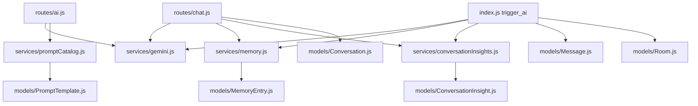

# 01. AI Scope and File Map

## Purpose
This document defines exactly what counts as an AI-related part of the backend and why each file matters. It is the boundary document for the rest of the documentation set.

## AI Scope
In this backend, "AI features" means more than model calls. The complete AI surface includes:

- route handlers that accept AI requests
- socket handlers that trigger room AI replies
- provider integration and model selection logic
- prompt construction and prompt template storage
- memory extraction, retrieval, and lifecycle management
- conversation insight generation and refresh
- file attachment ingestion used to enrich prompts
- project context injection into prompts
- quota and rate-limiting applied to AI actions
- storage of AI responses, metadata, and memory references

## Primary AI Files
| File | Why it matters |
|---|---|
| `index.js` | Starts the app and contains the socket-side room AI flow |
| `routes/chat.js` | Main REST solo-chat endpoint |
| `routes/ai.js` | Smart replies, sentiment, grammar, and model list endpoints |
| `routes/conversations.js` | Reads AI conversation history and insight actions |
| `routes/memory.js` | Memory CRUD, preview import, import, export |
| `routes/uploads.js` | File upload and file serving for prompt attachments |
| `routes/admin.js` | Admin prompt-template management |
| `routes/settings.js` | User-level AI feature toggles |
| `services/gemini.js` | Provider adapters, model catalog, routing, prompt execution |
| `services/memory.js` | Durable memory extraction, scoring, and retrieval |
| `services/conversationInsights.js` | Structured summary generation and persistence |
| `services/promptCatalog.js` | Default prompts plus DB overrides |
| `services/importExport.js` | Import/export path that can produce memories and insights |
| `services/messageFormatting.js` | Attachment validation and memory reference formatting |
| `services/aiQuota.js` | In-memory AI quota accounting |
| `middleware/aiQuota.js` | AI quota enforcement on REST endpoints |
| `middleware/rateLimit.js` | Express-level route throttling |
| `middleware/upload.js` | Allowed file types and upload size limits |
| `middleware/auth.js` | Auth gate for AI REST endpoints |
| `models/Conversation.js` | Stores solo AI chat transcripts and response metadata |
| `models/Message.js` | Stores room AI outputs and memory refs |
| `models/MemoryEntry.js` | Durable user memory records |
| `models/ConversationInsight.js` | Persisted summaries, topics, action items |
| `models/PromptTemplate.js` | Prompt override storage |
| `models/Project.js` | Optional project context injected into AI prompts |
| `models/Room.js` | Stores room-level `aiHistory` |
| `models/User.js` | User AI settings toggles |
| `config/db.js` | MongoDB connection and pool sizing |

## AI-Relevant `dist/` Files
These are not treated as the main implementation, but they are useful when analyzing drift:

- `dist/routes/ai.routes.js`
- `dist/routes/memory.routes.js`
- `dist/services/aiFeature.service.js`
- `dist/services/memory.service.js`
- `dist/services/promptCatalog.service.js`
- `dist/services/ai/gemini.service.js`
- `dist/socket/index.js`

## Relationship Map

## Key Observations
- The source tree uses Mongoose end to end for AI storage.
- The room AI path lives directly in `index.js`, not in a dedicated service or socket module.
- Model execution is centralized in `services/gemini.js`, even though the file now handles far more than Gemini.
- Memory and insight systems are AI-adjacent data products that shape prompts and persist AI-derived structure.

## Rebuild Guidance
If rebuilding from scratch, preserve this layered boundary:

1. entrypoints for REST and socket
2. request policy and validation
3. prompt/context building
4. model routing and provider execution
5. persistence and post-processing
6. operational controls such as quota, logging, and fallbacks

