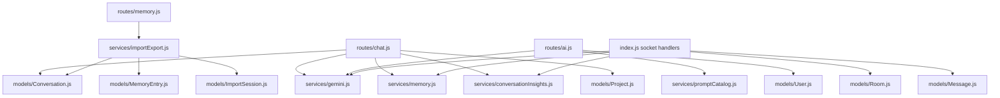

# 01. AI Scope And File Map

## Purpose

This file defines the exact AI-relevant file inventory for the current backend. It also explains why each file matters and which `dist/` files expose drift worth documenting.

## Scope Boundary

Included:

- files that directly generate AI output
- files that shape AI prompts or AI feature settings
- files that store AI responses, memory, or insights
- files that validate or throttle AI requests
- files that load uploaded/project context into AI prompts
- `dist/` files only when they disagree with or outpace source

## Source Inventory

| File | Why it matters |
| --- | --- |
| `index.js` | boots Express and Socket.IO, mounts AI routes, initializes catalogs, and contains the live room-AI socket implementation |
| `routes/chat.js` | solo AI chat REST entrypoint |
| `routes/ai.js` | model listing, smart replies, sentiment, grammar |
| `routes/conversations.js` | exposes stored solo chat history and conversation insights/actions |
| `routes/rooms.js` | exposes room insight reads and refresh-triggering actions |
| `routes/memory.js` | memory CRUD plus import/export |
| `routes/admin.js` | admin prompt-template management |
| `routes/uploads.js` | file upload and retrieval for AI attachments |
| `routes/projects.js` | project context persisted for prompt injection |
| `routes/settings.js` | user AI feature flags |
| `routes/export.js` | exports include AI metadata and memory refs |
| `services/gemini.js` | provider adapters, catalog refresh, routing, prompt assembly, attachment/project context, fallback chain |
| `services/memory.js` | deterministic and AI-assisted extraction, scoring, usage marking |
| `services/conversationInsights.js` | insight generation, persistence, retrieval |
| `services/promptCatalog.js` | default prompts, DB overrides, interpolation, initial room history |
| `services/aiQuota.js` | in-memory AI quota map |
| `services/importExport.js` | import preview/import/export with memory and insight side effects |
| `services/messageFormatting.js` | attachment validation and room-message formatting |
| `middleware/aiQuota.js` | HTTP AI quota gate |
| `middleware/rateLimit.js` | HTTP rate limiting, including dedicated AI limiter |
| `middleware/upload.js` | accepted file types, storage path, size limit |
| `middleware/socketAuth.js` | socket auth for room AI access |
| `models/Conversation.js` | solo chat storage model |
| `models/Message.js` | room and room-AI message storage model |
| `models/MemoryEntry.js` | durable memory storage model |
| `models/ConversationInsight.js` | insight storage model |
| `models/PromptTemplate.js` | prompt override storage model |
| `models/Room.js` | `aiHistory` storage and initial prompt seed |
| `models/Project.js` | prompt-injected project metadata and file attachments |
| `models/User.js` | AI feature flags under `settings.aiFeatures` |
| `models/ImportSession.js` | memory/conversation import session tracking |

## Relationship Map

## AI-Relevant `dist/` Files Worth Reading

| `dist/` file | Why it matters for drift |
| --- | --- |
| `dist/app.js`, `dist/server.js` | modular boot flow vs monolithic `index.js` |
| `dist/socket/index.js` | service-layer room AI, Prisma data access, different event payloads |
| `dist/routes/ai.routes.js` | different request/response shapes and validation |
| `dist/routes/chat.routes.js` | UUID validation, wrapped `{ success, data }` responses, richer attachment schema |
| `dist/routes/memory.routes.js` | entry-based memory import instead of raw text import |
| `dist/services/aiFeature.service.js` | AI feature flags named differently from source |
| `dist/services/chat.service.js` | solo chat implemented in service layer with Prisma |
| `dist/services/memory.service.js` | different memory fields, fingerprinting, and scoring |
| `dist/services/conversationInsights.service.js` | different insight schema conventions |
| `dist/services/promptCatalog.service.js` | cached prompt catalog and versioned DB entries |

## High-Value Drift Signals

| Topic | Source | `dist/` |
| --- | --- | --- |
| DB layer | Mongoose + MongoDB ObjectIds | Prisma + UUID-style IDs |
| room AI location | in `index.js` socket handler | in `dist/socket/index.js` calling services |
| AI REST payloads | direct JSON payloads | zod-validated payloads with `{ success, data }` wrappers |
| prompt templates | single active row per `key` | versioned `key_version` upserts |
| user AI settings | `smartReplies`, `sentimentAnalysis`, `grammarCheck` | `smartReplies`, `sentiment`, `grammar` |

## Failure And Risk Notes

- The biggest documentation risk is assuming `dist/` reflects the live runtime. It does not.
- The second biggest risk is under-scoping `index.js`, because room AI is hidden inside the socket section.
- The third biggest risk is assuming `services/gemini.js` is Gemini-only. In source it is the multi-provider router.

## Rebuild Notes

If rebuilding from scratch:

1. move room AI out of `index.js` into a service
2. isolate provider adapters from prompt assembly
3. make memory, insight, and storage side effects explicit orchestration steps

