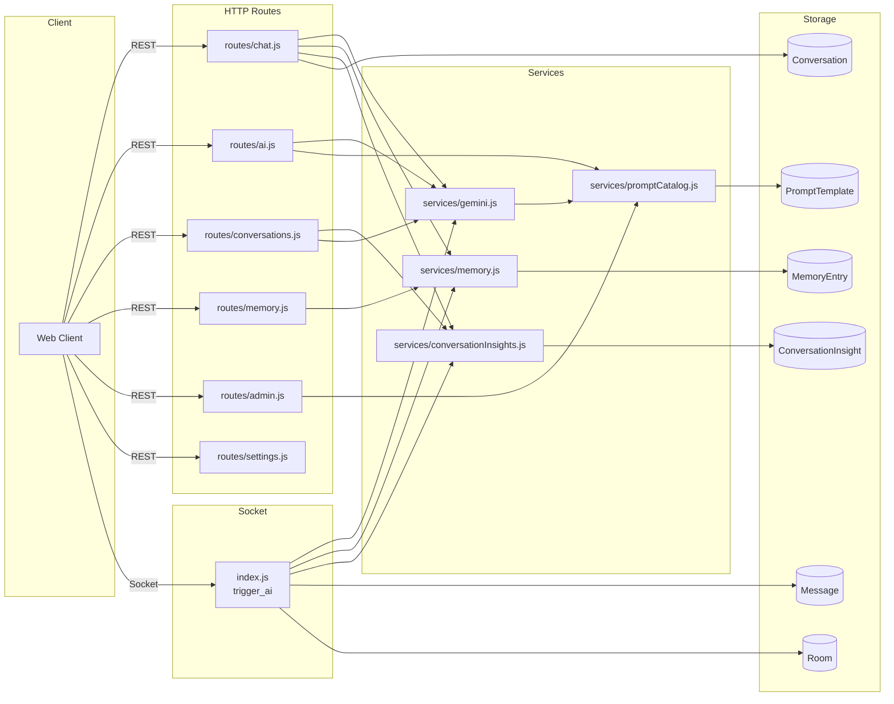

# 01. AI Scope and File Map

## Purpose

This document defines exactly what counts as an AI-related part of the ChatSphere backend, why each file matters, and how they interconnect. It is the boundary document for the entire AI subsystem and serves as the primary reference for onboarding, code review, and architectural decisions.

In this backend, "AI features" means far more than model API calls. The complete AI surface spans route handlers, socket event handlers, provider integrations, prompt construction, memory extraction, insight generation, attachment ingestion, project context injection, quota enforcement, and the storage of AI responses and metadata.

---

## AI Scope Definition

The AI subsystem encompasses every code path that:

1. Accepts an AI request from a client (REST or Socket.IO)
2. Constructs a prompt with context (memory, insight, attachments, project data)
3. Routes to an AI provider (OpenRouter, Gemini, Grok, Groq, Together AI, HuggingFace)
4. Handles fallback when a provider or model fails
5. Extracts structured data from AI responses (JSON memory, insights, smart replies)
6. Persists AI responses and metadata to MongoDB
7. Refreshes conversation or room insights after AI activity
8. Manages user-level AI feature toggles
9. Enforces per-user AI request quotas
10. Imports external conversations and extracts memories from them

---

## Primary AI Files

| File | Lines | Responsibility | Key Exports |
|------|-------|---------------|-------------|
| `index.js` | 1137 | Express app, Socket.IO server, route mounting, socket event handlers including `trigger_ai` | `startServer`, socket handlers |
| `services/gemini.js` | 1386 | Provider adapters, model catalog, routing, prompt execution, fallback chains | `sendMessage`, `sendGroupMessage`, `getJsonFromModel`, `resolveModel`, `refreshModelCatalogs` |
| `services/memory.js` | 262 | Deterministic + AI memory extraction, scoring, retrieval, upsert | `retrieveRelevantMemories`, `upsertMemoryEntries`, `extractDeterministicMemories`, `extractAiMemories` |
| `services/conversationInsights.js` | 192 | Structured insight generation and persistence for conversations and rooms | `refreshConversationInsight`, `refreshRoomInsight`, `getConversationInsight`, `getRoomInsight` |
| `services/promptCatalog.js` | 149 | Default prompt templates, DB overrides, interpolation | `getPromptTemplate`, `interpolatePrompt`, `buildInitialRoomHistory`, `listPromptTemplates` |
| `services/aiQuota.js` | 42 | In-memory sliding-window AI request quota | `consumeAiQuota` |
| `services/importExport.js` | 370 | External conversation parsing, import with memory extraction, export in multiple formats | `previewImport`, `importConversationBundle`, `exportUserBundle` |
| `services/messageFormatting.js` | 66 | Message formatting for API responses, attachment payload validation | `formatMessage`, `validateAttachmentPayload` |
| `routes/chat.js` | 186 | Solo AI chat REST endpoint | Express router |
| `routes/ai.js` | 214 | Smart replies, sentiment, grammar, model listing endpoints | Express router |
| `routes/conversations.js` | 172 | Conversation CRUD, insight retrieval, action endpoints | Express router |
| `routes/memory.js` | 163 | Memory CRUD, import, export endpoints | Express router |
| `routes/admin.js` | 231 | Admin prompt template management | Express router |
| `routes/settings.js` | 105 | User AI feature toggle settings | Express router |
| `middleware/aiQuota.js` | 18 | AI quota enforcement on REST endpoints | `aiQuotaMiddleware` |
| `middleware/rateLimit.js` | 55 | Express-level rate limiting for auth, AI, and general API | `authLimiter`, `aiLimiter`, `apiLimiter` |
| `middleware/upload.js` | 58 | Multer file upload configuration for attachments | `upload` |
| `middleware/socketAuth.js` | 19 | Socket.IO JWT authentication | `socketAuthMiddleware` |
| `helpers/logger.js` | 191 | Structured logging with sensitive data redaction | `logInfo`, `logError`, `logWarn`, `serializeError` |
| `helpers/validate.js` | 96 | Room validation helpers | `findRoomMember`, `hasRoomRole`, `isRoomCreator` |
| `config/db.js` | 32 | MongoDB connection with pool settings | `connectDB` |

---

## Database Models Involved in AI

| Model | AI Relevance | Key Fields |
|-------|-------------|------------|
| `Conversation` | Stores solo AI chat transcripts with full message history | `userId`, `messages[]`, `projectId`, `sourceType` |
| `Message` | Stores room AI outputs with metadata | `roomId`, `isAI`, `modelId`, `provider`, `memoryRefs`, `reactions` |
| `MemoryEntry` | Durable user memory records with scoring | `userId`, `summary`, `fingerprint`, `confidenceScore`, `usageCount`, `pinned` |
| `ConversationInsight` | Persisted structured summaries | `scopeKey`, `scopeType`, `title`, `summary`, `intent`, `topics`, `decisions`, `actionItems` |
| `PromptTemplate` | Customizable prompt template storage | `key`, `version`, `content`, `isActive` |
| `Room` | Multi-user chat rooms with AI history | `name`, `members[]`, `aiHistory[]`, `pinnedMessages[]` |
| `User` | User settings including AI feature toggles | `settings.aiFeatures.smartReplies`, `settings.aiFeatures.sentimentAnalysis`, `settings.aiFeatures.grammarCheck` |
| `Project` | Optional project context injected into prompts | `name`, `description`, `instructions`, `context`, `tags`, `files[]`, `suggestedPrompts` |
| `ImportSession` | Tracks import operations with AI-assisted parsing | `userId`, `sourceType`, `fingerprint`, `status`, `preview`, `importedConversationIds` |

---

## File Dependency Graph

```mermaid
flowchart TD
    subgraph "Entrypoints"
        IDX["index.js\n1137 lines"]
        R_CHAT["routes/chat.js\n186 lines"]
        R_AI["routes/ai.js\n214 lines"]
        R_CONV["routes/conversations.js\n172 lines"]
        R_MEM["routes/memory.js\n163 lines"]
        R_ADMIN["routes/admin.js\n231 lines"]
        R_SETTINGS["routes/settings.js\n105 lines"]
    end

    subgraph "Services"
        S_GEMINI["services/gemini.js\n1386 lines"]
        S_MEMORY["services/memory.js\n262 lines"]
        S_INSIGHTS["services/conversationInsights.js\n192 lines"]
        S_PROMPTS["services/promptCatalog.js\n149 lines"]
        S_QUOTA["services/aiQuota.js\n42 lines"]
        S_IMPORT["services/importExport.js\n370 lines"]
        S_FORMAT["services/messageFormatting.js\n66 lines"]
    end

    subgraph "Middleware"
        M_AIQUOTA["middleware/aiQuota.js\n18 lines"]
        M_RATE["middleware/rateLimit.js\n55 lines"]
        M_UPLOAD["middleware/upload.js\n58 lines"]
        M_SAUTH["middleware/socketAuth.js\n19 lines"]
    end

    subgraph "Models"
        M_CONV["models/Conversation"]
        M_MSG["models/Message"]
        M_MEM["models/MemoryEntry"]
        M_INS["models/ConversationInsight"]
        M_PROMPT["models/PromptTemplate"]
        M_ROOM["models/Room"]
        M_USER["models/User"]
        M_PROJ["models/Project"]
    end

    subgraph "External"
        PROVIDERS["AI Providers\nOpenRouter, Gemini, Grok,\nGroq, Together, HuggingFace"]
        MONGO[(MongoDB)]
    end

    IDX --> R_CHAT
    IDX --> R_AI
    IDX --> R_CONV
    IDX --> R_MEM
    IDX --> R_ADMIN
    IDX --> R_SETTINGS

    IDX --> M_SAUTH

    R_CHAT --> S_GEMINI
    R_CHAT --> S_MEMORY
    R_CHAT --> S_INSIGHTS
    R_AI --> S_GEMINI
    R_AI --> S_PROMPTS
    R_AI --> S_QUOTA
    R_CONV --> S_INSIGHTS
    R_CONV --> S_GEMINI
    R_MEM --> S_MEMORY
    R_MEM --> S_IMPORT
    R_ADMIN --> S_PROMPTS
    R_SETTINGS --> M_USER

    S_GEMINI --> S_PROMPTS
    S_GEMINI --> S_MEMORY
    S_GEMINI --> PROVIDERS
    S_GEMINI --> M_RATE

    S_MEMORY --> M_MEM
    S_INSIGHTS --> M_INS
    S_PROMPTS --> M_PROMPT
    S_IMPORT --> M_CONV
    S_IMPORT --> M_MEM

    S_GEMINI --> MONGO
    S_MEMORY --> MONGO
    S_INSIGHTS --> MONGO
    S_PROMPTS --> MONGO
    R_CHAT --> MONGO
    R_CONV --> MONGO
    R_MEM --> MONGO
    R_ADMIN --> MONGO

    IDX -->|"trigger_ai handler"| S_GEMINI
    IDX -->|"trigger_ai handler"| S_MEMORY
    IDX -->|"trigger_ai handler"| S_INSIGHTS
```



---

## Detailed File Breakdown

### index.js — Main Entry Point

**File:** `index.js` (1137 lines)

**Purpose:** Bootstraps the entire application. Creates the Express app, configures middleware, mounts all route handlers, sets up the Socket.IO server with JWT authentication, and defines all real-time event handlers. The critical `trigger_ai` socket handler lives directly in this file rather than in a dedicated service module.

**Key sections by line range:**

| Lines | Section | Description |
|-------|---------|-------------|
| 1-50 | Imports & configuration | Loads dotenv, express, http, socket.io, CORS, rate limiters, database connector, all route modules |
| 51-120 | Express setup | CORS with `CLIENT_URL` (default `http://localhost:5173`), JSON body limit 5MB, request logging with requestId, `apiLimiter` on `/api` routes |
| 121-180 | Route mounting | Mounts all API routes including `/api/ai`, `/api/chat`, `/api/conversations`, `/api/memory`, `/api/admin`, `/api/settings` |
| 181-250 | Socket.IO setup | Creates Socket.IO server with CORS, attaches `socketAuthMiddleware` for JWT verification |
| 251-400 | Socket state initialization | Initializes `roomUsers` (Map<roomId, Map<socketId, user>>), `globalOnlineUsers`, `typingUsers`, `socketFlood` maps |
| 401-550 | Basic socket events | `authenticate`, `join_room`, `leave_room`, `typing_start`, `typing_stop`, `mark_read` handlers |
| 551-850 | `send_message` handler | Message persistence, room broadcast, flood control (FLOOD_MAX=30, FLOOD_WINDOW=10000ms) |
| 851-1050 | `trigger_ai` handler | Quota check, membership validation, memory retrieval, insight retrieval, calls `sendGroupMessage`, memory upsert, AI history management (trim to 42), emits `ai_response` |
| 1051-1137 | `startServer` function | Calls `connectDB()`, `refreshModelCatalogs()`, logs available models, starts HTTP listener |

**Key constants defined in index.js:**

```javascript
// AI username for room bot messages (line ~860)
const AI_USERNAME = process.env.GEMINI_GROUP_BOT_NAME || 'Gemini';

// Message edit window in milliseconds (line ~855)
const EDIT_WINDOW_MS = (process.env.MESSAGE_EDIT_WINDOW_MINUTES || 15) * 60 * 1000;

// Flood control parameters (line ~280)
const FLOOD_MAX = 30;
const FLOOD_WINDOW = 10000; // 10 seconds

// Allowed emoji reactions (line ~275)
const ALLOWED_REACTIONS = ['👍', '🔥', '🤯', '💡'];
```

**Route mounts (AI-relevant):**

```javascript
app.use('/api/ai', aiQuotaMiddleware, aiRoutes);
app.use('/api/chat', chatRoutes);
app.use('/api/conversations', conversationRoutes);
app.use('/api/memory', memoryRoutes);
app.use('/api/admin', adminRoutes);
app.use('/api/settings', settingsRoutes);
```

**Health check endpoint:**

```javascript
app.get('/api/health', (req, res) => {
  res.json({ status: 'ok' });
});
```

---

### services/gemini.js — AI Core Service

**File:** `services/gemini.js` (1386 lines)

**Purpose:** The central AI service handling all provider communication, model resolution, prompt construction, fallback chains, and response normalization. Despite the filename referencing only Gemini, it supports 6 providers.

**Provider support matrix:**

| Provider | Env Prefix | Default Model | SDK/Method | Models Available |
|----------|-----------|---------------|------------|-----------------|
| OpenRouter | `OPENROUTER_` | First from 19-model list | OpenAI-compatible REST | 19 models |
| Gemini (direct) | `GEMINI_` | `gemini-2.5-flash` | `@google/generative-ai` SDK | 12 models |
| Grok | `GROK_` | `grok-2-latest` | OpenAI-compatible REST | 1 model |
| Groq | `GROQ_` | First from 10-model list | OpenAI-compatible REST (direct) | 10 models |
| Together AI | `TOGETHER_` | First from 12-model list | OpenAI-compatible REST | 12 models |
| HuggingFace | `HUGGINGFACE_` | `meta-llama/Llama-3.1-8B-Instruct:cerebras` | OpenAI-compatible REST | 1 model |

**Model name resolution priority (line ~85):**

```
DEFAULT_AI_MODEL
  > OPENROUTER_DEFAULT_MODEL
    > TOGETHER_MODEL
      > GROQ_MODEL
        > GEMINI_MODEL
          > DEFAULT_GEMINI_MODEL ('gemini-2.5-flash')
```

**Model catalog caching:**

```javascript
// Minimum 5 minutes, default 30 minutes (line ~95)
const MODEL_CATALOG_TTL_MS = Math.max(
  5 * 60 * 1000,
  parseInt(process.env.MODEL_CATALOG_TTL_MS) || 30 * 60 * 1000
);
```

**Key function groups:**

| Function Group | Functions | Purpose |
|---------------|-----------|---------|
| Model catalog | `refreshModelCatalogs`, `getAvailableModels`, `resolveModel` | Fetch, cache, and resolve model IDs across providers |
| Prompt building | `buildPrompt`, `buildMemoryContext`, `buildInsightContext`, `buildAttachmentPayload`, `buildProjectContext` | Compose complete prompts with all context sections |
| Provider requests | `runOpenRouterRequest`, `runGeminiRequest`, `runGrokRequest`, `runGroqDirectRequest`, `runTogetherRequest`, `runHuggingFaceRequest` | Execute API calls to specific providers |
| Fallback chain | `runModelPromptWithFallback`, `buildFallbackModelChain`, `normalizeAiError` | Multi-attempt execution with provider/model fallback |
| Entry points | `sendMessage`, `sendGroupMessage`, `getJsonFromModel` | Public API for AI operations |
| Utilities | `estimatePromptComplexity`, `rankModelsForTask`, `resolveTaskModel`, `parseJsonFromText`, `normalizeHistoryEntry`, `serializeHistory` | Supporting logic for model selection and data normalization |

**Max tokens configuration:**

| Operation | Default | Configurable Via |
|-----------|---------|-----------------|
| JSON operations | 400 | Environment variable |
| Chat operations | 1200 | Environment variable |
| Group chat | 1200 | Environment variable |
| Default | 800 | Environment variable |

**Temperature:** All providers use temperature `0.6`.

---

### services/memory.js — Memory Service

**File:** `services/memory.js` (262 lines)

**Purpose:** Extracts, stores, scores, and retrieves user memories. Uses both deterministic regex patterns and AI-based extraction via the Gemini service.

**Deterministic extraction patterns:**

| Pattern Type | Regex Target | Example Input | Extracted Value |
|-------------|-------------|---------------|-----------------|
| Name | `my name is (\w+)` | "my name is John" | name: "John" |
| Location | `i live in (.+)` | "i live in New York" | location: "New York" |
| Workplace | `i work at/for (.+)` | "i work at Google" | workplace: "Google" |
| Favorites | `my favorite (\w+) is (.+)` | "my favorite color is blue" | favorite_color: "blue" |
| Preferences | `i like/love/prefer (.+)` | "i like pizza" | preference: "pizza" |

**Memory scoring formula (line ~180):**

```
score = textScore * 0.45
      + importanceScore * 0.2
      + confidenceScore * 0.15
      + recencyScore * 0.1
      + usageBoost * min(0.1, count * 0.01)
      + pinnedBonus (0.15 if pinned)
```

**Recency score buckets:**

| Memory Age | Recency Score |
|------------|--------------|
| ≤ 1 day | 1.0 |
| ≤ 7 days | 0.85 |
| ≤ 30 days | 0.65 |
| ≤ 90 days | 0.45 |
| > 90 days | 0.25 |

**Retrieval process:**
1. Fetches up to 100 entries for the user
2. Scores each entry against query tokens
3. Filters to entries with score > 0.08 or pinned entries
4. Sorts by score descending
5. Returns top N entries (default 5)

---

### services/conversationInsights.js — Insights Service

**File:** `services/conversationInsights.js` (192 lines)

**Purpose:** Generates and persists structured insights from conversations and rooms. Uses AI to extract title, summary, intent, topics, decisions, and action items.

**Scope types:**

| Scope Type | Scope ID | Data Source | Message Limit |
|------------|----------|-------------|---------------|
| `conversation` | conversationId | Full `Conversation.messages` array | All messages |
| `room` | roomId | Last 40 `Message` documents from room | 40 messages |

**Scope key format:** `"scopeType:scopeId:userId"` or `"scopeType:scopeId:global"`

**Insight schema:**

```javascript
{
  title: string,
  summary: string,
  intent: string,
  topics: string[],
  decisions: string[],
  actionItems: string[]
}
```

**Fallback insight generation:** When AI is unavailable, builds a basic insight using word-frequency analysis for topics, text slice for summary, and question mark detection for intent.

---

### services/promptCatalog.js — Prompt Templates

**File:** `services/promptCatalog.js` (149 lines)

**Purpose:** Manages prompt templates. Provides 8 default templates and DB-based override capability via admin endpoints.

**Default templates:**

| Template Key | Purpose |
|-------------|---------|
| `solo-chat` | One-on-one AI conversation system prompt |
| `group-chat` | Multi-user room AI conversation system prompt |
| `memory-extract` | JSON memory extraction from conversation text |
| `conversation-insight` | Structured insight generation (title, summary, intent, etc.) |
| `smart-replies` | Generate 3 reply suggestions for a message |
| `sentiment` | Sentiment analysis classification |
| `grammar` | Grammar correction suggestions |

**Interpolation:** Uses `{{variable}}` pattern replacement. Variables include `roomName`, `username`, and any context values passed by the caller.

---

### services/aiQuota.js — In-Memory Quota

**File:** `services/aiQuota.js` (42 lines)

**Purpose:** Sliding-window rate limiter for AI requests. Operates entirely in memory.

| Constant | Value | Description |
|----------|-------|-------------|
| `AI_WINDOW_MS` | 15 minutes (900,000ms) | Sliding window duration |
| `AI_MAX_REQUESTS` | 20 | Max requests per window per key |

**Return value:** `{ allowed: boolean, remaining: number, retryAfterMs: number }`

---

### services/importExport.js — Import/Export

**File:** `services/importExport.js` (370 lines)

**Purpose:** Parses external conversation formats and exports user data. Supports import from ChatGPT, Claude, and generic markdown formats.

**Supported import formats:**

| Format | Parser Function | Detection Method |
|--------|----------------|-----------------|
| ChatGPT JSON | `parseChatGptJson` | Mapping format or simple array format |
| Claude JSON/Text | `parseClaudeSource` | JSON parse or Human:/Assistant: text pattern |
| Generic Markdown | `parseGenericMarkdown` | User:/Assistant: block pattern |

**Import process:**
1. Parse source format into normalized messages
2. Build candidate memories from message content
3. Fingerprint deduplication check
4. Create Conversation documents
5. Extract and store memories
6. Refresh conversation insights

**Export formats:** normalized JSON, markdown, adapter-specific formats

---

### services/messageFormatting.js — Message Formatting

**File:** `services/messageFormatting.js` (66 lines)

**Purpose:** Formats Mongoose Message documents for API responses and validates attachment payloads.

**Attachment validation checks:**
- `fileUrl` must be present and valid
- `fileName` must be present
- `fileType` must be present
- `fileSize` must be within limits

---

### routes/ai.js — AI Helper Endpoints

**File:** `routes/ai.js` (214 lines)

**Endpoints:**

| Method | Path | Purpose | Middleware |
|--------|------|---------|-----------|
| GET | `/api/ai/models` | Refresh catalogs, return model list with 'auto' option | `authMiddleware` |
| POST | `/api/ai/smart-replies` | Generate 3 smart reply suggestions | `authMiddleware`, `aiLimiter`, `aiQuotaMiddleware` |
| POST | `/api/ai/sentiment` | Analyze message sentiment | `authMiddleware`, `aiLimiter`, `aiQuotaMiddleware` |
| POST | `/api/ai/grammar` | Check and correct grammar | `authMiddleware`, `aiLimiter`, `aiQuotaMiddleware` |

**All AI helper endpoints check user settings before processing.** If the feature is disabled in `user.settings.aiFeatures`, the endpoint returns a 403 or skips processing.

---

### routes/chat.js — Solo Chat

**File:** `routes/chat.js` (186 lines)

**Endpoint:** `POST /api/chat`

**Middleware:** `authMiddleware`, `aiQuotaMiddleware`

**Request flow:**
1. Validate message content and attachment payload
2. Retrieve relevant memories (limit 5) via `retrieveRelevantMemories`
3. Load existing conversation insight
4. Resolve project context from `projectId` or associated conversation
5. Call `sendMessage` with memory, insight, attachment, and project context
6. Create new Conversation or update existing one with user+assistant messages
7. Store memory references, model ID, provider, routing metadata, token counts
8. Run `upsertMemoryEntries` and `markMemoriesUsed` in parallel
9. Trigger `refreshConversationInsight` (non-blocking on error)
10. Return response with conversationId, content, memoryRefs, insight, model info, routing metadata

---

### routes/conversations.js — Conversations

**File:** `routes/conversations.js` (172 lines)

**Endpoints:**

| Method | Path | Purpose |
|--------|------|---------|
| GET | `/api/conversations` | List conversations with optional `projectId` filter, populate project |
| GET | `/api/conversations/:id` | Full conversation with messages |
| GET | `/api/conversations/:id/insights` | Get conversation insight |
| POST | `/api/conversations/:id/actions/:action` | Execute actions: summarize, extract-tasks, extract-decisions |
| DELETE | `/api/conversations/:id` | Delete conversation |

---

### routes/memory.js — Memory Management

**File:** `routes/memory.js` (163 lines)

**Endpoints:**

| Method | Path | Purpose |
|--------|------|---------|
| GET | `/api/memory` | List memories with search, pinned filter, limit |
| PUT | `/api/memory/:id` | Update memory entry (summary, details, tags, pinned, scores) |
| DELETE | `/api/memory/:id` | Delete memory entry |
| POST | `/api/memory/import` | Preview or import conversations |
| GET | `/api/memory/export` | Export in normalized, markdown, adapter formats |

---

### routes/admin.js — Admin Prompt Management

**File:** `routes/admin.js` (231 lines)

**Endpoints:**

| Method | Path | Purpose |
|--------|------|---------|
| GET | `/api/admin/prompts` | List all prompt templates (DB + defaults) |
| PUT | `/api/admin/prompts/:key` | Upsert prompt template (create or update) |

---

### routes/settings.js — AI Feature Toggles

**File:** `routes/settings.js` (105 lines)

**AI feature toggles stored in `User.settings.aiFeatures`:**

| Feature | Default | Description |
|---------|---------|-------------|
| `smartReplies` | `true` | AI-generated reply suggestions |
| `sentimentAnalysis` | `false` | Sentiment classification of messages |
| `grammarCheck` | `false` | Grammar correction suggestions |

---

### middleware/aiQuota.js — Quota Middleware

**File:** `middleware/aiQuota.js` (18 lines)

**Purpose:** Builds quota key from `user.id` or IP address, calls `consumeAiQuota`, returns HTTP 429 if quota exceeded.

---

### middleware/rateLimit.js — Rate Limiting

**File:** `middleware/rateLimit.js` (55 lines)

**Limiter configuration:**

| Limiter | Window | Max Requests | Scope |
|---------|--------|-------------|-------|
| `authLimiter` | 15 min | 20 | Authentication routes |
| `aiLimiter` | 15 min | 80 | AI routes (user-aware key) |
| `apiLimiter` | 15 min | 1000 | General API (skips `/health` and `/auth`) |

---

### middleware/upload.js — File Upload

**File:** `middleware/upload.js` (58 lines)

**Configuration:**

| Setting | Value |
|---------|-------|
| Storage engine | Multer disk storage |
| Upload directory | `uploads/` |
| Max file size | 5MB |
| Allowed types | Images (JPEG, PNG, GIF, WebP), PDF, text files, code files |
| Filename generation | `crypto.randomBytes(16)` hex string |

---

### middleware/socketAuth.js — Socket Authentication

**File:** `middleware/socketAuth.js` (19 lines)

**Purpose:** Verifies JWT from `socket.handshake.auth.token`, attaches `socket.user` object with `id`, `username`, `email` to the socket instance.

---

### helpers/logger.js — Structured Logging

**File:** `helpers/logger.js` (191 lines)

**Features:**
- Structured logging with event codes
- Sensitive key redaction (API keys, tokens)
- `serializeError` extracts: name, message, code, statusCode, retryAfterMs, modelId, provider
- `buildRequestSummary` for request logging with method, path, status, duration

---

### helpers/validate.js — Validation Helpers

**File:** `helpers/validate.js` (96 lines)

**Exports:**

| Function | Purpose |
|----------|---------|
| `isValidObjectId` | Validates MongoDB ObjectId format |
| `findRoomMember` | Finds a user in a room's member list |
| `hasRoomRole` | Checks if a user has a specific role in a room |
| `getRoomMemberRole` | Returns the role of a user in a room |
| `isRoomCreator` | Checks if a user created the room |

---

### config/db.js — Database Connection

**File:** `config/db.js` (32 lines)

**Configuration:**

| Setting | Value |
|---------|-------|
| Connection method | `mongoose.connect` |
| Max pool size | 10 |
| Server selection timeout | 5000ms |
| Socket timeout | 45000ms |

---

## Relationship Map



---

## Key Observations

1. **Mongoose end to end:** All AI storage uses Mongoose models. There is no Redis, no external cache layer beyond in-memory JavaScript Maps.

2. **Room AI lives in index.js:** The `trigger_ai` socket handler is embedded directly in the main entry file. It is not extracted into a dedicated service or socket module. This makes `index.js` the single most complex file in the codebase.

3. **Provider abstraction in gemini.js:** Despite the filename, `services/gemini.js` handles 6 providers. The file name is a historical artifact.

4. **Memory and insights are AI data products:** They are not just storage — they shape prompts (memory context, insight context) and persist AI-derived structure (extracted memories, conversation summaries).

5. **No distributed coordination:** All state (quota, room presence, typing indicators, flood control) is in-memory and process-local. This limits horizontal scaling.

---

## Inconsistencies and Risks

| Risk | Location | Severity | Description |
|------|----------|----------|-------------|
| Filename mismatch | `services/gemini.js` | Low | File named "gemini" but supports 6 providers; confusing for new developers |
| In-memory quota | `services/aiQuota.js` | Medium | Quota resets on process restart; no cross-instance sharing in multi-deployment scenarios |
| No distributed locking | `services/conversationInsights.js` | Medium | Concurrent insight refreshes may cause duplicate AI calls for the same conversation |
| Hard-coded limits | `index.js` | Low | AI history trim to 42 entries, last 20 history entries for serialization — not configurable via env |
| Memory score weights | `services/memory.js` | Low | Weights (0.45, 0.2, 0.15, 0.1) are hard-coded; no tuning mechanism or A/B testing support |
| Flood control unbounded | `index.js` | Medium | `socketFlood` Map grows without cleanup interval; potential memory leak under sustained load |
| No retry-after header | `middleware/aiQuota.js` | Low | Returns 429 but does not set `Retry-After` header for client backoff |
| Upload cleanup missing | `middleware/upload.js` | Medium | Disk-based uploads in `uploads/` directory have no TTL or auto-deletion strategy |

---

## Scaling and Operational Implications

| Concern | Detail | Mitigation |
|---------|--------|-----------|
| Memory usage | `runtimeModelCatalog`, `quotaMap`, `roomUsers`, `socketFlood` all live in memory; monitor under load | Add size limits, TTL cleanup intervals |
| Provider API costs | Fallback chains can multiply API calls (up to `AI_FALLBACK_MODEL_LIMIT`, default 6) | Monitor token usage per provider, set budget alerts |
| Catalog TTL | 30-minute default means stale model lists during provider updates | Reduce TTL during known update windows |
| Socket scaling | In-memory state does not survive restarts or scale across instances | Use Redis adapter for Socket.IO, externalize state |
| Upload storage | Disk-based uploads require cleanup strategy | Implement cron-based cleanup or use S3 |
| Database indexes | Ensure indexes on `MemoryEntry.userId`, `ConversationInsight.scopeKey`, `Message.roomId` | Add compound indexes for common query patterns |
| Connection pool | Max pool size of 10 may be insufficient under high concurrent AI load | Monitor pool utilization, increase as needed |

---

## How to Rebuild from Scratch

If you need to recreate the AI subsystem from zero, follow this layered approach:

### Layer 1: Foundation
1. Install dependencies: `express`, `socket.io`, `mongoose`, `@google/generative-ai`, `multer`, `jsonwebtoken`, `cors`, `dotenv`
2. Create `config/db.js` — MongoDB connection with pool settings (maxPoolSize:10, serverSelectionTimeoutMS:5000, socketTimeoutMS:45000)
3. Create all Mongoose models: Conversation, Message, MemoryEntry, ConversationInsight, PromptTemplate, Room, User, Project, ImportSession

### Layer 2: Core Services
4. Create `services/promptCatalog.js` — Define 8 default prompt templates, implement interpolation with `{{variable}}` patterns, add DB override capability
5. Create `services/aiQuota.js` — Implement sliding window quota with `AI_WINDOW_MS=15min` and `AI_MAX_REQUESTS=20`
6. Create `services/memory.js` — Implement 5 deterministic regex patterns, AI extraction via `getJsonFromModel`, scoring formula, retrieval with token matching
7. Create `services/conversationInsights.js` — Implement insight generation with JSON schema, scope key format, fallback insight builder
8. Create `services/gemini.js` — Implement 6 provider adapters, model catalog with TTL caching, prompt building with all context sections, fallback chain with error classification

### Layer 3: Middleware
9. Create `middleware/auth.js` — JWT verification for REST endpoints
10. Create `middleware/socketAuth.js` — JWT verification from `socket.handshake.auth.token`
11. Create `middleware/rateLimit.js` — Three limiters: authLimiter (20/15min), aiLimiter (80/15min), apiLimiter (1000/15min)
12. Create `middleware/aiQuota.js` — Quota key from user ID or IP, 429 response on exceed
13. Create `middleware/upload.js` — Multer disk storage, 5MB limit, allowed file types

### Layer 4: Routes
14. Create `routes/chat.js` — Solo AI chat with memory retrieval, project context, insight refresh
15. Create `routes/ai.js` — Smart replies, sentiment, grammar, model listing
16. Create `routes/conversations.js` — CRUD with insight and action endpoints
17. Create `routes/memory.js` — Memory CRUD, import, export
18. Create `routes/admin.js` — Prompt template management
19. Create `routes/settings.js` — AI feature toggles

### Layer 5: Entry Point
20. Create `index.js` — Express app with CORS (CLIENT_URL), JSON 5MB limit, request logging, route mounting, Socket.IO setup, all socket event handlers including `trigger_ai`
21. Set environment variables — Provider API keys, model configurations, feature flags
22. Run `refreshModelCatalogs()` on startup to populate model caches
23. Log available models for operational visibility

---

## Expanded Learning Appendix

### Extended Study Notes

- **Study note 1:** The real decision point for model selection is `resolveModel` in `services/gemini.js`, not the route handler. Routes pass `modelId` or `'auto'`, but `resolveModel` does the actual lookup against the catalog.
- **Study note 2:** The `trigger_ai` handler in `index.js` is the most complex single function. It orchestrates quota checks, membership validation, memory retrieval, insight retrieval, AI execution, memory upsert, history management, and response emission — all in one handler.
- **Study note 3:** Memory fingerprinting uses SHA1 hashing of normalized summary text. This means two memories with semantically identical content but different formatting will have different fingerprints.
- **Study note 4:** The fallback chain in `runModelPromptWithFallback` can attempt up to `AI_FALLBACK_MODEL_LIMIT` (default 6) different model/provider combinations before giving up.
- **Study note 5:** `buildFallbackModelChain` diversifies across providers in priority order, preventing all fallbacks from hitting the same provider during an outage.

### Detailed Trace Prompts

- **Trace prompt 1:** Walk a `POST /api/chat` request from client through `authMiddleware`, `aiQuotaMiddleware`, `routes/chat.js` handler, memory retrieval, prompt construction, provider API call, response parsing, conversation persistence, memory upsert, insight refresh, and final response.
- **Trace prompt 2:** Walk a `trigger_ai` socket event from client emission through `socketAuthMiddleware`, quota check, membership validation, memory retrieval, insight retrieval, `sendGroupMessage` call, AI response, memory upsert, AI history update, and `ai_response` emission.
- **Trace prompt 3:** Walk a `POST /api/ai/smart-replies` request through settings check, template loading, AI execution, response normalization to 3 suggestions, and fallback by question detection.

### Data and State Questions

- **Data question 1:** What state is durable vs. process-local? Durable: all Mongoose models in MongoDB. Process-local: `runtimeModelCatalog`, `quotaMap`, `roomUsers`, `typingUsers`, `socketFlood`, `globalOnlineUsers`. Under concurrency, process-local state is inconsistent across instances.
- **Data question 2:** The `socketFlood` Map in `index.js` has no cleanup mechanism. Under sustained load from many sockets, this Map grows unbounded. A TTL-based cleanup or LRU eviction strategy is needed.
- **Data question 3:** `ConversationInsight` uses upsert by `scopeKey`. If two requests trigger `refreshConversationInsight` simultaneously, both may call the AI provider and both may write, with the second overwriting the first. This wastes API calls.

### Failure and Recovery Questions

- **Failure question 1:** If the AI provider times out during `sendMessage`, `runModelPromptWithFallback` attempts the next model in the fallback chain. If all attempts fail, the error is normalized by `normalizeAiError` and returned to the caller. The Conversation is not created (no partial state).
- **Failure question 2:** If `refreshConversationInsight` fails after the solo chat response is sent, the user still receives their AI response. The insight is stale but not blocking. This is by design — insight refresh is non-blocking.
- **Failure question 3:** If memory upsert fails during `trigger_ai`, the AI response is still emitted to the room. The memory is lost but the user experience is not interrupted. This is a silent failure mode.

### Scaling and Operations Notes

- **Operations note 1:** Under high load, the in-memory `quotaMap` in `services/aiQuota.js` is the fastest quota check but does not share state across instances. For multi-instance deployments, move quota to Redis.
- **Operations note 2:** The MongoDB connection pool of 10 may become a bottleneck when multiple AI requests concurrently read memories, insights, and write conversations. Monitor pool utilization and increase `maxPoolSize` as needed.
- **Operations note 3:** Model catalog refresh runs in parallel for all providers during `refreshModelCatalogs`. If one provider API is slow, it does not block others due to `Promise.all` with individual error handling.

### Code Review Angles

- **Review angle 1:** The `trigger_ai` handler in `index.js` should be extracted into a dedicated service module (e.g., `services/roomAi.js`). Its current location makes `index.js` hard to test in isolation and obscures the room AI flow.
- **Review angle 2:** The memory scoring weights in `services/memory.js` are hard-coded. Consider making them configurable via environment variables or a database table for A/B testing.
- **Review angle 3:** The `services/gemini.js` filename should be renamed to `services/aiProvider.js` or `services/modelRouter.js` to accurately reflect its multi-provider responsibility.

### Rebuild Guidance Points

- **Rebuild point 1:** If rebuilding the AI subsystem, define clear interfaces between layers: route handlers should not call MongoDB directly, services should not depend on Express request objects, and socket handlers should delegate to services rather than containing business logic.
- **Rebuild point 2:** Externalize all in-memory state (quota, room presence, typing indicators) to a shared store like Redis before deploying to multiple instances.
- **Rebuild point 3:** Add structured tracing (e.g., OpenTelemetry) to track AI request latency across quota check, memory retrieval, prompt construction, provider call, and persistence.

### Practical Learning Exercises

- **Exercise 1:** Open `services/gemini.js` and trace the full path of `sendMessage` from parameter validation through prompt construction, provider selection, API call, response parsing, and error handling. Note every environment variable referenced.
- **Exercise 2:** Open `index.js` and identify every socket event handler. For each handler, list the MongoDB operations it performs and the Socket.IO emissions it triggers.
- **Exercise 3:** Compare the default prompt templates in `services/promptCatalog.js` with the actual prompt construction in `services/gemini.js`. Identify which template variables are interpolated and which context sections are added programmatically.
