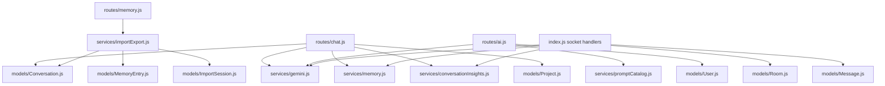

# 01. AI Scope And File Map

## Purpose

This file defines the exact AI-relevant file inventory for the current backend. It also explains why each file matters and which `dist/` files expose drift worth documenting.

## Scope Boundary

Included:

- files that directly generate AI output
- files that shape AI prompts or AI feature settings
- files that store AI responses, memory, or insights
- files that validate or throttle AI requests
- files that load uploaded/project context into AI prompts
- `dist/` files only when they disagree with or outpace source

## Source Inventory

| File | Why it matters |
| --- | --- |
| `index.js` | boots Express and Socket.IO, mounts AI routes, initializes catalogs, and contains the live room-AI socket implementation |
| `routes/chat.js` | solo AI chat REST entrypoint |
| `routes/ai.js` | model listing, smart replies, sentiment, grammar |
| `routes/conversations.js` | exposes stored solo chat history and conversation insights/actions |
| `routes/rooms.js` | exposes room insight reads and refresh-triggering actions |
| `routes/memory.js` | memory CRUD plus import/export |
| `routes/admin.js` | admin prompt-template management |
| `routes/uploads.js` | file upload and retrieval for AI attachments |
| `routes/projects.js` | project context persisted for prompt injection |
| `routes/settings.js` | user AI feature flags |
| `routes/export.js` | exports include AI metadata and memory refs |
| `services/gemini.js` | provider adapters, catalog refresh, routing, prompt assembly, attachment/project context, fallback chain |
| `services/memory.js` | deterministic and AI-assisted extraction, scoring, usage marking |
| `services/conversationInsights.js` | insight generation, persistence, retrieval |
| `services/promptCatalog.js` | default prompts, DB overrides, interpolation, initial room history |
| `services/aiQuota.js` | in-memory AI quota map |
| `services/importExport.js` | import preview/import/export with memory and insight side effects |
| `services/messageFormatting.js` | attachment validation and room-message formatting |
| `middleware/aiQuota.js` | HTTP AI quota gate |
| `middleware/rateLimit.js` | HTTP rate limiting, including dedicated AI limiter |
| `middleware/upload.js` | accepted file types, storage path, size limit |
| `middleware/socketAuth.js` | socket auth for room AI access |
| `models/Conversation.js` | solo chat storage model |
| `models/Message.js` | room and room-AI message storage model |
| `models/MemoryEntry.js` | durable memory storage model |
| `models/ConversationInsight.js` | insight storage model |
| `models/PromptTemplate.js` | prompt override storage model |
| `models/Room.js` | `aiHistory` storage and initial prompt seed |
| `models/Project.js` | prompt-injected project metadata and file attachments |
| `models/User.js` | AI feature flags under `settings.aiFeatures` |
| `models/ImportSession.js` | memory/conversation import session tracking |

## Relationship Map

## AI-Relevant `dist/` Files Worth Reading

| `dist/` file | Why it matters for drift |
| --- | --- |
| `dist/app.js`, `dist/server.js` | modular boot flow vs monolithic `index.js` |
| `dist/socket/index.js` | service-layer room AI, Prisma data access, different event payloads |
| `dist/routes/ai.routes.js` | different request/response shapes and validation |
| `dist/routes/chat.routes.js` | UUID validation, wrapped `{ success, data }` responses, richer attachment schema |
| `dist/routes/memory.routes.js` | entry-based memory import instead of raw text import |
| `dist/services/aiFeature.service.js` | AI feature flags named differently from source |
| `dist/services/chat.service.js` | solo chat implemented in service layer with Prisma |
| `dist/services/memory.service.js` | different memory fields, fingerprinting, and scoring |
| `dist/services/conversationInsights.service.js` | different insight schema conventions |
| `dist/services/promptCatalog.service.js` | cached prompt catalog and versioned DB entries |

## High-Value Drift Signals

| Topic | Source | `dist/` |
| --- | --- | --- |
| DB layer | Mongoose + MongoDB ObjectIds | Prisma + UUID-style IDs |
| room AI location | in `index.js` socket handler | in `dist/socket/index.js` calling services |
| AI REST payloads | direct JSON payloads | zod-validated payloads with `{ success, data }` wrappers |
| prompt templates | single active row per `key` | versioned `key_version` upserts |
| user AI settings | `smartReplies`, `sentimentAnalysis`, `grammarCheck` | `smartReplies`, `sentiment`, `grammar` |

## Failure And Risk Notes

- The biggest documentation risk is assuming `dist/` reflects the live runtime. It does not.
- The second biggest risk is under-scoping `index.js`, because room AI is hidden inside the socket section.
- The third biggest risk is assuming `services/gemini.js` is Gemini-only. In source it is the multi-provider router.

## Rebuild Notes

If rebuilding from scratch:

1. move room AI out of `index.js` into a service
2. isolate provider adapters from prompt assembly
3. make memory, insight, and storage side effects explicit orchestration steps

## Implementation Deepening Appendix

This appendix adds implementation-focused explanation to 01-ai-scope-and-file-map. The goal is to make the code easier to learn by focusing on execution order, data transformations, control points, and the practical reasoning behind the current implementation choices.

### Implementation Focus 1: Entry Boundary
- Implementation note 1 for 01-ai-scope-and-file-map: identify the real boundary where work starts, then explain what the code validates immediately, what it defers, and why that ordering affects correctness, latency, and failure visibility.
- Implementation note 2 for 01-ai-scope-and-file-map: identify the real boundary where work starts, then explain what the code validates immediately, what it defers, and why that ordering affects correctness, latency, and failure visibility.
- Implementation note 3 for 01-ai-scope-and-file-map: identify the real boundary where work starts, then explain what the code validates immediately, what it defers, and why that ordering affects correctness, latency, and failure visibility.
- Implementation note 4 for 01-ai-scope-and-file-map: identify the real boundary where work starts, then explain what the code validates immediately, what it defers, and why that ordering affects correctness, latency, and failure visibility.
- Implementation note 5 for 01-ai-scope-and-file-map: identify the real boundary where work starts, then explain what the code validates immediately, what it defers, and why that ordering affects correctness, latency, and failure visibility.
- Implementation note 6 for 01-ai-scope-and-file-map: identify the real boundary where work starts, then explain what the code validates immediately, what it defers, and why that ordering affects correctness, latency, and failure visibility.
- Implementation note 7 for 01-ai-scope-and-file-map: identify the real boundary where work starts, then explain what the code validates immediately, what it defers, and why that ordering affects correctness, latency, and failure visibility.
- Implementation note 8 for 01-ai-scope-and-file-map: identify the real boundary where work starts, then explain what the code validates immediately, what it defers, and why that ordering affects correctness, latency, and failure visibility.
- Implementation note 9 for 01-ai-scope-and-file-map: identify the real boundary where work starts, then explain what the code validates immediately, what it defers, and why that ordering affects correctness, latency, and failure visibility.
- Implementation note 10 for 01-ai-scope-and-file-map: identify the real boundary where work starts, then explain what the code validates immediately, what it defers, and why that ordering affects correctness, latency, and failure visibility.
- Implementation note 11 for 01-ai-scope-and-file-map: identify the real boundary where work starts, then explain what the code validates immediately, what it defers, and why that ordering affects correctness, latency, and failure visibility.
- Implementation note 12 for 01-ai-scope-and-file-map: identify the real boundary where work starts, then explain what the code validates immediately, what it defers, and why that ordering affects correctness, latency, and failure visibility.

### Implementation Focus 2: Control Flow
- Control-flow note 1 for 01-ai-scope-and-file-map: trace the exact branch conditions in C:\Users\RAVIPRAKASH\Downloads\backend\docs\ai\01-ai-scope-and-file-map.md and explain which conditions are business rules, which are safety checks, and which are fallback behavior added for robustness rather than product semantics.
- Control-flow note 2 for 01-ai-scope-and-file-map: trace the exact branch conditions in C:\Users\RAVIPRAKASH\Downloads\backend\docs\ai\01-ai-scope-and-file-map.md and explain which conditions are business rules, which are safety checks, and which are fallback behavior added for robustness rather than product semantics.
- Control-flow note 3 for 01-ai-scope-and-file-map: trace the exact branch conditions in C:\Users\RAVIPRAKASH\Downloads\backend\docs\ai\01-ai-scope-and-file-map.md and explain which conditions are business rules, which are safety checks, and which are fallback behavior added for robustness rather than product semantics.
- Control-flow note 4 for 01-ai-scope-and-file-map: trace the exact branch conditions in C:\Users\RAVIPRAKASH\Downloads\backend\docs\ai\01-ai-scope-and-file-map.md and explain which conditions are business rules, which are safety checks, and which are fallback behavior added for robustness rather than product semantics.
- Control-flow note 5 for 01-ai-scope-and-file-map: trace the exact branch conditions in C:\Users\RAVIPRAKASH\Downloads\backend\docs\ai\01-ai-scope-and-file-map.md and explain which conditions are business rules, which are safety checks, and which are fallback behavior added for robustness rather than product semantics.
- Control-flow note 6 for 01-ai-scope-and-file-map: trace the exact branch conditions in C:\Users\RAVIPRAKASH\Downloads\backend\docs\ai\01-ai-scope-and-file-map.md and explain which conditions are business rules, which are safety checks, and which are fallback behavior added for robustness rather than product semantics.
- Control-flow note 7 for 01-ai-scope-and-file-map: trace the exact branch conditions in C:\Users\RAVIPRAKASH\Downloads\backend\docs\ai\01-ai-scope-and-file-map.md and explain which conditions are business rules, which are safety checks, and which are fallback behavior added for robustness rather than product semantics.
- Control-flow note 8 for 01-ai-scope-and-file-map: trace the exact branch conditions in C:\Users\RAVIPRAKASH\Downloads\backend\docs\ai\01-ai-scope-and-file-map.md and explain which conditions are business rules, which are safety checks, and which are fallback behavior added for robustness rather than product semantics.
- Control-flow note 9 for 01-ai-scope-and-file-map: trace the exact branch conditions in C:\Users\RAVIPRAKASH\Downloads\backend\docs\ai\01-ai-scope-and-file-map.md and explain which conditions are business rules, which are safety checks, and which are fallback behavior added for robustness rather than product semantics.
- Control-flow note 10 for 01-ai-scope-and-file-map: trace the exact branch conditions in C:\Users\RAVIPRAKASH\Downloads\backend\docs\ai\01-ai-scope-and-file-map.md and explain which conditions are business rules, which are safety checks, and which are fallback behavior added for robustness rather than product semantics.
- Control-flow note 11 for 01-ai-scope-and-file-map: trace the exact branch conditions in C:\Users\RAVIPRAKASH\Downloads\backend\docs\ai\01-ai-scope-and-file-map.md and explain which conditions are business rules, which are safety checks, and which are fallback behavior added for robustness rather than product semantics.
- Control-flow note 12 for 01-ai-scope-and-file-map: trace the exact branch conditions in C:\Users\RAVIPRAKASH\Downloads\backend\docs\ai\01-ai-scope-and-file-map.md and explain which conditions are business rules, which are safety checks, and which are fallback behavior added for robustness rather than product semantics.

### Implementation Focus 3: Data Shaping
- Data-shaping note 1 for 01-ai-scope-and-file-map: explain how the implementation converts incoming payloads, database rows, provider outputs, or socket payloads into the smaller structures used later in the flow, and why those shape changes matter.
- Data-shaping note 2 for 01-ai-scope-and-file-map: explain how the implementation converts incoming payloads, database rows, provider outputs, or socket payloads into the smaller structures used later in the flow, and why those shape changes matter.
- Data-shaping note 3 for 01-ai-scope-and-file-map: explain how the implementation converts incoming payloads, database rows, provider outputs, or socket payloads into the smaller structures used later in the flow, and why those shape changes matter.
- Data-shaping note 4 for 01-ai-scope-and-file-map: explain how the implementation converts incoming payloads, database rows, provider outputs, or socket payloads into the smaller structures used later in the flow, and why those shape changes matter.
- Data-shaping note 5 for 01-ai-scope-and-file-map: explain how the implementation converts incoming payloads, database rows, provider outputs, or socket payloads into the smaller structures used later in the flow, and why those shape changes matter.
- Data-shaping note 6 for 01-ai-scope-and-file-map: explain how the implementation converts incoming payloads, database rows, provider outputs, or socket payloads into the smaller structures used later in the flow, and why those shape changes matter.
- Data-shaping note 7 for 01-ai-scope-and-file-map: explain how the implementation converts incoming payloads, database rows, provider outputs, or socket payloads into the smaller structures used later in the flow, and why those shape changes matter.
- Data-shaping note 8 for 01-ai-scope-and-file-map: explain how the implementation converts incoming payloads, database rows, provider outputs, or socket payloads into the smaller structures used later in the flow, and why those shape changes matter.
- Data-shaping note 9 for 01-ai-scope-and-file-map: explain how the implementation converts incoming payloads, database rows, provider outputs, or socket payloads into the smaller structures used later in the flow, and why those shape changes matter.
- Data-shaping note 10 for 01-ai-scope-and-file-map: explain how the implementation converts incoming payloads, database rows, provider outputs, or socket payloads into the smaller structures used later in the flow, and why those shape changes matter.
- Data-shaping note 11 for 01-ai-scope-and-file-map: explain how the implementation converts incoming payloads, database rows, provider outputs, or socket payloads into the smaller structures used later in the flow, and why those shape changes matter.
- Data-shaping note 12 for 01-ai-scope-and-file-map: explain how the implementation converts incoming payloads, database rows, provider outputs, or socket payloads into the smaller structures used later in the flow, and why those shape changes matter.

### Implementation Focus 4: Storage Semantics
- Storage note 1 for 01-ai-scope-and-file-map: describe exactly when this topic reads from MongoDB, when it writes, which fields are durable, which are derived, and how partial success could leave the stored state slightly ahead of or behind the intended architecture.
- Storage note 2 for 01-ai-scope-and-file-map: describe exactly when this topic reads from MongoDB, when it writes, which fields are durable, which are derived, and how partial success could leave the stored state slightly ahead of or behind the intended architecture.
- Storage note 3 for 01-ai-scope-and-file-map: describe exactly when this topic reads from MongoDB, when it writes, which fields are durable, which are derived, and how partial success could leave the stored state slightly ahead of or behind the intended architecture.
- Storage note 4 for 01-ai-scope-and-file-map: describe exactly when this topic reads from MongoDB, when it writes, which fields are durable, which are derived, and how partial success could leave the stored state slightly ahead of or behind the intended architecture.
- Storage note 5 for 01-ai-scope-and-file-map: describe exactly when this topic reads from MongoDB, when it writes, which fields are durable, which are derived, and how partial success could leave the stored state slightly ahead of or behind the intended architecture.
- Storage note 6 for 01-ai-scope-and-file-map: describe exactly when this topic reads from MongoDB, when it writes, which fields are durable, which are derived, and how partial success could leave the stored state slightly ahead of or behind the intended architecture.
- Storage note 7 for 01-ai-scope-and-file-map: describe exactly when this topic reads from MongoDB, when it writes, which fields are durable, which are derived, and how partial success could leave the stored state slightly ahead of or behind the intended architecture.
- Storage note 8 for 01-ai-scope-and-file-map: describe exactly when this topic reads from MongoDB, when it writes, which fields are durable, which are derived, and how partial success could leave the stored state slightly ahead of or behind the intended architecture.
- Storage note 9 for 01-ai-scope-and-file-map: describe exactly when this topic reads from MongoDB, when it writes, which fields are durable, which are derived, and how partial success could leave the stored state slightly ahead of or behind the intended architecture.
- Storage note 10 for 01-ai-scope-and-file-map: describe exactly when this topic reads from MongoDB, when it writes, which fields are durable, which are derived, and how partial success could leave the stored state slightly ahead of or behind the intended architecture.
- Storage note 11 for 01-ai-scope-and-file-map: describe exactly when this topic reads from MongoDB, when it writes, which fields are durable, which are derived, and how partial success could leave the stored state slightly ahead of or behind the intended architecture.
- Storage note 12 for 01-ai-scope-and-file-map: describe exactly when this topic reads from MongoDB, when it writes, which fields are durable, which are derived, and how partial success could leave the stored state slightly ahead of or behind the intended architecture.

### Implementation Focus 5: Small Coding Explanations
- Coding explanation 1 for 01-ai-scope-and-file-map: pick a small helper, condition, loop, or mapping step tied to this topic and explain what it is doing in plain language, what assumption it relies on, and how a new engineer should read it without overcomplicating it.
- Coding explanation 2 for 01-ai-scope-and-file-map: pick a small helper, condition, loop, or mapping step tied to this topic and explain what it is doing in plain language, what assumption it relies on, and how a new engineer should read it without overcomplicating it.
- Coding explanation 3 for 01-ai-scope-and-file-map: pick a small helper, condition, loop, or mapping step tied to this topic and explain what it is doing in plain language, what assumption it relies on, and how a new engineer should read it without overcomplicating it.
- Coding explanation 4 for 01-ai-scope-and-file-map: pick a small helper, condition, loop, or mapping step tied to this topic and explain what it is doing in plain language, what assumption it relies on, and how a new engineer should read it without overcomplicating it.
- Coding explanation 5 for 01-ai-scope-and-file-map: pick a small helper, condition, loop, or mapping step tied to this topic and explain what it is doing in plain language, what assumption it relies on, and how a new engineer should read it without overcomplicating it.
- Coding explanation 6 for 01-ai-scope-and-file-map: pick a small helper, condition, loop, or mapping step tied to this topic and explain what it is doing in plain language, what assumption it relies on, and how a new engineer should read it without overcomplicating it.
- Coding explanation 7 for 01-ai-scope-and-file-map: pick a small helper, condition, loop, or mapping step tied to this topic and explain what it is doing in plain language, what assumption it relies on, and how a new engineer should read it without overcomplicating it.
- Coding explanation 8 for 01-ai-scope-and-file-map: pick a small helper, condition, loop, or mapping step tied to this topic and explain what it is doing in plain language, what assumption it relies on, and how a new engineer should read it without overcomplicating it.
- Coding explanation 9 for 01-ai-scope-and-file-map: pick a small helper, condition, loop, or mapping step tied to this topic and explain what it is doing in plain language, what assumption it relies on, and how a new engineer should read it without overcomplicating it.
- Coding explanation 10 for 01-ai-scope-and-file-map: pick a small helper, condition, loop, or mapping step tied to this topic and explain what it is doing in plain language, what assumption it relies on, and how a new engineer should read it without overcomplicating it.
- Coding explanation 11 for 01-ai-scope-and-file-map: pick a small helper, condition, loop, or mapping step tied to this topic and explain what it is doing in plain language, what assumption it relies on, and how a new engineer should read it without overcomplicating it.
- Coding explanation 12 for 01-ai-scope-and-file-map: pick a small helper, condition, loop, or mapping step tied to this topic and explain what it is doing in plain language, what assumption it relies on, and how a new engineer should read it without overcomplicating it.

### Implementation Focus 6: Error Paths
- Error-path note 1 for 01-ai-scope-and-file-map: explain how the implementation reports failure for this topic, whether the failure is user-visible, whether logs preserve enough context, and whether the code retries, degrades, or simply aborts.
- Error-path note 2 for 01-ai-scope-and-file-map: explain how the implementation reports failure for this topic, whether the failure is user-visible, whether logs preserve enough context, and whether the code retries, degrades, or simply aborts.
- Error-path note 3 for 01-ai-scope-and-file-map: explain how the implementation reports failure for this topic, whether the failure is user-visible, whether logs preserve enough context, and whether the code retries, degrades, or simply aborts.
- Error-path note 4 for 01-ai-scope-and-file-map: explain how the implementation reports failure for this topic, whether the failure is user-visible, whether logs preserve enough context, and whether the code retries, degrades, or simply aborts.
- Error-path note 5 for 01-ai-scope-and-file-map: explain how the implementation reports failure for this topic, whether the failure is user-visible, whether logs preserve enough context, and whether the code retries, degrades, or simply aborts.
- Error-path note 6 for 01-ai-scope-and-file-map: explain how the implementation reports failure for this topic, whether the failure is user-visible, whether logs preserve enough context, and whether the code retries, degrades, or simply aborts.
- Error-path note 7 for 01-ai-scope-and-file-map: explain how the implementation reports failure for this topic, whether the failure is user-visible, whether logs preserve enough context, and whether the code retries, degrades, or simply aborts.
- Error-path note 8 for 01-ai-scope-and-file-map: explain how the implementation reports failure for this topic, whether the failure is user-visible, whether logs preserve enough context, and whether the code retries, degrades, or simply aborts.
- Error-path note 9 for 01-ai-scope-and-file-map: explain how the implementation reports failure for this topic, whether the failure is user-visible, whether logs preserve enough context, and whether the code retries, degrades, or simply aborts.
- Error-path note 10 for 01-ai-scope-and-file-map: explain how the implementation reports failure for this topic, whether the failure is user-visible, whether logs preserve enough context, and whether the code retries, degrades, or simply aborts.
- Error-path note 11 for 01-ai-scope-and-file-map: explain how the implementation reports failure for this topic, whether the failure is user-visible, whether logs preserve enough context, and whether the code retries, degrades, or simply aborts.
- Error-path note 12 for 01-ai-scope-and-file-map: explain how the implementation reports failure for this topic, whether the failure is user-visible, whether logs preserve enough context, and whether the code retries, degrades, or simply aborts.

### Implementation Focus 7: Refactor Reading Guide
- Refactor guide 1 for 01-ai-scope-and-file-map: if this part of the code were to be refactored, explain which lines are true domain logic, which lines are orchestration, and which lines should likely move into a narrower service, helper, or adapter boundary.
- Refactor guide 2 for 01-ai-scope-and-file-map: if this part of the code were to be refactored, explain which lines are true domain logic, which lines are orchestration, and which lines should likely move into a narrower service, helper, or adapter boundary.
- Refactor guide 3 for 01-ai-scope-and-file-map: if this part of the code were to be refactored, explain which lines are true domain logic, which lines are orchestration, and which lines should likely move into a narrower service, helper, or adapter boundary.
- Refactor guide 4 for 01-ai-scope-and-file-map: if this part of the code were to be refactored, explain which lines are true domain logic, which lines are orchestration, and which lines should likely move into a narrower service, helper, or adapter boundary.
- Refactor guide 5 for 01-ai-scope-and-file-map: if this part of the code were to be refactored, explain which lines are true domain logic, which lines are orchestration, and which lines should likely move into a narrower service, helper, or adapter boundary.
- Refactor guide 6 for 01-ai-scope-and-file-map: if this part of the code were to be refactored, explain which lines are true domain logic, which lines are orchestration, and which lines should likely move into a narrower service, helper, or adapter boundary.
- Refactor guide 7 for 01-ai-scope-and-file-map: if this part of the code were to be refactored, explain which lines are true domain logic, which lines are orchestration, and which lines should likely move into a narrower service, helper, or adapter boundary.
- Refactor guide 8 for 01-ai-scope-and-file-map: if this part of the code were to be refactored, explain which lines are true domain logic, which lines are orchestration, and which lines should likely move into a narrower service, helper, or adapter boundary.
- Refactor guide 9 for 01-ai-scope-and-file-map: if this part of the code were to be refactored, explain which lines are true domain logic, which lines are orchestration, and which lines should likely move into a narrower service, helper, or adapter boundary.
- Refactor guide 10 for 01-ai-scope-and-file-map: if this part of the code were to be refactored, explain which lines are true domain logic, which lines are orchestration, and which lines should likely move into a narrower service, helper, or adapter boundary.
- Refactor guide 11 for 01-ai-scope-and-file-map: if this part of the code were to be refactored, explain which lines are true domain logic, which lines are orchestration, and which lines should likely move into a narrower service, helper, or adapter boundary.
- Refactor guide 12 for 01-ai-scope-and-file-map: if this part of the code were to be refactored, explain which lines are true domain logic, which lines are orchestration, and which lines should likely move into a narrower service, helper, or adapter boundary.

### Implementation Focus 8: Step-By-Step Review Checklist
- Review checklist item 1 for 01-ai-scope-and-file-map: when reviewing this implementation, verify the validation order, the read-before-write sequence, the response shape, the fallback path, the storage side effects, and the assumptions about single-process or multi-process deployment.
- Review checklist item 2 for 01-ai-scope-and-file-map: when reviewing this implementation, verify the validation order, the read-before-write sequence, the response shape, the fallback path, the storage side effects, and the assumptions about single-process or multi-process deployment.
- Review checklist item 3 for 01-ai-scope-and-file-map: when reviewing this implementation, verify the validation order, the read-before-write sequence, the response shape, the fallback path, the storage side effects, and the assumptions about single-process or multi-process deployment.
- Review checklist item 4 for 01-ai-scope-and-file-map: when reviewing this implementation, verify the validation order, the read-before-write sequence, the response shape, the fallback path, the storage side effects, and the assumptions about single-process or multi-process deployment.
- Review checklist item 5 for 01-ai-scope-and-file-map: when reviewing this implementation, verify the validation order, the read-before-write sequence, the response shape, the fallback path, the storage side effects, and the assumptions about single-process or multi-process deployment.
- Review checklist item 6 for 01-ai-scope-and-file-map: when reviewing this implementation, verify the validation order, the read-before-write sequence, the response shape, the fallback path, the storage side effects, and the assumptions about single-process or multi-process deployment.
- Review checklist item 7 for 01-ai-scope-and-file-map: when reviewing this implementation, verify the validation order, the read-before-write sequence, the response shape, the fallback path, the storage side effects, and the assumptions about single-process or multi-process deployment.
- Review checklist item 8 for 01-ai-scope-and-file-map: when reviewing this implementation, verify the validation order, the read-before-write sequence, the response shape, the fallback path, the storage side effects, and the assumptions about single-process or multi-process deployment.
- Review checklist item 9 for 01-ai-scope-and-file-map: when reviewing this implementation, verify the validation order, the read-before-write sequence, the response shape, the fallback path, the storage side effects, and the assumptions about single-process or multi-process deployment.
- Review checklist item 10 for 01-ai-scope-and-file-map: when reviewing this implementation, verify the validation order, the read-before-write sequence, the response shape, the fallback path, the storage side effects, and the assumptions about single-process or multi-process deployment.
- Review checklist item 11 for 01-ai-scope-and-file-map: when reviewing this implementation, verify the validation order, the read-before-write sequence, the response shape, the fallback path, the storage side effects, and the assumptions about single-process or multi-process deployment.
- Review checklist item 12 for 01-ai-scope-and-file-map: when reviewing this implementation, verify the validation order, the read-before-write sequence, the response shape, the fallback path, the storage side effects, and the assumptions about single-process or multi-process deployment.

### Implementation Focus 9: Teaching Notes
- Teaching note 1 for 01-ai-scope-and-file-map: explain this topic to a new engineer as a sequence of small decisions rather than a wall of code, and call out the one place where the implementation is clever, the one place where it is practical, and the one place where it is fragile.
- Teaching note 2 for 01-ai-scope-and-file-map: explain this topic to a new engineer as a sequence of small decisions rather than a wall of code, and call out the one place where the implementation is clever, the one place where it is practical, and the one place where it is fragile.
- Teaching note 3 for 01-ai-scope-and-file-map: explain this topic to a new engineer as a sequence of small decisions rather than a wall of code, and call out the one place where the implementation is clever, the one place where it is practical, and the one place where it is fragile.
- Teaching note 4 for 01-ai-scope-and-file-map: explain this topic to a new engineer as a sequence of small decisions rather than a wall of code, and call out the one place where the implementation is clever, the one place where it is practical, and the one place where it is fragile.
- Teaching note 5 for 01-ai-scope-and-file-map: explain this topic to a new engineer as a sequence of small decisions rather than a wall of code, and call out the one place where the implementation is clever, the one place where it is practical, and the one place where it is fragile.
- Teaching note 6 for 01-ai-scope-and-file-map: explain this topic to a new engineer as a sequence of small decisions rather than a wall of code, and call out the one place where the implementation is clever, the one place where it is practical, and the one place where it is fragile.
- Teaching note 7 for 01-ai-scope-and-file-map: explain this topic to a new engineer as a sequence of small decisions rather than a wall of code, and call out the one place where the implementation is clever, the one place where it is practical, and the one place where it is fragile.
- Teaching note 8 for 01-ai-scope-and-file-map: explain this topic to a new engineer as a sequence of small decisions rather than a wall of code, and call out the one place where the implementation is clever, the one place where it is practical, and the one place where it is fragile.
- Teaching note 9 for 01-ai-scope-and-file-map: explain this topic to a new engineer as a sequence of small decisions rather than a wall of code, and call out the one place where the implementation is clever, the one place where it is practical, and the one place where it is fragile.
- Teaching note 10 for 01-ai-scope-and-file-map: explain this topic to a new engineer as a sequence of small decisions rather than a wall of code, and call out the one place where the implementation is clever, the one place where it is practical, and the one place where it is fragile.
- Teaching note 11 for 01-ai-scope-and-file-map: explain this topic to a new engineer as a sequence of small decisions rather than a wall of code, and call out the one place where the implementation is clever, the one place where it is practical, and the one place where it is fragile.
- Teaching note 12 for 01-ai-scope-and-file-map: explain this topic to a new engineer as a sequence of small decisions rather than a wall of code, and call out the one place where the implementation is clever, the one place where it is practical, and the one place where it is fragile.
