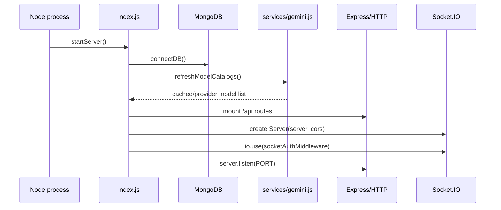

# 02. Runtime Entrypoints

## Purpose

This document explains how AI behavior enters the runtime: server bootstrap, route mounting, model-catalog warmup, and socket initialization.

## Relevant Files

- `index.js`
- `middleware/socketAuth.js`
- `middleware/rateLimit.js`
- `services/gemini.js`

## Boot Flow

`index.js` owns the live boot sequence. It does all of the following in one file:

- loads `.env`
- connects to MongoDB through `connectDB()`
- mounts all API routes
- creates the Socket.IO server
- attaches socket auth middleware
- warms provider catalogs through `refreshModelCatalogs()`
- logs configured AI providers at startup



## AI-Relevant Route Mounts

| Mount | Why AI cares |
| --- | --- |
| `/api/chat` | solo AI chat |
| `/api/ai` | smart replies, sentiment, grammar, model list |
| `/api/conversations` | conversation history and insights |
| `/api/rooms` | room insights and room metadata returned to AI clients |
| `/api/projects` | project prompt context |
| `/api/settings` | user AI feature flags |
| `/api/uploads` | attachment upload and retrieval |
| `/api/memory` | memory CRUD and import/export |
| `/api/admin` | prompt template management |

## Global Middleware That Affects AI

Before any AI route runs, the process applies:

- `cors` using `CLIENT_URL`
- `express.json({ limit: '5mb' })`
- request ID creation and structured request logging
- `app.use('/api', apiLimiter)` from `middleware/rateLimit.js`

## Socket Initialization

Room AI does not use a separate route module. Instead:

- `io` is created in `index.js`
- `io.use(socketAuthMiddleware)` verifies JWT access tokens
- `io.on('connection', ...)` registers all room, message, and AI events
- `trigger_ai` is attached inside that connection handler

## In-Memory State Created At Boot

| Variable | Type | Used for |
| --- | --- | --- |
| `roomUsers` | `Map<roomId, Map<socketId, user>>` | room membership tracking for socket authorization and fan-out |
| `globalOnlineUsers` | `Map<userId, socket>` | user presence |
| `typingUsers` | per-room typing state | room UX, indirectly affects AI timing noise |
| `socketFlood` | per-socket flood counter | event throttling, including `trigger_ai` |

None of these maps are shared across instances.

## Startup AI Warmup

`startServer()` calls:

```js
await refreshModelCatalogs().catch(() => {});
const configuredModels = getAvailableModels({ includeFallback: false });
```

Implications:

- startup does not fail if model catalog refresh fails
- provider discovery is best-effort
- the process can still serve requests even if all provider catalogs fail

## Health Endpoint

`GET /api/health` returns MongoDB health only. It does not report:

- provider reachability
- model catalog age
- in-memory quota pressure

## `dist/` Drift Notes

`dist/app.js` and `dist/server.js` represent a cleaner split:

- `createApp()` in `dist/app.js`
- `initializeSocketServer(server)` in `dist/server.js`
- `helmet`, centralized error middleware, and startup checks

That modular architecture does not exist in the live source tree. The real runtime entrypoint today is still `index.js`.

## Rebuild Notes

If rebuilding:

1. split HTTP bootstrap, socket bootstrap, and AI warmup into separate modules
2. make health/readiness distinguish DB health from provider readiness
3. move room AI orchestration out of the socket bootstrap file


## Implementation Deepening Appendix

This appendix adds implementation-focused explanation to 02-runtime-entrypoints. The goal is to make the code easier to learn by focusing on execution order, data transformations, control points, and the practical reasoning behind the current implementation choices.

### Implementation Focus 1: Entry Boundary
- Implementation note 1 for 02-runtime-entrypoints: identify the real boundary where work starts, then explain what the code validates immediately, what it defers, and why that ordering affects correctness, latency, and failure visibility.
- Implementation note 2 for 02-runtime-entrypoints: identify the real boundary where work starts, then explain what the code validates immediately, what it defers, and why that ordering affects correctness, latency, and failure visibility.
- Implementation note 3 for 02-runtime-entrypoints: identify the real boundary where work starts, then explain what the code validates immediately, what it defers, and why that ordering affects correctness, latency, and failure visibility.
- Implementation note 4 for 02-runtime-entrypoints: identify the real boundary where work starts, then explain what the code validates immediately, what it defers, and why that ordering affects correctness, latency, and failure visibility.
- Implementation note 5 for 02-runtime-entrypoints: identify the real boundary where work starts, then explain what the code validates immediately, what it defers, and why that ordering affects correctness, latency, and failure visibility.
- Implementation note 6 for 02-runtime-entrypoints: identify the real boundary where work starts, then explain what the code validates immediately, what it defers, and why that ordering affects correctness, latency, and failure visibility.
- Implementation note 7 for 02-runtime-entrypoints: identify the real boundary where work starts, then explain what the code validates immediately, what it defers, and why that ordering affects correctness, latency, and failure visibility.
- Implementation note 8 for 02-runtime-entrypoints: identify the real boundary where work starts, then explain what the code validates immediately, what it defers, and why that ordering affects correctness, latency, and failure visibility.
- Implementation note 9 for 02-runtime-entrypoints: identify the real boundary where work starts, then explain what the code validates immediately, what it defers, and why that ordering affects correctness, latency, and failure visibility.
- Implementation note 10 for 02-runtime-entrypoints: identify the real boundary where work starts, then explain what the code validates immediately, what it defers, and why that ordering affects correctness, latency, and failure visibility.
- Implementation note 11 for 02-runtime-entrypoints: identify the real boundary where work starts, then explain what the code validates immediately, what it defers, and why that ordering affects correctness, latency, and failure visibility.
- Implementation note 12 for 02-runtime-entrypoints: identify the real boundary where work starts, then explain what the code validates immediately, what it defers, and why that ordering affects correctness, latency, and failure visibility.

### Implementation Focus 2: Control Flow
- Control-flow note 1 for 02-runtime-entrypoints: trace the exact branch conditions in C:\Users\RAVIPRAKASH\Downloads\backend\docs\ai\02-runtime-entrypoints.md and explain which conditions are business rules, which are safety checks, and which are fallback behavior added for robustness rather than product semantics.
- Control-flow note 2 for 02-runtime-entrypoints: trace the exact branch conditions in C:\Users\RAVIPRAKASH\Downloads\backend\docs\ai\02-runtime-entrypoints.md and explain which conditions are business rules, which are safety checks, and which are fallback behavior added for robustness rather than product semantics.
- Control-flow note 3 for 02-runtime-entrypoints: trace the exact branch conditions in C:\Users\RAVIPRAKASH\Downloads\backend\docs\ai\02-runtime-entrypoints.md and explain which conditions are business rules, which are safety checks, and which are fallback behavior added for robustness rather than product semantics.
- Control-flow note 4 for 02-runtime-entrypoints: trace the exact branch conditions in C:\Users\RAVIPRAKASH\Downloads\backend\docs\ai\02-runtime-entrypoints.md and explain which conditions are business rules, which are safety checks, and which are fallback behavior added for robustness rather than product semantics.
- Control-flow note 5 for 02-runtime-entrypoints: trace the exact branch conditions in C:\Users\RAVIPRAKASH\Downloads\backend\docs\ai\02-runtime-entrypoints.md and explain which conditions are business rules, which are safety checks, and which are fallback behavior added for robustness rather than product semantics.
- Control-flow note 6 for 02-runtime-entrypoints: trace the exact branch conditions in C:\Users\RAVIPRAKASH\Downloads\backend\docs\ai\02-runtime-entrypoints.md and explain which conditions are business rules, which are safety checks, and which are fallback behavior added for robustness rather than product semantics.
- Control-flow note 7 for 02-runtime-entrypoints: trace the exact branch conditions in C:\Users\RAVIPRAKASH\Downloads\backend\docs\ai\02-runtime-entrypoints.md and explain which conditions are business rules, which are safety checks, and which are fallback behavior added for robustness rather than product semantics.
- Control-flow note 8 for 02-runtime-entrypoints: trace the exact branch conditions in C:\Users\RAVIPRAKASH\Downloads\backend\docs\ai\02-runtime-entrypoints.md and explain which conditions are business rules, which are safety checks, and which are fallback behavior added for robustness rather than product semantics.
- Control-flow note 9 for 02-runtime-entrypoints: trace the exact branch conditions in C:\Users\RAVIPRAKASH\Downloads\backend\docs\ai\02-runtime-entrypoints.md and explain which conditions are business rules, which are safety checks, and which are fallback behavior added for robustness rather than product semantics.
- Control-flow note 10 for 02-runtime-entrypoints: trace the exact branch conditions in C:\Users\RAVIPRAKASH\Downloads\backend\docs\ai\02-runtime-entrypoints.md and explain which conditions are business rules, which are safety checks, and which are fallback behavior added for robustness rather than product semantics.
- Control-flow note 11 for 02-runtime-entrypoints: trace the exact branch conditions in C:\Users\RAVIPRAKASH\Downloads\backend\docs\ai\02-runtime-entrypoints.md and explain which conditions are business rules, which are safety checks, and which are fallback behavior added for robustness rather than product semantics.
- Control-flow note 12 for 02-runtime-entrypoints: trace the exact branch conditions in C:\Users\RAVIPRAKASH\Downloads\backend\docs\ai\02-runtime-entrypoints.md and explain which conditions are business rules, which are safety checks, and which are fallback behavior added for robustness rather than product semantics.

### Implementation Focus 3: Data Shaping
- Data-shaping note 1 for 02-runtime-entrypoints: explain how the implementation converts incoming payloads, database rows, provider outputs, or socket payloads into the smaller structures used later in the flow, and why those shape changes matter.
- Data-shaping note 2 for 02-runtime-entrypoints: explain how the implementation converts incoming payloads, database rows, provider outputs, or socket payloads into the smaller structures used later in the flow, and why those shape changes matter.
- Data-shaping note 3 for 02-runtime-entrypoints: explain how the implementation converts incoming payloads, database rows, provider outputs, or socket payloads into the smaller structures used later in the flow, and why those shape changes matter.
- Data-shaping note 4 for 02-runtime-entrypoints: explain how the implementation converts incoming payloads, database rows, provider outputs, or socket payloads into the smaller structures used later in the flow, and why those shape changes matter.
- Data-shaping note 5 for 02-runtime-entrypoints: explain how the implementation converts incoming payloads, database rows, provider outputs, or socket payloads into the smaller structures used later in the flow, and why those shape changes matter.
- Data-shaping note 6 for 02-runtime-entrypoints: explain how the implementation converts incoming payloads, database rows, provider outputs, or socket payloads into the smaller structures used later in the flow, and why those shape changes matter.
- Data-shaping note 7 for 02-runtime-entrypoints: explain how the implementation converts incoming payloads, database rows, provider outputs, or socket payloads into the smaller structures used later in the flow, and why those shape changes matter.
- Data-shaping note 8 for 02-runtime-entrypoints: explain how the implementation converts incoming payloads, database rows, provider outputs, or socket payloads into the smaller structures used later in the flow, and why those shape changes matter.
- Data-shaping note 9 for 02-runtime-entrypoints: explain how the implementation converts incoming payloads, database rows, provider outputs, or socket payloads into the smaller structures used later in the flow, and why those shape changes matter.
- Data-shaping note 10 for 02-runtime-entrypoints: explain how the implementation converts incoming payloads, database rows, provider outputs, or socket payloads into the smaller structures used later in the flow, and why those shape changes matter.
- Data-shaping note 11 for 02-runtime-entrypoints: explain how the implementation converts incoming payloads, database rows, provider outputs, or socket payloads into the smaller structures used later in the flow, and why those shape changes matter.
- Data-shaping note 12 for 02-runtime-entrypoints: explain how the implementation converts incoming payloads, database rows, provider outputs, or socket payloads into the smaller structures used later in the flow, and why those shape changes matter.

### Implementation Focus 4: Storage Semantics
- Storage note 1 for 02-runtime-entrypoints: describe exactly when this topic reads from MongoDB, when it writes, which fields are durable, which are derived, and how partial success could leave the stored state slightly ahead of or behind the intended architecture.
- Storage note 2 for 02-runtime-entrypoints: describe exactly when this topic reads from MongoDB, when it writes, which fields are durable, which are derived, and how partial success could leave the stored state slightly ahead of or behind the intended architecture.
- Storage note 3 for 02-runtime-entrypoints: describe exactly when this topic reads from MongoDB, when it writes, which fields are durable, which are derived, and how partial success could leave the stored state slightly ahead of or behind the intended architecture.
- Storage note 4 for 02-runtime-entrypoints: describe exactly when this topic reads from MongoDB, when it writes, which fields are durable, which are derived, and how partial success could leave the stored state slightly ahead of or behind the intended architecture.
- Storage note 5 for 02-runtime-entrypoints: describe exactly when this topic reads from MongoDB, when it writes, which fields are durable, which are derived, and how partial success could leave the stored state slightly ahead of or behind the intended architecture.
- Storage note 6 for 02-runtime-entrypoints: describe exactly when this topic reads from MongoDB, when it writes, which fields are durable, which are derived, and how partial success could leave the stored state slightly ahead of or behind the intended architecture.
- Storage note 7 for 02-runtime-entrypoints: describe exactly when this topic reads from MongoDB, when it writes, which fields are durable, which are derived, and how partial success could leave the stored state slightly ahead of or behind the intended architecture.
- Storage note 8 for 02-runtime-entrypoints: describe exactly when this topic reads from MongoDB, when it writes, which fields are durable, which are derived, and how partial success could leave the stored state slightly ahead of or behind the intended architecture.
- Storage note 9 for 02-runtime-entrypoints: describe exactly when this topic reads from MongoDB, when it writes, which fields are durable, which are derived, and how partial success could leave the stored state slightly ahead of or behind the intended architecture.
- Storage note 10 for 02-runtime-entrypoints: describe exactly when this topic reads from MongoDB, when it writes, which fields are durable, which are derived, and how partial success could leave the stored state slightly ahead of or behind the intended architecture.
- Storage note 11 for 02-runtime-entrypoints: describe exactly when this topic reads from MongoDB, when it writes, which fields are durable, which are derived, and how partial success could leave the stored state slightly ahead of or behind the intended architecture.
- Storage note 12 for 02-runtime-entrypoints: describe exactly when this topic reads from MongoDB, when it writes, which fields are durable, which are derived, and how partial success could leave the stored state slightly ahead of or behind the intended architecture.

### Implementation Focus 5: Small Coding Explanations
- Coding explanation 1 for 02-runtime-entrypoints: pick a small helper, condition, loop, or mapping step tied to this topic and explain what it is doing in plain language, what assumption it relies on, and how a new engineer should read it without overcomplicating it.
- Coding explanation 2 for 02-runtime-entrypoints: pick a small helper, condition, loop, or mapping step tied to this topic and explain what it is doing in plain language, what assumption it relies on, and how a new engineer should read it without overcomplicating it.
- Coding explanation 3 for 02-runtime-entrypoints: pick a small helper, condition, loop, or mapping step tied to this topic and explain what it is doing in plain language, what assumption it relies on, and how a new engineer should read it without overcomplicating it.
- Coding explanation 4 for 02-runtime-entrypoints: pick a small helper, condition, loop, or mapping step tied to this topic and explain what it is doing in plain language, what assumption it relies on, and how a new engineer should read it without overcomplicating it.
- Coding explanation 5 for 02-runtime-entrypoints: pick a small helper, condition, loop, or mapping step tied to this topic and explain what it is doing in plain language, what assumption it relies on, and how a new engineer should read it without overcomplicating it.
- Coding explanation 6 for 02-runtime-entrypoints: pick a small helper, condition, loop, or mapping step tied to this topic and explain what it is doing in plain language, what assumption it relies on, and how a new engineer should read it without overcomplicating it.
- Coding explanation 7 for 02-runtime-entrypoints: pick a small helper, condition, loop, or mapping step tied to this topic and explain what it is doing in plain language, what assumption it relies on, and how a new engineer should read it without overcomplicating it.
- Coding explanation 8 for 02-runtime-entrypoints: pick a small helper, condition, loop, or mapping step tied to this topic and explain what it is doing in plain language, what assumption it relies on, and how a new engineer should read it without overcomplicating it.
- Coding explanation 9 for 02-runtime-entrypoints: pick a small helper, condition, loop, or mapping step tied to this topic and explain what it is doing in plain language, what assumption it relies on, and how a new engineer should read it without overcomplicating it.
- Coding explanation 10 for 02-runtime-entrypoints: pick a small helper, condition, loop, or mapping step tied to this topic and explain what it is doing in plain language, what assumption it relies on, and how a new engineer should read it without overcomplicating it.
- Coding explanation 11 for 02-runtime-entrypoints: pick a small helper, condition, loop, or mapping step tied to this topic and explain what it is doing in plain language, what assumption it relies on, and how a new engineer should read it without overcomplicating it.
- Coding explanation 12 for 02-runtime-entrypoints: pick a small helper, condition, loop, or mapping step tied to this topic and explain what it is doing in plain language, what assumption it relies on, and how a new engineer should read it without overcomplicating it.

### Implementation Focus 6: Error Paths
- Error-path note 1 for 02-runtime-entrypoints: explain how the implementation reports failure for this topic, whether the failure is user-visible, whether logs preserve enough context, and whether the code retries, degrades, or simply aborts.
- Error-path note 2 for 02-runtime-entrypoints: explain how the implementation reports failure for this topic, whether the failure is user-visible, whether logs preserve enough context, and whether the code retries, degrades, or simply aborts.
- Error-path note 3 for 02-runtime-entrypoints: explain how the implementation reports failure for this topic, whether the failure is user-visible, whether logs preserve enough context, and whether the code retries, degrades, or simply aborts.
- Error-path note 4 for 02-runtime-entrypoints: explain how the implementation reports failure for this topic, whether the failure is user-visible, whether logs preserve enough context, and whether the code retries, degrades, or simply aborts.
- Error-path note 5 for 02-runtime-entrypoints: explain how the implementation reports failure for this topic, whether the failure is user-visible, whether logs preserve enough context, and whether the code retries, degrades, or simply aborts.
- Error-path note 6 for 02-runtime-entrypoints: explain how the implementation reports failure for this topic, whether the failure is user-visible, whether logs preserve enough context, and whether the code retries, degrades, or simply aborts.
- Error-path note 7 for 02-runtime-entrypoints: explain how the implementation reports failure for this topic, whether the failure is user-visible, whether logs preserve enough context, and whether the code retries, degrades, or simply aborts.
- Error-path note 8 for 02-runtime-entrypoints: explain how the implementation reports failure for this topic, whether the failure is user-visible, whether logs preserve enough context, and whether the code retries, degrades, or simply aborts.
- Error-path note 9 for 02-runtime-entrypoints: explain how the implementation reports failure for this topic, whether the failure is user-visible, whether logs preserve enough context, and whether the code retries, degrades, or simply aborts.
- Error-path note 10 for 02-runtime-entrypoints: explain how the implementation reports failure for this topic, whether the failure is user-visible, whether logs preserve enough context, and whether the code retries, degrades, or simply aborts.
- Error-path note 11 for 02-runtime-entrypoints: explain how the implementation reports failure for this topic, whether the failure is user-visible, whether logs preserve enough context, and whether the code retries, degrades, or simply aborts.
- Error-path note 12 for 02-runtime-entrypoints: explain how the implementation reports failure for this topic, whether the failure is user-visible, whether logs preserve enough context, and whether the code retries, degrades, or simply aborts.

### Implementation Focus 7: Refactor Reading Guide
- Refactor guide 1 for 02-runtime-entrypoints: if this part of the code were to be refactored, explain which lines are true domain logic, which lines are orchestration, and which lines should likely move into a narrower service, helper, or adapter boundary.
- Refactor guide 2 for 02-runtime-entrypoints: if this part of the code were to be refactored, explain which lines are true domain logic, which lines are orchestration, and which lines should likely move into a narrower service, helper, or adapter boundary.
- Refactor guide 3 for 02-runtime-entrypoints: if this part of the code were to be refactored, explain which lines are true domain logic, which lines are orchestration, and which lines should likely move into a narrower service, helper, or adapter boundary.
- Refactor guide 4 for 02-runtime-entrypoints: if this part of the code were to be refactored, explain which lines are true domain logic, which lines are orchestration, and which lines should likely move into a narrower service, helper, or adapter boundary.
- Refactor guide 5 for 02-runtime-entrypoints: if this part of the code were to be refactored, explain which lines are true domain logic, which lines are orchestration, and which lines should likely move into a narrower service, helper, or adapter boundary.
- Refactor guide 6 for 02-runtime-entrypoints: if this part of the code were to be refactored, explain which lines are true domain logic, which lines are orchestration, and which lines should likely move into a narrower service, helper, or adapter boundary.
- Refactor guide 7 for 02-runtime-entrypoints: if this part of the code were to be refactored, explain which lines are true domain logic, which lines are orchestration, and which lines should likely move into a narrower service, helper, or adapter boundary.
- Refactor guide 8 for 02-runtime-entrypoints: if this part of the code were to be refactored, explain which lines are true domain logic, which lines are orchestration, and which lines should likely move into a narrower service, helper, or adapter boundary.
- Refactor guide 9 for 02-runtime-entrypoints: if this part of the code were to be refactored, explain which lines are true domain logic, which lines are orchestration, and which lines should likely move into a narrower service, helper, or adapter boundary.
- Refactor guide 10 for 02-runtime-entrypoints: if this part of the code were to be refactored, explain which lines are true domain logic, which lines are orchestration, and which lines should likely move into a narrower service, helper, or adapter boundary.
- Refactor guide 11 for 02-runtime-entrypoints: if this part of the code were to be refactored, explain which lines are true domain logic, which lines are orchestration, and which lines should likely move into a narrower service, helper, or adapter boundary.
- Refactor guide 12 for 02-runtime-entrypoints: if this part of the code were to be refactored, explain which lines are true domain logic, which lines are orchestration, and which lines should likely move into a narrower service, helper, or adapter boundary.

### Implementation Focus 8: Step-By-Step Review Checklist
- Review checklist item 1 for 02-runtime-entrypoints: when reviewing this implementation, verify the validation order, the read-before-write sequence, the response shape, the fallback path, the storage side effects, and the assumptions about single-process or multi-process deployment.
- Review checklist item 2 for 02-runtime-entrypoints: when reviewing this implementation, verify the validation order, the read-before-write sequence, the response shape, the fallback path, the storage side effects, and the assumptions about single-process or multi-process deployment.
- Review checklist item 3 for 02-runtime-entrypoints: when reviewing this implementation, verify the validation order, the read-before-write sequence, the response shape, the fallback path, the storage side effects, and the assumptions about single-process or multi-process deployment.
- Review checklist item 4 for 02-runtime-entrypoints: when reviewing this implementation, verify the validation order, the read-before-write sequence, the response shape, the fallback path, the storage side effects, and the assumptions about single-process or multi-process deployment.
- Review checklist item 5 for 02-runtime-entrypoints: when reviewing this implementation, verify the validation order, the read-before-write sequence, the response shape, the fallback path, the storage side effects, and the assumptions about single-process or multi-process deployment.
- Review checklist item 6 for 02-runtime-entrypoints: when reviewing this implementation, verify the validation order, the read-before-write sequence, the response shape, the fallback path, the storage side effects, and the assumptions about single-process or multi-process deployment.
- Review checklist item 7 for 02-runtime-entrypoints: when reviewing this implementation, verify the validation order, the read-before-write sequence, the response shape, the fallback path, the storage side effects, and the assumptions about single-process or multi-process deployment.
- Review checklist item 8 for 02-runtime-entrypoints: when reviewing this implementation, verify the validation order, the read-before-write sequence, the response shape, the fallback path, the storage side effects, and the assumptions about single-process or multi-process deployment.
- Review checklist item 9 for 02-runtime-entrypoints: when reviewing this implementation, verify the validation order, the read-before-write sequence, the response shape, the fallback path, the storage side effects, and the assumptions about single-process or multi-process deployment.
- Review checklist item 10 for 02-runtime-entrypoints: when reviewing this implementation, verify the validation order, the read-before-write sequence, the response shape, the fallback path, the storage side effects, and the assumptions about single-process or multi-process deployment.
- Review checklist item 11 for 02-runtime-entrypoints: when reviewing this implementation, verify the validation order, the read-before-write sequence, the response shape, the fallback path, the storage side effects, and the assumptions about single-process or multi-process deployment.
- Review checklist item 12 for 02-runtime-entrypoints: when reviewing this implementation, verify the validation order, the read-before-write sequence, the response shape, the fallback path, the storage side effects, and the assumptions about single-process or multi-process deployment.

### Implementation Focus 9: Teaching Notes
- Teaching note 1 for 02-runtime-entrypoints: explain this topic to a new engineer as a sequence of small decisions rather than a wall of code, and call out the one place where the implementation is clever, the one place where it is practical, and the one place where it is fragile.
- Teaching note 2 for 02-runtime-entrypoints: explain this topic to a new engineer as a sequence of small decisions rather than a wall of code, and call out the one place where the implementation is clever, the one place where it is practical, and the one place where it is fragile.
- Teaching note 3 for 02-runtime-entrypoints: explain this topic to a new engineer as a sequence of small decisions rather than a wall of code, and call out the one place where the implementation is clever, the one place where it is practical, and the one place where it is fragile.
- Teaching note 4 for 02-runtime-entrypoints: explain this topic to a new engineer as a sequence of small decisions rather than a wall of code, and call out the one place where the implementation is clever, the one place where it is practical, and the one place where it is fragile.
- Teaching note 5 for 02-runtime-entrypoints: explain this topic to a new engineer as a sequence of small decisions rather than a wall of code, and call out the one place where the implementation is clever, the one place where it is practical, and the one place where it is fragile.
- Teaching note 6 for 02-runtime-entrypoints: explain this topic to a new engineer as a sequence of small decisions rather than a wall of code, and call out the one place where the implementation is clever, the one place where it is practical, and the one place where it is fragile.
- Teaching note 7 for 02-runtime-entrypoints: explain this topic to a new engineer as a sequence of small decisions rather than a wall of code, and call out the one place where the implementation is clever, the one place where it is practical, and the one place where it is fragile.
- Teaching note 8 for 02-runtime-entrypoints: explain this topic to a new engineer as a sequence of small decisions rather than a wall of code, and call out the one place where the implementation is clever, the one place where it is practical, and the one place where it is fragile.
- Teaching note 9 for 02-runtime-entrypoints: explain this topic to a new engineer as a sequence of small decisions rather than a wall of code, and call out the one place where the implementation is clever, the one place where it is practical, and the one place where it is fragile.
- Teaching note 10 for 02-runtime-entrypoints: explain this topic to a new engineer as a sequence of small decisions rather than a wall of code, and call out the one place where the implementation is clever, the one place where it is practical, and the one place where it is fragile.
- Teaching note 11 for 02-runtime-entrypoints: explain this topic to a new engineer as a sequence of small decisions rather than a wall of code, and call out the one place where the implementation is clever, the one place where it is practical, and the one place where it is fragile.
- Teaching note 12 for 02-runtime-entrypoints: explain this topic to a new engineer as a sequence of small decisions rather than a wall of code, and call out the one place where the implementation is clever, the one place where it is practical, and the one place where it is fragile.
