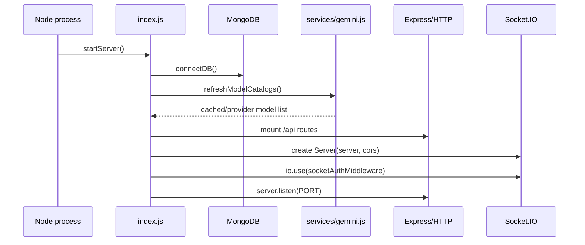

# 02. Runtime Entrypoints

## Purpose

This document explains how AI behavior enters the runtime: server bootstrap, route mounting, model-catalog warmup, and socket initialization.

## Relevant Files

- `index.js`
- `middleware/socketAuth.js`
- `middleware/rateLimit.js`
- `services/gemini.js`

## Boot Flow

`index.js` owns the live boot sequence. It does all of the following in one file:

- loads `.env`
- connects to MongoDB through `connectDB()`
- mounts all API routes
- creates the Socket.IO server
- attaches socket auth middleware
- warms provider catalogs through `refreshModelCatalogs()`
- logs configured AI providers at startup



## AI-Relevant Route Mounts

| Mount | Why AI cares |
| --- | --- |
| `/api/chat` | solo AI chat |
| `/api/ai` | smart replies, sentiment, grammar, model list |
| `/api/conversations` | conversation history and insights |
| `/api/rooms` | room insights and room metadata returned to AI clients |
| `/api/projects` | project prompt context |
| `/api/settings` | user AI feature flags |
| `/api/uploads` | attachment upload and retrieval |
| `/api/memory` | memory CRUD and import/export |
| `/api/admin` | prompt template management |

## Global Middleware That Affects AI

Before any AI route runs, the process applies:

- `cors` using `CLIENT_URL`
- `express.json({ limit: '5mb' })`
- request ID creation and structured request logging
- `app.use('/api', apiLimiter)` from `middleware/rateLimit.js`

## Socket Initialization

Room AI does not use a separate route module. Instead:

- `io` is created in `index.js`
- `io.use(socketAuthMiddleware)` verifies JWT access tokens
- `io.on('connection', ...)` registers all room, message, and AI events
- `trigger_ai` is attached inside that connection handler

## In-Memory State Created At Boot

| Variable | Type | Used for |
| --- | --- | --- |
| `roomUsers` | `Map<roomId, Map<socketId, user>>` | room membership tracking for socket authorization and fan-out |
| `globalOnlineUsers` | `Map<userId, socket>` | user presence |
| `typingUsers` | per-room typing state | room UX, indirectly affects AI timing noise |
| `socketFlood` | per-socket flood counter | event throttling, including `trigger_ai` |

None of these maps are shared across instances.

## Startup AI Warmup

`startServer()` calls:

```js
await refreshModelCatalogs().catch(() => {});
const configuredModels = getAvailableModels({ includeFallback: false });
```

Implications:

- startup does not fail if model catalog refresh fails
- provider discovery is best-effort
- the process can still serve requests even if all provider catalogs fail

## Health Endpoint

`GET /api/health` returns MongoDB health only. It does not report:

- provider reachability
- model catalog age
- in-memory quota pressure

## `dist/` Drift Notes

`dist/app.js` and `dist/server.js` represent a cleaner split:

- `createApp()` in `dist/app.js`
- `initializeSocketServer(server)` in `dist/server.js`
- `helmet`, centralized error middleware, and startup checks

That modular architecture does not exist in the live source tree. The real runtime entrypoint today is still `index.js`.

## Rebuild Notes

If rebuilding:

1. split HTTP bootstrap, socket bootstrap, and AI warmup into separate modules
2. make health/readiness distinguish DB health from provider readiness
3. move room AI orchestration out of the socket bootstrap file


## Implementation Deepening Appendix

This appendix adds implementation-focused explanation to 02-runtime-entrypoints. The goal is to make the code easier to learn by focusing on execution order, data transformations, control points, and the practical reasoning behind the current implementation choices.

### Implementation Focus 1: Entry Boundary
- Implementation note 1 for 02-runtime-entrypoints: identify the real boundary where work starts, then explain what the code validates immediately, what it defers, and why that ordering affects correctness, latency, and failure visibility.
