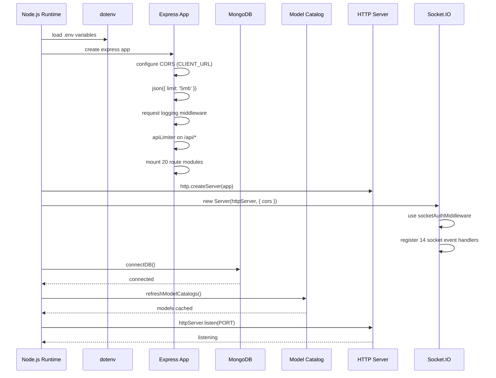
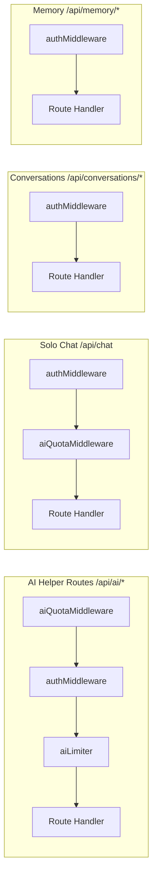
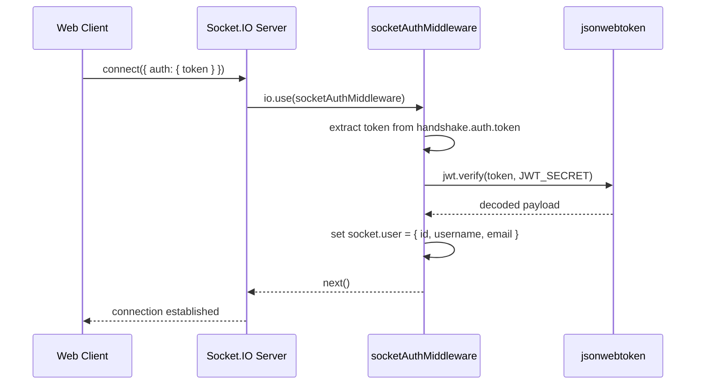
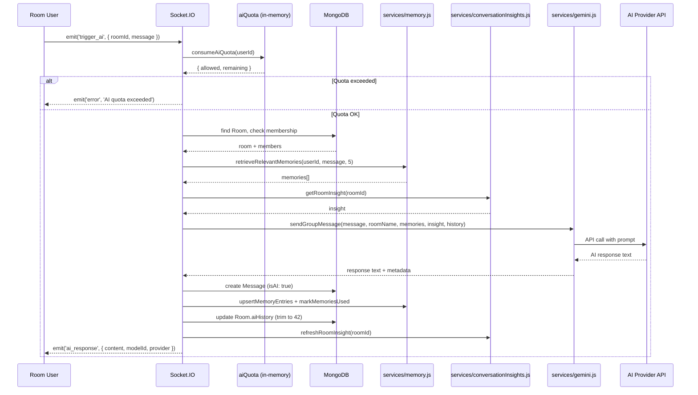

# 02. Runtime Entrypoints

## Purpose

This document explains how the ChatSphere backend starts, where AI features are mounted, and how AI requests enter the system through both REST and Socket.IO channels. It covers the boot sequence, middleware pipeline, route registration, Socket.IO initialization, and the dual entry paths for AI operations.

Understanding the runtime entrypoints is essential for debugging startup issues, adding new AI endpoints, configuring middleware chains, and understanding how requests flow from the network layer into the AI service layer.

---

## Main Entry File

**File:** `index.js` (1137 lines)

The runtime starts in `index.js`. This single file is responsible for:

1. Loading environment variables via `dotenv`
2. Connecting to MongoDB via `connectDB()` from `config/db.js`
3. Creating the Express application
4. Configuring CORS with `CLIENT_URL` (default `http://localhost:5173`)
5. Setting JSON body parsing limit to 5MB
6. Attaching request logging middleware with unique `requestId` per request
7. Applying `apiLimiter` rate limiting to all `/api` routes
8. Mounting 20 route modules under `/api/*` prefixes
9. Creating the HTTP server via `http.createServer(app)`
10. Initializing the Socket.IO server attached to the HTTP server
11. Registering `socketAuthMiddleware` for JWT verification on socket connections
12. Initializing in-memory state maps for room presence, online users, typing indicators, and flood control
13. Registering 14 socket event handlers including the critical `trigger_ai` handler
14. Exporting `startServer` function that orchestrates the boot sequence

---

## Boot Sequence



---

## Boot Flow Steps in Detail

### Step 1: Environment Loading

```javascript
// index.js — line ~1
require('dotenv').config();
```

All configuration flows through environment variables. Key AI-related variables:

| Variable | Purpose | Default |
|----------|---------|---------|
| `CLIENT_URL` | CORS origin | `http://localhost:5173` |
| `MONGO_URI` | MongoDB connection string | Required |
| `PORT` | HTTP server port | Required |
| `JWT_SECRET` | JWT signing/verification | Required |
| `GEMINI_API_KEY` | Direct Gemini API key | Optional |
| `OPENROUTER_API_KEY` | OpenRouter API key | Optional |
| `GROQ_API_KEY` | Groq API key | Optional |
| `TOGETHER_API_KEY` | Together AI API key | Optional |
| `HUGGINGFACE_API_KEY` | HuggingFace API key | Optional |
| `GROK_API_KEY` | Grok API key | Optional |
| `DEFAULT_AI_MODEL` | Primary model override | None |
| `GEMINI_GROUP_BOT_NAME` | AI bot display name in rooms | `'Gemini'` |
| `MESSAGE_EDIT_WINDOW_MINUTES` | Message edit time window | `15` |
| `MODEL_CATALOG_TTL_MS` | Model catalog cache TTL | `1800000` (30min) |
| `AI_FALLBACK_MODEL_LIMIT` | Max fallback attempts | `6` |

### Step 2: Express Application Setup

```javascript
// index.js — line ~50-120
const app = express();

app.use(cors({
  origin: process.env.CLIENT_URL || 'http://localhost:5173',
  credentials: true
}));

app.use(express.json({ limit: '5mb' }));
```

The 5MB JSON limit accommodates large message payloads including base64-encoded image attachments.

### Step 3: Request Logging Middleware

```javascript
// index.js — line ~70
app.use((req, res, next) => {
  req.requestId = crypto.randomUUID();
  logInfo('request_received', {
    method: req.method,
    path: req.path,
    requestId: req.requestId
  });
  res.on('finish', () => {
    logInfo('request_completed', {
      method: req.method,
      path: req.path,
      status: res.statusCode,
      duration: Date.now() - req.startTime,
      requestId: req.requestId
    });
  });
  next();
});
```

Every request gets a unique `requestId` for tracing through logs. The `finish` event captures the response status and total duration.

### Step 4: Rate Limiting

```javascript
// index.js — line ~90
app.use('/api', apiLimiter);
```

The `apiLimiter` (from `middleware/rateLimit.js`) allows 1000 requests per 15-minute window, skipping `/api/health` and `/api/auth` paths. This is a coarse outer layer; individual route groups have their own limiters.

### Step 5: Route Mounting

```javascript
// index.js — line ~121-180
app.use('/api/auth', authRoutes);
app.use('/api/chat', chatRoutes);              // AI solo chat
app.use('/api/conversations', conversationRoutes);
app.use('/api/rooms', roomRoutes);
app.use('/api/dashboard', dashboardRoutes);
app.use('/api/users', userRoutes);
app.use('/api/search', searchRoutes);
app.use('/api/ai', aiQuotaMiddleware, aiRoutes);  // AI helpers
app.use('/api/projects', projectRoutes);
app.use('/api/settings', settingsRoutes);      // AI feature toggles
app.use('/api/polls', pollRoutes);
app.use('/api/groups', groupRoutes);
app.use('/api/moderation', moderationRoutes);
app.use('/api/export', exportRoutes);
app.use('/api/admin', adminRoutes);            // AI prompt management
app.use('/api/analytics', analyticsRoutes);
app.use('/api/uploads', uploadRoutes);
app.use('/api/memory', memoryRoutes);          // AI memory management
```

**Note the middleware difference:** Only `/api/ai` has `aiQuotaMiddleware` applied at the mount level. The `/api/chat` route applies `aiQuotaMiddleware` inside its own route handler instead.

### Step 6: Socket.IO Initialization

```javascript
// index.js — line ~181-250
const io = new Server(httpServer, {
  cors: {
    origin: process.env.CLIENT_URL || 'http://localhost:5173',
    credentials: true
  }
});

io.use(socketAuthMiddleware);
```

The Socket.IO server shares the same CORS configuration as Express. The `socketAuthMiddleware` (from `middleware/socketAuth.js`) verifies the JWT from `socket.handshake.auth.token` before allowing any socket events.

### Step 7: In-Memory State Initialization

```javascript
// index.js — line ~251-280
const roomUsers = new Map();        // Map<roomId, Map<socketId, user>>
const globalOnlineUsers = new Map(); // Map<userId, userInfo>
const typingUsers = new Map();      // Map<roomId, Set<userId>>
const socketFlood = new Map();      // Map<socketId, {count, resetAt}>
```

All four maps are process-local. They do not survive restarts and are not shared across instances.

### Step 8: Socket Event Registration

```javascript
// index.js — line ~280-1050
io.on('connection', (socket) => {
  // 14 event handlers registered here
  socket.on('authenticate', handleAuthenticate);
  socket.on('join_room', handleJoinRoom);
  socket.on('leave_room', handleLeaveRoom);
  socket.on('typing_start', handleTypingStart);
  socket.on('typing_stop', handleTypingStop);
  socket.on('mark_read', handleMarkRead);
  socket.on('send_message', handleSendMessage);
  socket.on('reply_message', handleReplyMessage);
  socket.on('add_reaction', handleAddReaction);
  socket.on('trigger_ai', handleTriggerAi);      // Critical AI handler
  socket.on('edit_message', handleEditMessage);
  socket.on('delete_message', handleDeleteMessage);
  socket.on('pin_message', handlePinMessage);
  socket.on('unpin_message', handleUnpinMessage);
  socket.on('disconnect', handleDisconnect);
});
```

### Step 9: Server Startup

```javascript
// index.js — line ~1051-1137
async function startServer() {
  await connectDB();
  await refreshModelCatalogs();
  logAvailableModels();
  httpServer.listen(PORT, () => {
    logInfo('server_started', { port: PORT });
  });
}

startServer().catch(err => {
  logError('server_start_failed', serializeError(err));
  process.exit(1);
});
```

The startup is sequential: database first, then model catalog, then HTTP listener. If any step fails, the process exits.

---

## REST Entry Points for AI

### Endpoint Summary

| Route File | Mount Path | AI Endpoints | Middleware Chain |
|------------|-----------|--------------|-----------------|
| `routes/chat.js` | `/api/chat` | `POST /` | `authMiddleware` → `aiQuotaMiddleware` → handler |
| `routes/ai.js` | `/api/ai` | `GET /models`, `POST /smart-replies`, `POST /sentiment`, `POST /grammar` | `aiQuotaMiddleware` (mount) → `authMiddleware` → `aiLimiter` → handler |
| `routes/conversations.js` | `/api/conversations` | `GET /:id/insights`, `POST /:id/actions/:action` | `authMiddleware` → handler |
| `routes/memory.js` | `/api/memory` | `GET /`, `PUT /:id`, `DELETE /:id`, `POST /import`, `GET /export` | `authMiddleware` → handler |
| `routes/admin.js` | `/api/admin` | `GET /prompts`, `PUT /prompts/:key` | `authMiddleware` → handler |
| `routes/settings.js` | `/api/settings` | AI feature toggle reads/writes | `authMiddleware` → handler |

### Middleware Chain Visualization



**Key difference:** The `/api/ai` mount applies `aiQuotaMiddleware` before route-level middleware, while `/api/chat` applies it inside the route handler. This means quota is checked at different stages for different AI entry points.

---

## Socket.IO Entry Points for AI

### Socket Authentication Flow



**File:** `middleware/socketAuth.js` (19 lines)

```javascript
const jwt = require('jsonwebtoken');

module.exports = (socket, next) => {
  try {
    const token = socket.handshake.auth.token;
    if (!token) return next(new Error('Authentication required'));

    const decoded = jwt.verify(token, process.env.JWT_SECRET);
    socket.user = {
      id: decoded.id,
      username: decoded.username,
      email: decoded.email
    };
    next();
  } catch (err) {
    next(new Error('Authentication failed'));
  }
};
```

### Socket Event Flow for AI

The `trigger_ai` event is the primary AI entry point over sockets. It is handled directly in `index.js` (lines ~851-1050).



---

## Rate Limiter Details

**File:** `middleware/rateLimit.js` (55 lines)

Three distinct rate limiters are configured:

| Limiter | Window | Max Requests | Key Strategy | Applied To |
|---------|--------|-------------|-------------|-----------|
| `authLimiter` | 15 min | 20 | IP address | `/api/auth/*` routes |
| `aiLimiter` | 15 min | 80 | User ID (authenticated) or IP | `/api/ai/*` routes |
| `apiLimiter` | 15 min | 1000 | IP address | All `/api/*` routes (skips `/health`, `/auth`) |

```javascript
// middleware/rateLimit.js — conceptual structure
const rateLimit = require('express-rate-limit');

const authLimiter = rateLimit({
  windowMs: 15 * 60 * 1000,
  max: 20,
  keyGenerator: (req) => req.ip
});

const aiLimiter = rateLimit({
  windowMs: 15 * 60 * 1000,
  max: 80,
  keyGenerator: (req) => req.user?.id || req.ip
});

const apiLimiter = rateLimit({
  windowMs: 15 * 60 * 1000,
  max: 1000,
  skip: (req) => req.path === '/health' || req.path.startsWith('/auth')
});
```

**Layering:** The `apiLimiter` is the outermost layer applied at the mount point. The `aiLimiter` is applied at the route level. The `aiQuotaMiddleware` is an additional in-memory quota that tracks AI-specific requests separately from general API rate limiting.

---

## AI Quota Middleware

**File:** `middleware/aiQuota.js` (18 lines)

```javascript
// middleware/aiQuota.js
const { consumeAiQuota } = require('../services/aiQuota');

module.exports = (req, res, next) => {
  const key = req.user?.id || req.ip;
  const { allowed, remaining, retryAfterMs } = consumeAiQuota(key);

  if (!allowed) {
    return res.status(429).json({
      error: 'AI quota exceeded',
      retryAfterMs
    });
  }

  res.setHeader('X-RateLimit-Remaining', remaining);
  next();
};
```

**Key behavior:**
- Uses user ID if authenticated, falls back to IP
- Returns 429 with `retryAfterMs` when quota exceeded
- Sets `X-RateLimit-Remaining` header on successful requests
- This is separate from `aiLimiter` — it tracks AI-specific usage with its own window

---

## Upload Middleware

**File:** `middleware/upload.js` (58 lines)

```javascript
// middleware/upload.js — key configuration
const multer = require('multer');
const crypto = require('crypto');

const storage = multer.diskStorage({
  destination: (req, file, cb) => cb(null, 'uploads/'),
  filename: (req, file, cb) => {
    const uniqueName = crypto.randomBytes(16).toString('hex');
    const ext = path.extname(file.originalname);
    cb(null, uniqueName + ext);
  }
});

const ALLOWED_TYPES = [
  'image/jpeg', 'image/png', 'image/gif', 'image/webp',
  'application/pdf', 'text/plain',
  'text/javascript', 'text/typescript', 'text/python', 'text/java',
  'text/x-ruby', 'text/x-go', 'text/x-rust'
];

const upload = multer({
  storage,
  limits: { fileSize: 5 * 1024 * 1024 }, // 5MB
  fileFilter: (req, file, cb) => {
    if (ALLOWED_TYPES.includes(file.mimetype)) {
      cb(null, true);
    } else {
      cb(new Error('File type not allowed'));
    }
  }
});
```

**AI relevance:** Attachments uploaded through this middleware are read by `buildAttachmentPayload` in `services/gemini.js` and included in AI prompts. Text files are extracted up to 12,000 characters; images are base64-encoded up to 3MB; PDFs are included as metadata notices only.

---

## Database Connection

**File:** `config/db.js` (32 lines)

```javascript
// config/db.js
const mongoose = require('mongoose');

const connectDB = async () => {
  await mongoose.connect(process.env.MONGO_URI, {
    maxPoolSize: 10,
    serverSelectionTimeoutMS: 5000,
    socketTimeoutMS: 45000
  });
  logInfo('db_connected', { uri: process.env.MONGO_URI?.split('@')[1] });
};

module.exports = { connectDB };
```

**Operational notes:**
- `maxPoolSize: 10` — Each of the 10 connections can handle one operation at a time. Under high concurrent AI load (multiple simultaneous memory retrievals, insight refreshes, message writes), this pool may become saturated.
- `serverSelectionTimeoutMS: 5000` — If MongoDB is unreachable for 5 seconds, the connection attempt fails. This is relatively short for cloud-hosted MongoDB with cold starts.
- `socketTimeoutMS: 45000` — Individual operations timeout after 45 seconds. AI provider calls can take 30-60 seconds, so this should be monitored.

---

## CORS Configuration

```javascript
// index.js — line ~50
app.use(cors({
  origin: process.env.CLIENT_URL || 'http://localhost:5173',
  credentials: true
}));
```

The same CORS configuration is applied to both Express and Socket.IO. The `CLIENT_URL` environment variable must match the frontend origin exactly (including protocol and port).

---

## Health Check

```javascript
// index.js — line ~100
app.get('/api/health', (req, res) => {
  res.json({ status: 'ok' });
});
```

The health check endpoint:
- Skips `apiLimiter` rate limiting
- Does not require authentication
- Returns a simple JSON response
- Does not check database connectivity or AI provider availability

---

## In-Memory State Maps

Four maps maintain process-local state in `index.js`:

### roomUsers

```javascript
const roomUsers = new Map(); // Map<roomId, Map<socketId, user>>
```

**Purpose:** Tracks which users are present in which rooms via their socket connections.

**Structure:**
```
roomUsers = {
  "room-abc": {
    "socket-1": { id: "user-1", username: "alice" },
    "socket-2": { id: "user-2", username: "bob" }
  },
  "room-def": {
    "socket-3": { id: "user-3", username: "charlie" }
  }
}
```

**Operations:**
- `join_room`: Adds socketId → user mapping to the roomId's inner Map
- `leave_room`: Removes socketId from the roomId's inner Map
- `disconnect`: Removes socketId from all room Maps

### globalOnlineUsers

```javascript
const globalOnlineUsers = new Map(); // Map<userId, userInfo>
```

**Purpose:** Tracks all online users across all rooms.

**Operations:**
- `authenticate`: Adds userId → userInfo
- `disconnect`: Removes userId

### typingUsers

```javascript
const typingUsers = new Map(); // Map<roomId, Set<userId>>
```

**Purpose:** Tracks which users are currently typing in which rooms.

**Operations:**
- `typing_start`: Adds userId to the roomId's Set, broadcasts `user_typing`
- `typing_stop`: Removes userId from the roomId's Set, broadcasts `user_stopped_typing`

### socketFlood

```javascript
const socketFlood = new Map(); // Map<socketId, { count, resetAt }>
```

**Purpose:** Prevents socket event flooding.

**Constants:**
- `FLOOD_MAX = 30` — Maximum events per window
- `FLOOD_WINDOW = 10000` — 10-second window

**Logic:**
```javascript
const now = Date.now();
const flood = socketFlood.get(socketId) || { count: 0, resetAt: now + FLOOD_WINDOW };
if (now > flood.resetAt) {
  socketFlood.set(socketId, { count: 1, resetAt: now + FLOOD_WINDOW });
} else if (flood.count >= FLOOD_MAX) {
  return; // Drop event
} else {
  flood.count++;
}
```

**Risk:** The `socketFlood` Map has no cleanup mechanism. Entries for disconnected sockets are never removed, causing a memory leak over time.

---

## Request/Response Examples

### Solo Chat Request

```http
POST /api/chat HTTP/1.1
Host: localhost:3000
Authorization: Bearer <jwt>
Content-Type: application/json

{
  "message": "What are the best practices for React state management?",
  "conversationId": "conv-123",
  "projectId": "proj-456",
  "attachment": {
    "fileUrl": "/uploads/abc123.js",
    "fileName": "store.js",
    "fileType": "text/javascript",
    "fileSize": 2048
  }
}
```

### Solo Chat Response

```json
{
  "conversationId": "conv-123",
  "content": "Here are the best practices for React state management...",
  "memoryRefs": ["mem-1", "mem-2"],
  "insight": {
    "title": "React State Management Discussion",
    "summary": "User asked about React state management best practices...",
    "intent": "learning",
    "topics": ["React", "state management", "best practices"],
    "decisions": [],
    "actionItems": []
  },
  "modelId": "google/gemini-2.5-flash",
  "provider": "openrouter",
  "routing": {
    "attempts": 1,
    "fallbackUsed": false
  },
  "tokenCount": {
    "input": 450,
    "output": 320
  }
}
```

### Socket AI Trigger

```javascript
// Client emits:
socket.emit('trigger_ai', {
  roomId: 'room-abc',
  message: '@Gemini summarize the discussion so far'
});

// Server emits back:
socket.on('ai_response', (data) => {
  console.log(data.content);    // AI response text
  console.log(data.modelId);    // Model used
  console.log(data.provider);   // Provider used
});
```

---

## Failure Cases and Recovery

| Failure Scenario | Detection | Recovery Behavior | User Impact |
|-----------------|-----------|------------------|-------------|
| MongoDB unavailable at startup | `connectDB()` throws | Process exits with code 1 | Service unavailable |
| AI provider timeout | HTTP request timeout in provider call | Fallback to next model in chain (up to 6 attempts) | Increased latency |
| All providers unavailable | All fallback attempts fail | Error returned to client | AI feature unavailable |
| Quota exceeded | `consumeAiQuota` returns `allowed: false` | 429 response with `retryAfterMs` | Request rejected |
| Memory extraction fails | `extractAiMemories` throws | Deterministic memories still processed; AI memories skipped | Partial memory extraction |
| Insight refresh fails | `refreshConversationInsight` throws | Error caught, not propagated | Stale insight (non-blocking) |
| Socket disconnect during AI | Socket `disconnect` event | AI response still computed and saved; no delivery | Response lost to client |
| Upload directory full | Multer disk storage error | 500 error on file upload | Attachment rejected |

---

## Scaling and Operational Implications

### Single-Instance Limitations

The entire AI subsystem is designed for single-instance deployment:

| State | Type | Scaling Issue |
|-------|------|--------------|
| `quotaMap` | In-memory Map | Quota not shared across instances |
| `roomUsers` | In-memory Map | Room presence not shared |
| `typingUsers` | In-memory Map | Typing indicators not shared |
| `socketFlood` | In-memory Map | Flood control not shared |
| `runtimeModelCatalog` | In-memory Map | Each instance maintains its own catalog |
| `refreshPromise` | In-memory Promise | Catalog refresh dedup only works within one process |

### Multi-Instance Requirements

To scale horizontally, the following changes would be needed:

1. **Redis adapter for Socket.IO** — Share socket state across instances
2. **Redis-based quota** — Replace in-memory `quotaMap` with Redis counters
3. **External model catalog cache** — Share catalog via Redis or database
4. **Distributed locking** — Prevent concurrent insight refreshes for the same scope
5. **Load balancer sticky sessions** — Or accept that socket connections may reconnect to different instances

### Connection Pool Sizing

The MongoDB pool of 10 connections may become a bottleneck:

| Scenario | Concurrent DB Operations | Pool Utilization |
|----------|------------------------|-----------------|
| Single solo chat | 5 (memory read, insight read, project read, conversation write, memory write) | 50% |
| Room AI trigger | 7 (room read, memory read, insight read, message write, memory write, history write, insight write) | 70% |
| 3 concurrent solo chats | 15 | 150% (queued) |
| 2 solo + 1 room AI | 17 | 170% (queued) |

**Recommendation:** Monitor `mongoose.connection.readyState` and pool utilization. Increase `maxPoolSize` to 20-30 under sustained AI load.

---

## Inconsistencies and Risks

| Issue | Location | Severity | Description |
|-------|----------|----------|-------------|
| Quota applied at different layers | `index.js` mount vs `routes/chat.js` handler | Medium | `/api/ai` applies `aiQuotaMiddleware` at mount; `/api/chat` applies it in handler. Different error handling paths. |
| No startup health probe | `index.js` | Medium | Health check does not verify DB connectivity or AI provider availability |
| Flood control memory leak | `index.js` `socketFlood` | Medium | Disconnected socket entries are never cleaned up |
| Sequential startup | `index.js` `startServer` | Low | DB → catalog → HTTP is sequential. Catalog refresh could run in parallel with HTTP startup. |
| No graceful shutdown | `index.js` | Medium | No `SIGTERM`/`SIGINT` handler to close sockets, drain connections, or save state |
| Hard-coded defaults | Multiple files | Low | Many defaults (AI_USERNAME, EDIT_WINDOW, FLOOD_MAX) are hard-coded with env fallback rather than centralized config |

---

## How to Rebuild from Scratch

To recreate the runtime entrypoint layer:

### 1. Create the Express Application

```javascript
const express = require('express');
const cors = require('cors');
const http = require('http');
const { Server } = require('socket.io');

const app = express();
const httpServer = http.createServer(app);

app.use(cors({ origin: process.env.CLIENT_URL, credentials: true }));
app.use(express.json({ limit: '5mb' }));
```

### 2. Configure Middleware Chain

```javascript
// Request logging
app.use(requestLogger);

// Outer rate limiter
app.use('/api', apiLimiter);

// Mount routes (order matters — more specific before generic)
app.use('/api/health', healthRoute);
app.use('/api/auth', authRoutes);
app.use('/api/chat', chatRoutes);
app.use('/api/ai', aiQuotaMiddleware, aiRoutes);
app.use('/api/memory', memoryRoutes);
// ... other routes
```

### 3. Initialize Socket.IO

```javascript
const io = new Server(httpServer, { cors: { origin: process.env.CLIENT_URL } });
io.use(socketAuthMiddleware);

// Initialize state maps
const roomUsers = new Map();
const globalOnlineUsers = new Map();
const typingUsers = new Map();
const socketFlood = new Map();

// Register event handlers
io.on('connection', (socket) => {
  socket.on('trigger_ai', handleTriggerAi);
  // ... other handlers
});
```

### 4. Start the Server

```javascript
async function startServer() {
  await connectDB();
  await refreshModelCatalogs();
  httpServer.listen(PORT);
}
```

### 5. Add Operational Concerns

- Graceful shutdown handler for `SIGTERM`/`SIGINT`
- Health check that verifies DB connectivity
- Periodic cleanup of `socketFlood` Map
- Structured logging with request correlation IDs
- Error boundary at the top level
