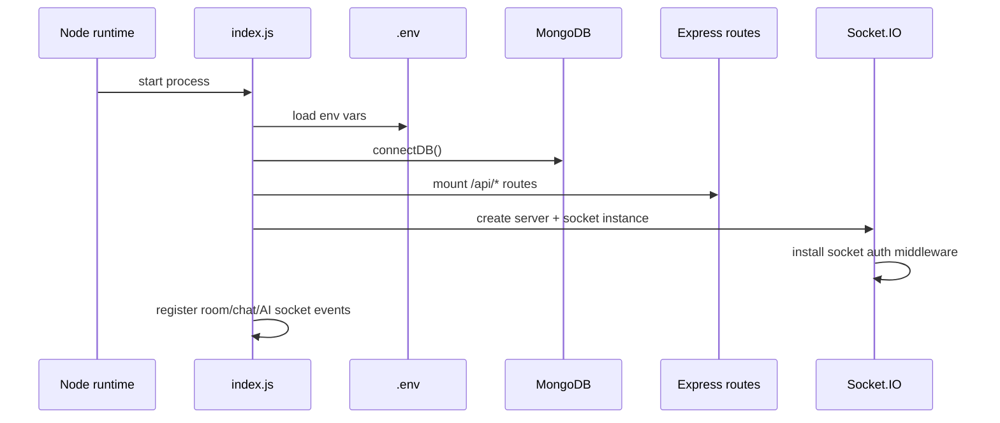
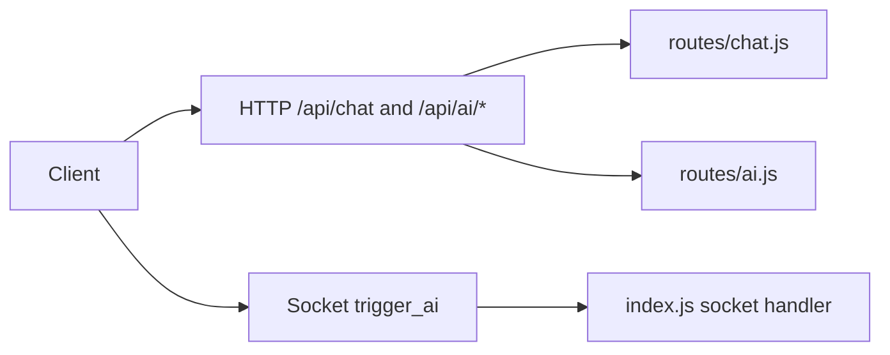

# 02. Runtime Entrypoints

## Purpose
This document explains how the backend starts, where the AI features are mounted, and how AI requests enter the system through REST and Socket.IO.

## Main Entry File
The runtime starts in `index.js`. This file:

- loads environment variables
- connects to MongoDB
- mounts API routes
- initializes Socket.IO
- registers socket auth middleware
- stores in-memory room presence and typing state
- implements room AI directly inside the socket event handlers

## Boot Flow

## REST Entry Points Relevant to AI
| Mounted path | Handler file | AI role |
|---|---|---|
| `/api/chat` | `routes/chat.js` | solo AI conversation |
| `/api/ai` | `routes/ai.js` | smart replies, sentiment, grammar |
| `/api/conversations` | `routes/conversations.js` | AI conversation retrieval and insight actions |
| `/api/memory` | `routes/memory.js` | memory admin and import/export |
| `/api/uploads` | `routes/uploads.js` | attachment upload used by AI prompts |
| `/api/admin` | `routes/admin.js` | prompt template editing |
| `/api/settings` | `routes/settings.js` | AI feature toggles |

## Socket Entry Point Relevant to AI
The room AI flow is implemented in the Socket.IO portion of `index.js` under:

- `socket.on('trigger_ai', ...)`

## In-Memory Runtime State
The process stores several maps in memory:

- `roomUsers`
- `globalOnlineUsers`
- `typingUsers`
- `socketFlood`

These are not AI-specific, but the AI room flow depends on them for membership and throttling behavior.

## Where the Database Gets Updated
At the entrypoint level:

- REST solo AI writes through `routes/chat.js` into `Conversation`, `MemoryEntry`, and `ConversationInsight`
- socket room AI writes through `index.js` into `Room`, `Message`, `MemoryEntry`, and `ConversationInsight`

## Example: REST and Socket Split

## Improvement Opportunities
- move socket AI logic into a dedicated module or service
- expose AI operational health beyond the basic DB check
- unify REST and socket AI request handling around a shared orchestration layer

