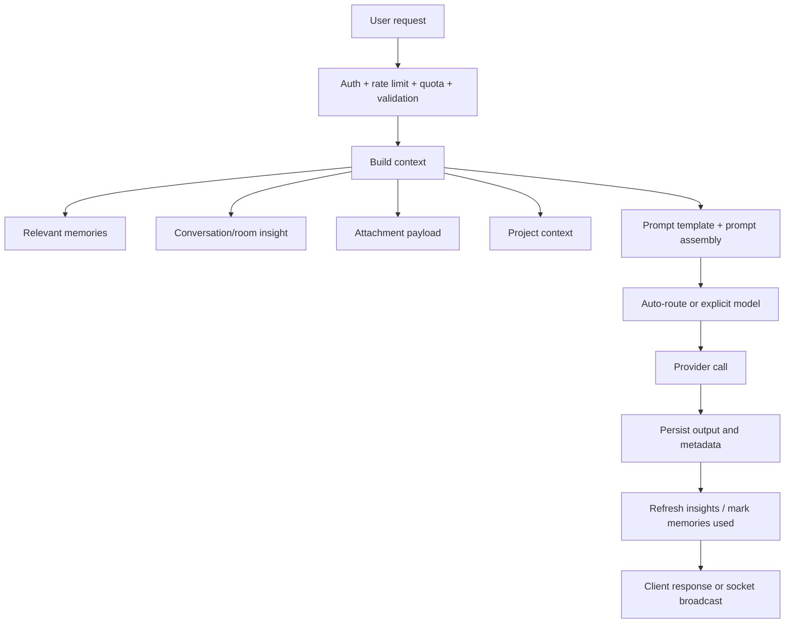

# 03. AI Feature Overview

## Purpose
This document gives a high-level map of every AI feature in the backend and explains how the pieces fit together.

## Feature Matrix
| Feature | Entry point | Main service path | Storage touched | Primary output |
|---|---|---|---|---|
| Solo AI chat | `POST /api/chat` | `services/gemini.js` | `Conversation`, `MemoryEntry`, `ConversationInsight` | assistant message in conversation |
| Room AI chat | `trigger_ai` socket event | `services/gemini.js` | `Room`, `Message`, `MemoryEntry`, `ConversationInsight` | AI room message |
| Smart replies | `POST /api/ai/smart-replies` | `getJsonFromModel` | none | 3 suggestions |
| Sentiment | `POST /api/ai/sentiment` | `getJsonFromModel` | none | sentiment payload |
| Grammar | `POST /api/ai/grammar` | `getJsonFromModel` | none | corrected text + suggestions |
| Memory extraction | implicit in chat/room/import flows | `services/memory.js` | `MemoryEntry` | durable user memory |
| Insights | implicit refresh and explicit conversation actions | `services/conversationInsights.js` | `ConversationInsight` | summary, topics, decisions, action items |
| Prompt templates | admin routes + runtime reads | `services/promptCatalog.js` | `PromptTemplate` | prompt text overrides |
| Model discovery | `GET /api/ai/models` | `refreshModelCatalogs` | runtime cache only | model catalog |

## Core Pipeline

## What Is Not Present
Important missing AI infrastructure:

- no vector database
- no distributed cache
- no job queue
- no streaming response path
- no benchmark or load-test suite
- no provider circuit breaker

## Main Inconsistencies
- `services/gemini.js` now does multi-provider work beyond Gemini
- source and `dist/` show different service layering
- REST helper features are thin route handlers while room AI orchestration is embedded in `index.js`
- some AI metadata is stored in `Conversation.messages`, but room `Message` stores a smaller metadata set

## Rebuild Guidance
A cleaner redesign would separate the system into:

1. AI request orchestrator
2. context providers
3. model router
4. provider adapters
5. persistence writers
6. post-processing hooks

