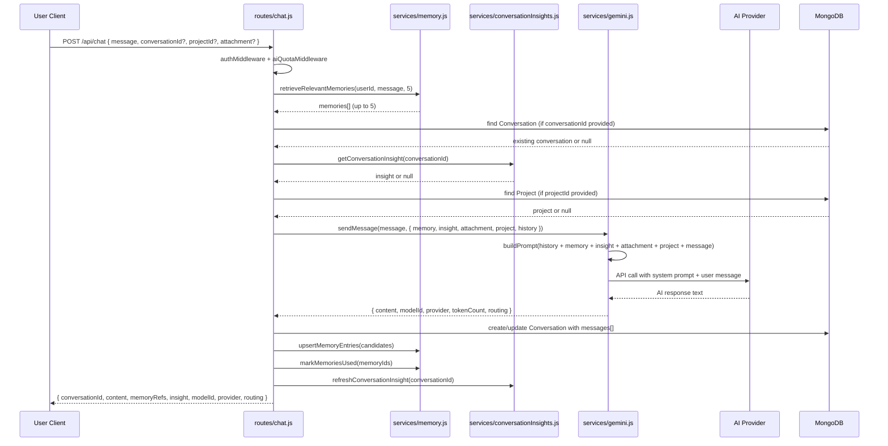
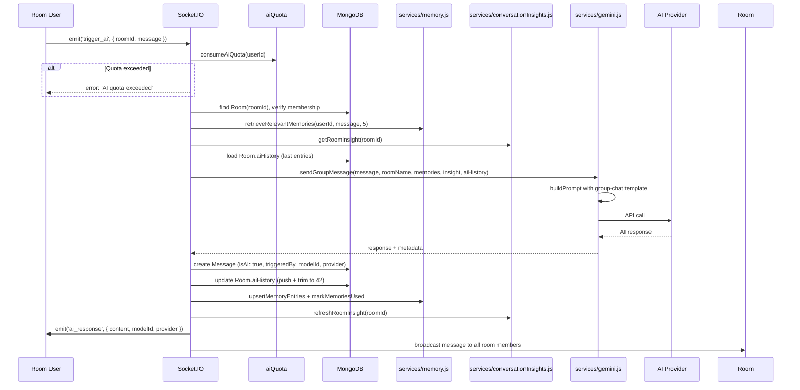
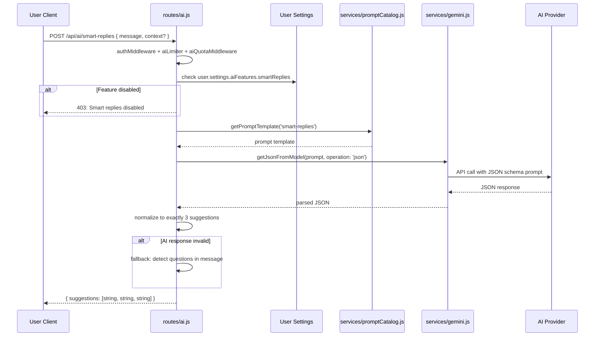
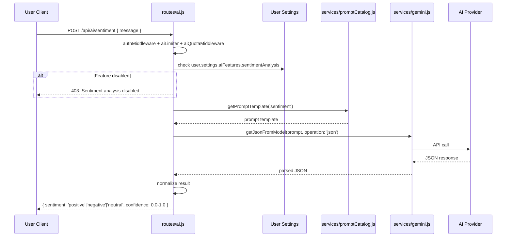
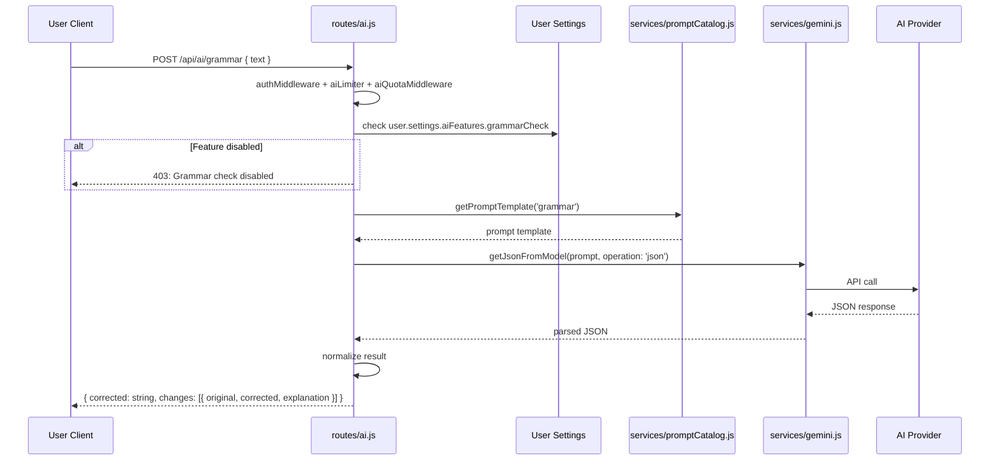
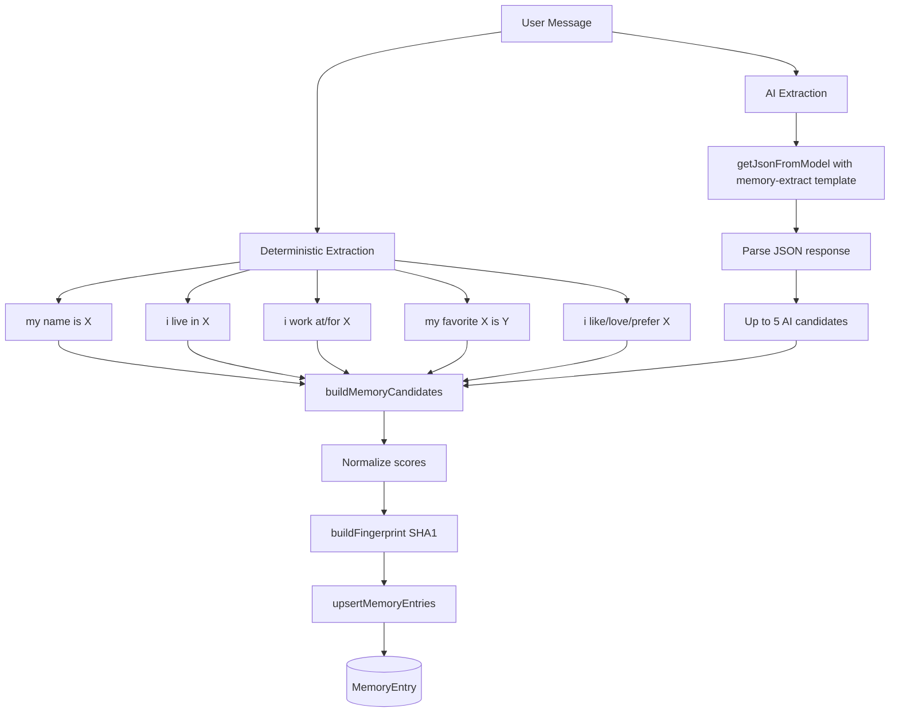
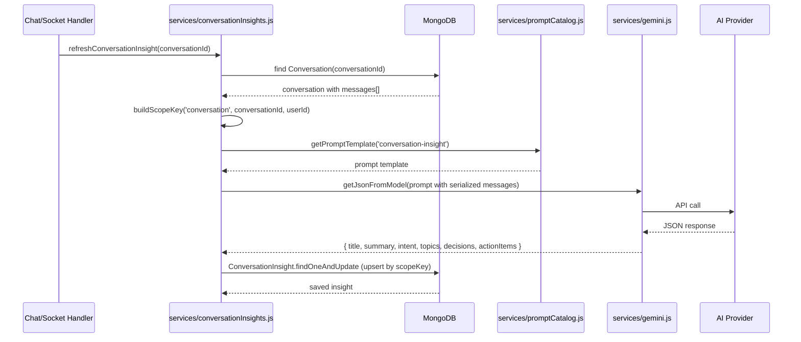
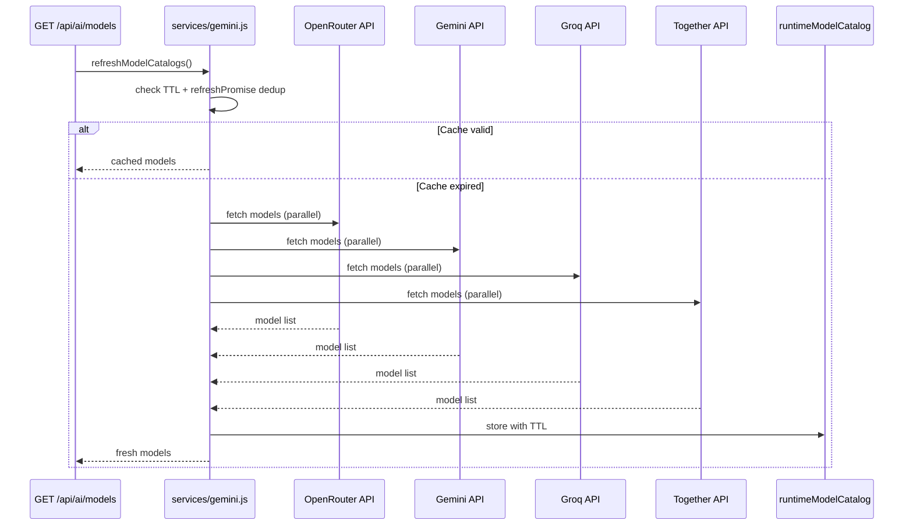
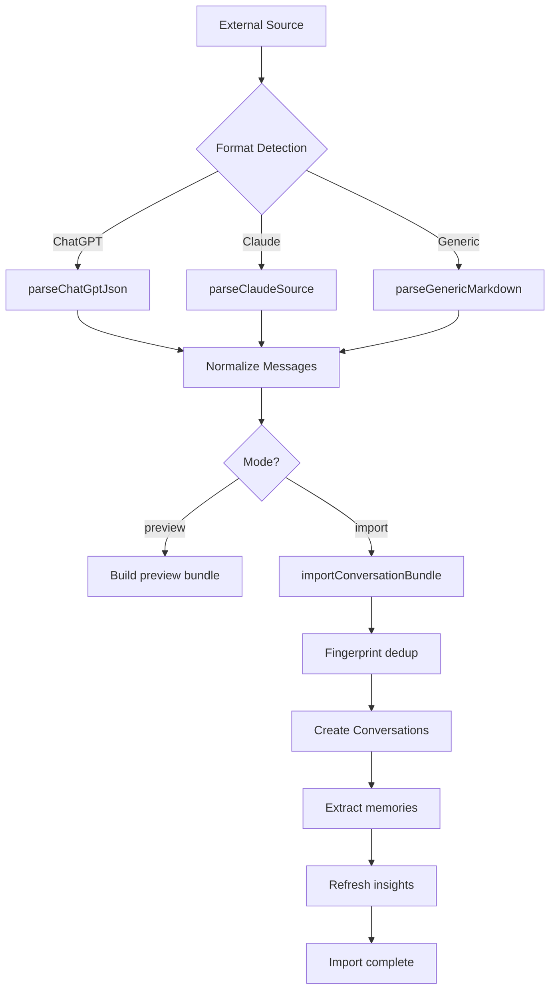
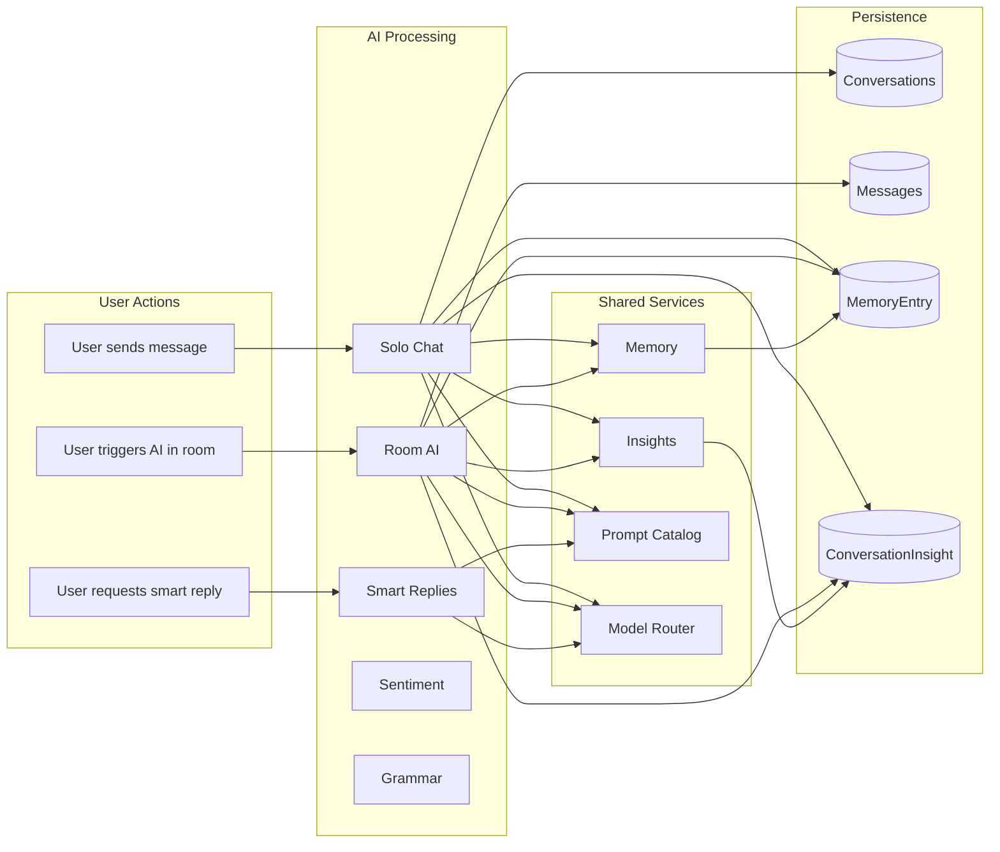

# 03. AI Feature Overview

## Purpose

This document provides a comprehensive overview of every AI feature in the ChatSphere backend. It describes what each feature does, how it works at a high level, which files implement it, and how features interact with each other. This is the primary reference for understanding the AI capability surface of the system.

The AI subsystem provides seven distinct features: solo chat, room AI, smart replies, sentiment analysis, grammar checking, memory management, and conversation insights. Each feature has its own entry points, service dependencies, and persistence patterns.

---

## Feature Inventory

| Feature | Entry Points | Primary Service | Data Written | User-Facing |
|---------|-------------|-----------------|-------------|-------------|
| Solo Chat | `POST /api/chat` | `services/gemini.js` → `sendMessage` | Conversation, MemoryEntry, ConversationInsight | Yes |
| Room AI | `trigger_ai` socket event | `services/gemini.js` → `sendGroupMessage` | Message, MemoryEntry, Room.aiHistory, ConversationInsight | Yes |
| Smart Replies | `POST /api/ai/smart-replies` | `services/gemini.js` → `getJsonFromModel` | None (stateless) | Yes |
| Sentiment Analysis | `POST /api/ai/sentiment` | `services/gemini.js` → `getJsonFromModel` | None (stateless) | Yes |
| Grammar Check | `POST /api/ai/grammar` | `services/gemini.js` → `getJsonFromModel` | None (stateless) | Yes |
| Memory Management | `routes/memory.js` CRUD + import/export | `services/memory.js` | MemoryEntry | Yes |
| Conversation Insights | Auto-triggered + `GET /:id/insights` | `services/conversationInsights.js` | ConversationInsight | Indirect |
| Model Management | `GET /api/ai/models` | `services/gemini.js` → `refreshModelCatalogs` | None (in-memory cache) | Admin |
| Prompt Management | `routes/admin.js` | `services/promptCatalog.js` | PromptTemplate | Admin |
| Import/Export | `POST /api/memory/import`, `GET /api/memory/export` | `services/importExport.js` | Conversation, MemoryEntry, ImportSession | Yes |

---

## Feature 1: Solo Chat

### Purpose

One-on-one conversation between a user and an AI model. The user sends a message, the system constructs a rich prompt with memory, insight, project context, and attachments, sends it to the AI provider, and stores the full exchange as a Conversation document.

### Entry Point

`POST /api/chat` in `routes/chat.js` (186 lines)

### Flow



### Key Implementation Details

**Memory retrieval:** Up to 5 memories are retrieved using `retrieveRelevantMemories(userId, message, 5)`. The scoring algorithm considers text similarity, importance, confidence, recency, usage count, and pinned status.

**Project context:** If a `projectId` is provided, the project's name, description, instructions, context, tags, and files (up to 6, each up to 4000 characters) are included in the prompt via `buildProjectContext`.

**Attachment handling:** If an attachment is provided, `buildAttachmentPayload` reads the file from the upload directory. Text files are extracted up to 12,000 characters; images are base64-encoded up to 3MB; PDFs are included as metadata notices.

**Conversation persistence:** The Conversation document is created (first message) or updated (subsequent messages) with both the user's message and the AI's response in the `messages[]` array.

**Memory upsert:** After the AI responds, new memory candidates are extracted and upserted in parallel with marking existing memories as used.

**Insight refresh:** The conversation insight is refreshed asynchronously. If it fails, the error is caught and does not affect the response to the client.

### Database Writes

| Model | Operation | Fields Updated |
|-------|-----------|---------------|
| `Conversation` | Create or Update | `messages[]`, `projectId`, `projectName`, `sourceType` |
| `MemoryEntry` | Create or Update | `summary`, `details`, `tags`, `fingerprint`, `scores`, `usageCount` |
| `ConversationInsight` | Create or Update | `title`, `summary`, `intent`, `topics`, `decisions`, `actionItems` |

### Response Example

```json
{
  "conversationId": "conv-abc123",
  "content": "Based on your project context and previous discussions about React...",
  "memoryRefs": ["mem-1", "mem-2"],
  "insight": {
    "title": "React State Management Best Practices",
    "summary": "Discussion about optimal state management patterns...",
    "intent": "technical guidance",
    "topics": ["React", "state management", "performance"],
    "decisions": [],
    "actionItems": ["Consider using Zustand for global state"]
  },
  "modelId": "google/gemini-2.5-flash",
  "provider": "openrouter",
  "routing": {
    "attempts": 1,
    "fallbackUsed": false,
    "complexity": "medium"
  },
  "tokenCount": {
    "input": 890,
    "output": 420
  }
}
```

---

## Feature 2: Room AI

### Purpose

AI participation in multi-user chat rooms. When a user triggers the AI (typically by mentioning the bot name or using a command), the AI reads the room's recent conversation history, retrieves relevant user memories, loads the room insight, and responds in the room context.

### Entry Point

`trigger_ai` socket event handler in `index.js` (lines ~851-1050)

### Flow



### Key Implementation Details

**Quota check:** The in-memory AI quota is checked before any processing. If exceeded, the request is rejected immediately with no DB reads.

**Membership validation:** The handler verifies that the triggering user is a member of the room using `findRoomMember` from `helpers/validate.js`.

**AI history management:** The room's `aiHistory` array is updated with each AI interaction and trimmed to 42 entries. This provides conversation context for subsequent AI triggers without unbounded growth.

**AI username:** The bot's display name is configured via `GEMINI_GROUP_BOT_NAME` environment variable (default: `'Gemini'`).

**Message persistence:** AI responses are stored as `Message` documents with `isAI: true`, `triggeredBy: userId`, `modelId`, `provider`, and `memoryRefs` fields.

**Allowed reactions:** AI messages support the same reactions as human messages: 👍, 🔥, 🤯, 💡.

### Database Writes

| Model | Operation | Fields Updated |
|-------|-----------|---------------|
| `Message` | Create | `roomId`, `userId` (AI), `username` (AI_USERNAME), `content`, `isAI: true`, `triggeredBy`, `modelId`, `provider`, `memoryRefs` |
| `Room` | Update | `aiHistory[]` (push + trim to 42) |
| `MemoryEntry` | Create or Update | Same as solo chat |
| `ConversationInsight` | Create or Update | Same as solo chat, scopeType: 'room' |

### Socket Event Example

```javascript
// Client triggers AI
socket.emit('trigger_ai', {
  roomId: 'room-abc',
  message: '@Gemini what did we decide about the API design?'
});

// Server responds
socket.on('ai_response', (data) => {
  // data.content = "Based on the room discussion, the team decided..."
  // data.modelId = "google/gemini-2.5-flash"
  // data.provider = "openrouter"
});
```

---

## Feature 3: Smart Replies

### Purpose

Generates three AI-suggested reply options for a given message. This feature is opt-in per user (default: enabled) and provides quick reply suggestions in chat interfaces.

### Entry Point

`POST /api/ai/smart-replies` in `routes/ai.js` (214 lines)

### Flow



### Key Implementation Details

**Feature toggle:** Checks `user.settings.aiFeatures.smartReplies` (default: `true`). If disabled, returns 403.

**Template loading:** Loads the `smart-replies` prompt template from DB or defaults.

**JSON extraction:** Uses `getJsonFromModel` which wraps `runModelPromptWithFallback` with `operation: 'json'` and parses JSON from the response text.

**Normalization:** The response is normalized to exactly 3 suggestions. If the AI returns fewer, duplicates are removed and gaps are filled. If more, only the first 3 are used.

**Fallback:** If the AI response is invalid or parsing fails, a simple fallback detects question marks in the input message and generates generic replies.

### Request/Response Example

```json
// Request
{
  "message": "Are we still meeting at 3pm tomorrow?"
}

// Response
{
  "suggestions": [
    "Yes, 3pm works for me. See you then!",
    "Can we push it to 4pm instead?",
    "I might be running late. Can we do a quick call first?"
  ]
}
```

---

## Feature 4: Sentiment Analysis

### Purpose

Analyzes the sentiment of a message using AI. Returns a classification (positive, negative, neutral) with a confidence score. This feature is opt-in per user (default: disabled).

### Entry Point

`POST /api/ai/sentiment` in `routes/ai.js`

### Flow



### Key Implementation Details

**Feature toggle:** Checks `user.settings.aiFeatures.sentimentAnalysis` (default: `false`).

**JSON schema prompt:** The sentiment template instructs the model to return JSON with `sentiment` and `confidence` fields.

**Normalization:** The result is normalized to ensure `sentiment` is one of the three valid values and `confidence` is a number between 0 and 1.

### Request/Response Example

```json
// Request
{
  "message": "I'm really frustrated with the deployment issues we've been having"
}

// Response
{
  "sentiment": "negative",
  "confidence": 0.87
}
```

---

## Feature 5: Grammar Check

### Purpose

Checks and corrects grammar in a message. Returns the corrected text with explanations of changes. This feature is opt-in per user (default: disabled).

### Entry Point

`POST /api/ai/grammar` in `routes/ai.js`

### Flow



### Key Implementation Details

**Feature toggle:** Checks `user.settings.aiFeatures.grammarCheck` (default: `false`).

**JSON schema prompt:** The grammar template instructs the model to return JSON with `corrected` text and an array of `changes`.

**Normalization:** Ensures the response has the expected structure. If parsing fails, returns the original text with no changes.

### Request/Response Example

```json
// Request
{
  "text": "Their going to the store to buy some apple's"
}

// Response
{
  "corrected": "They're going to the store to buy some apples",
  "changes": [
    {
      "original": "Their",
      "corrected": "They're",
      "explaining": "Homophone correction: 'Their' (possessive) should be 'They're' (contraction of 'they are')"
    },
    {
      "original": "apple's",
      "corrected": "apples",
      "explaining": "Removed unnecessary apostrophe: 'apples' is plural, not possessive"
    }
  ]
}
```

---

## Feature 6: Memory Management

### Purpose

Extracts, stores, scores, and retrieves user memories from conversations. Memories enable the AI to remember important facts about users across sessions, making interactions more personalized and contextually relevant.

### Entry Points

| Endpoint | Purpose |
|----------|---------|
| `GET /api/memory` | List memories with search, pinned filter, limit |
| `PUT /api/memory/:id` | Update memory entry |
| `DELETE /api/memory/:id` | Delete memory entry |
| `POST /api/memory/import` | Preview or import conversations |
| `GET /api/memory/export` | Export memories in various formats |

### Memory Extraction Pipeline



### Deterministic Extraction Patterns

| Pattern | Regex | Example | Extracted |
|---------|-------|---------|-----------|
| Name | `my name is (\w+)` | "my name is Alice" | `{ type: 'name', value: 'Alice' }` |
| Location | `i live in (.+)` | "i live in San Francisco" | `{ type: 'location', value: 'San Francisco' }` |
| Workplace | `i work at/for (.+)` | "i work at Acme Corp" | `{ type: 'workplace', value: 'Acme Corp' }` |
| Favorites | `my favorite (\w+) is (.+)` | "my favorite language is TypeScript" | `{ type: 'favorite_language', value: 'TypeScript' }` |
| Preferences | `i like/love/prefer (.+)` | "i like functional programming" | `{ type: 'preference', value: 'functional programming' }` |

### Memory Scoring Formula

```
score = textScore * 0.45
      + importanceScore * 0.2
      + confidenceScore * 0.15
      + recencyScore * 0.1
      + usageBoost * min(0.1, usageCount * 0.01)
      + pinnedBonus (0.15 if pinned)
```

| Component | Weight | Description |
|-----------|--------|-------------|
| `textScore` | 0.45 | Token overlap between memory and query |
| `importanceScore` | 0.20 | AI-assessed importance of the memory |
| `confidenceScore` | 0.15 | Confidence in the extraction accuracy |
| `recencyScore` | 0.10 | Based on age (≤1d: 1.0, ≤7d: 0.85, ≤30d: 0.65, ≤90d: 0.45, >90d: 0.25) |
| `usageBoost` | min(0.1, count * 0.01) | Increases with usage count, caps at 0.1 |
| `pinnedBonus` | 0.15 | Added if memory is pinned by user |

### Memory Retrieval Process

1. Fetch up to 100 MemoryEntry documents for the user
2. Compute score for each entry against the query tokens
3. Filter to entries with score > 0.08 or pinned entries
4. Sort by score descending
5. Return top N entries (default 5)

### Fingerprint Deduplication

```javascript
// services/memory.js — buildFingerprint
const crypto = require('crypto');

function buildFingerprint(summary) {
  const normalized = summary.toLowerCase().trim().replace(/\s+/g, ' ');
  return crypto.createHash('sha1').update(normalized).digest('hex');
}
```

The SHA1 fingerprint is computed from the normalized summary text. When upserting, entries are matched by `userId + fingerprint`. This prevents duplicate memories but means semantically identical content with different formatting will create separate entries.

---

## Feature 7: Conversation Insights

### Purpose

Automatically generates structured summaries of conversations and rooms. Insights capture the title, summary, intent, topics, decisions, and action items from a conversation, making it easy to understand what was discussed without reading every message.

### Entry Points

| Trigger | Mechanism |
|---------|-----------|
| After solo chat response | `refreshConversationInsight(conversationId)` called in `routes/chat.js` |
| After room AI response | `refreshRoomInsight(roomId)` called in `index.js` trigger_ai handler |
| Manual retrieval | `GET /api/conversations/:id/insights` |
| Manual action | `POST /api/conversations/:id/actions/summarize` |

### Insight Generation Flow



### Scope Key Format

```
scopeKey = `${scopeType}:${scopeId}:${userId || 'global'}`
```

| Scope Type | Scope ID | Example scopeKey |
|------------|----------|-----------------|
| `conversation` | conversationId | `conversation:conv-123:user-456` |
| `room` | roomId | `room:room-abc:global` |

### Fallback Insight

When AI is unavailable, `buildFallbackInsight` generates a basic insight:
- **Topics:** Word-frequency analysis on message text
- **Summary:** First text slice of the conversation
- **Intent:** Detected from presence of question marks

### Room Insight vs Conversation Insight

| Aspect | Conversation Insight | Room Insight |
|--------|---------------------|--------------|
| Scope Type | `conversation` | `room` |
| Data Source | `Conversation.messages[]` | Last 40 `Message` documents |
| Scope Key | Includes userId | Uses `global` |
| Trigger | After each solo chat response | After each room AI trigger |
| Message Limit | All messages | 40 messages |

---

## Feature 8: Model Management

### Purpose

Dynamically discovers, caches, and resolves AI models across 6 providers. Provides a unified interface for model selection with automatic fallback when models are unavailable.

### Entry Point

`GET /api/ai/models` in `routes/ai.js`

### Model Catalog Refresh



### Model Resolution Priority

When a model ID is provided or `'auto'` is requested:

1. If explicit `modelId` provided → use that model
2. If `'auto'` or null → use `rankModelsForTask` based on complexity
3. If resolved model unavailable → use fallback chain (up to 6 attempts)

### Complexity Estimation

```javascript
// services/gemini.js — estimatePromptComplexity
function estimatePromptComplexity(message, hasAttachment, isGroupChat) {
  if (hasAttachment || isGroupChat || message.length > 2800) return 'high';
  if (looksLikeJson(message) || message.length > 1200) return 'medium';
  return 'low';
}
```

| Complexity | Triggers |
|------------|---------|
| High | Has attachment, group chat, message > 2800 chars |
| Medium | Looks like JSON, message > 1200 chars |
| Low | Everything else |

---

## Feature 9: Prompt Management

### Purpose

Manages prompt templates that define the system prompts for various AI operations. Templates can be overridden via admin endpoints, allowing customization without code changes.

### Entry Points

| Endpoint | Purpose |
|----------|---------|
| `GET /api/admin/prompts` | List all templates (DB + defaults merged) |
| `PUT /api/admin/prompts/:key` | Upsert a template (create or update) |

### Template Loading

```javascript
// services/promptCatalog.js — getPromptTemplate
async function getPromptTemplate(key) {
  const dbTemplate = await PromptTemplate.findOne({ key, isActive: true });
  return dbTemplate?.content || DEFAULT_PROMPTS[key];
}
```

DB templates take precedence over defaults. Only `isActive: true` templates are loaded.

---

## Feature 10: Import/Export

### Purpose

Imports conversations from external sources (ChatGPT, Claude, generic markdown) and exports user data in multiple formats. Import includes AI-assisted memory extraction.

### Supported Import Formats

| Format | Parser | Detection |
|--------|--------|-----------|
| ChatGPT JSON | `parseChatGptJson` | Mapping format or simple array |
| Claude JSON/Text | `parseClaudeSource` | JSON or Human:/Assistant: text |
| Generic Markdown | `parseGenericMarkdown` | User:/Assistant: blocks |

### Import Flow



### Export Formats

| Format | Description |
|--------|-------------|
| Normalized JSON | Structured JSON with conversations, memories, insights |
| Markdown | Human-readable markdown format |
| Adapter | Format compatible with specific external platforms |

---

## Feature Interactions



---

## What Is Not Present

Important AI infrastructure that is absent from the codebase:

| Missing Component | Impact |
|------------------|--------|
| Vector database | No semantic similarity search for memories; relies on token overlap |
| Distributed cache | In-memory state does not survive restarts or scale across instances |
| Job queue | No async processing for heavy operations like import or insight refresh |
| Streaming responses | All AI responses are buffered; no SSE or WebSocket streaming |
| Benchmark suite | No load testing or performance regression tests |
| Circuit breaker | No provider circuit breaker; failed providers are retried on every request |
| Response validation | AI responses are not validated against expected schemas before storage |

---

## Failure Cases and Recovery

| Feature | Failure Scenario | Recovery Behavior |
|---------|-----------------|------------------|
| Solo Chat | Provider timeout | Fallback chain (up to 6 attempts) |
| Solo Chat | All providers fail | Error returned, no Conversation created |
| Solo Chat | Memory upsert fails | Response still returned; memory silently lost |
| Solo Chat | Insight refresh fails | Error caught; response unaffected |
| Room AI | Quota exceeded | Immediate rejection; no processing |
| Room AI | User not room member | Rejected with error |
| Room AI | Provider fails | Fallback chain; if all fail, error emitted |
| Smart Replies | AI response invalid | Fallback to question detection |
| Smart Replies | Feature disabled | 403 response |
| Sentiment | AI response invalid | Default neutral sentiment |
| Grammar | AI response invalid | Original text returned |
| Memory | Duplicate fingerprint | Existing entry updated |
| Import | Duplicate fingerprint | Import skipped |
| Model Catalog | Provider API down | Use cached models or defaults |

---

## Scaling and Operational Implications

| Concern | Impact | Mitigation |
|---------|--------|-----------|
| AI quota is in-memory | Quota resets on restart; not shared across instances | Move to Redis for multi-instance |
| Insight refresh is async | Stale insights possible under high load | Acceptable trade-off; non-blocking |
| Memory scoring is CPU-intensive | 100 entries scored per retrieval | Consider caching scores or reducing fetch limit |
| Model catalog TTL is 30min | Stale model lists during provider updates | Reduce TTL during known update windows |
| Fallback chain multiplies API calls | Up to 6x API cost per request | Monitor and alert on fallback rate |
| No request deduplication | Concurrent identical requests each trigger AI calls | Add request-level dedup for hot paths |

---

## Inconsistencies and Risks

| Issue | Severity | Description |
|-------|----------|-------------|
| Memory fingerprint uses raw text | Medium | Different formatting of same content creates duplicate memories |
| Score weights are hard-coded | Low | No mechanism to tune weights without code changes |
| Room AI in index.js | Medium | Business logic mixed with infrastructure code |
| No AI response validation | Low | AI responses are not validated before storage |
| Fallback insight is basic | Low | Word-frequency topics are not as useful as AI-generated topics |
| Import has no rate limit | Medium | Large imports could exhaust API quota |
| `services/gemini.js` naming | Low | File named "gemini" but handles 6 providers |
| Source vs dist drift | Medium | `dist/` files show different service layering than source |
| Metadata inconsistency | Low | Conversation.messages stores full metadata; room Message stores smaller set |

---

## How to Rebuild from Scratch

To recreate all AI features from zero:

1. **Solo Chat:** Create `POST /api/chat` endpoint that retrieves memories, loads insight, resolves project, calls `sendMessage`, persists Conversation, upserts memories, refreshes insight
2. **Room AI:** Create `trigger_ai` socket handler that checks quota, validates membership, retrieves memories and insight, calls `sendGroupMessage`, persists Message, updates Room.aiHistory, upserts memories, refreshes insight
3. **Smart Replies:** Create `POST /api/ai/smart-replies` that checks feature toggle, loads template, calls `getJsonFromModel`, normalizes to 3 suggestions
4. **Sentiment:** Create `POST /api/ai/sentiment` that checks feature toggle, loads template, calls `getJsonFromModel`, normalizes result
5. **Grammar:** Create `POST /api/ai/grammar` that checks feature toggle, loads template, calls `getJsonFromModel`, normalizes result
6. **Memory:** Implement deterministic regex extraction, AI extraction via JSON schema, scoring formula, retrieval with token matching, fingerprint deduplication, upsert logic
7. **Insights:** Implement insight generation with JSON schema, scope key format, fallback insight builder, auto-refresh triggers
8. **Models:** Implement provider adapters, model catalog with TTL caching, model resolution, fallback chain
9. **Prompts:** Define 8 default templates, implement interpolation, add DB override capability
10. **Import/Export:** Implement parsers for ChatGPT, Claude, and generic markdown formats, fingerprint dedup, multi-format export
