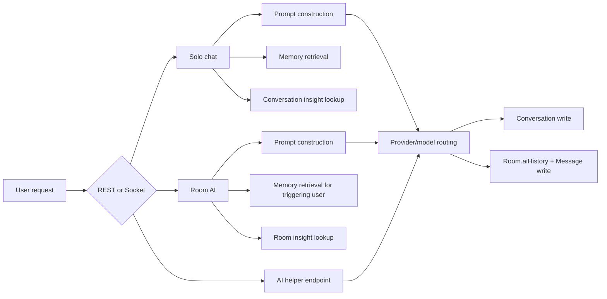

# 03. AI Feature Overview

## Purpose

This document gives the feature-level view of the backend AI system before diving into individual flows.

## Feature Matrix

| Feature | Entry point | Main dependencies | Stores output? | Uses memory? | Uses insights? | Uses prompt templates? |
| --- | --- | --- | --- | --- | --- | --- |
| Solo chat | `POST /api/chat` | `sendMessage`, memory service, insight service | yes, in `Conversation.messages` | yes | yes | yes |
| Room AI | Socket `trigger_ai` | `sendGroupMessage`, memory service, room insight service | yes, in `Message` and `Room.aiHistory` | yes | yes | yes |
| Smart replies | `POST /api/ai/smart-replies` | `getJsonFromModel`, `getPromptTemplate` | no | no | no | yes |
| Sentiment | `POST /api/ai/sentiment` | `getJsonFromModel`, `getPromptTemplate` | no | no | no | yes |
| Grammar | `POST /api/ai/grammar` | `getJsonFromModel`, `getPromptTemplate` | no | no | no | yes |
| Memory extraction | chat, room AI, import | `upsertMemoryEntries` | yes, `MemoryEntry` | n/a | no | indirectly |
| Insight generation | conversation and room actions, chat refresh | `refreshConversationInsight`, `refreshRoomInsight` | yes, `ConversationInsight` | reads conversation text | n/a | indirectly |
| Model discovery | `GET /api/ai/models`, startup | catalog refresh in `services/gemini.js` | cached in memory only | no | no | no |
| Prompt editing | admin REST | `PromptTemplate` + `promptCatalog` | yes, `PromptTemplate` | affects all prompt-based features | affects all prompt-based features | core system |
| Attachment context | uploads plus chat/room AI | upload middleware + `buildAttachmentPayload` | file on disk, refs in messages | no | no | no |
| Project context | project APIs plus solo chat | `Project` + `buildProjectContext` | project metadata in `Project` | no | no | no |

## System View

## Shared Building Blocks

| Building block | Used by |
| --- | --- |
| `services/gemini.js` | all provider-backed AI features |
| `services/promptCatalog.js` | chat, room AI, memory extraction prompt, insight prompt, helper endpoints |
| `services/memory.js` | solo chat, room AI, imports |
| `services/conversationInsights.js` | solo chat, room insight routes, conversation insight routes |
| `services/aiQuota.js` | REST AI endpoints and room AI socket flow |

## Database Footprint By Feature

| Feature | Main writes |
| --- | --- |
| Solo chat | `Conversation.save()`, `MemoryEntry.create/save`, `MemoryEntry.updateMany`, `ConversationInsight.findOneAndUpdate()` |
| Room AI | `Room.save()`, `Message.save()`, `MemoryEntry.create/save`, `MemoryEntry.updateMany`, `ConversationInsight.findOneAndUpdate()` |
| Smart replies | none |
| Sentiment | none |
| Grammar | none |
| Prompt edits | `PromptTemplate.findOneAndUpdate()` |
| Memory CRUD | `MemoryEntry.findOneAndUpdate()`, `findOneAndDelete()` |
| Memory import | `ImportSession`, `Conversation`, `MemoryEntry`, `ConversationInsight` |

## Failure Profile Summary

| Feature | Primary failure mode | Typical recovery |
| --- | --- | --- |
| Solo chat | provider failure or rate limit | normalized 429/503/500 response, retry or choose another model |
| Room AI | provider failure during socket flow | error assistant message persisted, socket error emitted |
| Smart replies | JSON/provider failure | deterministic suggestion fallback |
| Sentiment | JSON/provider failure | neutral fallback |
| Grammar | provider/JSON failure | echo input with empty suggestions |
| Memory extraction | AI extraction failure | deterministic regex extraction still runs |
| Insights | AI summarizer failure | deterministic fallback insight |

## Risks And Inconsistencies

- `services/gemini.js` is named after Gemini but now routes across multiple providers.
- room AI stores output differently from solo chat because room history lives in both a `Message` collection and embedded `Room.aiHistory`.
- helper endpoints are AI-backed but stateless, unlike chat flows.
- `dist/` suggests a cleaner service-oriented architecture than the live source actually runs.

## Rebuild Notes

If implementing the same product from scratch, keep the product features but formalize them into separate orchestration layers:

1. stateless helper features
2. solo conversation orchestration
3. room conversation orchestration
4. shared memory/insight services
5. shared provider-routing service

