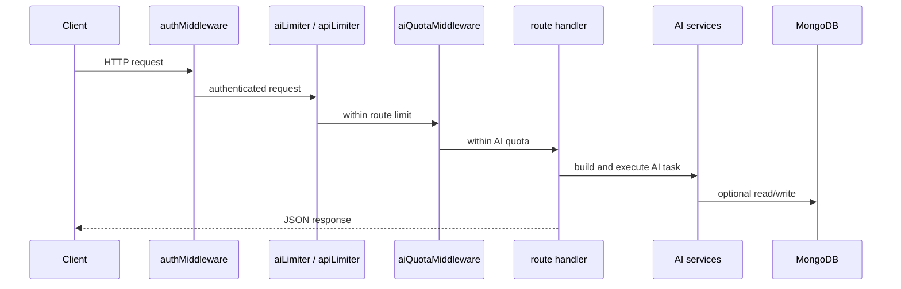

# 04. REST API Overview

## Purpose
This document explains the AI-related HTTP API surface, authentication rules, request/response patterns, and the common behaviors shared across routes.

## AI REST Endpoints
| Method | Path | File | Purpose |
|---|---|---|---|
| `POST` | `/api/chat` | `routes/chat.js` | solo assistant conversation |
| `GET` | `/api/ai/models` | `routes/ai.js` | list configured/discovered models |
| `POST` | `/api/ai/smart-replies` | `routes/ai.js` | generate 3 reply suggestions |
| `POST` | `/api/ai/sentiment` | `routes/ai.js` | sentiment analysis |
| `POST` | `/api/ai/grammar` | `routes/ai.js` | grammar improvement |
| `GET` | `/api/conversations/:id/insights` | `routes/conversations.js` | fetch insight |
| `POST` | `/api/conversations/:id/actions/:action` | `routes/conversations.js` | summarize, extract tasks, extract decisions |
| `GET` | `/api/memory` | `routes/memory.js` | list memories |
| `PUT` | `/api/memory/:id` | `routes/memory.js` | update a memory |
| `DELETE` | `/api/memory/:id` | `routes/memory.js` | delete a memory |
| `POST` | `/api/memory/import` | `routes/memory.js` | preview or import conversation bundle |
| `GET` | `/api/memory/export` | `routes/memory.js` | export conversations/insights/memories |
| `POST` | `/api/uploads` | `routes/uploads.js` | upload AI attachment |
| `GET` | `/api/uploads/:filename` | `routes/uploads.js` | serve stored attachment |
| `GET` | `/api/admin/prompts` | `routes/admin.js` | list prompt templates |
| `PUT` | `/api/admin/prompts/:key` | `routes/admin.js` | update prompt template |
| `GET` | `/api/settings` | `routes/settings.js` | read AI settings |
| `PUT` | `/api/settings` | `routes/settings.js` | update AI toggles |

## Authentication
`middleware/auth.js` expects:

```http
Authorization: Bearer <jwt>
```

## Common Request Pattern


## Database Update Summary
REST APIs write to:

- `Conversation` on chat
- `MemoryEntry` on chat and memory import
- `ConversationInsight` on chat and conversation actions
- `PromptTemplate` on admin prompt edits

They do not write room artifacts like `Room.aiHistory` or room `Message` documents.

## Risks
- helper endpoints perform AI work inside route handlers rather than dedicated services
- no strict schema validator beyond manual checks in source routes
- no streaming or partial progress support for long-running model calls
- quota is per-process memory, so multi-instance REST traffic becomes inconsistent

