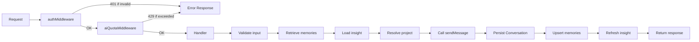
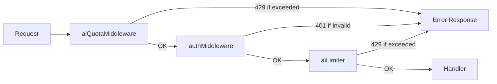

# 04. REST API Overview

## Purpose

This document explains the complete AI-related HTTP API surface of the ChatSphere backend. It covers authentication rules, request/response patterns, middleware chains, error handling, and the common behaviors shared across all AI routes. This is the primary reference for frontend developers, API consumers, and anyone integrating with the AI subsystem.

The AI REST API consists of 20 endpoints across 6 route modules, each with specific middleware chains, validation rules, and response shapes.

---

## Endpoint Inventory

| Method | Path | File | Purpose | Auth Required |
|--------|------|------|---------|--------------|
| `POST` | `/api/chat` | `routes/chat.js` | Solo AI assistant conversation | Yes |
| `GET` | `/api/ai/models` | `routes/ai.js` | List configured/discovered models | Yes |
| `POST` | `/api/ai/smart-replies` | `routes/ai.js` | Generate 3 reply suggestions | Yes |
| `POST` | `/api/ai/sentiment` | `routes/ai.js` | Sentiment analysis of message | Yes |
| `POST` | `/api/ai/grammar` | `routes/ai.js` | Grammar correction suggestions | Yes |
| `GET` | `/api/conversations` | `routes/conversations.js` | List user conversations | Yes |
| `GET` | `/api/conversations/:id` | `routes/conversations.js` | Full conversation with messages | Yes |
| `GET` | `/api/conversations/:id/insights` | `routes/conversations.js` | Fetch conversation insight | Yes |
| `POST` | `/api/conversations/:id/actions/:action` | `routes/conversations.js` | Summarize, extract tasks/decisions | Yes |
| `DELETE` | `/api/conversations/:id` | `routes/conversations.js` | Delete conversation | Yes |
| `GET` | `/api/memory` | `routes/memory.js` | List memories with search/filter | Yes |
| `PUT` | `/api/memory/:id` | `routes/memory.js` | Update memory entry | Yes |
| `DELETE` | `/api/memory/:id` | `routes/memory.js` | Delete memory entry | Yes |
| `POST` | `/api/memory/import` | `routes/memory.js` | Preview or import conversations | Yes |
| `GET` | `/api/memory/export` | `routes/memory.js` | Export in various formats | Yes |
| `GET` | `/api/admin/prompts` | `routes/admin.js` | List prompt templates | Yes |
| `PUT` | `/api/admin/prompts/:key` | `routes/admin.js` | Upsert prompt template | Yes |
| `GET` | `/api/settings` | `routes/settings.js` | Read user AI settings | Yes |
| `PUT` | `/api/settings` | `routes/settings.js` | Update AI feature toggles | Yes |
| `GET` | `/api/health` | `index.js` | Health check | No |

---

## Authentication

**File:** `middleware/auth.js`

All AI endpoints (except `/api/health`) require authentication via JWT bearer token.

```http
Authorization: Bearer <jwt_token>
```

The middleware:
1. Extracts the token from the `Authorization` header
2. Verifies the token using `jwt.verify(token, process.env.JWT_SECRET)`
3. Attaches `req.user` with decoded payload (id, username, email)
4. Calls `next()` on success
5. Returns 401 on failure

---

## Middleware Chains

Each route module applies its own middleware stack. Understanding the order is critical for debugging authentication, rate limiting, and quota issues.

### Solo Chat (`POST /api/chat`)

```
authMiddleware → aiQuotaMiddleware → handler
```



### AI Helper Endpoints (`/api/ai/*`)

```
aiQuotaMiddleware (mount level) → authMiddleware → aiLimiter → handler
```

**Important:** The `aiQuotaMiddleware` is applied at the mount level in `index.js`, meaning it runs before route-level middleware. This is different from `/api/chat` where quota is checked after auth.



### Conversations (`/api/conversations/*`)

```
authMiddleware → handler
```

No AI quota or rate limiting at the route level (outer `apiLimiter` still applies).

### Memory (`/api/memory/*`)

```
authMiddleware → handler
```

No AI quota or rate limiting at the route level.

### Admin (`/api/admin/*`)

```
authMiddleware → handler
```

### Settings (`/api/settings`)

```
authMiddleware → handler
```

---

## Rate Limiting Layers

Three layers of rate limiting apply to AI endpoints:

| Layer | Limiter | Window | Max | Scope | Applied To |
|-------|---------|--------|-----|-------|-----------|
| Outer | `apiLimiter` | 15 min | 1000 | IP | All `/api/*` (skips `/health`, `/auth`) |
| Route | `aiLimiter` | 15 min | 80 | User ID or IP | `/api/ai/*` only |
| Quota | `aiQuotaMiddleware` | 15 min | 20 | User ID or IP | `/api/ai/*` (mount) and `/api/chat` (handler) |

**Effective limits:**
- `/api/ai/*` endpoints: 20 requests per 15 min (quota) AND 80 per 15 min (rate limiter) — quota is the tighter constraint
- `/api/chat`: 20 requests per 15 min (quota) AND 1000 per 15 min (outer limiter) — quota is the tighter constraint
- `/api/conversations/*`: 1000 per 15 min (outer limiter only)
- `/api/memory/*`: 1000 per 15 min (outer limiter only)

---

## Endpoint Details

### POST /api/chat

**File:** `routes/chat.js` (186 lines)

**Purpose:** Send a message to the solo AI assistant. Creates or continues a conversation.

**Request Body:**

```json
{
  "message": "What are the best practices for React state management?",
  "conversationId": "conv-123",
  "projectId": "proj-456",
  "modelId": "google/gemini-2.5-flash",
  "attachment": {
    "fileUrl": "/uploads/abc123.js",
    "fileName": "store.js",
    "fileType": "text/javascript",
    "fileSize": 2048
  }
}
```

| Field | Type | Required | Description |
|-------|------|----------|-------------|
| `message` | string | Yes | User's message to the AI |
| `conversationId` | string | No | Existing conversation ID to continue |
| `projectId` | string | No | Project ID for context injection |
| `modelId` | string | No | Explicit model ID or `'auto'` |
| `attachment` | object | No | File attachment for prompt enrichment |
| `attachment.fileUrl` | string | Conditional | Required if attachment present |
| `attachment.fileName` | string | Conditional | Required if attachment present |
| `attachment.fileType` | string | Conditional | Required if attachment present |
| `attachment.fileSize` | number | Conditional | Required if attachment present |

**Response (200):**

```json
{
  "conversationId": "conv-abc123",
  "content": "Based on your project context and previous discussions...",
  "memoryRefs": ["mem-1", "mem-2"],
  "insight": {
    "title": "React State Management Discussion",
    "summary": "User asked about React state management best practices...",
    "intent": "technical guidance",
    "topics": ["React", "state management", "best practices"],
    "decisions": [],
    "actionItems": []
  },
  "modelId": "google/gemini-2.5-flash",
  "provider": "openrouter",
  "routing": {
    "attempts": 1,
    "fallbackUsed": false,
    "complexity": "medium"
  },
  "tokenCount": {
    "input": 890,
    "output": 420
  }
}
```

**Error Responses:**

| Status | Condition | Response Body |
|--------|-----------|--------------|
| 400 | Missing `message` field | `{ error: 'Message is required' }` |
| 400 | Invalid attachment payload | `{ error: 'Invalid attachment' }` |
| 401 | Missing or invalid JWT | `{ error: 'Authentication required' }` |
| 429 | AI quota exceeded | `{ error: 'AI quota exceeded', retryAfterMs: 123456 }` |
| 500 | All AI providers failed | `{ error: 'AI service unavailable' }` |

**Database Operations:**

| Model | Operation | Timing |
|-------|-----------|--------|
| `MemoryEntry` | Read (retrieveRelevantMemories) | Before AI call |
| `ConversationInsight` | Read (getConversationInsight) | Before AI call |
| `Project` | Read (if projectId provided) | Before AI call |
| `Conversation` | Create or Update | After AI response |
| `MemoryEntry` | Create/Update (upsertMemoryEntries) | After AI response |
| `MemoryEntry` | Update (markMemoriesUsed) | After AI response |
| `ConversationInsight` | Create/Update (refreshConversationInsight) | After AI response (async) |

---

### GET /api/ai/models

**File:** `routes/ai.js` (214 lines)

**Purpose:** Refresh model catalogs and return the list of available models across all providers.

**Query Parameters:**

| Parameter | Type | Description |
|-----------|------|-------------|
| `refresh` | boolean | If `true`, force refresh the model catalog |

**Response (200):**

```json
{
  "models": [
    {
      "id": "google/gemini-2.5-flash",
      "provider": "openrouter",
      "name": "Gemini 2.5 Flash"
    },
    {
      "id": "gemini-2.5-flash",
      "provider": "gemini",
      "name": "Gemini 2.5 Flash"
    }
  ],
  "auto": {
    "id": "auto",
    "provider": "auto",
    "name": "Auto-select best model"
  }
}
```

**Behavior:**
1. Calls `refreshModelCatalogs()` which fetches from all provider APIs in parallel
2. Respects TTL cache (minimum 5 min, default 30 min)
3. Uses `refreshPromise` dedup to prevent concurrent refreshes
4. Returns configured or cached models per provider
5. Includes `'auto'` option for automatic model selection
6. Falls back to default model arrays if no catalog available

---

### POST /api/ai/smart-replies

**File:** `routes/ai.js`

**Purpose:** Generate 3 AI-suggested reply options for a given message.

**Request Body:**

```json
{
  "message": "Are we still meeting at 3pm tomorrow?"
}
```

**Response (200):**

```json
{
  "suggestions": [
    "Yes, 3pm works for me. See you then!",
    "Can we push it to 4pm instead?",
    "I might be running late. Can we do a quick call first?"
  ]
}
```

**Feature Toggle:** Checks `user.settings.aiFeatures.smartReplies` (default: `true`). Returns 403 if disabled.

**Fallback:** If AI response is invalid, falls back to question detection in the input message.

---

### POST /api/ai/sentiment

**File:** `routes/ai.js`

**Purpose:** Analyze the sentiment of a message.

**Request Body:**

```json
{
  "message": "I'm really frustrated with the deployment issues"
}
```

**Response (200):**

```json
{
  "sentiment": "negative",
  "confidence": 0.87
}
```

**Feature Toggle:** Checks `user.settings.aiFeatures.sentimentAnalysis` (default: `false`). Returns 403 if disabled.

---

### POST /api/ai/grammar

**File:** `routes/ai.js`

**Purpose:** Check and correct grammar in text.

**Request Body:**

```json
{
  "text": "Their going to the store to buy some apple's"
}
```

**Response (200):**

```json
{
  "corrected": "They're going to the store to buy some apples",
  "changes": [
    {
      "original": "Their",
      "corrected": "They're",
      "explaining": "Homophone correction"
    },
    {
      "original": "apple's",
      "corrected": "apples",
      "explaining": "Removed unnecessary apostrophe"
    }
  ]
}
```

**Feature Toggle:** Checks `user.settings.aiFeatures.grammarCheck` (default: `false`). Returns 403 if disabled.

---

### GET /api/conversations

**File:** `routes/conversations.js` (172 lines)

**Purpose:** List user's AI conversations.

**Query Parameters:**

| Parameter | Type | Description |
|-----------|------|-------------|
| `projectId` | string | Filter by project ID |
| `limit` | number | Number of results (default varies) |
| `skip` | number | Pagination offset |

**Response (200):**

```json
{
  "conversations": [
    {
      "_id": "conv-abc123",
      "userId": "user-456",
      "title": "React State Management Discussion",
      "messages": [
        { "role": "user", "content": "What are best practices..." },
        { "role": "assistant", "content": "Here are the best practices..." }
      ],
      "projectId": "proj-789",
      "projectName": "Frontend Redesign",
      "sourceType": "chat",
      "createdAt": "2025-01-15T10:30:00Z",
      "updatedAt": "2025-01-15T10:35:00Z"
    }
  ],
  "total": 42
}
```

---

### GET /api/conversations/:id

**File:** `routes/conversations.js`

**Purpose:** Get full conversation with all messages.

**Response (200):**

```json
{
  "_id": "conv-abc123",
  "userId": "user-456",
  "title": "React State Management Discussion",
  "messages": [
    {
      "role": "user",
      "content": "What are the best practices for React state management?",
      "timestamp": "2025-01-15T10:30:00Z"
    },
    {
      "role": "assistant",
      "content": "Here are the best practices...",
      "timestamp": "2025-01-15T10:30:05Z",
      "modelId": "google/gemini-2.5-flash",
      "provider": "openrouter"
    }
  ],
  "projectId": "proj-789",
  "projectName": "Frontend Redesign",
  "createdAt": "2025-01-15T10:30:00Z",
  "updatedAt": "2025-01-15T10:35:00Z"
}
```

---

### GET /api/conversations/:id/insights

**File:** `routes/conversations.js`

**Purpose:** Get the structured insight for a conversation.

**Response (200):**

```json
{
  "scopeKey": "conversation:conv-abc123:user-456",
  "scopeType": "conversation",
  "scopeId": "conv-abc123",
  "title": "React State Management Discussion",
  "summary": "User asked about React state management best practices...",
  "intent": "technical guidance",
  "topics": ["React", "state management", "performance"],
  "decisions": [],
  "actionItems": ["Consider using Zustand for global state"],
  "messageCount": 8,
  "lastGeneratedAt": "2025-01-15T10:35:00Z",
  "promptVersion": 1
}
```

**Behavior:** Loads existing insight or triggers a refresh if none exists.

---

### POST /api/conversations/:id/actions/:action

**File:** `routes/conversations.js`

**Purpose:** Execute AI actions on a conversation.

**Supported Actions:**

| Action | Description |
|--------|-------------|
| `summarize` | Generate a summary of the conversation |
| `extract-tasks` | Extract action items from the conversation |
| `extract-decisions` | Extract decisions made in the conversation |

**Request:** No body required. Action is specified in the URL path.

**Response (200):**

```json
{
  "action": "summarize",
  "result": {
    "summary": "The conversation covered React state management...",
    "topics": ["React", "state management"],
    "actionItems": ["Consider Zustand"],
    "decisions": []
  }
}
```

---

### DELETE /api/conversations/:id

**File:** `routes/conversations.js`

**Purpose:** Delete a conversation and its associated data.

**Response (200):**

```json
{
  "message": "Conversation deleted successfully"
}
```

**Side Effects:**
- Deletes the Conversation document
- Does NOT delete associated MemoryEntry documents (memories persist)
- Does NOT delete associated ConversationInsight documents (insights may become orphaned)

---

### GET /api/memory

**File:** `routes/memory.js` (163 lines)

**Purpose:** List user memories with search and filtering.

**Query Parameters:**

| Parameter | Type | Description |
|-----------|------|-------------|
| `search` | string | Search query for memory text |
| `pinned` | boolean | Filter to pinned memories only |
| `limit` | number | Number of results |

**Response (200):**

```json
{
  "memories": [
    {
      "_id": "mem-1",
      "userId": "user-456",
      "summary": "User prefers TypeScript over JavaScript",
      "details": "Mentioned during a discussion about frontend tooling",
      "tags": ["preference", "programming"],
      "fingerprint": "a1b2c3d4e5f6...",
      "sourceType": "chat",
      "sourceConversationId": "conv-abc123",
      "confidenceScore": 0.85,
      "importanceScore": 0.7,
      "recencyScore": 0.85,
      "pinned": false,
      "usageCount": 3,
      "lastUsedAt": "2025-01-15T10:30:00Z",
      "lastObservedAt": "2025-01-10T08:00:00Z",
      "createdAt": "2025-01-10T08:00:00Z"
    }
  ],
  "total": 15
}
```

---

### PUT /api/memory/:id

**File:** `routes/memory.js`

**Purpose:** Update a memory entry.

**Request Body:**

```json
{
  "summary": "User prefers TypeScript for frontend development",
  "details": "Mentioned during frontend tooling discussion",
  "tags": ["preference", "programming", "frontend"],
  "pinned": true,
  "confidenceScore": 0.9,
  "importanceScore": 0.8
}
```

| Field | Type | Description |
|-------|------|-------------|
| `summary` | string | Updated memory summary |
| `details` | string | Updated details/context |
| `tags` | string[] | Updated tags |
| `pinned` | boolean | Pin/unpin the memory |
| `confidenceScore` | number | Override confidence score |
| `importanceScore` | number | Override importance score |

---

### DELETE /api/memory/:id

**File:** `routes/memory.js`

**Purpose:** Delete a memory entry.

**Response (200):**

```json
{
  "message": "Memory deleted successfully"
}
```

---

### POST /api/memory/import

**File:** `routes/memory.js`

**Purpose:** Preview or import conversations from external sources.

**Request Body:**

```json
{
  "mode": "preview",
  "sourceType": "chatgpt",
  "data": { ... }
}
```

| Field | Type | Required | Description |
|-------|------|----------|-------------|
| `mode` | string | Yes | `'preview'` or `'import'` |
| `sourceType` | string | Yes | `'chatgpt'`, `'claude'`, or `'generic'` |
| `data` | object | Yes | Source conversation data |

**Preview Response (200):**

```json
{
  "mode": "preview",
  "candidateMemories": [
    { "summary": "...", "details": "...", "tags": ["..."] }
  ],
  "messageCount": 42,
  "estimatedMemories": 5
}
```

**Import Response (200):**

```json
{
  "mode": "import",
  "importedConversationIds": ["conv-1", "conv-2"],
  "importedMemoryIds": ["mem-1", "mem-2"],
  "importSessionId": "import-abc123"
}
```

---

### GET /api/memory/export

**File:** `routes/memory.js`

**Purpose:** Export user data in various formats.

**Query Parameters:**

| Parameter | Type | Description |
|-----------|------|-------------|
| `format` | string | `'normalized'`, `'markdown'`, or `'adapter'` |

**Response:** Varies by format. Returns downloadable content.

---

### GET /api/admin/prompts

**File:** `routes/admin.js` (231 lines)

**Purpose:** List all prompt templates (DB + defaults merged).

**Response (200):**

```json
{
  "templates": [
    {
      "key": "solo-chat",
      "version": 1,
      "description": "System prompt for solo AI chat",
      "content": "You are a helpful assistant...",
      "isActive": true,
      "source": "database"
    },
    {
      "key": "group-chat",
      "version": 1,
      "description": "System prompt for room AI",
      "content": "You are an AI assistant in a group chat...",
      "isActive": true,
      "source": "default"
    }
  ]
}
```

---

### PUT /api/admin/prompts/:key

**File:** `routes/admin.js`

**Purpose:** Upsert a prompt template (create or update).

**Request Body:**

```json
{
  "version": 2,
  "description": "Updated system prompt for solo AI chat",
  "content": "You are an enhanced helpful assistant...",
  "isActive": true
}
```

**Response (200):**

```json
{
  "key": "solo-chat",
  "version": 2,
  "message": "Prompt template updated"
}
```

---

### GET /api/settings

**File:** `routes/settings.js` (105 lines)

**Purpose:** Read user AI feature toggle settings.

**Response (200):**

```json
{
  "aiFeatures": {
    "smartReplies": true,
    "sentimentAnalysis": false,
    "grammarCheck": false
  }
}
```

---

### PUT /api/settings

**File:** `routes/settings.js`

**Purpose:** Update user AI feature toggles.

**Request Body:**

```json
{
  "aiFeatures": {
    "smartReplies": true,
    "sentimentAnalysis": true,
    "grammarCheck": true
  }
}
```

**Response (200):**

```json
{
  "aiFeatures": {
    "smartReplies": true,
    "sentimentAnalysis": true,
    "grammarCheck": true
  },
  "message": "Settings updated"
}
```

---

## Common Error Responses

| Status | Error Code | Description | When |
|--------|-----------|-------------|------|
| 400 | `VALIDATION_ERROR` | Request body validation failed | Missing required fields, invalid types |
| 401 | `AUTH_REQUIRED` | Missing or invalid JWT | No Authorization header or expired token |
| 403 | `FEATURE_DISABLED` | AI feature is disabled | User has feature toggle set to false |
| 403 | `FORBIDDEN` | Insufficient permissions | Non-admin accessing admin routes |
| 404 | `NOT_FOUND` | Resource not found | Invalid conversation/memory ID |
| 429 | `QUOTA_EXCEEDED` | AI quota exceeded | More than 20 AI requests in 15 min |
| 429 | `RATE_LIMITED` | Rate limit exceeded | More than 80 (aiLimiter) or 1000 (apiLimiter) requests |
| 500 | `AI_SERVICE_UNAVAILABLE` | All AI providers failed | Fallback chain exhausted |
| 500 | `INTERNAL_ERROR` | Unexpected server error | Database errors, unhandled exceptions |

---

## Database Update Points

### Write Operations by Endpoint

| Endpoint | Models Written | Write Type |
|----------|---------------|------------|
| `POST /api/chat` | Conversation, MemoryEntry, ConversationInsight | Create/Update |
| `POST /api/ai/smart-replies` | None | Stateless |
| `POST /api/ai/sentiment` | None | Stateless |
| `POST /api/ai/grammar` | None | Stateless |
| `POST /api/conversations/:id/actions/:action` | ConversationInsight | Update |
| `DELETE /api/conversations/:id` | Conversation | Delete |
| `PUT /api/memory/:id` | MemoryEntry | Update |
| `DELETE /api/memory/:id` | MemoryEntry | Delete |
| `POST /api/memory/import` | Conversation, MemoryEntry, ImportSession | Create |
| `PUT /api/admin/prompts/:key` | PromptTemplate | Create/Update |
| `PUT /api/settings` | User | Update |

### Read Operations by Endpoint

| Endpoint | Models Read |
|----------|------------|
| `POST /api/chat` | MemoryEntry, ConversationInsight, Project, Conversation |
| `GET /api/ai/models` | None (in-memory cache) |
| `POST /api/ai/smart-replies` | PromptTemplate, User |
| `POST /api/ai/sentiment` | PromptTemplate, User |
| `POST /api/ai/grammar` | PromptTemplate, User |
| `GET /api/conversations` | Conversation, Project |
| `GET /api/conversations/:id` | Conversation |
| `GET /api/conversations/:id/insights` | ConversationInsight, Conversation |
| `GET /api/memory` | MemoryEntry |
| `POST /api/memory/import` | ImportSession (fingerprint check) |
| `GET /api/memory/export` | Conversation, MemoryEntry, ConversationInsight |
| `GET /api/admin/prompts` | PromptTemplate |
| `GET /api/settings` | User |

---

## Failure Cases and Recovery

| Failure | Endpoint | Detection | Recovery | User Impact |
|---------|----------|-----------|----------|-------------|
| Provider timeout | `POST /api/chat` | HTTP timeout in provider call | Fallback chain (up to 6 attempts) | Increased latency |
| All providers fail | `POST /api/chat` | All fallback attempts fail | 500 error returned | No response |
| Memory retrieval fails | `POST /api/chat` | DB error | Continue without memories | Less personalized response |
| Insight refresh fails | `POST /api/chat` | Async error caught | Stale insight | Non-blocking |
| Quota exceeded | All AI endpoints | `consumeAiQuota` returns false | 429 with retryAfterMs | Request rejected |
| Invalid attachment | `POST /api/chat` | `validateAttachmentPayload` fails | 400 error | Request rejected |
| Feature disabled | Smart replies, sentiment, grammar | Settings check fails | 403 error | Request rejected |
| Template not found | Smart replies, sentiment, grammar | `getPromptTemplate` returns undefined | Use default template | May use outdated prompt |
| Import duplicate | `POST /api/memory/import` | Fingerprint match | Skip import | No duplicate data |
| Catalog refresh fails | `GET /api/ai/models` | Provider API error | Use cached or defaults | Stale model list |

---

## Scaling and Operational Implications

| Concern | Impact | Mitigation |
|---------|--------|-----------|
| AI quota is in-memory | Quota resets on restart; not shared across instances | Move to Redis for multi-instance deployments |
| No request deduplication | Concurrent identical requests each trigger AI calls | Add request-level dedup for hot paths |
| Fallback chain multiplies API calls | Up to 6x API cost per failed request | Monitor fallback rate, set budget alerts |
| Memory scoring is CPU-intensive | 100 entries scored per retrieval | Consider caching scores or reducing fetch limit |
| Model catalog TTL is 30min | Stale model lists during provider updates | Reduce TTL during known update windows |
| No streaming responses | All AI responses are buffered | Consider SSE for long-running AI calls |
| Upload storage is disk-based | No cleanup strategy for `uploads/` directory | Implement cron-based cleanup or use S3 |
| Connection pool of 10 | May bottleneck under concurrent AI load | Monitor pool utilization, increase as needed |

---

## Inconsistencies and Risks

| Issue | Severity | Description |
|-------|----------|-------------|
| Quota applied at different layers | Medium | `/api/ai` applies quota at mount level; `/api/chat` applies it in handler. Different error paths. |
| No Retry-After header | Low | 429 responses include `retryAfterMs` in body but not as HTTP header |
| Import has no rate limit | Medium | Large imports could exhaust API quota quickly |
| Delete conversation orphan data | Medium | Deleting a conversation does not clean up associated insights |
| No pagination on memory list | Low | Large memory collections may return excessive data |
| Hard-coded defaults | Low | Many defaults (AI_USERNAME, EDIT_WINDOW, FLOOD_MAX) are hard-coded with env fallback |
| Source vs dist drift | Medium | `dist/` files show different service layering than source |

---

## How to Rebuild from Scratch

To recreate the REST API layer:

### 1. Set up Express with middleware

```javascript
const express = require('express');
const app = express();

app.use(cors({ origin: process.env.CLIENT_URL, credentials: true }));
app.use(express.json({ limit: '5mb' }));
app.use('/api', apiLimiter);
```

### 2. Mount route modules

```javascript
app.use('/api/chat', chatRoutes);
app.use('/api/ai', aiQuotaMiddleware, aiRoutes);
app.use('/api/conversations', conversationRoutes);
app.use('/api/memory', memoryRoutes);
app.use('/api/admin', adminRoutes);
app.use('/api/settings', settingsRoutes);
```

### 3. Implement each route handler

Each handler should:
- Validate input (required fields, types, attachment payloads)
- Check feature toggles (for smart replies, sentiment, grammar)
- Call the appropriate service function
- Handle errors gracefully (catch, log, return appropriate status)
- Return consistent response shapes

### 4. Add error handling middleware

```javascript
app.use((err, req, res, next) => {
  logError('unhandled_error', serializeError(err));
  res.status(500).json({ error: 'Internal server error' });
});
```

### 5. Add operational concerns

- Structured request logging with requestId
- Rate limiting at multiple layers
- AI quota enforcement
- Health check endpoint
- Graceful error responses with consistent error shapes
