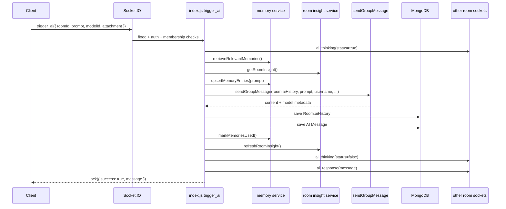

# 05. Socket AI Overview

## Purpose

This document explains the room-AI socket architecture as implemented in the live source tree.

## Relevant Files

- `index.js`
- `middleware/socketAuth.js`
- `services/gemini.js`
- `services/memory.js`
- `services/conversationInsights.js`
- `models/Room.js`
- `models/Message.js`

## Why Socket AI Is Different

Room AI is not just chat over WebSocket. It layers AI generation on top of:

- JWT-authenticated sockets
- room-membership checks
- per-socket flood control
- per-user in-memory AI quota
- room broadcast events
- dual persistence in `Message` and `Room.aiHistory`

## Event Lifecycle

## AI-Relevant Socket Events

| Event | Direction | Purpose |
| --- | --- | --- |
| `authenticate` | client -> server | optional ack of connected user |
| `join_room` | client -> server | join socket room |
| `send_message` | client -> server | normal room message, non-AI |
| `reply_message` | client -> server | reply message, non-AI |
| `trigger_ai` | client -> server | start room AI generation |
| `ai_thinking` | server -> room | broadcast AI pending state |
| `ai_response` | server -> room | broadcast persisted AI message |
| `error_message` | server -> socket | socket error payload used by AI failures too |

## Membership Model

Room AI depends on two separate checks:

1. the user must be a room member in MongoDB
2. the socket must already be inside that room according to the in-memory `roomUsers` map

That second check means a valid user can still be blocked from room AI if the socket has not joined the room first.

## Persistence Model

Room AI writes to two places:

| Store | Why |
| --- | --- |
| `Room.aiHistory` | compact model-facing conversation state for later prompts |
| `Message` collection | user-facing room transcript and exports |

## Failure Path

If `trigger_ai` throws:

- `ai_thinking(status=false)` is broadcast
- an error-flavored AI `Message` is still persisted with generic content
- `ai_response` is emitted with that message
- `error_message` is sent to the triggering socket

## `dist/` Drift Notes

The `dist/socket/index.js` implementation differs in multiple ways:

- it uses Prisma and UUIDs
- it emits `socket_error`, not `error_message`
- it broadcasts `ai_thinking` with `thinking: true/false`, not `status: true/false`
- it emits `message_created` after AI, not `ai_response`

## Rebuild Notes

If rebuilding:

1. isolate room-AI orchestration from the socket adapter
2. use an async queue for provider work
3. store one canonical room-AI history representation and derive the other view

