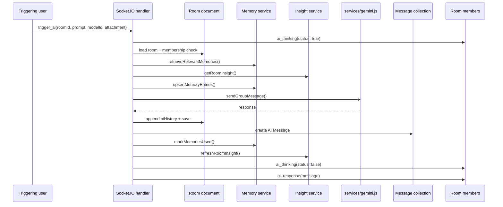

# 05. Socket AI Overview

## Purpose
This document explains how room AI works over Socket.IO, which events matter, and how state, storage, and broadcasts interact.

## Main Event
The AI room interaction is centered on:

- `trigger_ai`

The response side uses:

- `ai_thinking`
- `ai_response`
- `error_message`

## High-Level Event Flow

## Where Data Is Stored
The room AI flow writes to three separate persistence layers:

1. `Room.aiHistory`
2. `Message`
3. `ConversationInsight` for room scope

It may also update:

4. `MemoryEntry`

## Risks
- no transaction across room save and message save
- quota and room state are instance-local
- synchronous provider latency blocks the socket handler
- insight refresh happens inline, increasing end-to-end latency

## Rebuild Guidance
If rebuilding, keep the event model but consider:

- dedicated socket controller module
- shared orchestration service with REST chat
- queue-backed long-running AI work
- Redis-backed room presence, flood control, and quota

