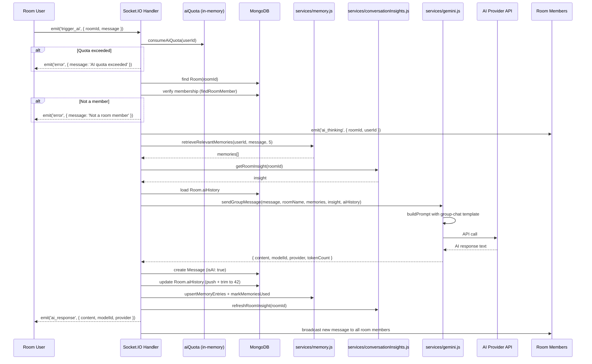

# 05. Socket AI Overview

## Purpose

This document explains how the room AI feature works over Socket.IO, which events are involved, how state and storage interact, and how broadcasts reach room members. The Socket.IO layer is the real-time backbone for multi-user AI interactions, and understanding it is essential for debugging room AI behavior, adding new socket events, or scaling the real-time layer.

Unlike the REST API which is request-response, Socket.IO provides bidirectional, event-driven communication. The AI room feature leverages this to show thinking states, stream responses to all room members, and maintain presence awareness.

---

## Socket.IO Server Setup

**File:** `index.js` (lines ~181-250)

```javascript
const { Server } = require('socket.io');

const io = new Server(httpServer, {
  cors: {
    origin: process.env.CLIENT_URL || 'http://localhost:5173',
    credentials: true
  }
});

io.use(socketAuthMiddleware);
```

The Socket.IO server is attached to the same HTTP server as Express, sharing the port. CORS configuration mirrors the Express CORS settings.

### Socket Authentication Middleware

**File:** `middleware/socketAuth.js` (19 lines)

```javascript
const jwt = require('jsonwebtoken');

module.exports = (socket, next) => {
  try {
    const token = socket.handshake.auth.token;
    if (!token) return next(new Error('Authentication required'));

    const decoded = jwt.verify(token, process.env.JWT_SECRET);
    socket.user = {
      id: decoded.id,
      username: decoded.username,
      email: decoded.email
    };
    next();
  } catch (err) {
    next(new Error('Authentication failed'));
  }
};
```

**Key behavior:**
- Token is extracted from `socket.handshake.auth.token` (not from headers)
- JWT is verified against `JWT_SECRET`
- Decoded payload is attached as `socket.user` with `id`, `username`, `email`
- Failed authentication rejects the socket connection entirely (not per-event)

---

## In-Memory State Maps

Four maps maintain process-local state in `index.js`:

### roomUsers

```javascript
const roomUsers = new Map(); // Map<roomId, Map<socketId, user>>
```

**Purpose:** Tracks which socket connections are present in which rooms.

**Structure:**
```
roomUsers = {
  "room-abc": {
    "socket-1": { id: "user-1", username: "alice" },
    "socket-2": { id: "user-2", username: "bob" }
  },
  "room-def": {
    "socket-3": { id: "user-3", username: "charlie" }
  }
}
```

**Operations:**
- `join_room`: Adds socketId → user mapping to the roomId's inner Map, emits `room_users` to all room members
- `leave_room`: Removes socketId from the roomId's inner Map, emits `room_users` to remaining members
- `disconnect`: Removes socketId from all room Maps, emits `room_users` to affected rooms

### globalOnlineUsers

```javascript
const globalOnlineUsers = new Map(); // Map<userId, userInfo>
```

**Purpose:** Tracks all online users across all rooms.

**Operations:**
- `authenticate`: Adds userId → userInfo, broadcasts `user_online`
- `disconnect`: Removes userId, broadcasts `user_offline`

### typingUsers

```javascript
const typingUsers = new Map(); // Map<roomId, Set<userId>>
```

**Purpose:** Tracks which users are currently typing in which rooms.

**Operations:**
- `typing_start`: Adds userId to the roomId's Set, broadcasts `user_typing` to room
- `typing_stop`: Removes userId from the roomId's Set, broadcasts `user_stopped_typing` to room

### socketFlood

```javascript
const socketFlood = new Map(); // Map<socketId, { count, resetAt }>
```

**Purpose:** Prevents socket event flooding.

**Constants:**
- `FLOOD_MAX = 30` — Maximum events per window
- `FLOOD_WINDOW = 10000` — 10-second window

**Logic:**
```javascript
const now = Date.now();
const flood = socketFlood.get(socketId) || { count: 0, resetAt: now + FLOOD_WINDOW };
if (now > flood.resetAt) {
  socketFlood.set(socketId, { count: 1, resetAt: now + FLOOD_WINDOW });
} else if (flood.count >= FLOOD_MAX) {
  return; // Drop event
} else {
  flood.count++;
}
```

**Risk:** The `socketFlood` Map has no cleanup mechanism. Entries for disconnected sockets are never removed, causing a memory leak over time.

---

## Socket Event Inventory

All 14 socket event handlers are registered in `index.js`:

| Event | Direction | Purpose | AI-Relevant |
|-------|-----------|---------|-------------|
| `authenticate` | Client → Server | Register user as online | Indirect |
| `join_room` | Client → Server | Join a room channel | Indirect |
| `leave_room` | Client → Server | Leave a room channel | Indirect |
| `typing_start` | Client → Server | Signal user started typing | Indirect |
| `typing_stop` | Client → Server | Signal user stopped typing | Indirect |
| `mark_read` | Client → Server | Mark messages as read | No |
| `send_message` | Client → Server | Send a message to a room | Indirect |
| `reply_message` | Client → Server | Reply to a specific message | No |
| `add_reaction` | Client → Server | Add emoji reaction to message | No |
| `trigger_ai` | Client → Server | Trigger AI response in room | **Yes** |
| `edit_message` | Client → Server | Edit an existing message | No |
| `delete_message` | Client → Server | Delete a message | No |
| `pin_message` | Client → Server | Pin a message in room | No |
| `unpin_message` | Client → Server | Unpin a message | No |
| `disconnect` | Server (auto) | Socket disconnected | Indirect |

---

## AI-Related Socket Events

### trigger_ai (Client → Server)

**Location:** `index.js` (lines ~851-1050)

**Purpose:** The primary AI entry point over sockets. A user in a room triggers the AI to respond to a message or question.

**Payload:**

```javascript
socket.emit('trigger_ai', {
  roomId: 'room-abc',
  message: '@Gemini what did we decide about the API design?',
  modelId: 'auto' // optional
});
```

| Field | Type | Required | Description |
|-------|------|----------|-------------|
| `roomId` | string | Yes | The room to trigger AI in |
| `message` | string | Yes | The prompt/message to the AI |
| `modelId` | string | No | Explicit model ID or `'auto'` |

**Handler Flow:**



**Key Implementation Details:**

1. **Quota check first:** The in-memory AI quota is checked before any database reads. If exceeded, the request is rejected immediately.

2. **Membership validation:** Uses `findRoomMember` from `helpers/validate.js` to verify the triggering user is a member of the room.

3. **AI thinking signal:** Emits `ai_thinking` to all room members to show a loading indicator.

4. **Memory retrieval:** Retrieves up to 5 relevant memories for the triggering user.

5. **Room insight:** Loads or generates the room's current insight (summary, topics, decisions, action items).

6. **AI history:** Uses the room's `aiHistory` array (trimmed to 42 entries) as conversation context.

7. **Group message generation:** Calls `sendGroupMessage` with the group-chat prompt template, room name interpolation, and all context.

8. **Message persistence:** Creates a `Message` document with:
   - `isAI: true`
   - `userId`: AI user ID (string)
   - `username`: `AI_USERNAME` (from `GEMINI_GROUP_BOT_NAME` env, default `'Gemini'`)
   - `triggeredBy`: ID of the user who triggered the AI
   - `modelId`: The model that generated the response
   - `provider`: The provider that served the request
   - `memoryRefs`: IDs of memories used in the response

9. **Room AI history update:** Pushes the exchange to `Room.aiHistory` and trims to 42 entries.

10. **Memory upsert:** Extracts new memories from the exchange and upserts them.

11. **Insight refresh:** Regenerates the room insight based on the latest 40 messages.

12. **Response emission:** Emits `ai_response` to the triggering user and broadcasts the message to all room members.

### ai_response (Server → Client)

**Purpose:** Delivers the AI's response to the triggering user.

**Payload:**

```javascript
socket.on('ai_response', (data) => {
  console.log(data.content);     // AI response text
  console.log(data.modelId);     // Model used (e.g., 'google/gemini-2.5-flash')
  console.log(data.provider);    // Provider used (e.g., 'openrouter')
  console.log(data.memoryRefs);  // Memory IDs referenced
});
```

| Field | Type | Description |
|-------|------|-------------|
| `content` | string | The AI's response text |
| `modelId` | string | The model that generated the response |
| `provider` | string | The provider that served the request |
| `memoryRefs` | string[] | IDs of memories referenced in the response |

### ai_thinking (Server → Room)

**Purpose:** Signals to all room members that the AI is processing a request.

**Payload:**

```javascript
socket.on('ai_thinking', (data) => {
  console.log(data.roomId);  // Room where AI is thinking
  console.log(data.userId);  // User who triggered the AI
});
```

### error (Server → Client)

**Purpose:** Reports errors during AI processing.

**Payload:**

```javascript
socket.on('error', (data) => {
  console.log(data.message);    // Error description
  console.log(data.retryAfterMs); // Retry delay (for quota errors)
});
```

| Error Type | Message | Additional Fields |
|------------|---------|------------------|
| Quota exceeded | `'AI quota exceeded'` | `retryAfterMs` |
| Not a member | `'Not a room member'` | None |
| Provider failure | `'AI service unavailable'` | None |
| Validation error | `'Message is required'` | None |

---

## Supporting Socket Events

### send_message

**Purpose:** Sends a user message to a room. Not directly AI-related, but messages sent through this handler become part of the room context that the AI reads.

**Flow:**
1. Flood control check (FLOOD_MAX=30, FLOOD_WINDOW=10000ms)
2. Validate message content
3. Create Message document in MongoDB
4. Broadcast to all room members via `room_message` event
5. Update room's last activity timestamp

### join_room

**Purpose:** Adds a socket to a room channel and updates presence tracking.

**Flow:**
1. Validate room exists
2. Add socket to Socket.IO room (`socket.join(roomId)`)
3. Update `roomUsers` Map
4. Emit `room_users` list to all room members
5. Broadcast `user_joined` to room

### leave_room

**Purpose:** Removes a socket from a room channel.

**Flow:**
1. Remove socket from Socket.IO room (`socket.leave(roomId)`)
2. Update `roomUsers` Map
3. Emit updated `room_users` list
4. Broadcast `user_left` to room

### disconnect

**Purpose:** Handles socket disconnection.

**Flow:**
1. Remove socket from all rooms
2. Remove from `roomUsers` Map
3. Remove from `globalOnlineUsers` Map
4. Remove from `typingUsers` Map
5. Broadcast `user_offline` and updated `room_users` lists

---

## Constants and Configuration

**File:** `index.js`

| Constant | Value | Source | Description |
|----------|-------|--------|-------------|
| `AI_USERNAME` | `process.env.GEMINI_GROUP_BOT_NAME \|\| 'Gemini'` | Line ~860 | Display name for AI bot messages |
| `EDIT_WINDOW_MS` | `(process.env.MESSAGE_EDIT_WINDOW_MINUTES \|\| 15) * 60 * 1000` | Line ~855 | Time window for message editing |
| `FLOOD_MAX` | `30` | Line ~280 | Max socket events per window |
| `FLOOD_WINDOW` | `10000` | Line ~280 | Flood control window in ms |
| `ALLOWED_REACTIONS` | `['👍', '🔥', '🤯', '💡']` | Line ~275 | Allowed emoji reactions |

---

## AI Username Configuration

The AI bot's display name in room messages is configurable:

```javascript
const AI_USERNAME = process.env.GEMINI_GROUP_BOT_NAME || 'Gemini';
```

**Environment Variable:** `GEMINI_GROUP_BOT_NAME`

**Default:** `'Gemini'`

**Usage:** When the AI sends a message to a room, the `username` field of the Message document is set to this value. This is how the frontend identifies AI messages vs. human messages.

**Note:** Despite the env variable name referencing "GEMINI", this name is used regardless of which provider actually generates the response. The actual provider is stored in the `provider` field of the Message document.

---

## Room AI History Management

**Model:** `Room.aiHistory[]`

The room maintains an `aiHistory` array that stores recent AI interactions. This provides conversation context for subsequent AI triggers.

**Management:**
- Each AI interaction appends the exchange to `aiHistory`
- The array is trimmed to 42 entries after each append
- The 42-entry limit is hard-coded (not configurable via env)

```javascript
// Conceptual implementation in trigger_ai handler
room.aiHistory.push({
  user: socket.user.username,
  message: triggerMessage,
  ai: responseContent,
  timestamp: new Date()
});

// Trim to 42 entries
if (room.aiHistory.length > 42) {
  room.aiHistory = room.aiHistory.slice(-42);
}

await room.save();
```

**Purpose:** Provides context for the AI to understand recent interactions in the room without loading the entire message history.

**Limitation:** The 42-entry limit means the AI only has context for the most recent interactions. Older context is lost.

---

## Database Operations in trigger_ai

The `trigger_ai` handler performs the following database operations:

| Operation | Model | Timing | Blocking |
|-----------|-------|--------|----------|
| Find Room | Room | Before AI call | Yes |
| Verify membership | Room (members[]) | Before AI call | Yes |
| Retrieve memories | MemoryEntry | Before AI call | Yes |
| Get room insight | ConversationInsight | Before AI call | Yes |
| Load AI history | Room (aiHistory) | Before AI call | Yes |
| Create Message | Message | After AI response | Yes |
| Update Room.aiHistory | Room | After AI response | Yes |
| Upsert memories | MemoryEntry | After AI response | Yes |
| Mark memories used | MemoryEntry | After AI response | Yes |
| Refresh room insight | ConversationInsight | After AI response | No (async) |

**Total blocking DB operations:** 8 (before and after AI call)
**Total non-blocking DB operations:** 1 (insight refresh)

---

## Request/Response Examples

### Triggering AI

```javascript
// Client code
socket.emit('trigger_ai', {
  roomId: 'room-project-alpha',
  message: '@Gemini can you summarize what we discussed about the database schema?'
});
```

### AI Thinking Signal

```javascript
// All room members receive this
socket.on('ai_thinking', (data) => {
  showTypingIndicator(data.userId); // Show "AI is thinking..."
});
```

### AI Response

```javascript
// Triggering user receives this
socket.on('ai_response', (data) => {
  hideTypingIndicator();
  displayMessage({
    content: data.content,
    username: 'Gemini',
    isAI: true,
    modelId: data.modelId,
    provider: data.provider
  });
});
```

### Error Handling

```javascript
socket.on('error', (data) => {
  if (data.message === 'AI quota exceeded') {
    showQuotaWarning(data.retryAfterMs);
  } else {
    showError(data.message);
  }
});
```

---

## Failure Cases and Recovery

| Failure Scenario | Detection Point | Recovery Behavior | User Impact |
|-----------------|----------------|------------------|-------------|
| Quota exceeded | Before any DB reads | Immediate error emission | Request rejected, no cost |
| User not room member | After room lookup | Error emission | Request rejected |
| Room not found | Initial DB query | Error emission | Request rejected |
| Memory retrieval fails | Before AI call | Continue without memories | Less personalized response |
| Insight retrieval fails | Before AI call | Continue without insight | Less contextual response |
| Provider timeout | During API call | Fallback chain (up to 6 attempts) | Increased latency |
| All providers fail | After fallback chain | Error emission | No AI response |
| Message creation fails | After AI response | Error emission, AI response lost | Response not persisted |
| Memory upsert fails | After AI response | Silent failure, response still emitted | Memory not stored |
| Insight refresh fails | After AI response | Error caught, non-blocking | Stale insight |
| Socket disconnect during AI | Any point | AI computation continues, response lost | Response not delivered |
| Flood control triggers | Before event processing | Event silently dropped | User action ignored |

---

## Scaling and Operational Implications

### Single-Instance Limitations

The entire Socket.IO layer is designed for single-instance deployment:

| State | Type | Scaling Issue |
|-------|------|--------------|
| `roomUsers` | In-memory Map | Room presence not shared across instances |
| `globalOnlineUsers` | In-memory Map | Online status not shared |
| `typingUsers` | In-memory Map | Typing indicators not shared |
| `socketFlood` | In-memory Map | Flood control not shared |
| Socket connections | Process-local | Users connected to one instance only |

### Multi-Instance Requirements

To scale Socket.IO horizontally:

1. **Redis adapter:** Use `@socket.io/redis-adapter` to share state across instances
2. **External presence store:** Move `roomUsers`, `globalOnlineUsers` to Redis
3. **External flood control:** Move `socketFlood` to Redis with TTL
4. **Sticky sessions or pub/sub:** Ensure events reach the correct instance
5. **Shared quota:** Move AI quota to Redis for cross-instance enforcement

### Connection Considerations

| Concern | Detail |
|---------|--------|
| Max connections | Node.js can handle ~10K-50K concurrent WebSocket connections per instance |
| Memory per connection | Each socket consumes ~10-50KB of memory |
| Room broadcasts | Broadcasting to large rooms (100+ members) can cause CPU spikes |
| Reconnection | Socket.IO auto-reconnects; ensure `trigger_ai` handlers are idempotent |
| Heartbeat | Socket.IO ping/pong every 25 seconds by default; tune for your network |

### Database Load

Each `trigger_ai` event performs 8+ blocking DB operations. Under high room AI usage:

| Scenario | Concurrent trigger_ai | DB Operations/sec |
|----------|----------------------|-------------------|
| 1 trigger/sec | 1 | 8+ |
| 5 triggers/sec | 5 | 40+ |
| 10 triggers/sec | 10 | 80+ |

With a connection pool of 10, concurrent operations will queue. Monitor pool utilization and consider increasing `maxPoolSize`.

---

## Inconsistencies and Risks

| Issue | Severity | Description |
|-------|----------|-------------|
| Room AI in index.js | High | Business logic mixed with infrastructure code; hard to test and maintain |
| Flood control memory leak | Medium | `socketFlood` entries for disconnected sockets are never cleaned up |
| No distributed state | High | All socket state is process-local; breaks in multi-instance deployments |
| Hard-coded aiHistory limit | Low | 42-entry limit is not configurable; may be too small or too large |
| No response deduplication | Medium | If user triggers AI twice quickly, both requests are processed independently |
| AI_USERNAME env naming | Low | Variable named `GEMINI_GROUP_BOT_NAME` but used for all providers |
| No graceful shutdown | Medium | No handler to close sockets cleanly on SIGTERM/SIGINT |
| Error handling inconsistency | Medium | Some errors emit `error` events, others are silently caught |
| No message ordering guarantee | Low | Socket.IO does not guarantee message ordering across events |

---

## How to Rebuild from Scratch

To recreate the Socket.IO AI layer:

### 1. Set up Socket.IO Server

```javascript
const { Server } = require('socket.io');

const io = new Server(httpServer, {
  cors: { origin: process.env.CLIENT_URL, credentials: true }
});

io.use(socketAuthMiddleware);
```

### 2. Initialize State Maps

```javascript
const roomUsers = new Map();
const globalOnlineUsers = new Map();
const typingUsers = new Map();
const socketFlood = new Map();
```

### 3. Register Event Handlers

```javascript
io.on('connection', (socket) => {
  socket.on('authenticate', handleAuthenticate);
  socket.on('join_room', handleJoinRoom);
  socket.on('leave_room', handleLeaveRoom);
  socket.on('typing_start', handleTypingStart);
  socket.on('typing_stop', handleTypingStop);
  socket.on('send_message', handleSendMessage);
  socket.on('trigger_ai', handleTriggerAi);
  socket.on('disconnect', handleDisconnect);
  // ... other handlers
});
```

### 4. Implement trigger_ai Handler

```javascript
socket.on('trigger_ai', async ({ roomId, message, modelId }) => {
  // 1. Check quota
  const { allowed, retryAfterMs } = consumeAiQuota(socket.user.id);
  if (!allowed) return socket.emit('error', { message: 'AI quota exceeded', retryAfterMs });

  // 2. Validate membership
  const room = await Room.findById(roomId);
  if (!room || !findRoomMember(room, socket.user.id)) {
    return socket.emit('error', { message: 'Not a room member' });
  }

  // 3. Signal thinking
  io.to(roomId).emit('ai_thinking', { roomId, userId: socket.user.id });

  // 4. Gather context
  const memories = await retrieveRelevantMemories(socket.user.id, message, 5);
  const insight = await getRoomInsight(roomId);

  // 5. Call AI
  const { content, modelId: usedModel, provider } = await sendGroupMessage(
    message, room.name, memories, insight, room.aiHistory
  );

  // 6. Persist
  const msg = await Message.create({
    roomId, userId: 'ai', username: AI_USERNAME, content,
    isAI: true, triggeredBy: socket.user.id, modelId: usedModel, provider
  });

  // 7. Update room history
  room.aiHistory.push({ user: socket.user.username, message, ai: content });
  if (room.aiHistory.length > 42) room.aiHistory = room.aiHistory.slice(-42);
  await room.save();

  // 8. Update memories
  await Promise.all([
    upsertMemoryEntries(candidates),
    markMemoriesUsed(memoryIds)
  ]);

  // 9. Refresh insight (async)
  refreshRoomInsight(roomId).catch(err => logError('insight_refresh_failed', err));

  // 10. Emit response
  socket.emit('ai_response', { content, modelId: usedModel, provider });
  io.to(roomId).emit('room_message', formatMessage(msg));
});
```

### 5. Add Operational Concerns

- Flood control with cleanup interval
- Graceful shutdown handler
- Structured event logging
- Error boundary for each handler
- Presence cleanup on disconnect
