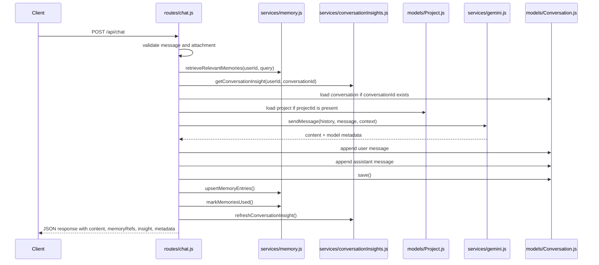

# 06. Solo Chat Flow

## Purpose
This document explains the end-to-end solo AI chat flow implemented in `routes/chat.js`.

## Relevant Files
- `routes/chat.js`
- `services/gemini.js`
- `services/memory.js`
- `services/conversationInsights.js`
- `services/messageFormatting.js`
- `models/Conversation.js`
- `models/Project.js`

## End-to-End Flow


## Request Validation
The route rejects:

- missing or blank `message`
- invalid attachment payload
- nonexistent project
- mismatched `projectId` vs existing conversation project

## Prompt Context Composition
The call to `sendMessage` can include:

- provided `history`
- retrieved `memoryEntries`
- existing conversation `insight`
- `attachment`
- `project`

This means the route enriches the prompt before the provider call instead of sending only the immediate message.

## Conversation Storage Shape
Each successful request stores two records inside `Conversation.messages`:

1. a `role: 'user'` message
2. a `role: 'assistant'` message

The assistant entry includes:

- `memoryRefs`
- `modelId`
- `provider`
- `requestedModelId`
- `processingMs`
- token counts
- `autoMode`
- `autoComplexity`
- `fallbackUsed`

## Example Assistant Message Record
```json
{
  "role": "assistant",
  "content": "Here is the summary...",
  "timestamp": "2026-03-31T10:00:00.000Z",
  "memoryRefs": [{"id": "123", "summary": "The user likes chess.", "score": 0.72}],
  "modelId": "gemini-2.5-flash",
  "provider": "gemini",
  "requestedModelId": "auto",
  "processingMs": 362,
  "promptTokens": 90,
  "completionTokens": 48,
  "totalTokens": 138,
  "autoMode": true,
  "autoComplexity": "medium",
  "fallbackUsed": false
}
```

## Database Writes
`POST /api/chat` performs these writes:

- `Conversation.save()`
- `upsertMemoryEntries(...)`
- `markMemoriesUsed(...)`
- `refreshConversationInsight(...)` which becomes `findOneAndUpdate(..., { upsert: true })`

## Failure Cases
| Failure | Behavior |
|---|---|
| invalid attachment | `400` |
| missing message | `400` |
| project not found | `404` |
| provider rate-limited | `429` with retry hint when available |
| provider unavailable or model invalid | `503` |
| other error | `500` |
| insight refresh failure after chat success | chat succeeds, warning is logged, `insight` may be null |

## Key Snippet Explained
The route uses post-success side effects instead of pre-committing everything:

```js
await conversation.save();
await Promise.all([
  upsertMemoryEntries(...),
  markMemoriesUsed(memoryEntries),
]);
```

This improves latency slightly compared with serial writes, but it also means:

- memory updates are not transactional with conversation save
- conversation can succeed even if insight refresh fails
- there is no compensation path if one write succeeds and another fails

## Improvement Opportunities
- add transaction or outbox-style post-processing for durability
- separate orchestration from route handling
- add request schema validation library
- persist more explicit audit data for failed AI attempts

## Rebuild Guidance
To rebuild this feature:

1. validate request and attachment
2. load existing conversation and optional project
3. retrieve memory and insight context
4. assemble prompt
5. execute model call with routing and fallback
6. persist both turns and metadata
7. refresh derivative artifacts such as insights and memory usage


## Expanded Learning Appendix

This appendix expands the topic covered in 06-solo-chat-flow without removing or replacing the earlier material. It is intentionally additive and is meant to help a reader study the implementation from several angles: control flow, data flow, storage, risk, scale, and redesign.

### Extended Study Notes
- Study note 1 for 06-solo-chat-flow: revisit the exact control path related to this topic and identify which route, middleware, model, or service acts as the real decision point rather than the most visible file.
- Study note 2 for 06-solo-chat-flow: revisit the exact control path related to this topic and identify which route, middleware, model, or service acts as the real decision point rather than the most visible file.
- Study note 3 for 06-solo-chat-flow: revisit the exact control path related to this topic and identify which route, middleware, model, or service acts as the real decision point rather than the most visible file.
- Study note 4 for 06-solo-chat-flow: revisit the exact control path related to this topic and identify which route, middleware, model, or service acts as the real decision point rather than the most visible file.
- Study note 5 for 06-solo-chat-flow: revisit the exact control path related to this topic and identify which route, middleware, model, or service acts as the real decision point rather than the most visible file.
- Study note 6 for 06-solo-chat-flow: revisit the exact control path related to this topic and identify which route, middleware, model, or service acts as the real decision point rather than the most visible file.
- Study note 7 for 06-solo-chat-flow: revisit the exact control path related to this topic and identify which route, middleware, model, or service acts as the real decision point rather than the most visible file.
- Study note 8 for 06-solo-chat-flow: revisit the exact control path related to this topic and identify which route, middleware, model, or service acts as the real decision point rather than the most visible file.
- Study note 9 for 06-solo-chat-flow: revisit the exact control path related to this topic and identify which route, middleware, model, or service acts as the real decision point rather than the most visible file.
- Study note 10 for 06-solo-chat-flow: revisit the exact control path related to this topic and identify which route, middleware, model, or service acts as the real decision point rather than the most visible file.
- Study note 11 for 06-solo-chat-flow: revisit the exact control path related to this topic and identify which route, middleware, model, or service acts as the real decision point rather than the most visible file.
- Study note 12 for 06-solo-chat-flow: revisit the exact control path related to this topic and identify which route, middleware, model, or service acts as the real decision point rather than the most visible file.
- Study note 13 for 06-solo-chat-flow: revisit the exact control path related to this topic and identify which route, middleware, model, or service acts as the real decision point rather than the most visible file.
- Study note 14 for 06-solo-chat-flow: revisit the exact control path related to this topic and identify which route, middleware, model, or service acts as the real decision point rather than the most visible file.
- Study note 15 for 06-solo-chat-flow: revisit the exact control path related to this topic and identify which route, middleware, model, or service acts as the real decision point rather than the most visible file.
- Study note 16 for 06-solo-chat-flow: revisit the exact control path related to this topic and identify which route, middleware, model, or service acts as the real decision point rather than the most visible file.
- Study note 17 for 06-solo-chat-flow: revisit the exact control path related to this topic and identify which route, middleware, model, or service acts as the real decision point rather than the most visible file.
- Study note 18 for 06-solo-chat-flow: revisit the exact control path related to this topic and identify which route, middleware, model, or service acts as the real decision point rather than the most visible file.
- Study note 19 for 06-solo-chat-flow: revisit the exact control path related to this topic and identify which route, middleware, model, or service acts as the real decision point rather than the most visible file.
- Study note 20 for 06-solo-chat-flow: revisit the exact control path related to this topic and identify which route, middleware, model, or service acts as the real decision point rather than the most visible file.
- Study note 21 for 06-solo-chat-flow: revisit the exact control path related to this topic and identify which route, middleware, model, or service acts as the real decision point rather than the most visible file.
- Study note 22 for 06-solo-chat-flow: revisit the exact control path related to this topic and identify which route, middleware, model, or service acts as the real decision point rather than the most visible file.
- Study note 23 for 06-solo-chat-flow: revisit the exact control path related to this topic and identify which route, middleware, model, or service acts as the real decision point rather than the most visible file.
- Study note 24 for 06-solo-chat-flow: revisit the exact control path related to this topic and identify which route, middleware, model, or service acts as the real decision point rather than the most visible file.
- Study note 25 for 06-solo-chat-flow: revisit the exact control path related to this topic and identify which route, middleware, model, or service acts as the real decision point rather than the most visible file.

### Detailed Trace Prompts
- Trace prompt 1 for 06-solo-chat-flow: walk one realistic request through the backend and write down the precise sequence of reads, transformations, provider calls, and writes that happen before the client sees a result.
- Trace prompt 2 for 06-solo-chat-flow: walk one realistic request through the backend and write down the precise sequence of reads, transformations, provider calls, and writes that happen before the client sees a result.
- Trace prompt 3 for 06-solo-chat-flow: walk one realistic request through the backend and write down the precise sequence of reads, transformations, provider calls, and writes that happen before the client sees a result.
- Trace prompt 4 for 06-solo-chat-flow: walk one realistic request through the backend and write down the precise sequence of reads, transformations, provider calls, and writes that happen before the client sees a result.
- Trace prompt 5 for 06-solo-chat-flow: walk one realistic request through the backend and write down the precise sequence of reads, transformations, provider calls, and writes that happen before the client sees a result.
- Trace prompt 6 for 06-solo-chat-flow: walk one realistic request through the backend and write down the precise sequence of reads, transformations, provider calls, and writes that happen before the client sees a result.
- Trace prompt 7 for 06-solo-chat-flow: walk one realistic request through the backend and write down the precise sequence of reads, transformations, provider calls, and writes that happen before the client sees a result.
- Trace prompt 8 for 06-solo-chat-flow: walk one realistic request through the backend and write down the precise sequence of reads, transformations, provider calls, and writes that happen before the client sees a result.
- Trace prompt 9 for 06-solo-chat-flow: walk one realistic request through the backend and write down the precise sequence of reads, transformations, provider calls, and writes that happen before the client sees a result.
- Trace prompt 10 for 06-solo-chat-flow: walk one realistic request through the backend and write down the precise sequence of reads, transformations, provider calls, and writes that happen before the client sees a result.
- Trace prompt 11 for 06-solo-chat-flow: walk one realistic request through the backend and write down the precise sequence of reads, transformations, provider calls, and writes that happen before the client sees a result.
- Trace prompt 12 for 06-solo-chat-flow: walk one realistic request through the backend and write down the precise sequence of reads, transformations, provider calls, and writes that happen before the client sees a result.
- Trace prompt 13 for 06-solo-chat-flow: walk one realistic request through the backend and write down the precise sequence of reads, transformations, provider calls, and writes that happen before the client sees a result.
- Trace prompt 14 for 06-solo-chat-flow: walk one realistic request through the backend and write down the precise sequence of reads, transformations, provider calls, and writes that happen before the client sees a result.
- Trace prompt 15 for 06-solo-chat-flow: walk one realistic request through the backend and write down the precise sequence of reads, transformations, provider calls, and writes that happen before the client sees a result.
- Trace prompt 16 for 06-solo-chat-flow: walk one realistic request through the backend and write down the precise sequence of reads, transformations, provider calls, and writes that happen before the client sees a result.
- Trace prompt 17 for 06-solo-chat-flow: walk one realistic request through the backend and write down the precise sequence of reads, transformations, provider calls, and writes that happen before the client sees a result.
- Trace prompt 18 for 06-solo-chat-flow: walk one realistic request through the backend and write down the precise sequence of reads, transformations, provider calls, and writes that happen before the client sees a result.
- Trace prompt 19 for 06-solo-chat-flow: walk one realistic request through the backend and write down the precise sequence of reads, transformations, provider calls, and writes that happen before the client sees a result.
- Trace prompt 20 for 06-solo-chat-flow: walk one realistic request through the backend and write down the precise sequence of reads, transformations, provider calls, and writes that happen before the client sees a result.
- Trace prompt 21 for 06-solo-chat-flow: walk one realistic request through the backend and write down the precise sequence of reads, transformations, provider calls, and writes that happen before the client sees a result.
- Trace prompt 22 for 06-solo-chat-flow: walk one realistic request through the backend and write down the precise sequence of reads, transformations, provider calls, and writes that happen before the client sees a result.
- Trace prompt 23 for 06-solo-chat-flow: walk one realistic request through the backend and write down the precise sequence of reads, transformations, provider calls, and writes that happen before the client sees a result.
- Trace prompt 24 for 06-solo-chat-flow: walk one realistic request through the backend and write down the precise sequence of reads, transformations, provider calls, and writes that happen before the client sees a result.
- Trace prompt 25 for 06-solo-chat-flow: walk one realistic request through the backend and write down the precise sequence of reads, transformations, provider calls, and writes that happen before the client sees a result.

### Data And State Questions
- Data question 1 for 06-solo-chat-flow: identify what state is durable, what state is request-scoped, and what state is process-local in C:\Users\RAVIPRAKASH\Downloads\backend\docs\ai\06-solo-chat-flow.md, then explain what could become inconsistent under concurrency or restart conditions.
- Data question 2 for 06-solo-chat-flow: identify what state is durable, what state is request-scoped, and what state is process-local in C:\Users\RAVIPRAKASH\Downloads\backend\docs\ai\06-solo-chat-flow.md, then explain what could become inconsistent under concurrency or restart conditions.
- Data question 3 for 06-solo-chat-flow: identify what state is durable, what state is request-scoped, and what state is process-local in C:\Users\RAVIPRAKASH\Downloads\backend\docs\ai\06-solo-chat-flow.md, then explain what could become inconsistent under concurrency or restart conditions.
- Data question 4 for 06-solo-chat-flow: identify what state is durable, what state is request-scoped, and what state is process-local in C:\Users\RAVIPRAKASH\Downloads\backend\docs\ai\06-solo-chat-flow.md, then explain what could become inconsistent under concurrency or restart conditions.
- Data question 5 for 06-solo-chat-flow: identify what state is durable, what state is request-scoped, and what state is process-local in C:\Users\RAVIPRAKASH\Downloads\backend\docs\ai\06-solo-chat-flow.md, then explain what could become inconsistent under concurrency or restart conditions.
- Data question 6 for 06-solo-chat-flow: identify what state is durable, what state is request-scoped, and what state is process-local in C:\Users\RAVIPRAKASH\Downloads\backend\docs\ai\06-solo-chat-flow.md, then explain what could become inconsistent under concurrency or restart conditions.
- Data question 7 for 06-solo-chat-flow: identify what state is durable, what state is request-scoped, and what state is process-local in C:\Users\RAVIPRAKASH\Downloads\backend\docs\ai\06-solo-chat-flow.md, then explain what could become inconsistent under concurrency or restart conditions.
- Data question 8 for 06-solo-chat-flow: identify what state is durable, what state is request-scoped, and what state is process-local in C:\Users\RAVIPRAKASH\Downloads\backend\docs\ai\06-solo-chat-flow.md, then explain what could become inconsistent under concurrency or restart conditions.
- Data question 9 for 06-solo-chat-flow: identify what state is durable, what state is request-scoped, and what state is process-local in C:\Users\RAVIPRAKASH\Downloads\backend\docs\ai\06-solo-chat-flow.md, then explain what could become inconsistent under concurrency or restart conditions.
- Data question 10 for 06-solo-chat-flow: identify what state is durable, what state is request-scoped, and what state is process-local in C:\Users\RAVIPRAKASH\Downloads\backend\docs\ai\06-solo-chat-flow.md, then explain what could become inconsistent under concurrency or restart conditions.
- Data question 11 for 06-solo-chat-flow: identify what state is durable, what state is request-scoped, and what state is process-local in C:\Users\RAVIPRAKASH\Downloads\backend\docs\ai\06-solo-chat-flow.md, then explain what could become inconsistent under concurrency or restart conditions.
- Data question 12 for 06-solo-chat-flow: identify what state is durable, what state is request-scoped, and what state is process-local in C:\Users\RAVIPRAKASH\Downloads\backend\docs\ai\06-solo-chat-flow.md, then explain what could become inconsistent under concurrency or restart conditions.
- Data question 13 for 06-solo-chat-flow: identify what state is durable, what state is request-scoped, and what state is process-local in C:\Users\RAVIPRAKASH\Downloads\backend\docs\ai\06-solo-chat-flow.md, then explain what could become inconsistent under concurrency or restart conditions.
- Data question 14 for 06-solo-chat-flow: identify what state is durable, what state is request-scoped, and what state is process-local in C:\Users\RAVIPRAKASH\Downloads\backend\docs\ai\06-solo-chat-flow.md, then explain what could become inconsistent under concurrency or restart conditions.
- Data question 15 for 06-solo-chat-flow: identify what state is durable, what state is request-scoped, and what state is process-local in C:\Users\RAVIPRAKASH\Downloads\backend\docs\ai\06-solo-chat-flow.md, then explain what could become inconsistent under concurrency or restart conditions.
- Data question 16 for 06-solo-chat-flow: identify what state is durable, what state is request-scoped, and what state is process-local in C:\Users\RAVIPRAKASH\Downloads\backend\docs\ai\06-solo-chat-flow.md, then explain what could become inconsistent under concurrency or restart conditions.
- Data question 17 for 06-solo-chat-flow: identify what state is durable, what state is request-scoped, and what state is process-local in C:\Users\RAVIPRAKASH\Downloads\backend\docs\ai\06-solo-chat-flow.md, then explain what could become inconsistent under concurrency or restart conditions.
- Data question 18 for 06-solo-chat-flow: identify what state is durable, what state is request-scoped, and what state is process-local in C:\Users\RAVIPRAKASH\Downloads\backend\docs\ai\06-solo-chat-flow.md, then explain what could become inconsistent under concurrency or restart conditions.
- Data question 19 for 06-solo-chat-flow: identify what state is durable, what state is request-scoped, and what state is process-local in C:\Users\RAVIPRAKASH\Downloads\backend\docs\ai\06-solo-chat-flow.md, then explain what could become inconsistent under concurrency or restart conditions.
- Data question 20 for 06-solo-chat-flow: identify what state is durable, what state is request-scoped, and what state is process-local in C:\Users\RAVIPRAKASH\Downloads\backend\docs\ai\06-solo-chat-flow.md, then explain what could become inconsistent under concurrency or restart conditions.
- Data question 21 for 06-solo-chat-flow: identify what state is durable, what state is request-scoped, and what state is process-local in C:\Users\RAVIPRAKASH\Downloads\backend\docs\ai\06-solo-chat-flow.md, then explain what could become inconsistent under concurrency or restart conditions.
- Data question 22 for 06-solo-chat-flow: identify what state is durable, what state is request-scoped, and what state is process-local in C:\Users\RAVIPRAKASH\Downloads\backend\docs\ai\06-solo-chat-flow.md, then explain what could become inconsistent under concurrency or restart conditions.
- Data question 23 for 06-solo-chat-flow: identify what state is durable, what state is request-scoped, and what state is process-local in C:\Users\RAVIPRAKASH\Downloads\backend\docs\ai\06-solo-chat-flow.md, then explain what could become inconsistent under concurrency or restart conditions.
- Data question 24 for 06-solo-chat-flow: identify what state is durable, what state is request-scoped, and what state is process-local in C:\Users\RAVIPRAKASH\Downloads\backend\docs\ai\06-solo-chat-flow.md, then explain what could become inconsistent under concurrency or restart conditions.
- Data question 25 for 06-solo-chat-flow: identify what state is durable, what state is request-scoped, and what state is process-local in C:\Users\RAVIPRAKASH\Downloads\backend\docs\ai\06-solo-chat-flow.md, then explain what could become inconsistent under concurrency or restart conditions.

### Failure And Recovery Questions
- Failure question 1 for 06-solo-chat-flow: ask what happens if the dependent provider, database read, validation step, or post-processing step fails halfway through, and whether the current implementation leaves behind partial success or visible drift.
- Failure question 2 for 06-solo-chat-flow: ask what happens if the dependent provider, database read, validation step, or post-processing step fails halfway through, and whether the current implementation leaves behind partial success or visible drift.
- Failure question 3 for 06-solo-chat-flow: ask what happens if the dependent provider, database read, validation step, or post-processing step fails halfway through, and whether the current implementation leaves behind partial success or visible drift.
- Failure question 4 for 06-solo-chat-flow: ask what happens if the dependent provider, database read, validation step, or post-processing step fails halfway through, and whether the current implementation leaves behind partial success or visible drift.
- Failure question 5 for 06-solo-chat-flow: ask what happens if the dependent provider, database read, validation step, or post-processing step fails halfway through, and whether the current implementation leaves behind partial success or visible drift.
- Failure question 6 for 06-solo-chat-flow: ask what happens if the dependent provider, database read, validation step, or post-processing step fails halfway through, and whether the current implementation leaves behind partial success or visible drift.
- Failure question 7 for 06-solo-chat-flow: ask what happens if the dependent provider, database read, validation step, or post-processing step fails halfway through, and whether the current implementation leaves behind partial success or visible drift.
- Failure question 8 for 06-solo-chat-flow: ask what happens if the dependent provider, database read, validation step, or post-processing step fails halfway through, and whether the current implementation leaves behind partial success or visible drift.
- Failure question 9 for 06-solo-chat-flow: ask what happens if the dependent provider, database read, validation step, or post-processing step fails halfway through, and whether the current implementation leaves behind partial success or visible drift.
- Failure question 10 for 06-solo-chat-flow: ask what happens if the dependent provider, database read, validation step, or post-processing step fails halfway through, and whether the current implementation leaves behind partial success or visible drift.
- Failure question 11 for 06-solo-chat-flow: ask what happens if the dependent provider, database read, validation step, or post-processing step fails halfway through, and whether the current implementation leaves behind partial success or visible drift.
- Failure question 12 for 06-solo-chat-flow: ask what happens if the dependent provider, database read, validation step, or post-processing step fails halfway through, and whether the current implementation leaves behind partial success or visible drift.
- Failure question 13 for 06-solo-chat-flow: ask what happens if the dependent provider, database read, validation step, or post-processing step fails halfway through, and whether the current implementation leaves behind partial success or visible drift.
- Failure question 14 for 06-solo-chat-flow: ask what happens if the dependent provider, database read, validation step, or post-processing step fails halfway through, and whether the current implementation leaves behind partial success or visible drift.
- Failure question 15 for 06-solo-chat-flow: ask what happens if the dependent provider, database read, validation step, or post-processing step fails halfway through, and whether the current implementation leaves behind partial success or visible drift.
- Failure question 16 for 06-solo-chat-flow: ask what happens if the dependent provider, database read, validation step, or post-processing step fails halfway through, and whether the current implementation leaves behind partial success or visible drift.
- Failure question 17 for 06-solo-chat-flow: ask what happens if the dependent provider, database read, validation step, or post-processing step fails halfway through, and whether the current implementation leaves behind partial success or visible drift.
- Failure question 18 for 06-solo-chat-flow: ask what happens if the dependent provider, database read, validation step, or post-processing step fails halfway through, and whether the current implementation leaves behind partial success or visible drift.
- Failure question 19 for 06-solo-chat-flow: ask what happens if the dependent provider, database read, validation step, or post-processing step fails halfway through, and whether the current implementation leaves behind partial success or visible drift.
- Failure question 20 for 06-solo-chat-flow: ask what happens if the dependent provider, database read, validation step, or post-processing step fails halfway through, and whether the current implementation leaves behind partial success or visible drift.
- Failure question 21 for 06-solo-chat-flow: ask what happens if the dependent provider, database read, validation step, or post-processing step fails halfway through, and whether the current implementation leaves behind partial success or visible drift.
- Failure question 22 for 06-solo-chat-flow: ask what happens if the dependent provider, database read, validation step, or post-processing step fails halfway through, and whether the current implementation leaves behind partial success or visible drift.
- Failure question 23 for 06-solo-chat-flow: ask what happens if the dependent provider, database read, validation step, or post-processing step fails halfway through, and whether the current implementation leaves behind partial success or visible drift.
- Failure question 24 for 06-solo-chat-flow: ask what happens if the dependent provider, database read, validation step, or post-processing step fails halfway through, and whether the current implementation leaves behind partial success or visible drift.
- Failure question 25 for 06-solo-chat-flow: ask what happens if the dependent provider, database read, validation step, or post-processing step fails halfway through, and whether the current implementation leaves behind partial success or visible drift.

### Scaling And Operations Notes
- Operations note 1 for 06-solo-chat-flow: estimate how this part of the system behaves under higher load, with particular attention to synchronous waiting, MongoDB contention, in-memory state, and multi-instance deployment concerns.
- Operations note 2 for 06-solo-chat-flow: estimate how this part of the system behaves under higher load, with particular attention to synchronous waiting, MongoDB contention, in-memory state, and multi-instance deployment concerns.
- Operations note 3 for 06-solo-chat-flow: estimate how this part of the system behaves under higher load, with particular attention to synchronous waiting, MongoDB contention, in-memory state, and multi-instance deployment concerns.
- Operations note 4 for 06-solo-chat-flow: estimate how this part of the system behaves under higher load, with particular attention to synchronous waiting, MongoDB contention, in-memory state, and multi-instance deployment concerns.
- Operations note 5 for 06-solo-chat-flow: estimate how this part of the system behaves under higher load, with particular attention to synchronous waiting, MongoDB contention, in-memory state, and multi-instance deployment concerns.
- Operations note 6 for 06-solo-chat-flow: estimate how this part of the system behaves under higher load, with particular attention to synchronous waiting, MongoDB contention, in-memory state, and multi-instance deployment concerns.
- Operations note 7 for 06-solo-chat-flow: estimate how this part of the system behaves under higher load, with particular attention to synchronous waiting, MongoDB contention, in-memory state, and multi-instance deployment concerns.
- Operations note 8 for 06-solo-chat-flow: estimate how this part of the system behaves under higher load, with particular attention to synchronous waiting, MongoDB contention, in-memory state, and multi-instance deployment concerns.
- Operations note 9 for 06-solo-chat-flow: estimate how this part of the system behaves under higher load, with particular attention to synchronous waiting, MongoDB contention, in-memory state, and multi-instance deployment concerns.
- Operations note 10 for 06-solo-chat-flow: estimate how this part of the system behaves under higher load, with particular attention to synchronous waiting, MongoDB contention, in-memory state, and multi-instance deployment concerns.
- Operations note 11 for 06-solo-chat-flow: estimate how this part of the system behaves under higher load, with particular attention to synchronous waiting, MongoDB contention, in-memory state, and multi-instance deployment concerns.
- Operations note 12 for 06-solo-chat-flow: estimate how this part of the system behaves under higher load, with particular attention to synchronous waiting, MongoDB contention, in-memory state, and multi-instance deployment concerns.
- Operations note 13 for 06-solo-chat-flow: estimate how this part of the system behaves under higher load, with particular attention to synchronous waiting, MongoDB contention, in-memory state, and multi-instance deployment concerns.
- Operations note 14 for 06-solo-chat-flow: estimate how this part of the system behaves under higher load, with particular attention to synchronous waiting, MongoDB contention, in-memory state, and multi-instance deployment concerns.
- Operations note 15 for 06-solo-chat-flow: estimate how this part of the system behaves under higher load, with particular attention to synchronous waiting, MongoDB contention, in-memory state, and multi-instance deployment concerns.
- Operations note 16 for 06-solo-chat-flow: estimate how this part of the system behaves under higher load, with particular attention to synchronous waiting, MongoDB contention, in-memory state, and multi-instance deployment concerns.
- Operations note 17 for 06-solo-chat-flow: estimate how this part of the system behaves under higher load, with particular attention to synchronous waiting, MongoDB contention, in-memory state, and multi-instance deployment concerns.
- Operations note 18 for 06-solo-chat-flow: estimate how this part of the system behaves under higher load, with particular attention to synchronous waiting, MongoDB contention, in-memory state, and multi-instance deployment concerns.
- Operations note 19 for 06-solo-chat-flow: estimate how this part of the system behaves under higher load, with particular attention to synchronous waiting, MongoDB contention, in-memory state, and multi-instance deployment concerns.
- Operations note 20 for 06-solo-chat-flow: estimate how this part of the system behaves under higher load, with particular attention to synchronous waiting, MongoDB contention, in-memory state, and multi-instance deployment concerns.
- Operations note 21 for 06-solo-chat-flow: estimate how this part of the system behaves under higher load, with particular attention to synchronous waiting, MongoDB contention, in-memory state, and multi-instance deployment concerns.
- Operations note 22 for 06-solo-chat-flow: estimate how this part of the system behaves under higher load, with particular attention to synchronous waiting, MongoDB contention, in-memory state, and multi-instance deployment concerns.
- Operations note 23 for 06-solo-chat-flow: estimate how this part of the system behaves under higher load, with particular attention to synchronous waiting, MongoDB contention, in-memory state, and multi-instance deployment concerns.
- Operations note 24 for 06-solo-chat-flow: estimate how this part of the system behaves under higher load, with particular attention to synchronous waiting, MongoDB contention, in-memory state, and multi-instance deployment concerns.
- Operations note 25 for 06-solo-chat-flow: estimate how this part of the system behaves under higher load, with particular attention to synchronous waiting, MongoDB contention, in-memory state, and multi-instance deployment concerns.

### Code Review Angles
- Review angle 1 for 06-solo-chat-flow: inspect whether naming, ownership boundaries, response shaping, and write ordering make the code easy to reason about or whether the logic would be safer if orchestration were extracted into a narrower service layer.
- Review angle 2 for 06-solo-chat-flow: inspect whether naming, ownership boundaries, response shaping, and write ordering make the code easy to reason about or whether the logic would be safer if orchestration were extracted into a narrower service layer.
- Review angle 3 for 06-solo-chat-flow: inspect whether naming, ownership boundaries, response shaping, and write ordering make the code easy to reason about or whether the logic would be safer if orchestration were extracted into a narrower service layer.
- Review angle 4 for 06-solo-chat-flow: inspect whether naming, ownership boundaries, response shaping, and write ordering make the code easy to reason about or whether the logic would be safer if orchestration were extracted into a narrower service layer.
- Review angle 5 for 06-solo-chat-flow: inspect whether naming, ownership boundaries, response shaping, and write ordering make the code easy to reason about or whether the logic would be safer if orchestration were extracted into a narrower service layer.
- Review angle 6 for 06-solo-chat-flow: inspect whether naming, ownership boundaries, response shaping, and write ordering make the code easy to reason about or whether the logic would be safer if orchestration were extracted into a narrower service layer.
- Review angle 7 for 06-solo-chat-flow: inspect whether naming, ownership boundaries, response shaping, and write ordering make the code easy to reason about or whether the logic would be safer if orchestration were extracted into a narrower service layer.
- Review angle 8 for 06-solo-chat-flow: inspect whether naming, ownership boundaries, response shaping, and write ordering make the code easy to reason about or whether the logic would be safer if orchestration were extracted into a narrower service layer.
- Review angle 9 for 06-solo-chat-flow: inspect whether naming, ownership boundaries, response shaping, and write ordering make the code easy to reason about or whether the logic would be safer if orchestration were extracted into a narrower service layer.
- Review angle 10 for 06-solo-chat-flow: inspect whether naming, ownership boundaries, response shaping, and write ordering make the code easy to reason about or whether the logic would be safer if orchestration were extracted into a narrower service layer.
- Review angle 11 for 06-solo-chat-flow: inspect whether naming, ownership boundaries, response shaping, and write ordering make the code easy to reason about or whether the logic would be safer if orchestration were extracted into a narrower service layer.
- Review angle 12 for 06-solo-chat-flow: inspect whether naming, ownership boundaries, response shaping, and write ordering make the code easy to reason about or whether the logic would be safer if orchestration were extracted into a narrower service layer.
- Review angle 13 for 06-solo-chat-flow: inspect whether naming, ownership boundaries, response shaping, and write ordering make the code easy to reason about or whether the logic would be safer if orchestration were extracted into a narrower service layer.
- Review angle 14 for 06-solo-chat-flow: inspect whether naming, ownership boundaries, response shaping, and write ordering make the code easy to reason about or whether the logic would be safer if orchestration were extracted into a narrower service layer.
- Review angle 15 for 06-solo-chat-flow: inspect whether naming, ownership boundaries, response shaping, and write ordering make the code easy to reason about or whether the logic would be safer if orchestration were extracted into a narrower service layer.
- Review angle 16 for 06-solo-chat-flow: inspect whether naming, ownership boundaries, response shaping, and write ordering make the code easy to reason about or whether the logic would be safer if orchestration were extracted into a narrower service layer.
- Review angle 17 for 06-solo-chat-flow: inspect whether naming, ownership boundaries, response shaping, and write ordering make the code easy to reason about or whether the logic would be safer if orchestration were extracted into a narrower service layer.
- Review angle 18 for 06-solo-chat-flow: inspect whether naming, ownership boundaries, response shaping, and write ordering make the code easy to reason about or whether the logic would be safer if orchestration were extracted into a narrower service layer.
- Review angle 19 for 06-solo-chat-flow: inspect whether naming, ownership boundaries, response shaping, and write ordering make the code easy to reason about or whether the logic would be safer if orchestration were extracted into a narrower service layer.
- Review angle 20 for 06-solo-chat-flow: inspect whether naming, ownership boundaries, response shaping, and write ordering make the code easy to reason about or whether the logic would be safer if orchestration were extracted into a narrower service layer.
- Review angle 21 for 06-solo-chat-flow: inspect whether naming, ownership boundaries, response shaping, and write ordering make the code easy to reason about or whether the logic would be safer if orchestration were extracted into a narrower service layer.
- Review angle 22 for 06-solo-chat-flow: inspect whether naming, ownership boundaries, response shaping, and write ordering make the code easy to reason about or whether the logic would be safer if orchestration were extracted into a narrower service layer.
- Review angle 23 for 06-solo-chat-flow: inspect whether naming, ownership boundaries, response shaping, and write ordering make the code easy to reason about or whether the logic would be safer if orchestration were extracted into a narrower service layer.
- Review angle 24 for 06-solo-chat-flow: inspect whether naming, ownership boundaries, response shaping, and write ordering make the code easy to reason about or whether the logic would be safer if orchestration were extracted into a narrower service layer.
- Review angle 25 for 06-solo-chat-flow: inspect whether naming, ownership boundaries, response shaping, and write ordering make the code easy to reason about or whether the logic would be safer if orchestration were extracted into a narrower service layer.

### Rebuild Guidance Points
- Rebuild point 1 for 06-solo-chat-flow: if this topic were rebuilt from scratch, define the minimum clean interface, the data contract, the failure contract, and the observability you would want before calling the implementation production ready.
- Rebuild point 2 for 06-solo-chat-flow: if this topic were rebuilt from scratch, define the minimum clean interface, the data contract, the failure contract, and the observability you would want before calling the implementation production ready.
- Rebuild point 3 for 06-solo-chat-flow: if this topic were rebuilt from scratch, define the minimum clean interface, the data contract, the failure contract, and the observability you would want before calling the implementation production ready.
- Rebuild point 4 for 06-solo-chat-flow: if this topic were rebuilt from scratch, define the minimum clean interface, the data contract, the failure contract, and the observability you would want before calling the implementation production ready.
- Rebuild point 5 for 06-solo-chat-flow: if this topic were rebuilt from scratch, define the minimum clean interface, the data contract, the failure contract, and the observability you would want before calling the implementation production ready.
- Rebuild point 6 for 06-solo-chat-flow: if this topic were rebuilt from scratch, define the minimum clean interface, the data contract, the failure contract, and the observability you would want before calling the implementation production ready.
- Rebuild point 7 for 06-solo-chat-flow: if this topic were rebuilt from scratch, define the minimum clean interface, the data contract, the failure contract, and the observability you would want before calling the implementation production ready.
- Rebuild point 8 for 06-solo-chat-flow: if this topic were rebuilt from scratch, define the minimum clean interface, the data contract, the failure contract, and the observability you would want before calling the implementation production ready.
- Rebuild point 9 for 06-solo-chat-flow: if this topic were rebuilt from scratch, define the minimum clean interface, the data contract, the failure contract, and the observability you would want before calling the implementation production ready.
- Rebuild point 10 for 06-solo-chat-flow: if this topic were rebuilt from scratch, define the minimum clean interface, the data contract, the failure contract, and the observability you would want before calling the implementation production ready.
- Rebuild point 11 for 06-solo-chat-flow: if this topic were rebuilt from scratch, define the minimum clean interface, the data contract, the failure contract, and the observability you would want before calling the implementation production ready.
- Rebuild point 12 for 06-solo-chat-flow: if this topic were rebuilt from scratch, define the minimum clean interface, the data contract, the failure contract, and the observability you would want before calling the implementation production ready.
- Rebuild point 13 for 06-solo-chat-flow: if this topic were rebuilt from scratch, define the minimum clean interface, the data contract, the failure contract, and the observability you would want before calling the implementation production ready.
- Rebuild point 14 for 06-solo-chat-flow: if this topic were rebuilt from scratch, define the minimum clean interface, the data contract, the failure contract, and the observability you would want before calling the implementation production ready.
- Rebuild point 15 for 06-solo-chat-flow: if this topic were rebuilt from scratch, define the minimum clean interface, the data contract, the failure contract, and the observability you would want before calling the implementation production ready.
- Rebuild point 16 for 06-solo-chat-flow: if this topic were rebuilt from scratch, define the minimum clean interface, the data contract, the failure contract, and the observability you would want before calling the implementation production ready.
- Rebuild point 17 for 06-solo-chat-flow: if this topic were rebuilt from scratch, define the minimum clean interface, the data contract, the failure contract, and the observability you would want before calling the implementation production ready.
- Rebuild point 18 for 06-solo-chat-flow: if this topic were rebuilt from scratch, define the minimum clean interface, the data contract, the failure contract, and the observability you would want before calling the implementation production ready.
- Rebuild point 19 for 06-solo-chat-flow: if this topic were rebuilt from scratch, define the minimum clean interface, the data contract, the failure contract, and the observability you would want before calling the implementation production ready.
- Rebuild point 20 for 06-solo-chat-flow: if this topic were rebuilt from scratch, define the minimum clean interface, the data contract, the failure contract, and the observability you would want before calling the implementation production ready.
- Rebuild point 21 for 06-solo-chat-flow: if this topic were rebuilt from scratch, define the minimum clean interface, the data contract, the failure contract, and the observability you would want before calling the implementation production ready.
- Rebuild point 22 for 06-solo-chat-flow: if this topic were rebuilt from scratch, define the minimum clean interface, the data contract, the failure contract, and the observability you would want before calling the implementation production ready.
- Rebuild point 23 for 06-solo-chat-flow: if this topic were rebuilt from scratch, define the minimum clean interface, the data contract, the failure contract, and the observability you would want before calling the implementation production ready.
- Rebuild point 24 for 06-solo-chat-flow: if this topic were rebuilt from scratch, define the minimum clean interface, the data contract, the failure contract, and the observability you would want before calling the implementation production ready.
- Rebuild point 25 for 06-solo-chat-flow: if this topic were rebuilt from scratch, define the minimum clean interface, the data contract, the failure contract, and the observability you would want before calling the implementation production ready.

### Practical Learning Exercises
- Exercise 1 for 06-solo-chat-flow: open the files referenced by this document, compare the stated behavior with the live source, and note any gaps between the intended architecture, the actual control flow, and the likely next refactor that would improve reliability.
- Exercise 2 for 06-solo-chat-flow: open the files referenced by this document, compare the stated behavior with the live source, and note any gaps between the intended architecture, the actual control flow, and the likely next refactor that would improve reliability.
- Exercise 3 for 06-solo-chat-flow: open the files referenced by this document, compare the stated behavior with the live source, and note any gaps between the intended architecture, the actual control flow, and the likely next refactor that would improve reliability.
- Exercise 4 for 06-solo-chat-flow: open the files referenced by this document, compare the stated behavior with the live source, and note any gaps between the intended architecture, the actual control flow, and the likely next refactor that would improve reliability.
- Exercise 5 for 06-solo-chat-flow: open the files referenced by this document, compare the stated behavior with the live source, and note any gaps between the intended architecture, the actual control flow, and the likely next refactor that would improve reliability.
- Exercise 6 for 06-solo-chat-flow: open the files referenced by this document, compare the stated behavior with the live source, and note any gaps between the intended architecture, the actual control flow, and the likely next refactor that would improve reliability.
- Exercise 7 for 06-solo-chat-flow: open the files referenced by this document, compare the stated behavior with the live source, and note any gaps between the intended architecture, the actual control flow, and the likely next refactor that would improve reliability.
- Exercise 8 for 06-solo-chat-flow: open the files referenced by this document, compare the stated behavior with the live source, and note any gaps between the intended architecture, the actual control flow, and the likely next refactor that would improve reliability.
- Exercise 9 for 06-solo-chat-flow: open the files referenced by this document, compare the stated behavior with the live source, and note any gaps between the intended architecture, the actual control flow, and the likely next refactor that would improve reliability.
- Exercise 10 for 06-solo-chat-flow: open the files referenced by this document, compare the stated behavior with the live source, and note any gaps between the intended architecture, the actual control flow, and the likely next refactor that would improve reliability.
- Exercise 11 for 06-solo-chat-flow: open the files referenced by this document, compare the stated behavior with the live source, and note any gaps between the intended architecture, the actual control flow, and the likely next refactor that would improve reliability.
- Exercise 12 for 06-solo-chat-flow: open the files referenced by this document, compare the stated behavior with the live source, and note any gaps between the intended architecture, the actual control flow, and the likely next refactor that would improve reliability.
- Exercise 13 for 06-solo-chat-flow: open the files referenced by this document, compare the stated behavior with the live source, and note any gaps between the intended architecture, the actual control flow, and the likely next refactor that would improve reliability.
- Exercise 14 for 06-solo-chat-flow: open the files referenced by this document, compare the stated behavior with the live source, and note any gaps between the intended architecture, the actual control flow, and the likely next refactor that would improve reliability.
- Exercise 15 for 06-solo-chat-flow: open the files referenced by this document, compare the stated behavior with the live source, and note any gaps between the intended architecture, the actual control flow, and the likely next refactor that would improve reliability.
- Exercise 16 for 06-solo-chat-flow: open the files referenced by this document, compare the stated behavior with the live source, and note any gaps between the intended architecture, the actual control flow, and the likely next refactor that would improve reliability.
- Exercise 17 for 06-solo-chat-flow: open the files referenced by this document, compare the stated behavior with the live source, and note any gaps between the intended architecture, the actual control flow, and the likely next refactor that would improve reliability.
- Exercise 18 for 06-solo-chat-flow: open the files referenced by this document, compare the stated behavior with the live source, and note any gaps between the intended architecture, the actual control flow, and the likely next refactor that would improve reliability.
- Exercise 19 for 06-solo-chat-flow: open the files referenced by this document, compare the stated behavior with the live source, and note any gaps between the intended architecture, the actual control flow, and the likely next refactor that would improve reliability.
- Exercise 20 for 06-solo-chat-flow: open the files referenced by this document, compare the stated behavior with the live source, and note any gaps between the intended architecture, the actual control flow, and the likely next refactor that would improve reliability.
- Exercise 21 for 06-solo-chat-flow: open the files referenced by this document, compare the stated behavior with the live source, and note any gaps between the intended architecture, the actual control flow, and the likely next refactor that would improve reliability.
- Exercise 22 for 06-solo-chat-flow: open the files referenced by this document, compare the stated behavior with the live source, and note any gaps between the intended architecture, the actual control flow, and the likely next refactor that would improve reliability.
- Exercise 23 for 06-solo-chat-flow: open the files referenced by this document, compare the stated behavior with the live source, and note any gaps between the intended architecture, the actual control flow, and the likely next refactor that would improve reliability.
- Exercise 24 for 06-solo-chat-flow: open the files referenced by this document, compare the stated behavior with the live source, and note any gaps between the intended architecture, the actual control flow, and the likely next refactor that would improve reliability.
- Exercise 25 for 06-solo-chat-flow: open the files referenced by this document, compare the stated behavior with the live source, and note any gaps between the intended architecture, the actual control flow, and the likely next refactor that would improve reliability.
