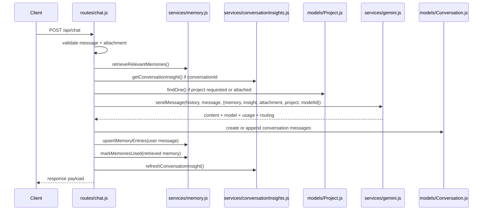

# 06. Solo Chat Flow

## Purpose

This document explains the full `POST /api/chat` flow from request validation to storage and response.

## Relevant Files

- `routes/chat.js`
- `services/gemini.js`
- `services/memory.js`
- `services/conversationInsights.js`
- `services/messageFormatting.js`
- `models/Conversation.js`
- `models/Project.js`

## End-To-End Sequence



## Request Contract

Accepted body fields:

- `message`: required string
- `conversationId`: optional conversation to append to
- `history`: optional ad hoc history array used for prompt construction
- `modelId`: optional explicit model or `auto`
- `attachment`: optional uploaded-file reference
- `projectId`: optional project context

## Validation Steps

The route rejects early when:

- `message` is empty
- attachment metadata is incomplete or invalid
- referenced project does not exist for the user
- `conversationId` exists but belongs to a different `projectId`

## Prompt Assembly

`sendMessage()` in `services/gemini.js` builds the final prompt from:

- serialized `history`
- memory context
- conversation insight
- attachment prompt text
- project context text
- current request

The system prompt comes from the `solo-chat` prompt template.

## Conversation Writes

After a successful AI response:

1. the user message is pushed into `conversation.messages`
2. the assistant message is pushed immediately after it
3. assistant message stores:
   - `memoryRefs`
   - `modelId`
   - `provider`
   - `requestedModelId`
   - `processingMs`
   - token counts
   - `autoMode`
   - `autoComplexity`
   - `fallbackUsed`

## Example Stored Assistant Message

```json
{
  "role": "assistant",
  "content": "Here is the answer.",
  "memoryRefs": [
    { "id": "660af4...", "summary": "The user works at Example Co.", "score": 0.68 }
  ],
  "modelId": "openai/gpt-5.4-mini",
  "provider": "openrouter",
  "requestedModelId": "auto",
  "processingMs": 1820,
  "promptTokens": 712,
  "completionTokens": 180,
  "totalTokens": 892,
  "autoMode": true,
  "autoComplexity": "medium",
  "fallbackUsed": false
}
```

## Post-Response Side Effects

After conversation save:

- `upsertMemoryEntries()` extracts memory from the user message
- `markMemoriesUsed()` increments usage counts for retrieved memories
- `refreshConversationInsight()` tries to regenerate the conversation insight

Insight refresh is best-effort. Chat can still succeed if insight refresh fails.

## Failure Handling

| Failure | Response |
| --- | --- |
| invalid message/attachment | `400` |
| missing project | `404` |
| project mismatch | `400` |
| provider rate limit | `429` with `retryAfterMs` if available |
| provider/model outage | `503` with model/provider hints |
| unexpected internal failure | `500` |

## Recovery Behavior

- memory retrieval failure currently bubbles and fails the whole request
- insight refresh failure after response generation is swallowed into a warning log
- provider fallback happens inside `services/gemini.js` before the route decides to fail

## `dist/` Drift Notes

`dist/services/chat.service.js` differs in important ways:

- it normalizes history from stored conversation messages instead of relying on request `history`
- it stores memory IDs on both user and assistant messages
- it uses Prisma and UUIDs

## Rebuild Notes

1. make prompt inputs explicit in a single orchestration object
2. separate conversation writes from derived-artifact refreshes
3. add idempotency or dedupe around retries to avoid duplicate assistant writes

