# 06. Solo Chat Flow

## Purpose

The Solo Chat feature enables one-on-one conversations between a user and the AI assistant. It supports persistent conversation history, long-term memory retrieval, project context injection, model routing with automatic fallback, and conversation-level insights. This is the primary AI interaction mode in ChatSphere.

**Purpose Statement**: Provide a stateful, context-aware AI chat experience with memory augmentation, project-scoped context, and automatic model selection based on query complexity.

---

## Source Files and References

| File | Lines | Responsibility |
|------|-------|----------------|
| `routes/chat.js` | 1-186 | REST endpoint handler, validation, conversation persistence, memory integration |
| `services/gemini.js` | Full | AI model communication, prompt building, fallback logic, attachment handling |
| `services/memory.js` | Full | Memory entry retrieval, scoring, upsertion, and usage tracking |
| `services/conversationInsights.js` | Full | Insight generation and caching for conversations |
| `services/promptCatalog.js` | Full | Prompt template retrieval with DB fallback to DEFAULT_PROMPTS |
| `middleware/aiQuota.js` | Full | AI usage quota enforcement per user |
| `middleware/rateLimit.js` | Full | `aiLimiter`: 15min window, max 80 requests |
| `models/Conversation.js` | Full | Mongoose schema for conversation storage |
| `models/MemoryEntry.js` | Full | Schema for long-term memory entries |
| `models/ConversationInsight.js` | Full | Schema for conversation-level AI insights |
| `models/Project.js` | Full | Project model for context injection |

---

## Architecture Overview

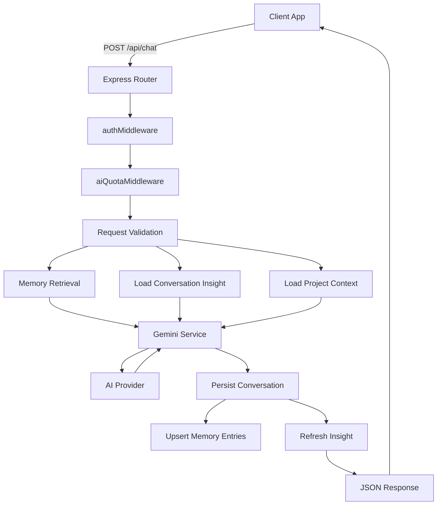

---

## Request Lifecycle Sequence

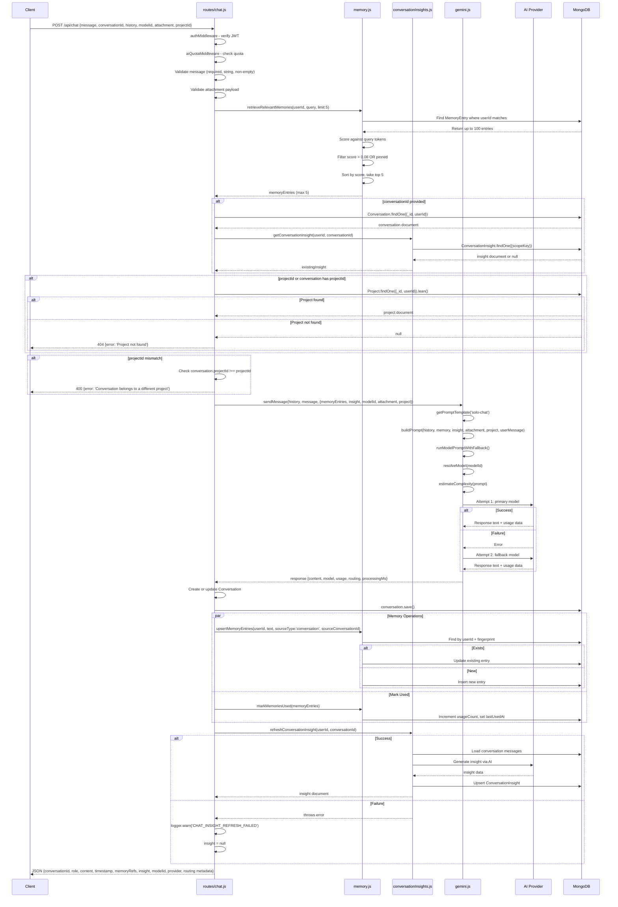

---

## Endpoint Specification

### POST /api/chat

| Property | Value |
|----------|-------|
| **Authentication** | Required (JWT via `authMiddleware`) |
| **Rate Limiting** | AI quota via `aiQuotaMiddleware` |
| **Content-Type** | `application/json` |
| **Idempotent** | No (creates new messages/conversations) |

### Request Body Schema

| Field | Type | Required | Description |
|-------|------|----------|-------------|
| `message` | string | Yes | User message text (non-empty after trim) |
| `conversationId` | string | No | Existing conversation ID to continue |
| `history` | array | No | Client-side message history for context |
| `modelId` | string | No | Specific model to use (falls back to auto-routing) |
| `attachment` | object | No | File attachment metadata |
| `attachment.fileUrl` | string | No | URL of uploaded file |
| `attachment.fileName` | string | No | Original filename |
| `attachment.fileType` | string | No | MIME type |
| `attachment.fileSize` | number | No | File size in bytes |
| `projectId` | string | No | Project to associate conversation with |

### Request Example

```json
{
  "message": "How do I implement authentication in my React app?",
  "conversationId": "65f1a2b3c4d5e6f7a8b9c0d1",
  "history": [
    { "role": "user", "content": "What's the best way to handle auth?" },
    { "role": "assistant", "content": "There are several approaches..." }
  ],
  "modelId": "gemini-2.0-flash",
  "attachment": {
    "fileUrl": "https://cdn.example.com/uploads/code-snippet.txt",
    "fileName": "code-snippet.txt",
    "fileType": "text/plain",
    "fileSize": 2048
  },
  "projectId": "65f9e8d7c6b5a4f3e2d1c0b9"
}
```

### Response Body Schema

| Field | Type | Description |
|-------|------|-------------|
| `conversationId` | string | ID of the conversation (created or existing) |
| `role` | string | Always `"model"` for AI responses |
| `content` | string | Generated AI response text |
| `timestamp` | ISO 8601 | Response generation time |
| `memoryRefs` | array | Referenced memory entries |
| `memoryRefs[].id` | string | Memory entry ID |
| `memoryRefs[].summary` | string | Memory summary |
| `memoryRefs[].score` | number | Relevance score |
| `insight` | object | Current conversation insight or null |
| `modelId` | string | Actual model used for generation |
| `provider` | string | AI provider name (e.g., `"google"`) |
| `requestedModelId` | string | Model ID originally requested by client |
| `processingMs` | number | Time taken to generate response |
| `promptTokens` | number | Tokens in the input prompt |
| `completionTokens` | number | Tokens in the generated response |
| `totalTokens` | number | Total tokens consumed |
| `autoMode` | boolean | Whether auto model routing was used |
| `autoComplexity` | string | Detected query complexity level |
| `fallbackUsed` | boolean | Whether a fallback model was used |

### Response Example

```json
{
  "conversationId": "65f1a2b3c4d5e6f7a8b9c0d1",
  "role": "model",
  "content": "For React authentication, I recommend using JWT tokens with HTTP-only cookies...",
  "timestamp": "2026-03-15T10:30:00.000Z",
  "memoryRefs": [
    {
      "id": "mem_abc123",
      "summary": "User is building a React application",
      "score": 0.85
    }
  ],
  "insight": {
    "title": "React Authentication Implementation",
    "summary": "Discussion about implementing JWT-based auth in React",
    "intent": "technical_guidance",
    "topics": ["react", "authentication", "jwt"],
    "decisions": [],
    "actionItems": []
  },
  "modelId": "gemini-2.0-flash",
  "provider": "google",
  "requestedModelId": "gemini-2.0-flash",
  "processingMs": 1250,
  "promptTokens": 342,
  "completionTokens": 156,
  "totalTokens": 498,
  "autoMode": false,
  "autoComplexity": null,
  "fallbackUsed": false
}
```

---

## Request Validation Flow

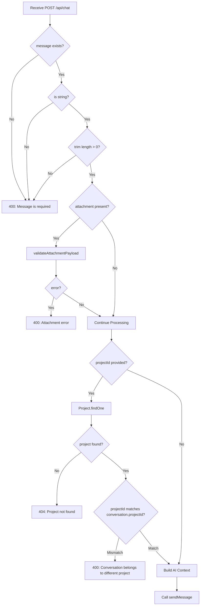

### Validation Rules

| Rule | Condition | Error Response |
|------|-----------|----------------|
| Message required | `!message \|\| typeof message !== 'string' \|\| message.trim().length === 0` | `400: Message is required` |
| Attachment valid | `validateAttachmentPayload(attachment)` returns error string | `400: <attachment error>` |
| Project exists | `projectId` provided but project not found | `404: Project not found` |
| Project mismatch | `conversation.projectId !== projectId` | `400: Conversation belongs to a different project` |

---

## Memory System Integration

### Retrieval Process

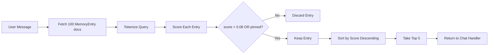

### Memory Entry Structure

| Field | Type | Purpose |
|-------|------|---------|
| `userId` | ObjectId | Owner of the memory |
| `summary` | string | Condensed representation of the memory |
| `details` | string | Full context and details |
| `tags` | string[] | Categorical tags for filtering |
| `fingerprint` | string | Hash for deduplication |
| `sourceType` | string | `'conversation'` or `'room'` |
| `sourceConversationId` | ObjectId | Link to originating conversation |
| `sourceRoomId` | string | Link to originating room |
| `confidenceScore` | number | AI confidence in memory accuracy |
| `importanceScore` | number | Relative importance rating |
| `recencyScore` | number | Time-decayed recency value |
| `pinned` | boolean | Manually pinned (always returned) |
| `usageCount` | number | Times this memory was referenced |
| `lastUsedAt` | Date | Most recent reference timestamp |

### Memory Flow in Chat

```javascript
// Step 1: Retrieve relevant memories before AI call (routes/chat.js)
const memoryEntries = await retrieveRelevantMemories({
  userId: req.user.id,
  query: message.trim(),
  limit: 5,
});

// Step 2: Pass memories to AI prompt builder (services/gemini.js)
const response = await sendMessage(chatHistory, message.trim(), {
  memoryEntries,
  insight: existingInsight,
  modelId,
  attachment,
  project,
});

// Step 3: Build memory references for response
const memoryRefs = memoryEntries.map((entry) => ({
  id: entry._id.toString(),
  summary: entry.summary,
  score: entry.score,
}));

// Step 4: Upsert new memories from user message
await upsertMemoryEntries({
  userId: req.user.id,
  text: message.trim(),
  sourceType: 'conversation',
  sourceConversationId: conversation._id,
});

// Step 5: Mark retrieved memories as used
await markMemoriesUsed(memoryEntries);
```

---

## Project Context Injection

When a `projectId` is provided (either directly or via an existing conversation), the system loads the project and injects its context into the AI prompt.

### Project Context Components

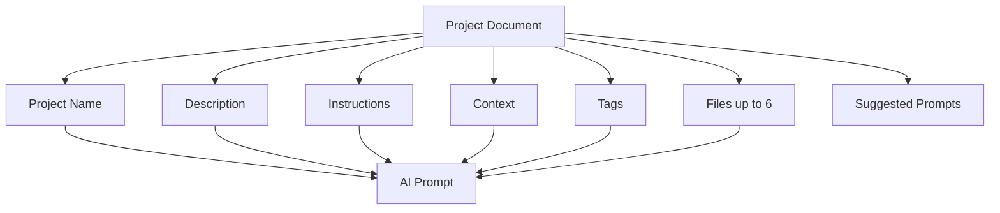

### Project Validation Flow

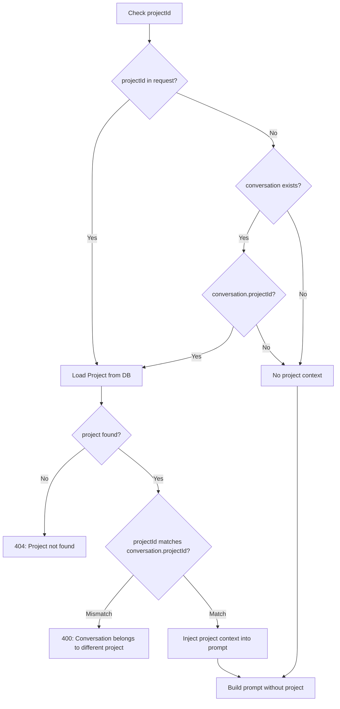

---

## Conversation Persistence

### Create vs Update Logic

```mermaid
flowchart TD
    Start[After AI Response] --> CheckConv{conversation exists?}
    CheckConv -->|No| Create[Create New Conversation]
    Create --> SetTitle[title = message.slice(0,80) + '...']
    SetTitle --> SetProject[Set projectId and projectName if available]
    SetProject --> PushMessages
    
    CheckConv -->|Yes| CheckProj{project provided AND no projectId?}
    CheckProj -->|Yes| UpdateProj[Update conversation.projectId and projectName]
    CheckProj -->|No| PushMessages
    
    UpdateProj --> PushMessages[Push user + assistant messages]
    PushMessages --> Save[conversation.save]
```

### Message Storage Schema

Each message stored in `conversation.messages[]` array:

| Field | User Message | Assistant Message |
|-------|--------------|-------------------|
| `role` | `'user'` | `'assistant'` |
| `content` | User's trimmed message | AI response content |
| `timestamp` | `new Date()` | `new Date()` |
| `fileUrl` | `attachment?.fileUrl` | `null` |
| `fileName` | `attachment?.fileName` | `null` |
| `fileType` | `attachment?.fileType` | `null` |
| `fileSize` | `attachment?.fileSize` | `null` |
| `memoryRefs` | `null` | Array of memory references |
| `modelId` | `null` | `response.model.id` |
| `provider` | `null` | `response.model.provider` |
| `requestedModelId` | `null` | Original requested model or null |
| `processingMs` | `null` | `response.processingMs` |
| `promptTokens` | `null` | `response.usage?.promptTokens` |
| `completionTokens` | `null` | `response.usage?.completionTokens` |
| `totalTokens` | `null` | `response.usage?.totalTokens` |
| `autoMode` | `null` | `Boolean(response.routing?.autoMode)` |
| `autoComplexity` | `null` | `response.routing?.complexity` |
| `fallbackUsed` | `null` | `Boolean(response.routing?.fallbackUsed)` |

---

## AI Service Integration

### sendMessage Function Flow

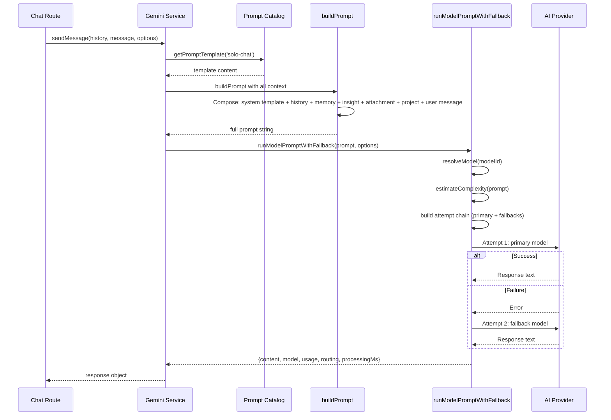

### Prompt Composition Structure

```
[SYSTEM TEMPLATE - from 'solo-chat' prompt catalog]

[HISTORY - previous messages if provided]

[MEMORY ENTRIES - up to 5 relevant memories]

[CONVERSATION INSIGHT - summary, intent, topics]

[ATTACHMENT - extracted text or image data]

[PROJECT CONTEXT - name, description, instructions, files]

[USER MESSAGE - current message]
```

---

## Insight System

### Insight Refresh Flow

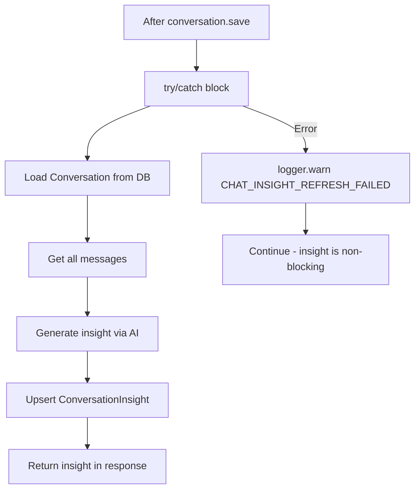

### Insight Fields

| Field | Type | Description |
|-------|------|-------------|
| `scopeKey` | string | Unique composite key |
| `scopeType` | string | `'conversation'` |
| `scopeId` | ObjectId | Reference to conversation |
| `userId` | ObjectId | Owner |
| `conversationId` | ObjectId | Linked conversation |
| `title` | string | Auto-generated conversation title |
| `summary` | string | AI-generated summary |
| `intent` | string | Detected user intent |
| `topics` | string[] | Extracted topics |
| `decisions` | string[] | Decisions made in conversation |
| `actionItems` | string[] | Action items identified |

### Non-Blocking Insight Refresh

The insight refresh is wrapped in a try/catch block and logged as a warning on failure. This ensures that insight generation failures do not block the main chat response:

```javascript
// routes/chat.js - insight refresh is non-blocking
let insight = null;
try {
  insight = await refreshConversationInsight(req.user.id, conversation._id);
} catch (insightError) {
  logger.warn('CHAT_INSIGHT_REFRESH_FAILED', 'Chat response succeeded but insight refresh failed', {
    requestId: req.requestId,
    userId: req.user.id,
    conversationId: conversation._id.toString(),
    error: logger.serializeError(insightError),
  });
}
```

---

## Error Handling

### Error Response Matrix

| Error Type | Status Code | Error Message | Additional Fields |
|------------|-------------|---------------|-------------------|
| Missing message | 400 | `Message is required` | - |
| Invalid attachment | 400 | Attachment-specific error | - |
| Project not found | 404 | `Project not found` | - |
| Project mismatch | 400 | `Conversation belongs to a different project` | - |
| Rate limited | 429 | `The selected AI provider is rate-limited right now. Please retry in a moment.` | `modelId`, `provider`, `retryAfterMs`, `requestId` |
| AI unavailable | 503 | `AI providers are temporarily unavailable. Please try again shortly or choose a different model.` | `modelId`, `provider`, `retryAfterMs`, `requestId` |
| Server error | 500 | `Failed to get AI response. Please try again.` | `modelId`, `provider`, `retryAfterMs`, `requestId` |

### Error Classification Logic

```javascript
// routes/chat.js - error classification
const statusCode = err?.statusCode === 429 
  ? 429 
  : String(err?.code || '').startsWith('AI_') 
    ? 503 
    : 500;
```

### Error Flow Diagram

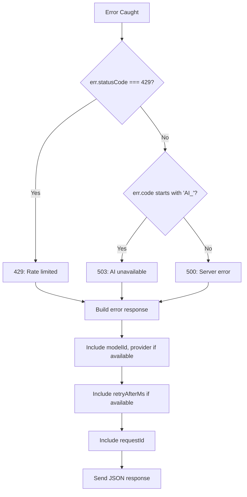

---

## Database Operations

### Write Operations Sequence

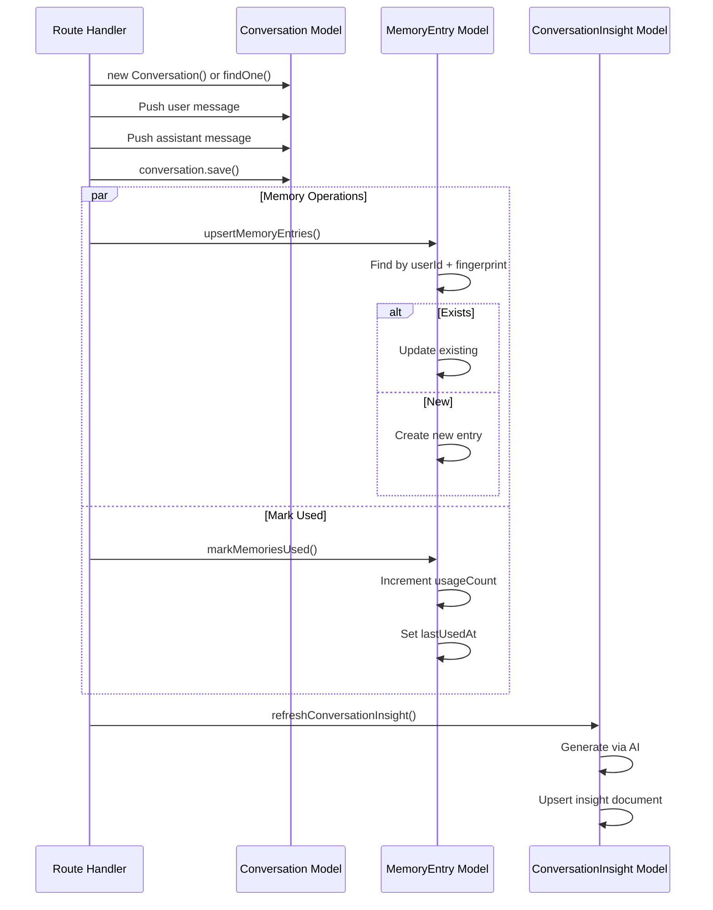

### Conversation Model Fields

| Field | Type | Notes |
|-------|------|-------|
| `userId` | ObjectId | Owner reference |
| `title` | string | First 80 chars of first message |
| `projectId` | ObjectId | Optional project reference |
| `projectName` | string | Denormalized project name |
| `messages` | array | Array of message objects |
| `sourceType` | string | Origin type |
| `sourceLabel` | string | Origin label |

---

## Scaling Considerations

### Performance Bottlenecks

| Operation | Complexity | Scaling Concern | Mitigation |
|-----------|------------|-----------------|------------|
| Memory retrieval | O(100) DB query | High user count → memory DB load | Index on `userId`, consider Redis cache |
| Conversation save | O(messages.length) | Long conversations → large documents | Consider message pagination or separate collection |
| Insight refresh | AI call per message | High throughput → AI quota exhaustion | Debounce or batch insight generation |
| Memory upsert | N upserts per message | Write amplification | Batch upserts, async processing |

### Concurrency Considerations

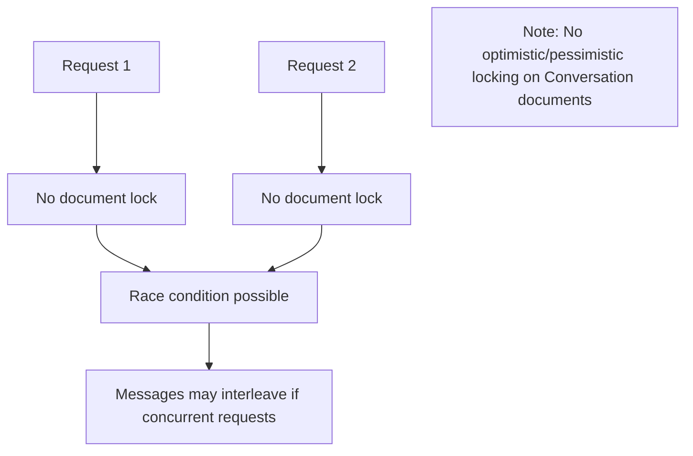

### Operational Recommendations

| Area | Recommendation | Priority |
|------|----------------|----------|
| Conversation size | Implement message count limits or archival | High |
| Memory scaling | Add caching layer for frequent queries | Medium |
| Insight generation | Debounce to once per N messages or time interval | Medium |
| Error tracking | Add distributed tracing for AI call chains | Low |

---

## Failure Cases and Recovery

### Failure Scenarios

| Scenario | Detection | Recovery | Data Impact |
|----------|-----------|----------|-------------|
| AI provider timeout | `runModelPromptWithFallback` catches error | Automatic fallback to secondary model | No data loss |
| Memory retrieval failure | Exception in `retrieveRelevantMemories` | Would propagate to main error handler | Conversation still saved without memory refs |
| Insight refresh failure | Caught in try/catch, logged as warning | Non-blocking, skipped | Insight may be stale |
| Memory upsert failure | Not wrapped in try/catch | Would cause 500 error | Conversation saved but memory not updated |
| Project load failure | Explicit check returns 404 | Request rejected early | No data written |

### Recovery Flow

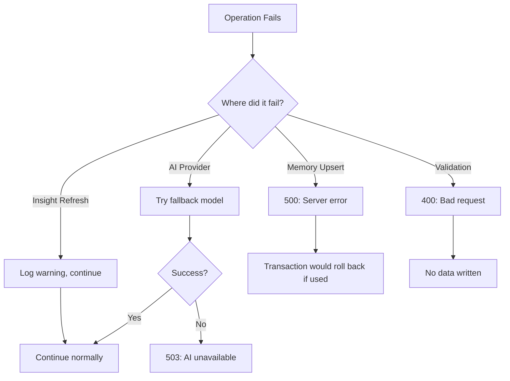

---

## Inconsistencies and Risks

### Identified Issues

| Issue | Severity | Description | Impact |
|-------|----------|-------------|--------|
| No transaction usage | High | Conversation save and memory operations are not in a transaction | Partial writes possible on failure |
| Race conditions | Medium | Concurrent requests to same conversation can interleave messages | Message ordering issues |
| Memory upsert not wrapped | Medium | `upsertMemoryEntries` and `markMemoriesUsed` not in try/catch | Single memory failure kills entire request |
| Title truncation | Low | Title is always first 80 chars of first message, not regenerated | May not reflect conversation topic well |
| Memory score threshold | Low | Hard-coded 0.08 threshold may not suit all use cases | Irrelevant memories or missed relevant ones |
| Project denormalization | Low | `projectName` stored in conversation | Stale if project is renamed |

### Improvement Areas

| Area | Current State | Proposed Improvement |
|------|---------------|---------------------|
| Transactions | None | Wrap conversation save + memory ops in MongoDB transaction |
| Concurrency | No locking | Add version field or optimistic locking on conversations |
| Memory resilience | Synchronous | Move memory operations to background job queue |
| Insight efficiency | Every message | Debounce insight refresh to every 5 messages or 30 seconds |
| Title generation | Static truncation | Use AI to generate title after 3+ messages |
| Project sync | Denormalized | Add project rename hook to update conversations |

---

## How to Rebuild From Scratch

### Step 1: Define Models

```javascript
// models/Conversation.js
const conversationSchema = new mongoose.Schema({
  userId: { type: mongoose.Schema.Types.ObjectId, ref: 'User', required: true },
  title: { type: String, required: true },
  projectId: { type: mongoose.Schema.Types.ObjectId, ref: 'Project' },
  projectName: String,
  messages: [{
    role: { type: String, enum: ['user', 'assistant'], required: true },
    content: { type: String, required: true },
    timestamp: { type: Date, default: Date.now },
    fileUrl: String,
    fileName: String,
    fileType: String,
    fileSize: Number,
    memoryRefs: [{ id: String, summary: String, score: Number }],
    modelId: String,
    provider: String,
    requestedModelId: String,
    processingMs: Number,
    promptTokens: Number,
    completionTokens: Number,
    totalTokens: Number,
    autoMode: Boolean,
    autoComplexity: String,
    fallbackUsed: Boolean,
  }],
  sourceType: String,
  sourceLabel: String,
}, { timestamps: true });
```

### Step 2: Implement Middleware

```javascript
// middleware/aiQuota.js
const aiQuotaMiddleware = async (req, res, next) => {
  const key = `user:${req.user.id}`;
  const quota = consumeAiQuota(key);
  if (!quota.allowed) {
    return res.status(429).json({ error: 'AI request limit reached' });
  }
  next();
};
```

### Step 3: Build Route Handler

1. Validate request body (message required, attachment valid)
2. Retrieve relevant memories (up to 5)
3. Load conversation insight if conversationId provided
4. Load project context if projectId provided
5. Call `sendMessage()` with all context
6. Create or update conversation document
7. Push user and assistant messages
8. Save conversation
9. Upsert memory entries and mark used
10. Refresh conversation insight (non-blocking)
11. Return JSON response

### Step 4: Wire AI Service

```javascript
// services/gemini.js
async function sendMessage(history, userMessage, options) {
  const template = await getPromptTemplate('solo-chat');
  const prompt = buildPrompt({
    template,
    history: options.history || [],
    memoryEntries: options.memoryEntries || [],
    insight: options.insight,
    attachment: options.attachment,
    project: options.project,
    userMessage,
  });
  return runModelPromptWithFallback(prompt, { modelId: options.modelId });
}
```

### Step 5: Add Error Handling

- Wrap entire handler in try/catch
- Classify errors by status code and error code prefix
- Return appropriate status codes (400, 404, 429, 503, 500)
- Include model info and retry timing in error responses
- Log all errors with request ID and user context

### Step 6: Test Scenarios

| Test Case | Expected Result |
|-----------|-----------------|
| Empty message | 400 error |
| New conversation | Creates conversation with title from message |
| Existing conversation | Appends messages to existing conversation |
| With project | Injects project context, validates ownership |
| With attachment | Includes attachment in prompt and stores metadata |
| Memory retrieval | Includes relevant memories in prompt |
| AI provider failure | Falls back to secondary model |
| Insight failure | Returns response without insight, logs warning |
| Rate limited | 429 with retry information |

---

## Quick Reference

### Key Functions

| Function | File | Purpose |
|----------|------|---------|
| `sendMessage` | `services/gemini.js` | Main AI call with fallback |
| `retrieveRelevantMemories` | `services/memory.js` | Score and return relevant memories |
| `upsertMemoryEntries` | `services/memory.js` | Create or update memory entries |
| `markMemoriesUsed` | `services/memory.js` | Update memory usage tracking |
| `refreshConversationInsight` | `services/conversationInsights.js` | Generate/update conversation insight |
| `getPromptTemplate` | `services/promptCatalog.js` | Load prompt template from DB or defaults |
| `runModelPromptWithFallback` | `services/gemini.js` | Execute AI call with automatic fallback |
| `buildPrompt` | `services/gemini.js` | Compose full prompt from all context sources |

### Configuration Points

| Setting | Location | Description |
|---------|----------|-------------|
| Memory limit | `retrieveRelevantMemories` call | Default 5 memories per request |
| Memory score threshold | `services/memory.js` | Default 0.08 minimum score |
| Title length | Route handler | First 80 characters of message |
| AI history limit | N/A for solo chat | Not applicable (uses full history) |
| Attachment text limit | `buildAttachmentPayload` | Up to 12,000 characters |
| Attachment image limit | `buildAttachmentPayload` | Up to 3MB base64 |
| Project files limit | `buildProjectContext` | Up to 6 files |
