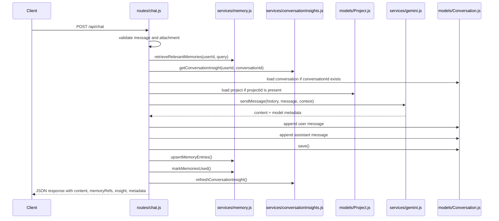

# 06. Solo Chat Flow

## Purpose
This document explains the end-to-end solo AI chat flow implemented in `routes/chat.js`.

## Relevant Files
- `routes/chat.js`
- `services/gemini.js`
- `services/memory.js`
- `services/conversationInsights.js`
- `services/messageFormatting.js`
- `models/Conversation.js`
- `models/Project.js`

## End-to-End Flow


## Request Validation
The route rejects:

- missing or blank `message`
- invalid attachment payload
- nonexistent project
- mismatched `projectId` vs existing conversation project

## Prompt Context Composition
The call to `sendMessage` can include:

- provided `history`
- retrieved `memoryEntries`
- existing conversation `insight`
- `attachment`
- `project`

This means the route enriches the prompt before the provider call instead of sending only the immediate message.

## Conversation Storage Shape
Each successful request stores two records inside `Conversation.messages`:

1. a `role: 'user'` message
2. a `role: 'assistant'` message

The assistant entry includes:

- `memoryRefs`
- `modelId`
- `provider`
- `requestedModelId`
- `processingMs`
- token counts
- `autoMode`
- `autoComplexity`
- `fallbackUsed`

## Example Assistant Message Record
```json
{
  "role": "assistant",
  "content": "Here is the summary...",
  "timestamp": "2026-03-31T10:00:00.000Z",
  "memoryRefs": [{"id": "123", "summary": "The user likes chess.", "score": 0.72}],
  "modelId": "gemini-2.5-flash",
  "provider": "gemini",
  "requestedModelId": "auto",
  "processingMs": 362,
  "promptTokens": 90,
  "completionTokens": 48,
  "totalTokens": 138,
  "autoMode": true,
  "autoComplexity": "medium",
  "fallbackUsed": false
}
```

## Database Writes
`POST /api/chat` performs these writes:

- `Conversation.save()`
- `upsertMemoryEntries(...)`
- `markMemoriesUsed(...)`
- `refreshConversationInsight(...)` which becomes `findOneAndUpdate(..., { upsert: true })`

## Failure Cases
| Failure | Behavior |
|---|---|
| invalid attachment | `400` |
| missing message | `400` |
| project not found | `404` |
| provider rate-limited | `429` with retry hint when available |
| provider unavailable or model invalid | `503` |
| other error | `500` |
| insight refresh failure after chat success | chat succeeds, warning is logged, `insight` may be null |

## Key Snippet Explained
The route uses post-success side effects instead of pre-committing everything:

```js
await conversation.save();
await Promise.all([
  upsertMemoryEntries(...),
  markMemoriesUsed(memoryEntries),
]);
```

This improves latency slightly compared with serial writes, but it also means:

- memory updates are not transactional with conversation save
- conversation can succeed even if insight refresh fails
- there is no compensation path if one write succeeds and another fails

## Improvement Opportunities
- add transaction or outbox-style post-processing for durability
- separate orchestration from route handling
- add request schema validation library
- persist more explicit audit data for failed AI attempts

## Rebuild Guidance
To rebuild this feature:

1. validate request and attachment
2. load existing conversation and optional project
3. retrieve memory and insight context
4. assemble prompt
5. execute model call with routing and fallback
6. persist both turns and metadata
7. refresh derivative artifacts such as insights and memory usage

