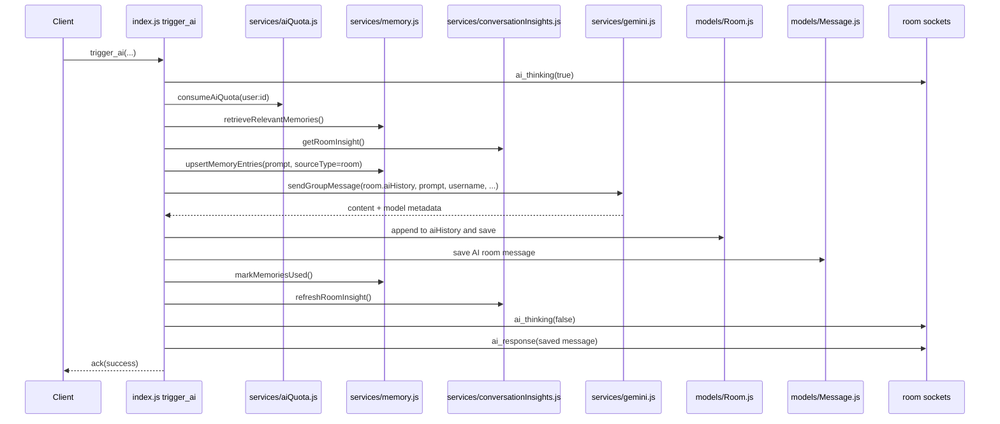

# 07. Room AI Flow

## Purpose

This file explains the `trigger_ai` room flow end to end, including membership checks, prompt context, dual persistence, broadcasts, and `aiHistory` trimming.

## Relevant Files

- `index.js`
- `services/gemini.js`
- `services/memory.js`
- `services/conversationInsights.js`
- `models/Room.js`
- `models/Message.js`

## High-Level Behavior

Room AI is invoked through a socket event:

```text
trigger_ai({ roomId, prompt, modelId, attachment }, callback)
```

It only runs if:

- the socket is authenticated
- the room exists
- the user is a room member in MongoDB
- the socket has joined the room in the in-memory room map
- the flood guard does not reject the socket
- the per-user AI quota allows the request

## End-To-End Sequence



## Why `aiHistory` Exists

`Room.aiHistory` is the prompt-facing room state. It is separate from `Message` because:

- prompt serialization only needs compact AI-relevant history
- stored room messages include UX fields like reactions, edit/delete state, and attachments
- `aiHistory` retains the seeded room system exchange from `buildInitialRoomHistory()`

## `aiHistory` Update Logic

After the model responds, source appends:

- user turn as `[username asks]: <prompt>`
- model turn as `<response content>`

Then it trims to:

- first 2 entries retained
- last 38 later entries retained
- total max length of 42 entries

## Persisted AI Room Message

The room transcript stores a separate `Message` document with:

- `userId: 'ai'`
- `username: AI_USERNAME`
- `isAI: true`
- `triggeredBy`
- `content`
- `modelId`
- `provider`
- `memoryRefs`

Unlike solo chat, room AI does not store token counts, routing metadata, or requested model ID on `Message`.

## Database Writes

| Step | Collection/document |
| --- | --- |
| memory upsert before generation | `MemoryEntry` |
| room history append | `Room` |
| room AI transcript message | `Message` |
| memory usage mark | `MemoryEntry` |
| room insight refresh | `ConversationInsight` |

## Error Path

If room AI fails:

- `ai_thinking(status=false)` is emitted
- a generic AI error message is still persisted as a `Message`
- `ai_response` is emitted with that message
- `error_message` is sent to the triggering socket

## Risks

- no dedupe prevents duplicate AI responses if the client retries the same socket event
- memory extraction occurs before AI generation, so failed AI requests can still create memories
- room AI stores less telemetry than solo chat, making postmortems harder

## `dist/` Drift Notes

The compiled socket flow differs sharply:

- `dist/socket/index.js` builds prompt context from recent `Message` rows instead of `Room.aiHistory`
- `dist` stores room AI history as prompt/response objects trimmed to 30, not Gemini-style parts
- `dist` emits `message_created` for AI success instead of `ai_response`

## Rebuild Notes

1. pick one authoritative room-history representation
2. queue AI generation off the socket thread
3. store richer room-AI telemetry for parity with solo chat

