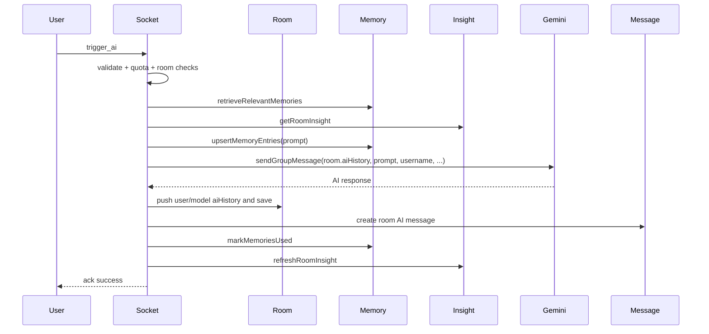

# 07. Room AI Flow

## Purpose
This document explains the room-based AI feature implemented inside the Socket.IO section of `index.js`.

## Relevant Files
- `index.js`
- `services/gemini.js`
- `services/memory.js`
- `services/conversationInsights.js`
- `services/messageFormatting.js`
- `models/Room.js`
- `models/Message.js`

## Event Contract
Caller sends:

```json
{
  "roomId": "mongo-id",
  "prompt": "@ai summarize the last discussion",
  "modelId": "auto",
  "attachment": {
    "fileUrl": "/api/uploads/file.txt",
    "fileName": "file.txt",
    "fileType": "text/plain",
    "fileSize": 2000
  }
}
```

## Execution Steps
1. Flood control check via `socketFlood`
2. Resolve requested model for logging
3. Validate prompt length and attachment
4. Emit `ai_thinking` to room
5. Consume AI quota for the triggering user
6. Load room and confirm membership
7. Confirm current socket is actually in the room
8. Fetch relevant memories and existing room insight
9. Upsert new memories from the current prompt
10. Call `sendGroupMessage(...)`
11. Append prompt history to `Room.aiHistory`
12. Trim history if needed
13. Save room
14. Create AI `Message`
15. Mark retrieved memories as used
16. Refresh room insight
17. Emit `ai_thinking false`
18. Emit `ai_response`

## Sequence Diagram


## Why There Are Two Histories
Room AI preserves context in two different formats:

- `Room.aiHistory` for model prompting
- `Message` documents for user-visible conversation history

This duplication is intentional but creates drift risk if one write succeeds and the other fails.

## Trim Logic
The handler keeps:

- the first two entries, which represent the initial room system context
- the last 38 entries after that

This effectively caps prompt history growth for room AI.

## AI Message Persistence
Room AI stores a visible message with:

- `roomId`
- `userId: 'ai'`
- `username: AI_USERNAME`
- `content`
- `isAI: true`
- `triggeredBy`
- `modelId`
- `provider`
- `memoryRefs`

Unlike solo chat, room messages do not store token counts or routing metadata in the `Message` schema.

## Failure Path
On failure the handler:

- logs the failed model/provider
- emits `ai_thinking false`
- creates a fallback error message in `Message`
- emits `ai_response` with that fallback message
- emits `error_message` to the caller

## Database Writes
Room AI writes:

- `MemoryEntry` from the prompt
- `Room.aiHistory`
- `Message`
- `ConversationInsight` for room scope
- `MemoryEntry.usageCount` / `lastUsedAt`

## Risks
- no transaction across room save and message save
- quota and room state are instance-local
- synchronous provider latency blocks the socket handler
- insight refresh happens inline, increasing end-to-end latency

## Improvement Opportunities
- move room AI logic into a service
- align room message metadata with solo chat metadata
- separate prompt history from room document if history volume grows
- run insight refresh asynchronously

