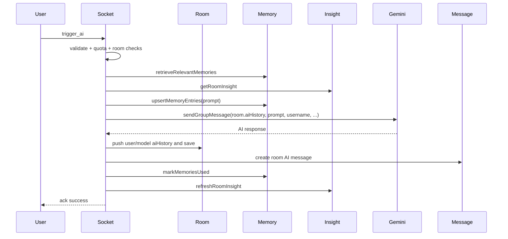

# 07. Room AI Flow

## Purpose
This document explains the room-based AI feature implemented inside the Socket.IO section of `index.js`.

## Relevant Files
- `index.js`
- `services/gemini.js`
- `services/memory.js`
- `services/conversationInsights.js`
- `services/messageFormatting.js`
- `models/Room.js`
- `models/Message.js`

## Event Contract
Caller sends:

```json
{
  "roomId": "mongo-id",
  "prompt": "@ai summarize the last discussion",
  "modelId": "auto",
  "attachment": {
    "fileUrl": "/api/uploads/file.txt",
    "fileName": "file.txt",
    "fileType": "text/plain",
    "fileSize": 2000
  }
}
```

## Execution Steps
1. Flood control check via `socketFlood`
2. Resolve requested model for logging
3. Validate prompt length and attachment
4. Emit `ai_thinking` to room
5. Consume AI quota for the triggering user
6. Load room and confirm membership
7. Confirm current socket is actually in the room
8. Fetch relevant memories and existing room insight
9. Upsert new memories from the current prompt
10. Call `sendGroupMessage(...)`
11. Append prompt history to `Room.aiHistory`
12. Trim history if needed
13. Save room
14. Create AI `Message`
15. Mark retrieved memories as used
16. Refresh room insight
17. Emit `ai_thinking false`
18. Emit `ai_response`

## Sequence Diagram


## Why There Are Two Histories
Room AI preserves context in two different formats:

- `Room.aiHistory` for model prompting
- `Message` documents for user-visible conversation history

This duplication is intentional but creates drift risk if one write succeeds and the other fails.

## Trim Logic
The handler keeps:

- the first two entries, which represent the initial room system context
- the last 38 entries after that

This effectively caps prompt history growth for room AI.

## AI Message Persistence
Room AI stores a visible message with:

- `roomId`
- `userId: 'ai'`
- `username: AI_USERNAME`
- `content`
- `isAI: true`
- `triggeredBy`
- `modelId`
- `provider`
- `memoryRefs`

Unlike solo chat, room messages do not store token counts or routing metadata in the `Message` schema.

## Failure Path
On failure the handler:

- logs the failed model/provider
- emits `ai_thinking false`
- creates a fallback error message in `Message`
- emits `ai_response` with that fallback message
- emits `error_message` to the caller

## Database Writes
Room AI writes:

- `MemoryEntry` from the prompt
- `Room.aiHistory`
- `Message`
- `ConversationInsight` for room scope
- `MemoryEntry.usageCount` / `lastUsedAt`

## Risks
- no transaction across room save and message save
- quota and room state are instance-local
- synchronous provider latency blocks the socket handler
- insight refresh happens inline, increasing end-to-end latency

## Improvement Opportunities
- move room AI logic into a service
- align room message metadata with solo chat metadata
- separate prompt history from room document if history volume grows
- run insight refresh asynchronously


## Expanded Learning Appendix

This appendix expands the topic covered in 07-room-ai-flow without removing or replacing the earlier material. It is intentionally additive and is meant to help a reader study the implementation from several angles: control flow, data flow, storage, risk, scale, and redesign.

### Extended Study Notes
- Study note 1 for 07-room-ai-flow: revisit the exact control path related to this topic and identify which route, middleware, model, or service acts as the real decision point rather than the most visible file.
- Study note 2 for 07-room-ai-flow: revisit the exact control path related to this topic and identify which route, middleware, model, or service acts as the real decision point rather than the most visible file.
- Study note 3 for 07-room-ai-flow: revisit the exact control path related to this topic and identify which route, middleware, model, or service acts as the real decision point rather than the most visible file.
- Study note 4 for 07-room-ai-flow: revisit the exact control path related to this topic and identify which route, middleware, model, or service acts as the real decision point rather than the most visible file.
- Study note 5 for 07-room-ai-flow: revisit the exact control path related to this topic and identify which route, middleware, model, or service acts as the real decision point rather than the most visible file.
- Study note 6 for 07-room-ai-flow: revisit the exact control path related to this topic and identify which route, middleware, model, or service acts as the real decision point rather than the most visible file.
- Study note 7 for 07-room-ai-flow: revisit the exact control path related to this topic and identify which route, middleware, model, or service acts as the real decision point rather than the most visible file.
- Study note 8 for 07-room-ai-flow: revisit the exact control path related to this topic and identify which route, middleware, model, or service acts as the real decision point rather than the most visible file.
- Study note 9 for 07-room-ai-flow: revisit the exact control path related to this topic and identify which route, middleware, model, or service acts as the real decision point rather than the most visible file.
- Study note 10 for 07-room-ai-flow: revisit the exact control path related to this topic and identify which route, middleware, model, or service acts as the real decision point rather than the most visible file.
- Study note 11 for 07-room-ai-flow: revisit the exact control path related to this topic and identify which route, middleware, model, or service acts as the real decision point rather than the most visible file.
- Study note 12 for 07-room-ai-flow: revisit the exact control path related to this topic and identify which route, middleware, model, or service acts as the real decision point rather than the most visible file.
- Study note 13 for 07-room-ai-flow: revisit the exact control path related to this topic and identify which route, middleware, model, or service acts as the real decision point rather than the most visible file.
- Study note 14 for 07-room-ai-flow: revisit the exact control path related to this topic and identify which route, middleware, model, or service acts as the real decision point rather than the most visible file.
- Study note 15 for 07-room-ai-flow: revisit the exact control path related to this topic and identify which route, middleware, model, or service acts as the real decision point rather than the most visible file.
- Study note 16 for 07-room-ai-flow: revisit the exact control path related to this topic and identify which route, middleware, model, or service acts as the real decision point rather than the most visible file.
- Study note 17 for 07-room-ai-flow: revisit the exact control path related to this topic and identify which route, middleware, model, or service acts as the real decision point rather than the most visible file.
- Study note 18 for 07-room-ai-flow: revisit the exact control path related to this topic and identify which route, middleware, model, or service acts as the real decision point rather than the most visible file.
- Study note 19 for 07-room-ai-flow: revisit the exact control path related to this topic and identify which route, middleware, model, or service acts as the real decision point rather than the most visible file.
- Study note 20 for 07-room-ai-flow: revisit the exact control path related to this topic and identify which route, middleware, model, or service acts as the real decision point rather than the most visible file.
- Study note 21 for 07-room-ai-flow: revisit the exact control path related to this topic and identify which route, middleware, model, or service acts as the real decision point rather than the most visible file.
- Study note 22 for 07-room-ai-flow: revisit the exact control path related to this topic and identify which route, middleware, model, or service acts as the real decision point rather than the most visible file.
- Study note 23 for 07-room-ai-flow: revisit the exact control path related to this topic and identify which route, middleware, model, or service acts as the real decision point rather than the most visible file.
- Study note 24 for 07-room-ai-flow: revisit the exact control path related to this topic and identify which route, middleware, model, or service acts as the real decision point rather than the most visible file.
- Study note 25 for 07-room-ai-flow: revisit the exact control path related to this topic and identify which route, middleware, model, or service acts as the real decision point rather than the most visible file.

### Detailed Trace Prompts
- Trace prompt 1 for 07-room-ai-flow: walk one realistic request through the backend and write down the precise sequence of reads, transformations, provider calls, and writes that happen before the client sees a result.
- Trace prompt 2 for 07-room-ai-flow: walk one realistic request through the backend and write down the precise sequence of reads, transformations, provider calls, and writes that happen before the client sees a result.
- Trace prompt 3 for 07-room-ai-flow: walk one realistic request through the backend and write down the precise sequence of reads, transformations, provider calls, and writes that happen before the client sees a result.
- Trace prompt 4 for 07-room-ai-flow: walk one realistic request through the backend and write down the precise sequence of reads, transformations, provider calls, and writes that happen before the client sees a result.
- Trace prompt 5 for 07-room-ai-flow: walk one realistic request through the backend and write down the precise sequence of reads, transformations, provider calls, and writes that happen before the client sees a result.
- Trace prompt 6 for 07-room-ai-flow: walk one realistic request through the backend and write down the precise sequence of reads, transformations, provider calls, and writes that happen before the client sees a result.
- Trace prompt 7 for 07-room-ai-flow: walk one realistic request through the backend and write down the precise sequence of reads, transformations, provider calls, and writes that happen before the client sees a result.
- Trace prompt 8 for 07-room-ai-flow: walk one realistic request through the backend and write down the precise sequence of reads, transformations, provider calls, and writes that happen before the client sees a result.
- Trace prompt 9 for 07-room-ai-flow: walk one realistic request through the backend and write down the precise sequence of reads, transformations, provider calls, and writes that happen before the client sees a result.
- Trace prompt 10 for 07-room-ai-flow: walk one realistic request through the backend and write down the precise sequence of reads, transformations, provider calls, and writes that happen before the client sees a result.
- Trace prompt 11 for 07-room-ai-flow: walk one realistic request through the backend and write down the precise sequence of reads, transformations, provider calls, and writes that happen before the client sees a result.
- Trace prompt 12 for 07-room-ai-flow: walk one realistic request through the backend and write down the precise sequence of reads, transformations, provider calls, and writes that happen before the client sees a result.
- Trace prompt 13 for 07-room-ai-flow: walk one realistic request through the backend and write down the precise sequence of reads, transformations, provider calls, and writes that happen before the client sees a result.
- Trace prompt 14 for 07-room-ai-flow: walk one realistic request through the backend and write down the precise sequence of reads, transformations, provider calls, and writes that happen before the client sees a result.
- Trace prompt 15 for 07-room-ai-flow: walk one realistic request through the backend and write down the precise sequence of reads, transformations, provider calls, and writes that happen before the client sees a result.
- Trace prompt 16 for 07-room-ai-flow: walk one realistic request through the backend and write down the precise sequence of reads, transformations, provider calls, and writes that happen before the client sees a result.
- Trace prompt 17 for 07-room-ai-flow: walk one realistic request through the backend and write down the precise sequence of reads, transformations, provider calls, and writes that happen before the client sees a result.
- Trace prompt 18 for 07-room-ai-flow: walk one realistic request through the backend and write down the precise sequence of reads, transformations, provider calls, and writes that happen before the client sees a result.
- Trace prompt 19 for 07-room-ai-flow: walk one realistic request through the backend and write down the precise sequence of reads, transformations, provider calls, and writes that happen before the client sees a result.
- Trace prompt 20 for 07-room-ai-flow: walk one realistic request through the backend and write down the precise sequence of reads, transformations, provider calls, and writes that happen before the client sees a result.
- Trace prompt 21 for 07-room-ai-flow: walk one realistic request through the backend and write down the precise sequence of reads, transformations, provider calls, and writes that happen before the client sees a result.
- Trace prompt 22 for 07-room-ai-flow: walk one realistic request through the backend and write down the precise sequence of reads, transformations, provider calls, and writes that happen before the client sees a result.
- Trace prompt 23 for 07-room-ai-flow: walk one realistic request through the backend and write down the precise sequence of reads, transformations, provider calls, and writes that happen before the client sees a result.
- Trace prompt 24 for 07-room-ai-flow: walk one realistic request through the backend and write down the precise sequence of reads, transformations, provider calls, and writes that happen before the client sees a result.
- Trace prompt 25 for 07-room-ai-flow: walk one realistic request through the backend and write down the precise sequence of reads, transformations, provider calls, and writes that happen before the client sees a result.

### Data And State Questions
- Data question 1 for 07-room-ai-flow: identify what state is durable, what state is request-scoped, and what state is process-local in C:\Users\RAVIPRAKASH\Downloads\backend\docs\ai\07-room-ai-flow.md, then explain what could become inconsistent under concurrency or restart conditions.
- Data question 2 for 07-room-ai-flow: identify what state is durable, what state is request-scoped, and what state is process-local in C:\Users\RAVIPRAKASH\Downloads\backend\docs\ai\07-room-ai-flow.md, then explain what could become inconsistent under concurrency or restart conditions.
- Data question 3 for 07-room-ai-flow: identify what state is durable, what state is request-scoped, and what state is process-local in C:\Users\RAVIPRAKASH\Downloads\backend\docs\ai\07-room-ai-flow.md, then explain what could become inconsistent under concurrency or restart conditions.
- Data question 4 for 07-room-ai-flow: identify what state is durable, what state is request-scoped, and what state is process-local in C:\Users\RAVIPRAKASH\Downloads\backend\docs\ai\07-room-ai-flow.md, then explain what could become inconsistent under concurrency or restart conditions.
- Data question 5 for 07-room-ai-flow: identify what state is durable, what state is request-scoped, and what state is process-local in C:\Users\RAVIPRAKASH\Downloads\backend\docs\ai\07-room-ai-flow.md, then explain what could become inconsistent under concurrency or restart conditions.
- Data question 6 for 07-room-ai-flow: identify what state is durable, what state is request-scoped, and what state is process-local in C:\Users\RAVIPRAKASH\Downloads\backend\docs\ai\07-room-ai-flow.md, then explain what could become inconsistent under concurrency or restart conditions.
- Data question 7 for 07-room-ai-flow: identify what state is durable, what state is request-scoped, and what state is process-local in C:\Users\RAVIPRAKASH\Downloads\backend\docs\ai\07-room-ai-flow.md, then explain what could become inconsistent under concurrency or restart conditions.
- Data question 8 for 07-room-ai-flow: identify what state is durable, what state is request-scoped, and what state is process-local in C:\Users\RAVIPRAKASH\Downloads\backend\docs\ai\07-room-ai-flow.md, then explain what could become inconsistent under concurrency or restart conditions.
- Data question 9 for 07-room-ai-flow: identify what state is durable, what state is request-scoped, and what state is process-local in C:\Users\RAVIPRAKASH\Downloads\backend\docs\ai\07-room-ai-flow.md, then explain what could become inconsistent under concurrency or restart conditions.
- Data question 10 for 07-room-ai-flow: identify what state is durable, what state is request-scoped, and what state is process-local in C:\Users\RAVIPRAKASH\Downloads\backend\docs\ai\07-room-ai-flow.md, then explain what could become inconsistent under concurrency or restart conditions.
- Data question 11 for 07-room-ai-flow: identify what state is durable, what state is request-scoped, and what state is process-local in C:\Users\RAVIPRAKASH\Downloads\backend\docs\ai\07-room-ai-flow.md, then explain what could become inconsistent under concurrency or restart conditions.
- Data question 12 for 07-room-ai-flow: identify what state is durable, what state is request-scoped, and what state is process-local in C:\Users\RAVIPRAKASH\Downloads\backend\docs\ai\07-room-ai-flow.md, then explain what could become inconsistent under concurrency or restart conditions.
- Data question 13 for 07-room-ai-flow: identify what state is durable, what state is request-scoped, and what state is process-local in C:\Users\RAVIPRAKASH\Downloads\backend\docs\ai\07-room-ai-flow.md, then explain what could become inconsistent under concurrency or restart conditions.
- Data question 14 for 07-room-ai-flow: identify what state is durable, what state is request-scoped, and what state is process-local in C:\Users\RAVIPRAKASH\Downloads\backend\docs\ai\07-room-ai-flow.md, then explain what could become inconsistent under concurrency or restart conditions.
- Data question 15 for 07-room-ai-flow: identify what state is durable, what state is request-scoped, and what state is process-local in C:\Users\RAVIPRAKASH\Downloads\backend\docs\ai\07-room-ai-flow.md, then explain what could become inconsistent under concurrency or restart conditions.
- Data question 16 for 07-room-ai-flow: identify what state is durable, what state is request-scoped, and what state is process-local in C:\Users\RAVIPRAKASH\Downloads\backend\docs\ai\07-room-ai-flow.md, then explain what could become inconsistent under concurrency or restart conditions.
- Data question 17 for 07-room-ai-flow: identify what state is durable, what state is request-scoped, and what state is process-local in C:\Users\RAVIPRAKASH\Downloads\backend\docs\ai\07-room-ai-flow.md, then explain what could become inconsistent under concurrency or restart conditions.
- Data question 18 for 07-room-ai-flow: identify what state is durable, what state is request-scoped, and what state is process-local in C:\Users\RAVIPRAKASH\Downloads\backend\docs\ai\07-room-ai-flow.md, then explain what could become inconsistent under concurrency or restart conditions.
- Data question 19 for 07-room-ai-flow: identify what state is durable, what state is request-scoped, and what state is process-local in C:\Users\RAVIPRAKASH\Downloads\backend\docs\ai\07-room-ai-flow.md, then explain what could become inconsistent under concurrency or restart conditions.
- Data question 20 for 07-room-ai-flow: identify what state is durable, what state is request-scoped, and what state is process-local in C:\Users\RAVIPRAKASH\Downloads\backend\docs\ai\07-room-ai-flow.md, then explain what could become inconsistent under concurrency or restart conditions.
- Data question 21 for 07-room-ai-flow: identify what state is durable, what state is request-scoped, and what state is process-local in C:\Users\RAVIPRAKASH\Downloads\backend\docs\ai\07-room-ai-flow.md, then explain what could become inconsistent under concurrency or restart conditions.
- Data question 22 for 07-room-ai-flow: identify what state is durable, what state is request-scoped, and what state is process-local in C:\Users\RAVIPRAKASH\Downloads\backend\docs\ai\07-room-ai-flow.md, then explain what could become inconsistent under concurrency or restart conditions.
- Data question 23 for 07-room-ai-flow: identify what state is durable, what state is request-scoped, and what state is process-local in C:\Users\RAVIPRAKASH\Downloads\backend\docs\ai\07-room-ai-flow.md, then explain what could become inconsistent under concurrency or restart conditions.
- Data question 24 for 07-room-ai-flow: identify what state is durable, what state is request-scoped, and what state is process-local in C:\Users\RAVIPRAKASH\Downloads\backend\docs\ai\07-room-ai-flow.md, then explain what could become inconsistent under concurrency or restart conditions.
- Data question 25 for 07-room-ai-flow: identify what state is durable, what state is request-scoped, and what state is process-local in C:\Users\RAVIPRAKASH\Downloads\backend\docs\ai\07-room-ai-flow.md, then explain what could become inconsistent under concurrency or restart conditions.

### Failure And Recovery Questions
- Failure question 1 for 07-room-ai-flow: ask what happens if the dependent provider, database read, validation step, or post-processing step fails halfway through, and whether the current implementation leaves behind partial success or visible drift.
- Failure question 2 for 07-room-ai-flow: ask what happens if the dependent provider, database read, validation step, or post-processing step fails halfway through, and whether the current implementation leaves behind partial success or visible drift.
- Failure question 3 for 07-room-ai-flow: ask what happens if the dependent provider, database read, validation step, or post-processing step fails halfway through, and whether the current implementation leaves behind partial success or visible drift.
- Failure question 4 for 07-room-ai-flow: ask what happens if the dependent provider, database read, validation step, or post-processing step fails halfway through, and whether the current implementation leaves behind partial success or visible drift.
- Failure question 5 for 07-room-ai-flow: ask what happens if the dependent provider, database read, validation step, or post-processing step fails halfway through, and whether the current implementation leaves behind partial success or visible drift.
- Failure question 6 for 07-room-ai-flow: ask what happens if the dependent provider, database read, validation step, or post-processing step fails halfway through, and whether the current implementation leaves behind partial success or visible drift.
- Failure question 7 for 07-room-ai-flow: ask what happens if the dependent provider, database read, validation step, or post-processing step fails halfway through, and whether the current implementation leaves behind partial success or visible drift.
- Failure question 8 for 07-room-ai-flow: ask what happens if the dependent provider, database read, validation step, or post-processing step fails halfway through, and whether the current implementation leaves behind partial success or visible drift.
- Failure question 9 for 07-room-ai-flow: ask what happens if the dependent provider, database read, validation step, or post-processing step fails halfway through, and whether the current implementation leaves behind partial success or visible drift.
- Failure question 10 for 07-room-ai-flow: ask what happens if the dependent provider, database read, validation step, or post-processing step fails halfway through, and whether the current implementation leaves behind partial success or visible drift.
- Failure question 11 for 07-room-ai-flow: ask what happens if the dependent provider, database read, validation step, or post-processing step fails halfway through, and whether the current implementation leaves behind partial success or visible drift.
- Failure question 12 for 07-room-ai-flow: ask what happens if the dependent provider, database read, validation step, or post-processing step fails halfway through, and whether the current implementation leaves behind partial success or visible drift.
- Failure question 13 for 07-room-ai-flow: ask what happens if the dependent provider, database read, validation step, or post-processing step fails halfway through, and whether the current implementation leaves behind partial success or visible drift.
- Failure question 14 for 07-room-ai-flow: ask what happens if the dependent provider, database read, validation step, or post-processing step fails halfway through, and whether the current implementation leaves behind partial success or visible drift.
- Failure question 15 for 07-room-ai-flow: ask what happens if the dependent provider, database read, validation step, or post-processing step fails halfway through, and whether the current implementation leaves behind partial success or visible drift.
- Failure question 16 for 07-room-ai-flow: ask what happens if the dependent provider, database read, validation step, or post-processing step fails halfway through, and whether the current implementation leaves behind partial success or visible drift.
- Failure question 17 for 07-room-ai-flow: ask what happens if the dependent provider, database read, validation step, or post-processing step fails halfway through, and whether the current implementation leaves behind partial success or visible drift.
- Failure question 18 for 07-room-ai-flow: ask what happens if the dependent provider, database read, validation step, or post-processing step fails halfway through, and whether the current implementation leaves behind partial success or visible drift.
- Failure question 19 for 07-room-ai-flow: ask what happens if the dependent provider, database read, validation step, or post-processing step fails halfway through, and whether the current implementation leaves behind partial success or visible drift.
- Failure question 20 for 07-room-ai-flow: ask what happens if the dependent provider, database read, validation step, or post-processing step fails halfway through, and whether the current implementation leaves behind partial success or visible drift.
- Failure question 21 for 07-room-ai-flow: ask what happens if the dependent provider, database read, validation step, or post-processing step fails halfway through, and whether the current implementation leaves behind partial success or visible drift.
- Failure question 22 for 07-room-ai-flow: ask what happens if the dependent provider, database read, validation step, or post-processing step fails halfway through, and whether the current implementation leaves behind partial success or visible drift.
- Failure question 23 for 07-room-ai-flow: ask what happens if the dependent provider, database read, validation step, or post-processing step fails halfway through, and whether the current implementation leaves behind partial success or visible drift.
- Failure question 24 for 07-room-ai-flow: ask what happens if the dependent provider, database read, validation step, or post-processing step fails halfway through, and whether the current implementation leaves behind partial success or visible drift.
- Failure question 25 for 07-room-ai-flow: ask what happens if the dependent provider, database read, validation step, or post-processing step fails halfway through, and whether the current implementation leaves behind partial success or visible drift.

### Scaling And Operations Notes
- Operations note 1 for 07-room-ai-flow: estimate how this part of the system behaves under higher load, with particular attention to synchronous waiting, MongoDB contention, in-memory state, and multi-instance deployment concerns.
- Operations note 2 for 07-room-ai-flow: estimate how this part of the system behaves under higher load, with particular attention to synchronous waiting, MongoDB contention, in-memory state, and multi-instance deployment concerns.
- Operations note 3 for 07-room-ai-flow: estimate how this part of the system behaves under higher load, with particular attention to synchronous waiting, MongoDB contention, in-memory state, and multi-instance deployment concerns.
- Operations note 4 for 07-room-ai-flow: estimate how this part of the system behaves under higher load, with particular attention to synchronous waiting, MongoDB contention, in-memory state, and multi-instance deployment concerns.
- Operations note 5 for 07-room-ai-flow: estimate how this part of the system behaves under higher load, with particular attention to synchronous waiting, MongoDB contention, in-memory state, and multi-instance deployment concerns.
- Operations note 6 for 07-room-ai-flow: estimate how this part of the system behaves under higher load, with particular attention to synchronous waiting, MongoDB contention, in-memory state, and multi-instance deployment concerns.
- Operations note 7 for 07-room-ai-flow: estimate how this part of the system behaves under higher load, with particular attention to synchronous waiting, MongoDB contention, in-memory state, and multi-instance deployment concerns.
- Operations note 8 for 07-room-ai-flow: estimate how this part of the system behaves under higher load, with particular attention to synchronous waiting, MongoDB contention, in-memory state, and multi-instance deployment concerns.
- Operations note 9 for 07-room-ai-flow: estimate how this part of the system behaves under higher load, with particular attention to synchronous waiting, MongoDB contention, in-memory state, and multi-instance deployment concerns.
- Operations note 10 for 07-room-ai-flow: estimate how this part of the system behaves under higher load, with particular attention to synchronous waiting, MongoDB contention, in-memory state, and multi-instance deployment concerns.
- Operations note 11 for 07-room-ai-flow: estimate how this part of the system behaves under higher load, with particular attention to synchronous waiting, MongoDB contention, in-memory state, and multi-instance deployment concerns.
- Operations note 12 for 07-room-ai-flow: estimate how this part of the system behaves under higher load, with particular attention to synchronous waiting, MongoDB contention, in-memory state, and multi-instance deployment concerns.
- Operations note 13 for 07-room-ai-flow: estimate how this part of the system behaves under higher load, with particular attention to synchronous waiting, MongoDB contention, in-memory state, and multi-instance deployment concerns.
- Operations note 14 for 07-room-ai-flow: estimate how this part of the system behaves under higher load, with particular attention to synchronous waiting, MongoDB contention, in-memory state, and multi-instance deployment concerns.
- Operations note 15 for 07-room-ai-flow: estimate how this part of the system behaves under higher load, with particular attention to synchronous waiting, MongoDB contention, in-memory state, and multi-instance deployment concerns.
- Operations note 16 for 07-room-ai-flow: estimate how this part of the system behaves under higher load, with particular attention to synchronous waiting, MongoDB contention, in-memory state, and multi-instance deployment concerns.
- Operations note 17 for 07-room-ai-flow: estimate how this part of the system behaves under higher load, with particular attention to synchronous waiting, MongoDB contention, in-memory state, and multi-instance deployment concerns.
- Operations note 18 for 07-room-ai-flow: estimate how this part of the system behaves under higher load, with particular attention to synchronous waiting, MongoDB contention, in-memory state, and multi-instance deployment concerns.
- Operations note 19 for 07-room-ai-flow: estimate how this part of the system behaves under higher load, with particular attention to synchronous waiting, MongoDB contention, in-memory state, and multi-instance deployment concerns.
- Operations note 20 for 07-room-ai-flow: estimate how this part of the system behaves under higher load, with particular attention to synchronous waiting, MongoDB contention, in-memory state, and multi-instance deployment concerns.
- Operations note 21 for 07-room-ai-flow: estimate how this part of the system behaves under higher load, with particular attention to synchronous waiting, MongoDB contention, in-memory state, and multi-instance deployment concerns.
- Operations note 22 for 07-room-ai-flow: estimate how this part of the system behaves under higher load, with particular attention to synchronous waiting, MongoDB contention, in-memory state, and multi-instance deployment concerns.
- Operations note 23 for 07-room-ai-flow: estimate how this part of the system behaves under higher load, with particular attention to synchronous waiting, MongoDB contention, in-memory state, and multi-instance deployment concerns.
- Operations note 24 for 07-room-ai-flow: estimate how this part of the system behaves under higher load, with particular attention to synchronous waiting, MongoDB contention, in-memory state, and multi-instance deployment concerns.
- Operations note 25 for 07-room-ai-flow: estimate how this part of the system behaves under higher load, with particular attention to synchronous waiting, MongoDB contention, in-memory state, and multi-instance deployment concerns.

### Code Review Angles
- Review angle 1 for 07-room-ai-flow: inspect whether naming, ownership boundaries, response shaping, and write ordering make the code easy to reason about or whether the logic would be safer if orchestration were extracted into a narrower service layer.
- Review angle 2 for 07-room-ai-flow: inspect whether naming, ownership boundaries, response shaping, and write ordering make the code easy to reason about or whether the logic would be safer if orchestration were extracted into a narrower service layer.
- Review angle 3 for 07-room-ai-flow: inspect whether naming, ownership boundaries, response shaping, and write ordering make the code easy to reason about or whether the logic would be safer if orchestration were extracted into a narrower service layer.
- Review angle 4 for 07-room-ai-flow: inspect whether naming, ownership boundaries, response shaping, and write ordering make the code easy to reason about or whether the logic would be safer if orchestration were extracted into a narrower service layer.
- Review angle 5 for 07-room-ai-flow: inspect whether naming, ownership boundaries, response shaping, and write ordering make the code easy to reason about or whether the logic would be safer if orchestration were extracted into a narrower service layer.
- Review angle 6 for 07-room-ai-flow: inspect whether naming, ownership boundaries, response shaping, and write ordering make the code easy to reason about or whether the logic would be safer if orchestration were extracted into a narrower service layer.
- Review angle 7 for 07-room-ai-flow: inspect whether naming, ownership boundaries, response shaping, and write ordering make the code easy to reason about or whether the logic would be safer if orchestration were extracted into a narrower service layer.
- Review angle 8 for 07-room-ai-flow: inspect whether naming, ownership boundaries, response shaping, and write ordering make the code easy to reason about or whether the logic would be safer if orchestration were extracted into a narrower service layer.
- Review angle 9 for 07-room-ai-flow: inspect whether naming, ownership boundaries, response shaping, and write ordering make the code easy to reason about or whether the logic would be safer if orchestration were extracted into a narrower service layer.
- Review angle 10 for 07-room-ai-flow: inspect whether naming, ownership boundaries, response shaping, and write ordering make the code easy to reason about or whether the logic would be safer if orchestration were extracted into a narrower service layer.
- Review angle 11 for 07-room-ai-flow: inspect whether naming, ownership boundaries, response shaping, and write ordering make the code easy to reason about or whether the logic would be safer if orchestration were extracted into a narrower service layer.
- Review angle 12 for 07-room-ai-flow: inspect whether naming, ownership boundaries, response shaping, and write ordering make the code easy to reason about or whether the logic would be safer if orchestration were extracted into a narrower service layer.
- Review angle 13 for 07-room-ai-flow: inspect whether naming, ownership boundaries, response shaping, and write ordering make the code easy to reason about or whether the logic would be safer if orchestration were extracted into a narrower service layer.
- Review angle 14 for 07-room-ai-flow: inspect whether naming, ownership boundaries, response shaping, and write ordering make the code easy to reason about or whether the logic would be safer if orchestration were extracted into a narrower service layer.
- Review angle 15 for 07-room-ai-flow: inspect whether naming, ownership boundaries, response shaping, and write ordering make the code easy to reason about or whether the logic would be safer if orchestration were extracted into a narrower service layer.
- Review angle 16 for 07-room-ai-flow: inspect whether naming, ownership boundaries, response shaping, and write ordering make the code easy to reason about or whether the logic would be safer if orchestration were extracted into a narrower service layer.
- Review angle 17 for 07-room-ai-flow: inspect whether naming, ownership boundaries, response shaping, and write ordering make the code easy to reason about or whether the logic would be safer if orchestration were extracted into a narrower service layer.
- Review angle 18 for 07-room-ai-flow: inspect whether naming, ownership boundaries, response shaping, and write ordering make the code easy to reason about or whether the logic would be safer if orchestration were extracted into a narrower service layer.
- Review angle 19 for 07-room-ai-flow: inspect whether naming, ownership boundaries, response shaping, and write ordering make the code easy to reason about or whether the logic would be safer if orchestration were extracted into a narrower service layer.
- Review angle 20 for 07-room-ai-flow: inspect whether naming, ownership boundaries, response shaping, and write ordering make the code easy to reason about or whether the logic would be safer if orchestration were extracted into a narrower service layer.
- Review angle 21 for 07-room-ai-flow: inspect whether naming, ownership boundaries, response shaping, and write ordering make the code easy to reason about or whether the logic would be safer if orchestration were extracted into a narrower service layer.
- Review angle 22 for 07-room-ai-flow: inspect whether naming, ownership boundaries, response shaping, and write ordering make the code easy to reason about or whether the logic would be safer if orchestration were extracted into a narrower service layer.
- Review angle 23 for 07-room-ai-flow: inspect whether naming, ownership boundaries, response shaping, and write ordering make the code easy to reason about or whether the logic would be safer if orchestration were extracted into a narrower service layer.
- Review angle 24 for 07-room-ai-flow: inspect whether naming, ownership boundaries, response shaping, and write ordering make the code easy to reason about or whether the logic would be safer if orchestration were extracted into a narrower service layer.
- Review angle 25 for 07-room-ai-flow: inspect whether naming, ownership boundaries, response shaping, and write ordering make the code easy to reason about or whether the logic would be safer if orchestration were extracted into a narrower service layer.

### Rebuild Guidance Points
- Rebuild point 1 for 07-room-ai-flow: if this topic were rebuilt from scratch, define the minimum clean interface, the data contract, the failure contract, and the observability you would want before calling the implementation production ready.
- Rebuild point 2 for 07-room-ai-flow: if this topic were rebuilt from scratch, define the minimum clean interface, the data contract, the failure contract, and the observability you would want before calling the implementation production ready.
- Rebuild point 3 for 07-room-ai-flow: if this topic were rebuilt from scratch, define the minimum clean interface, the data contract, the failure contract, and the observability you would want before calling the implementation production ready.
- Rebuild point 4 for 07-room-ai-flow: if this topic were rebuilt from scratch, define the minimum clean interface, the data contract, the failure contract, and the observability you would want before calling the implementation production ready.
- Rebuild point 5 for 07-room-ai-flow: if this topic were rebuilt from scratch, define the minimum clean interface, the data contract, the failure contract, and the observability you would want before calling the implementation production ready.
- Rebuild point 6 for 07-room-ai-flow: if this topic were rebuilt from scratch, define the minimum clean interface, the data contract, the failure contract, and the observability you would want before calling the implementation production ready.
- Rebuild point 7 for 07-room-ai-flow: if this topic were rebuilt from scratch, define the minimum clean interface, the data contract, the failure contract, and the observability you would want before calling the implementation production ready.
- Rebuild point 8 for 07-room-ai-flow: if this topic were rebuilt from scratch, define the minimum clean interface, the data contract, the failure contract, and the observability you would want before calling the implementation production ready.
- Rebuild point 9 for 07-room-ai-flow: if this topic were rebuilt from scratch, define the minimum clean interface, the data contract, the failure contract, and the observability you would want before calling the implementation production ready.
- Rebuild point 10 for 07-room-ai-flow: if this topic were rebuilt from scratch, define the minimum clean interface, the data contract, the failure contract, and the observability you would want before calling the implementation production ready.
- Rebuild point 11 for 07-room-ai-flow: if this topic were rebuilt from scratch, define the minimum clean interface, the data contract, the failure contract, and the observability you would want before calling the implementation production ready.
- Rebuild point 12 for 07-room-ai-flow: if this topic were rebuilt from scratch, define the minimum clean interface, the data contract, the failure contract, and the observability you would want before calling the implementation production ready.
- Rebuild point 13 for 07-room-ai-flow: if this topic were rebuilt from scratch, define the minimum clean interface, the data contract, the failure contract, and the observability you would want before calling the implementation production ready.
- Rebuild point 14 for 07-room-ai-flow: if this topic were rebuilt from scratch, define the minimum clean interface, the data contract, the failure contract, and the observability you would want before calling the implementation production ready.
- Rebuild point 15 for 07-room-ai-flow: if this topic were rebuilt from scratch, define the minimum clean interface, the data contract, the failure contract, and the observability you would want before calling the implementation production ready.
- Rebuild point 16 for 07-room-ai-flow: if this topic were rebuilt from scratch, define the minimum clean interface, the data contract, the failure contract, and the observability you would want before calling the implementation production ready.
- Rebuild point 17 for 07-room-ai-flow: if this topic were rebuilt from scratch, define the minimum clean interface, the data contract, the failure contract, and the observability you would want before calling the implementation production ready.
- Rebuild point 18 for 07-room-ai-flow: if this topic were rebuilt from scratch, define the minimum clean interface, the data contract, the failure contract, and the observability you would want before calling the implementation production ready.
- Rebuild point 19 for 07-room-ai-flow: if this topic were rebuilt from scratch, define the minimum clean interface, the data contract, the failure contract, and the observability you would want before calling the implementation production ready.
- Rebuild point 20 for 07-room-ai-flow: if this topic were rebuilt from scratch, define the minimum clean interface, the data contract, the failure contract, and the observability you would want before calling the implementation production ready.
- Rebuild point 21 for 07-room-ai-flow: if this topic were rebuilt from scratch, define the minimum clean interface, the data contract, the failure contract, and the observability you would want before calling the implementation production ready.
- Rebuild point 22 for 07-room-ai-flow: if this topic were rebuilt from scratch, define the minimum clean interface, the data contract, the failure contract, and the observability you would want before calling the implementation production ready.
- Rebuild point 23 for 07-room-ai-flow: if this topic were rebuilt from scratch, define the minimum clean interface, the data contract, the failure contract, and the observability you would want before calling the implementation production ready.
- Rebuild point 24 for 07-room-ai-flow: if this topic were rebuilt from scratch, define the minimum clean interface, the data contract, the failure contract, and the observability you would want before calling the implementation production ready.
- Rebuild point 25 for 07-room-ai-flow: if this topic were rebuilt from scratch, define the minimum clean interface, the data contract, the failure contract, and the observability you would want before calling the implementation production ready.

### Practical Learning Exercises
- Exercise 1 for 07-room-ai-flow: open the files referenced by this document, compare the stated behavior with the live source, and note any gaps between the intended architecture, the actual control flow, and the likely next refactor that would improve reliability.
- Exercise 2 for 07-room-ai-flow: open the files referenced by this document, compare the stated behavior with the live source, and note any gaps between the intended architecture, the actual control flow, and the likely next refactor that would improve reliability.
- Exercise 3 for 07-room-ai-flow: open the files referenced by this document, compare the stated behavior with the live source, and note any gaps between the intended architecture, the actual control flow, and the likely next refactor that would improve reliability.
- Exercise 4 for 07-room-ai-flow: open the files referenced by this document, compare the stated behavior with the live source, and note any gaps between the intended architecture, the actual control flow, and the likely next refactor that would improve reliability.
- Exercise 5 for 07-room-ai-flow: open the files referenced by this document, compare the stated behavior with the live source, and note any gaps between the intended architecture, the actual control flow, and the likely next refactor that would improve reliability.
- Exercise 6 for 07-room-ai-flow: open the files referenced by this document, compare the stated behavior with the live source, and note any gaps between the intended architecture, the actual control flow, and the likely next refactor that would improve reliability.
- Exercise 7 for 07-room-ai-flow: open the files referenced by this document, compare the stated behavior with the live source, and note any gaps between the intended architecture, the actual control flow, and the likely next refactor that would improve reliability.
- Exercise 8 for 07-room-ai-flow: open the files referenced by this document, compare the stated behavior with the live source, and note any gaps between the intended architecture, the actual control flow, and the likely next refactor that would improve reliability.
- Exercise 9 for 07-room-ai-flow: open the files referenced by this document, compare the stated behavior with the live source, and note any gaps between the intended architecture, the actual control flow, and the likely next refactor that would improve reliability.
- Exercise 10 for 07-room-ai-flow: open the files referenced by this document, compare the stated behavior with the live source, and note any gaps between the intended architecture, the actual control flow, and the likely next refactor that would improve reliability.
- Exercise 11 for 07-room-ai-flow: open the files referenced by this document, compare the stated behavior with the live source, and note any gaps between the intended architecture, the actual control flow, and the likely next refactor that would improve reliability.
- Exercise 12 for 07-room-ai-flow: open the files referenced by this document, compare the stated behavior with the live source, and note any gaps between the intended architecture, the actual control flow, and the likely next refactor that would improve reliability.
- Exercise 13 for 07-room-ai-flow: open the files referenced by this document, compare the stated behavior with the live source, and note any gaps between the intended architecture, the actual control flow, and the likely next refactor that would improve reliability.
- Exercise 14 for 07-room-ai-flow: open the files referenced by this document, compare the stated behavior with the live source, and note any gaps between the intended architecture, the actual control flow, and the likely next refactor that would improve reliability.
- Exercise 15 for 07-room-ai-flow: open the files referenced by this document, compare the stated behavior with the live source, and note any gaps between the intended architecture, the actual control flow, and the likely next refactor that would improve reliability.
- Exercise 16 for 07-room-ai-flow: open the files referenced by this document, compare the stated behavior with the live source, and note any gaps between the intended architecture, the actual control flow, and the likely next refactor that would improve reliability.
- Exercise 17 for 07-room-ai-flow: open the files referenced by this document, compare the stated behavior with the live source, and note any gaps between the intended architecture, the actual control flow, and the likely next refactor that would improve reliability.
- Exercise 18 for 07-room-ai-flow: open the files referenced by this document, compare the stated behavior with the live source, and note any gaps between the intended architecture, the actual control flow, and the likely next refactor that would improve reliability.
- Exercise 19 for 07-room-ai-flow: open the files referenced by this document, compare the stated behavior with the live source, and note any gaps between the intended architecture, the actual control flow, and the likely next refactor that would improve reliability.
- Exercise 20 for 07-room-ai-flow: open the files referenced by this document, compare the stated behavior with the live source, and note any gaps between the intended architecture, the actual control flow, and the likely next refactor that would improve reliability.
- Exercise 21 for 07-room-ai-flow: open the files referenced by this document, compare the stated behavior with the live source, and note any gaps between the intended architecture, the actual control flow, and the likely next refactor that would improve reliability.
- Exercise 22 for 07-room-ai-flow: open the files referenced by this document, compare the stated behavior with the live source, and note any gaps between the intended architecture, the actual control flow, and the likely next refactor that would improve reliability.
- Exercise 23 for 07-room-ai-flow: open the files referenced by this document, compare the stated behavior with the live source, and note any gaps between the intended architecture, the actual control flow, and the likely next refactor that would improve reliability.
- Exercise 24 for 07-room-ai-flow: open the files referenced by this document, compare the stated behavior with the live source, and note any gaps between the intended architecture, the actual control flow, and the likely next refactor that would improve reliability.
- Exercise 25 for 07-room-ai-flow: open the files referenced by this document, compare the stated behavior with the live source, and note any gaps between the intended architecture, the actual control flow, and the likely next refactor that would improve reliability.
