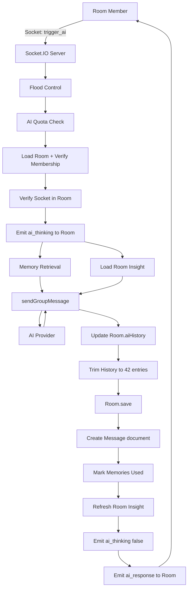
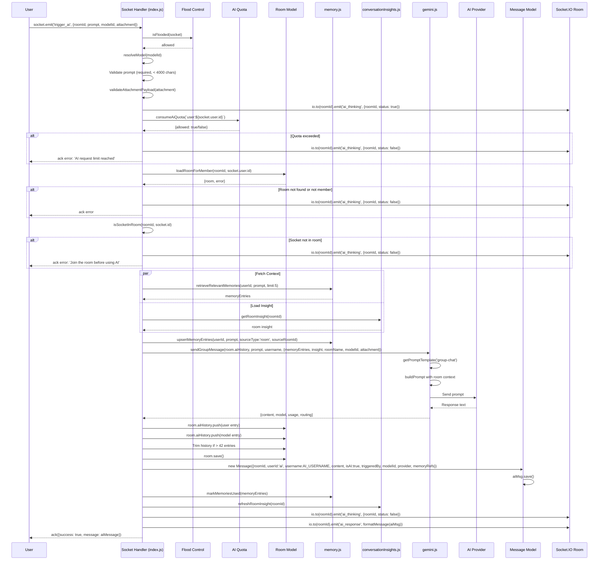
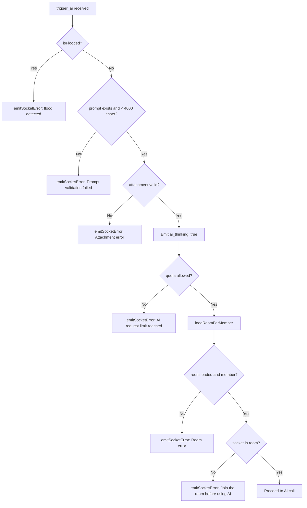
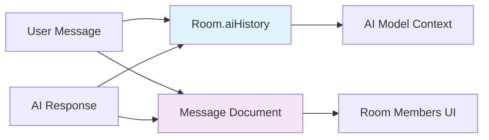
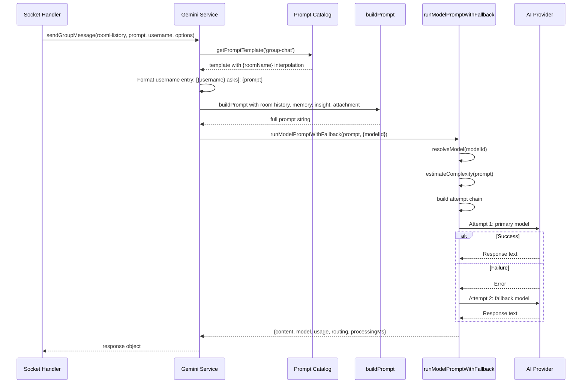
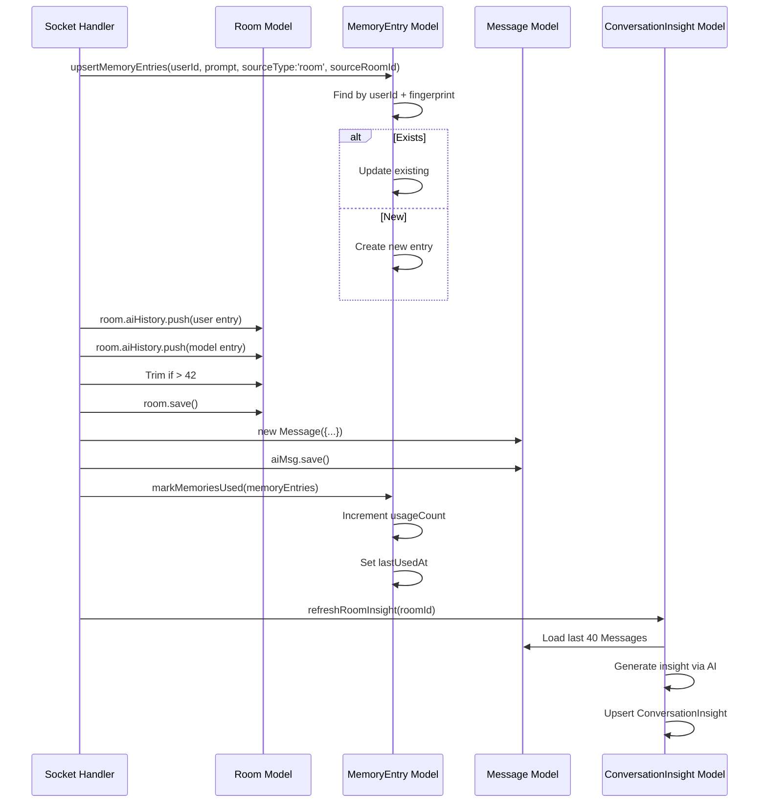
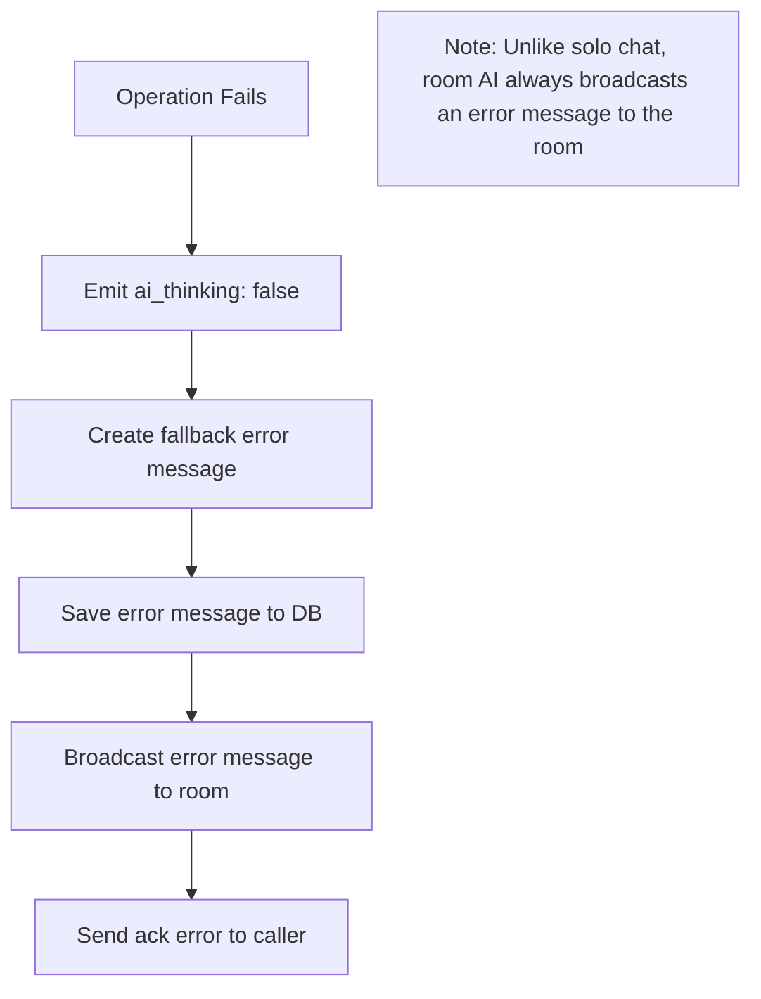

# 07. Room AI Flow

## Purpose

The Room AI feature enables any member of a chat room to trigger an AI response that is visible to all room participants. Unlike Solo Chat, Room AI operates over Socket.IO in real-time, broadcasts responses to all room members, and maintains a separate AI history within the Room document for context continuity. The AI acts as a virtual participant in group conversations.

**Purpose Statement**: Provide real-time, multi-user AI assistance within chat rooms with shared context, broadcast delivery, and persistent room-scoped AI history.

---

## Source Files and References

| File | Lines | Responsibility |
|------|-------|----------------|
| `index.js` | 716-831 | Socket.IO `trigger_ai` event handler |
| `services/gemini.js` | Full | `sendGroupMessage`, prompt building, fallback logic |
| `services/memory.js` | Full | Memory entry retrieval, upsertion, and usage tracking |
| `services/conversationInsights.js` | Full | Room insight generation and caching |
| `services/promptCatalog.js` | Full | Prompt template retrieval (`group-chat` template) |
| `services/messageFormatting.js` | Full | `formatMessage` for socket emission |
| `middleware/aiQuota.js` | Full | AI usage quota enforcement per user |
| `middleware/rateLimit.js` | Full | Socket flood control |
| `models/Room.js` | Full | Room schema with `aiHistory` array |
| `models/Message.js` | Full | Message schema for room-visible AI messages |

---

## Architecture Overview



---

## Event Contract

### Socket Event: `trigger_ai`

**Direction**: Client → Server

**Payload**:

| Field | Type | Required | Description |
|-------|------|----------|-------------|
| `roomId` | string | Yes | Target room ID |
| `prompt` | string | Yes | User's prompt to the AI (max 4000 chars) |
| `modelId` | string | No | Specific model to use |
| `attachment` | object | No | File attachment metadata |
| `attachment.fileUrl` | string | No | URL of uploaded file |
| `attachment.fileName` | string | No | Original filename |
| `attachment.fileType` | string | No | MIME type |
| `attachment.fileSize` | number | No | File size in bytes |

**Request Example**:

```json
{
  "roomId": "65f1a2b3c4d5e6f7a8b9c0d1",
  "prompt": "@ai summarize the last discussion",
  "modelId": "auto",
  "attachment": {
    "fileUrl": "/api/uploads/file.txt",
    "fileName": "file.txt",
    "fileType": "text/plain",
    "fileSize": 2000
  }
}
```

### Server Emissions

| Event | Direction | Payload | Timing |
|-------|-----------|---------|--------|
| `ai_thinking` | Server → Room | `{ roomId, status: true/false }` | Before AI call (true), after completion (false) |
| `ai_response` | Server → Room | Formatted AI message object | After successful AI response |
| `error_message` | Server → Caller | Error details | On validation or processing failure |

### Acknowledgment Response

```json
{
  "success": true,
  "message": {
    "_id": "msg_abc123",
    "roomId": "65f1a2b3c4d5e6f7a8b9c0d1",
    "userId": "ai",
    "username": "ChatSphere AI",
    "content": "Here's a summary of the discussion...",
    "isAI": true,
    "triggeredBy": "john_doe",
    "status": "delivered",
    "timestamp": "2026-03-15T10:30:00.000Z",
    "reactions": {},
    "modelId": "gemini-2.0-flash",
    "provider": "google",
    "memoryRefs": [
      { "id": "mem_xyz", "summary": "Team discussed deployment strategy", "score": 0.75 }
    ]
  }
}
```

---

## Request Lifecycle Sequence



---

## Validation Flow



### Validation Rules

| Rule | Condition | Error Response |
|------|-----------|----------------|
| Flood control | `isFlooded(socket)` returns true | Socket error via `emitSocketError` |
| Prompt required | `!prompt \|\| prompt.trim().length === 0` | `Prompt is required` |
| Prompt length | `prompt.trim().length > 4000` | `Prompt must be under 4000 characters` |
| Attachment valid | `validateAttachmentPayload(attachment)` returns error | Attachment-specific error |
| Quota available | `consumeAiQuota(key).allowed` is false | `AI request limit reached. Please wait a few minutes.` |
| Room membership | `loadRoomForMember` returns error | Room-specific error |
| Socket presence | `!isSocketInRoom(roomId, socket.id)` | `Join the room before using AI` |

---

## Dual History System

Room AI maintains two separate history stores, each serving a different purpose:

### Room.aiHistory (Model Context)

| Property | Value |
|----------|-------|
| **Location** | `Room.aiHistory` array field |
| **Purpose** | Prompt context for the AI model |
| **Format** | `{ role: 'user' \| 'model', parts: [{ text: string }] }` |
| **Capacity** | First 2 entries (system) + last 38 entries = 40 total + system |
| **Trim Strategy** | Keep first 2, then last 38 when exceeding 42 |
| **Visibility** | Server-side only, not sent to clients |

### Message Documents (User-Visible History)

| Property | Value |
|----------|-------|
| **Location** | `Message` collection in MongoDB |
| **Purpose** | User-visible chat history |
| **Format** | Full Message schema with reactions, status, etc. |
| **Capacity** | Unlimited (separate collection) |
| **Trim Strategy** | None (persistent) |
| **Visibility** | Sent to all room members via socket |

### Why Two Histories?



**Trade-offs**:
- **Pros**: Model context stays compact and optimized; user history is complete and queryable
- **Cons**: Duplication risk if one write succeeds and the other fails; no transactional guarantee

---

## AI History Trim Logic

### Trim Algorithm

```javascript
// index.js lines ~770-774
if (room.aiHistory.length > 42) {
  room.aiHistory = [
    room.aiHistory[0],           // System prompt entry 1
    room.aiHistory[1],           // System prompt entry 2
    ...room.aiHistory.slice(-38) // Last 38 conversation entries
  ];
}
```

### Trim Visualization

```
Before trim (43 entries):
[0] System prompt 1
[1] System prompt 2
[2] User-AI exchange 1
[3] User-AI exchange 2
...
[40] User-AI exchange 39
[41] User-AI exchange 40
[42] New user message

After trim (42 entries):
[0] System prompt 1        (kept)
[1] System prompt 2        (kept)
[2] User-AI exchange 5     (oldest kept)
[3] User-AI exchange 6
...
[40] User-AI exchange 40
[41] New user message      (newest)
```

### Trim Implications

| Aspect | Detail |
|--------|--------|
| System prompts | Always preserved (first 2 entries) |
| Middle history | Discarded when room exceeds 42 entries |
| Recent history | Always preserved (last 38 entries) |
| Capacity | ~19 AI exchanges (each exchange = 2 entries) |
| Trigger | Every request that pushes total over 42 |

---

## AI Message Persistence

### Message Document Structure

| Field | Value | Notes |
|-------|-------|-------|
| `roomId` | Room ID | Links message to room |
| `userId` | `'ai'` | String literal, not ObjectId |
| `username` | `AI_USERNAME` | Constant (e.g., "ChatSphere AI") |
| `content` | AI response text | Full generated content |
| `isAI` | `true` | Flag for AI-generated messages |
| `triggeredBy` | Username of triggering user | e.g., "john_doe" |
| `status` | `'delivered'` | Message delivery status |
| `reactions` | `new Map()` | Empty reactions map |
| `modelId` | `response.model.id` | Actual model used |
| `provider` | `response.model.provider` | AI provider name |
| `memoryRefs` | Array of memory references | Up to 5 entries |

### Metadata Differences from Solo Chat

| Field | Solo Chat | Room AI | Notes |
|-------|-----------|---------|-------|
| `processingMs` | Stored | Not stored | Room AI doesn't track timing |
| `promptTokens` | Stored | Not stored | No token tracking in Message |
| `completionTokens` | Stored | Not stored | No token tracking in Message |
| `totalTokens` | Stored | Not stored | No token tracking in Message |
| `autoMode` | Stored | Not stored | No routing metadata in Message |
| `autoComplexity` | Stored | Not stored | No routing metadata in Message |
| `fallbackUsed` | Stored | Not stored | No routing metadata in Message |
| `requestedModelId` | Stored | Not stored | Original model not tracked |

---

## Group Message AI Service

### sendGroupMessage Flow



### Prompt Composition for Group Chat

```
[SYSTEM TEMPLATE - from 'group-chat' prompt catalog with {roomName} interpolated]

[ROOM HISTORY - Room.aiHistory entries formatted as parts]

[MEMORY ENTRIES - up to 5 relevant memories]

[ROOM INSIGHT - summary, intent, topics]

[ATTACHMENT - extracted text or image data]

[USER MESSAGE - formatted as [{username} asks]: {prompt}]
```

---

## Database Operations

### Write Operations Sequence



### Room Model Fields (AI-related)

| Field | Type | Notes |
|-------|------|-------|
| `name` | string | Room name, interpolated into prompt |
| `members` | array | Member list for access control |
| `creatorId` | ObjectId | Room creator |
| `maxUsers` | number | Maximum room capacity |
| `aiHistory` | array | AI prompt context (capped at 42) |

---

## Error Handling

### Error Path Flow

```mermaid
flowchart TD
    Start[Error Caught in try/catch] --> LogModel[Log failed model/provider]
    LogModel --> EmitThinkingOff[io.to(roomId).emit ai_thinking false]
    EmitThinkingOff --> CreateErrMsg[new Message with error content]
    CreateErrMsg --> SaveErrMsg[errorMsg.save]
    SaveErrMsg --> EmitResponse[io.to(roomId).emit ai_response with error message]
    EmitResponse --> EmitSocketErr[emitSocketError to caller]
    EmitSocketErr --> End[Handler completes]
```

### Error Message Content

When an error occurs, a fallback AI message is created and broadcast:

```javascript
const errorMsg = new Message({
  roomId,
  userId: 'ai',
  username: AI_USERNAME,
  content: 'I ran into an error while processing that request. Please try again.',
  isAI: true,
  triggeredBy: socket.user.username,
  status: 'delivered',
  reactions: new Map(),
});
```

### Error Response Matrix

| Scenario | Status | Client Response | Room Broadcast |
|----------|--------|-----------------|----------------|
| Flood detected | N/A | Socket error | None |
| Empty prompt | N/A | `Prompt is required` | None |
| Prompt too long | N/A | `Prompt must be under 4000 characters` | None |
| Invalid attachment | N/A | Attachment error | None |
| Quota exceeded | N/A | `AI request limit reached` | `ai_thinking: false` |
| Room not found | N/A | Room error | `ai_thinking: false` |
| Not a member | N/A | Room error | `ai_thinking: false` |
| Socket not in room | N/A | `Join the room before using AI` | `ai_thinking: false` |
| AI provider failure | N/A | `AI request failed` | Error message + `ai_response` |

---

## Failure Cases and Recovery

### Failure Scenarios

| Scenario | Detection | Recovery | Data Impact |
|----------|-----------|----------|-------------|
| AI provider timeout | `runModelPromptWithFallback` catches error | Automatic fallback to secondary model | No data loss |
| Room save failure | Exception in `room.save()` | Catch block creates error message | aiHistory may be partially updated |
| Message save failure | Exception in `aiMsg.save()` | Caught in outer catch | Error message created and broadcast |
| Memory upsert failure | Exception in `upsertMemoryEntries` | Caught in outer catch | Error message created and broadcast |
| Insight refresh failure | Exception in `refreshRoomInsight` | Caught in outer catch | Error message created and broadcast |
| Quota check failure | `consumeAiQuota` throws | Caught in outer catch | Error message created and broadcast |

### Recovery Flow



### Key Difference from Solo Chat

| Aspect | Solo Chat | Room AI |
|--------|-----------|---------|
| Error visibility | Only to requesting user | Broadcast to entire room |
| Error message | JSON error response | Visible AI message in chat |
| Recovery | HTTP error response | Graceful error message in room |
| State cleanup | No partial writes | Error message always persisted |

---

## Scaling Considerations

### Performance Bottlenecks

| Operation | Complexity | Scaling Concern | Mitigation |
|-----------|------------|-----------------|------------|
| Room load | Single document read | Large room documents with long aiHistory | aiHistory capped at 42 entries |
| AI call | External API latency | Blocks socket handler during wait | `ai_thinking` status keeps UI responsive |
| Room save | Single document write | Concurrent saves may conflict | No locking mechanism |
| Message save | Single document insert | High message volume | Separate collection, indexed by roomId |
| Insight refresh | AI call on last 40 messages | Additional latency after AI response | Consider debouncing |

### Multi-Instance Deployment Concerns

| Concern | Description | Impact |
|---------|-------------|--------|
| In-memory flood control | Flood state is per-process | Different instances may allow different rates |
| In-memory quota | Quota state is per-process | Quota not shared across instances |
| Socket room membership | `isSocketInRoom` checks local socket map | May fail if user connected to different instance |
| ai_thinking broadcast | Emitted to all instances via Socket.IO adapter | Works correctly with Redis adapter |

### Operational Recommendations

| Area | Recommendation | Priority |
|------|----------------|----------|
| Quota sharing | Use Redis-backed quota for multi-instance | High |
| Flood control | Move to Redis or shared store | Medium |
| Insight refresh | Debounce or run asynchronously | Medium |
| Error tracking | Add requestId to socket error responses | Low |
| Token tracking | Add token usage to Message schema | Low |

---

## Inconsistencies and Risks

### Identified Issues

| Issue | Severity | Description | Impact |
|-------|----------|-------------|--------|
| No transaction | High | Room save and Message save are not atomic | aiHistory and Message can diverge |
| Missing metadata | Medium | Message doesn't store token counts, routing info | Less observability than solo chat |
| In-memory state | Medium | Flood control and quota are process-local | Inconsistent behavior across instances |
| Insight latency | Low | Insight refresh blocks the response | Increased end-to-end latency |
| Error message generic | Low | All errors produce same fallback text | Users can't distinguish error types |
| History trim edge case | Low | Trim assumes first 2 entries are system prompts | May break if format changes |

### Improvement Areas

| Area | Current State | Proposed Improvement |
|------|---------------|---------------------|
| Transactions | None | Wrap room save + message save in MongoDB transaction |
| Metadata parity | Missing tracking fields | Add token counts and routing info to Message |
| Quota sharing | In-memory | Use Redis-backed quota store |
| Insight async | Synchronous | Move insight refresh to background queue |
| Error specificity | Generic message | Include error type in broadcast message |
| Service extraction | Inline in index.js | Extract to dedicated room AI service |

---

## How to Rebuild From Scratch

### Step 1: Define Socket Event Contract

```javascript
// Client → Server
socket.emit('trigger_ai', {
  roomId: 'room-id',
  prompt: 'Summarize the discussion',
  modelId: 'auto',
  attachment: { fileUrl, fileName, fileType, fileSize }
}, callback);

// Server → Room
io.to(roomId).emit('ai_thinking', { roomId, status: true });
io.to(roomId).emit('ai_thinking', { roomId, status: false });
io.to(roomId).emit('ai_response', formattedMessage);

// Server → Caller (acknowledgment)
callback({ success: true, message: formattedMessage });
```

### Step 2: Implement Validation Chain

1. Check flood control
2. Validate prompt (required, < 4000 chars)
3. Validate attachment payload
4. Emit `ai_thinking: true` to room
5. Check AI quota
6. Load room and verify membership
7. Verify socket is in room

### Step 3: Build Context Fetching

```javascript
const [memoryEntries, insight] = await Promise.all([
  retrieveRelevantMemories({
    userId: socket.user.id,
    query: prompt.trim(),
    limit: 5,
  }),
  getRoomInsight(roomId),
]);

await upsertMemoryEntries({
  userId: socket.user.id,
  text: prompt.trim(),
  sourceType: 'room',
  sourceRoomId: roomId,
});
```

### Step 4: Call AI Service

```javascript
const response = await sendGroupMessage(room.aiHistory, prompt.trim(), socket.user.username, {
  memoryEntries,
  insight,
  roomName: room.name,
  modelId,
  attachment,
});
```

### Step 5: Update Histories

```javascript
// Update Room.aiHistory
room.aiHistory.push({ role: 'user', parts: [{ text: `[${socket.user.username} asks]: ${prompt.trim()}` }] });
room.aiHistory.push({ role: 'model', parts: [{ text: response.content }] });

// Trim if needed
if (room.aiHistory.length > 42) {
  room.aiHistory = [room.aiHistory[0], room.aiHistory[1], ...room.aiHistory.slice(-38)];
}
await room.save();

// Create visible message
const aiMsg = new Message({
  roomId,
  userId: 'ai',
  username: AI_USERNAME,
  content: response.content,
  isAI: true,
  triggeredBy: socket.user.username,
  status: 'delivered',
  reactions: new Map(),
  modelId: response.model.id,
  provider: response.model.provider,
  memoryRefs: memoryEntries.slice(0, 5).map((entry) => ({
    id: entry._id.toString(),
    summary: entry.summary,
    score: entry.score,
  })),
});
await aiMsg.save();
```

### Step 6: Broadcast and Acknowledge

```javascript
await markMemoriesUsed(memoryEntries);
await refreshRoomInsight(roomId);

io.to(roomId).emit('ai_thinking', { roomId, status: false });
const aiMessage = formatMessage(aiMsg);
io.to(roomId).emit('ai_response', aiMessage);
ack({ success: true, message: aiMessage });
```

### Step 7: Handle Errors

```javascript
catch (err) {
  const failedModel = err?.model || requestedModel;
  io.to(roomId).emit('ai_thinking', { roomId, status: false });

  const errorMsg = new Message({
    roomId,
    userId: 'ai',
    username: AI_USERNAME,
    content: 'I ran into an error while processing that request. Please try again.',
    isAI: true,
    triggeredBy: socket.user.username,
    status: 'delivered',
    reactions: new Map(),
  });
  await errorMsg.save();
  io.to(roomId).emit('ai_response', formatMessage(errorMsg));
  emitSocketError(socket, ack, 'AI request failed', {
    modelId: failedModel?.id || null,
    provider: failedModel?.provider || null,
  });
}
```

### Step 8: Test Scenarios

| Test Case | Expected Result |
|-----------|-----------------|
| Empty prompt | Socket error: "Prompt is required" |
| Prompt > 4000 chars | Socket error: "Prompt must be under 4000 characters" |
| User not in room | Socket error: "Join the room before using AI" |
| Quota exceeded | Socket error with `ai_thinking: false` broadcast |
| Successful AI call | `ai_response` broadcast to room, ack to caller |
| AI provider failure | Error message broadcast to room, ack error to caller |
| History trim | aiHistory stays at 42 entries max |

---

## Quick Reference

### Key Functions

| Function | File | Purpose |
|----------|------|---------|
| `sendGroupMessage` | `services/gemini.js` | AI call for group chat context |
| `retrieveRelevantMemories` | `services/memory.js` | Score and return relevant memories |
| `upsertMemoryEntries` | `services/memory.js` | Create or update memory entries |
| `markMemoriesUsed` | `services/memory.js` | Update memory usage tracking |
| `refreshRoomInsight` | `services/conversationInsights.js` | Generate/update room insight |
| `getPromptTemplate` | `services/promptCatalog.js` | Load `group-chat` template |
| `formatMessage` | `services/messageFormatting.js` | Format message for socket emission |
| `loadRoomForMember` | Various | Load room and verify membership |
| `isSocketInRoom` | Various | Check if socket is in room |
| `consumeAiQuota` | `middleware/aiQuota.js` | Check and consume AI quota |

### Configuration Points

| Setting | Location | Description |
|---------|----------|-------------|
| AI history cap | `index.js` | 42 entries (2 system + 40 conversation) |
| Prompt max length | `index.js` | 4000 characters |
| Memory limit | `retrieveRelevantMemories` call | Default 5 memories per request |
| Memory refs in message | `index.js` | Up to 5 memory references |
| AI username | `AI_USERNAME` constant | Display name for AI messages |
| Attachment text limit | `buildAttachmentPayload` | Up to 12,000 characters |
| Attachment image limit | `buildAttachmentPayload` | Up to 3MB base64 |
