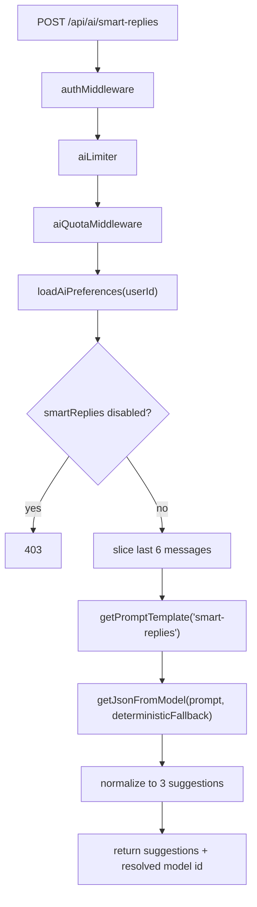

# 08. Smart Replies Flow

## Purpose

This file explains `POST /api/ai/smart-replies`, including settings gates, prompt construction, fallback behavior, and the absence of storage writes.

## Relevant Files

- `routes/ai.js`
- `services/gemini.js`
- `services/promptCatalog.js`
- `models/User.js`
- `middleware/aiQuota.js`
- `middleware/rateLimit.js`

## Request Shape

```json
{
  "messages": [
    { "username": "maya", "content": "Can you send the notes?" },
    { "username": "ravi", "content": "Sure, give me five minutes." }
  ],
  "context": "project handoff",
  "modelId": "auto"
}
```

## Flow



## Settings Gate

The route loads `settings.aiFeatures.smartReplies`.

Behavior:

- if the value is explicitly `false`, return `403`
- otherwise the feature is treated as enabled

## Fallback

Fallback is not generic. It depends on the last message:

- if the last message ends with `?`, return question-oriented replies
- otherwise return generic agreement/update replies

## Normalization Rules

After model output:

- only arrays are accepted as suggestions
- each item is coerced to trimmed string
- empty items are dropped
- list is capped at 3
- if fewer than 3 remain, `"Interesting!"` is appended until length is 3

## Storage And Side Effects

There are no MongoDB writes.

Reads only:

- `User` for AI feature preferences
- `PromptTemplate` via prompt catalog

## Failure Cases

| Failure | Behavior |
| --- | --- |
| no messages array | `400` |
| settings disabled | `403` |
| provider/JSON failure | warning log, deterministic fallback |
| unexpected route failure | `500` with `requestId` |

## `dist/` Drift Notes

`dist/routes/ai.routes.js` and `dist/services/aiFeature.service.js` differ:

- request body uses a single `message`, not a `messages` array
- output field is `replies`, not `suggestions`

## Rebuild Notes

1. treat smart replies as a stateless generation feature with strict JSON schema
2. log the final resolved model and whether fallback happened
3. add optional conversation-role metadata instead of free-form `username` strings

