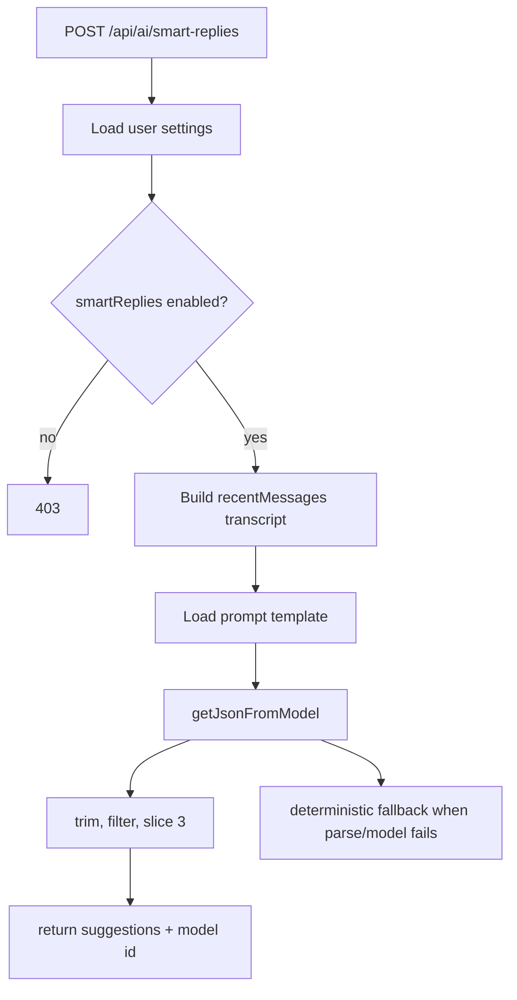

# 08. Smart Replies Flow

## Purpose
This document explains the `/api/ai/smart-replies` helper feature.

## Relevant Files
- `routes/ai.js`
- `services/gemini.js`
- `services/promptCatalog.js`
- `models/User.js`

## Route Summary
Endpoint:

- `POST /api/ai/smart-replies`

Middleware:

- `authMiddleware`
- `aiLimiter`
- `aiQuotaMiddleware`

## Required Input
The route expects:

- `messages` as a non-empty array
- optional `context`
- optional `modelId`

## Execution Logic
1. Load user AI settings
2. Reject if `settings.aiFeatures.smartReplies === false`
3. Normalize the last six messages into a compact transcript
4. Load prompt template `smart-replies`
5. Call `getJsonFromModel(...)`
6. If model parsing fails, use deterministic fallback replies
7. Normalize to exactly three short strings
8. Return chosen model metadata

## Flow Diagram

## Deterministic Fallback
If the latest message ends with `?`, fallback replies are question-oriented:

- `Yes, that works for me.`
- `Let me check and get back to you.`
- `Can you share a bit more detail?`

Otherwise fallback replies are more general:

- `Sounds good.`
- `Thanks for the update.`
- `Let's do that.`

## Database Writes
This feature does not directly update MongoDB. It only reads:

- `User` for settings
- `PromptTemplate` for prompt overrides

## Improvement Opportunities
- add stricter validation on message item shape
- persist telemetry about fallback frequency
- capture user acceptance rate for suggestions
- separate helper features into dedicated service layer

