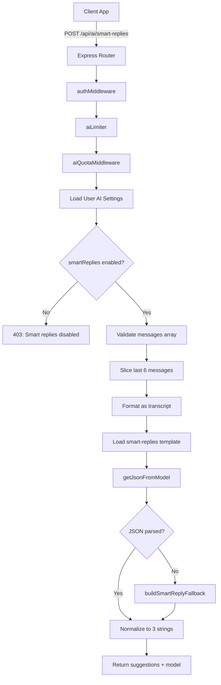
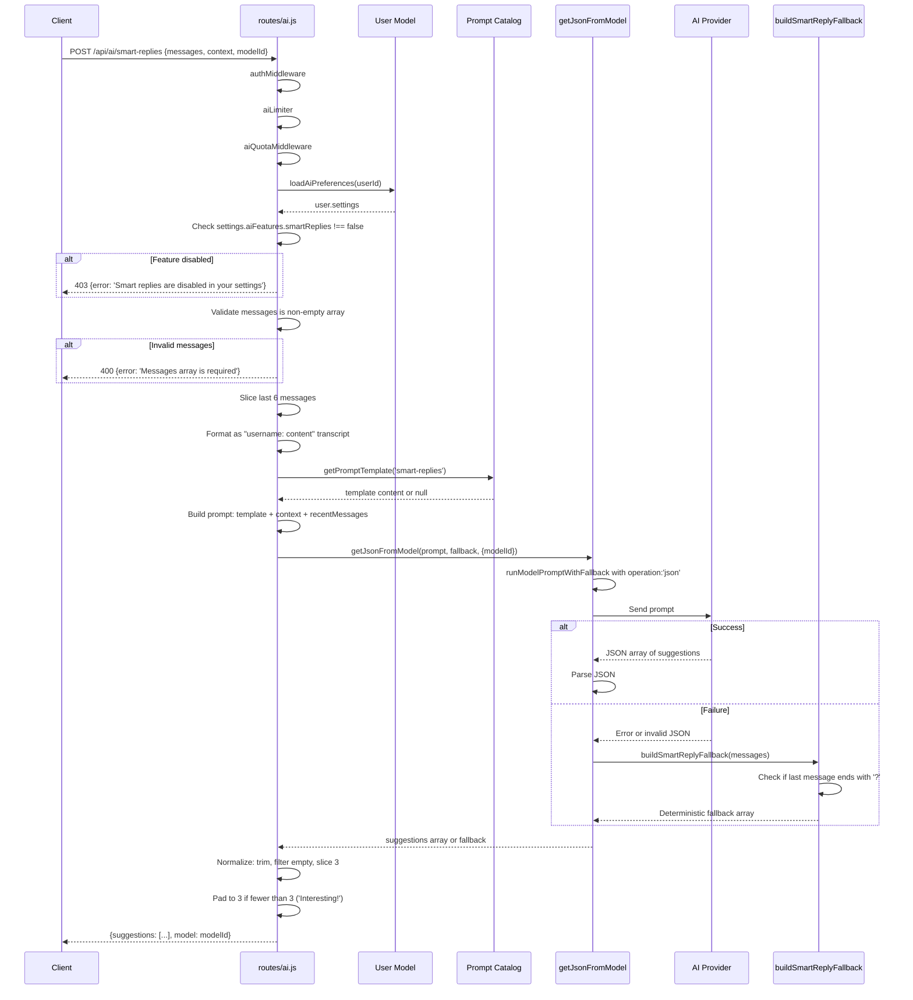
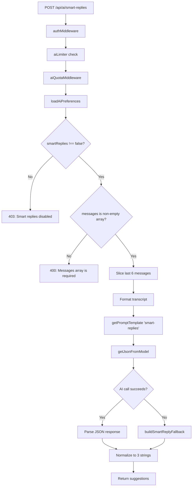
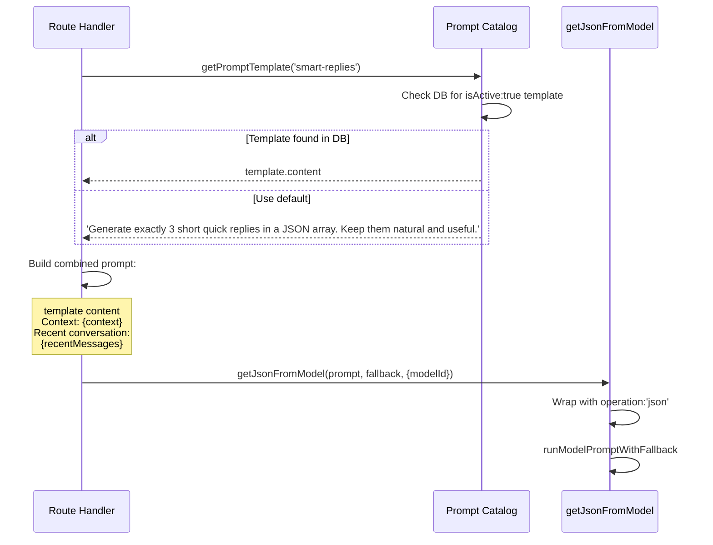
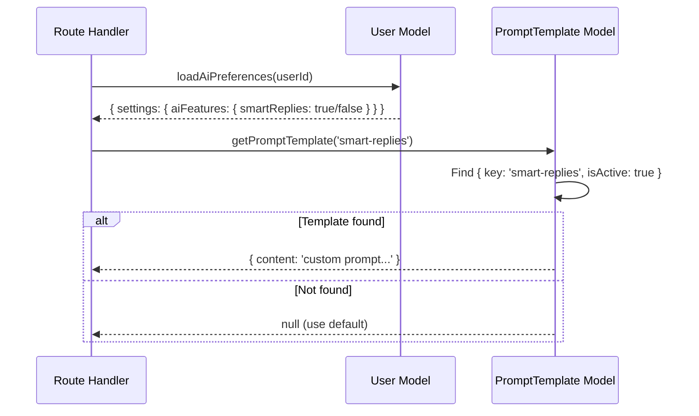
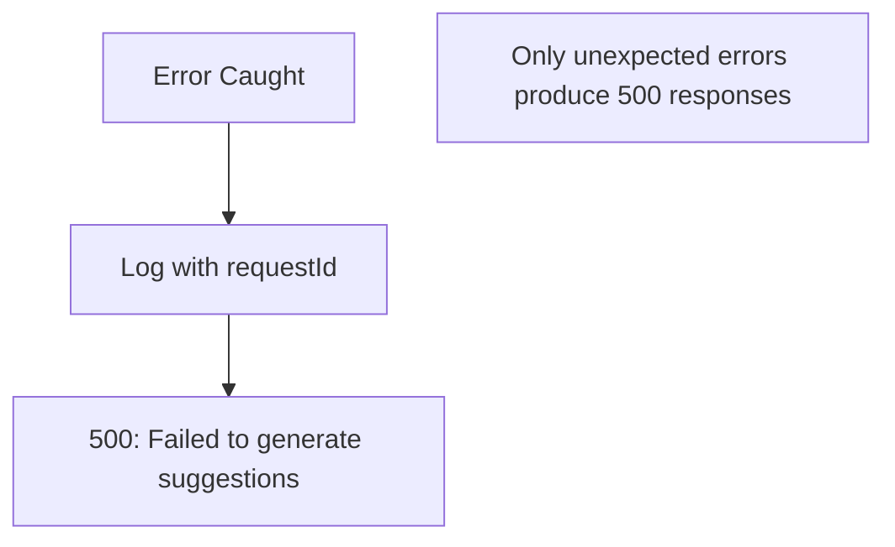
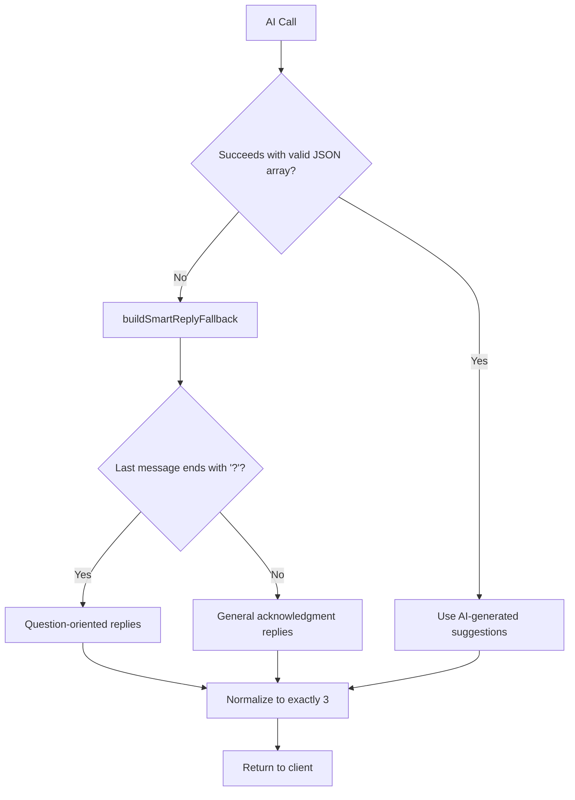

# 08. Smart Replies Flow

## Purpose

The Smart Replies feature generates contextually relevant quick-reply suggestions based on recent conversation messages. It provides users with one-tap response options that are natural and appropriate to the current conversation context. This is a lightweight AI helper that operates independently of the main chat flow, returning suggestions without modifying any conversation state.

**Purpose Statement**: Provide AI-generated, context-aware quick-reply suggestions to accelerate user responses in chat conversations.

---

## Source Files and References

| File | Lines | Responsibility |
|------|-------|----------------|
| `routes/ai.js` | Smart replies section | REST endpoint handler, validation, fallback logic |
| `services/gemini.js` | Full | `getJsonFromModel` for JSON-structured AI responses |
| `services/promptCatalog.js` | Full | Prompt template retrieval (`smart-replies` key) |
| `middleware/aiQuota.js` | Full | AI usage quota enforcement per user |
| `middleware/rateLimit.js` | Full | `aiLimiter`: 15min window, max 80 requests |
| `models/User.js` | Full | User settings for feature toggles |

---

## Architecture Overview



---

## Endpoint Specification

### POST /api/ai/smart-replies

| Property | Value |
|----------|-------|
| **Authentication** | Required (JWT via `authMiddleware`) |
| **Rate Limiting** | `aiLimiter` (15min window, max 80) + `aiQuotaMiddleware` |
| **Content-Type** | `application/json` |
| **Idempotent** | Yes (same input produces same output with same model) |

### Request Body Schema

| Field | Type | Required | Description |
|-------|------|----------|-------------|
| `messages` | array | Yes | Array of message objects from recent conversation |
| `messages[].username` | string | No | Sender's username |
| `messages[].role` | string | No | Message role (user/assistant) |
| `messages[].content` | string | Yes | Message text content |
| `context` | string | No | Additional context (e.g., "General chat", "Project discussion") |
| `modelId` | string | No | Specific model to use for generation |

### Request Example

```json
{
  "messages": [
    { "username": "alice", "content": "Hey, are you free for a call tomorrow?" },
    { "username": "bob", "content": "Let me check my schedule." },
    { "username": "alice", "content": "No rush, just let me know by evening." },
    { "username": "bob", "content": "Sounds good, I'll ping you later." },
    { "username": "alice", "content": "What time works best for you?" },
    { "username": "bob", "content": "Maybe around 3 PM?" }
  ],
  "context": "Team coordination",
  "modelId": "gemini-2.0-flash"
}
```

### Response Body Schema

| Field | Type | Description |
|-------|------|-------------|
| `suggestions` | string[] | Array of exactly 3 quick-reply suggestions |
| `model` | string | Model ID used for generation |

### Response Example

```json
{
  "suggestions": [
    "3 PM works perfectly for me!",
    "Can we do 4 PM instead?",
    "Sure, I'll be available then"
  ],
  "model": "gemini-2.0-flash"
}
```

---

## Request Lifecycle Sequence



---

## Validation Flow



### Validation Rules

| Rule | Condition | Error Response |
|------|-----------|----------------|
| Feature enabled | `user?.settings?.aiFeatures?.smartReplies === false` | `403: Smart replies are disabled in your settings` |
| Messages array | `!Array.isArray(messages) \|\| messages.length === 0` | `400: Messages array is required` |

---

## Message Transcript Construction

### Algorithm

```javascript
// routes/ai.js - transcript building
const recentMessages = messages
  .slice(-6)                                    // Take last 6 messages
  .map((message) => 
    `${message.username || message.role || 'user'}: ${message.content}`  // Format each
  )
  .join('\n');                                  // Join with newlines
```

### Example Transformation

**Input messages**:
```json
[
  { "username": "alice", "content": "Hey everyone!" },
  { "username": "bob", "content": "Hi Alice, what's up?" },
  { "username": "charlie", "content": "Hey!" },
  { "username": "alice", "content": "Can we discuss the project timeline?" },
  { "username": "bob", "content": "Sure, I think we're on track." },
  { "username": "charlie", "content": "I have some concerns about the deadline." },
  { "username": "alice", "content": "What concerns do you have?" },
  { "username": "bob", "content": "Should we schedule a meeting?" }
]
```

**Output transcript** (last 6 only):
```
alice: Can we discuss the project timeline?
bob: Sure, I think we're on track.
charlie: I have some concerns about the deadline.
alice: What concerns do you have?
bob: Should we schedule a meeting?
charlie: I'm worried about the testing phase.
```

### Design Decisions

| Decision | Rationale |
|----------|-----------|
| Last 6 messages only | Balances context with token efficiency |
| Username fallback to role | Handles messages without username field |
| Role fallback to 'user' | Ensures every message has a sender label |
| Newline separator | Clear message boundaries for the AI |

---

## Deterministic Fallback System

### Fallback Logic

```mermaid
flowchart TD
    Start[buildSmartReplyFallback called] --> GetLast[lastMessage = messages[messages.length - 1]?.content]
    GetLast --> Trim[lastMessage.trim()]
    Trim --> CheckQ{Ends with '?'?}
    CheckQ -->|Yes| QuestionReplies[Return question-oriented replies]
    CheckQ -->|No| GeneralReplies[Return general acknowledgments]
    
    QuestionReplies --> Q1['Yes, that works for me.']
    QuestionReplies --> Q2['Let me check and get back to you.']
    QuestionReplies --> Q3['Can you share a bit more detail?']
    
    GeneralReplies --> G1['Sounds good.']
    GeneralReplies --> G2['Thanks for the update.']
    GeneralReplies --> G3['Let\'s do that.']
```

### Fallback Reply Sets

| Trigger Condition | Reply 1 | Reply 2 | Reply 3 |
|-------------------|---------|---------|---------|
| Last message ends with `?` | `Yes, that works for me.` | `Let me check and get back to you.` | `Can you share a bit more detail?` |
| Last message does NOT end with `?` | `Sounds good.` | `Thanks for the update.` | `Let's do that.` |

### Fallback Function

```javascript
function buildSmartReplyFallback(messages) {
  const lastMessage = messages[messages.length - 1]?.content || '';
  if (/\?$/.test(lastMessage.trim())) {
    return [
      'Yes, that works for me.',
      'Let me check and get back to you.',
      'Can you share a bit more detail?'
    ];
  }
  return [
    'Sounds good.',
    'Thanks for the update.',
    "Let's do that."
  ];
}
```

---

## Prompt Construction

### Prompt Template Flow



### Default Prompt Template

```
Generate exactly 3 short quick replies in a JSON array. Keep them natural and useful.

Context: General chat

Recent conversation:
alice: Hey, are you free tomorrow?
bob: Let me check my schedule.
alice: No rush, just let me know.
```

### Prompt Components

| Component | Source | Purpose |
|-----------|--------|---------|
| Template content | Prompt catalog (DB or default) | Instructs AI on output format |
| Context | `req.body.context` or "General chat" | Provides conversation setting |
| Recent messages | Last 6 messages formatted | Provides conversation context |

---

## Response Normalization

### Normalization Pipeline

```mermaid
flowchart TD
    Start[Raw AI Response] --> CheckArray{Is array?}
    CheckArray -->|No| EmptyArr[Use empty array]
    CheckArray -->|Yes| MapItems[Map each item]
    MapItems --> ToString[String(item)]
    ToString --> Trim[.trim]
    Trim --> FilterBool[Filter falsy]
    FilterBool --> Slice3[.slice(0, 3)]
    Slice3 --> CheckLen{Length < 3?}
    CheckLen -->|Yes| Pad[Pad with 'Interesting!']
    CheckLen -->|No| Done[Return normalized array]
    Pad --> Done
```

### Normalization Code

```javascript
const normalized = (Array.isArray(suggestions) ? suggestions : [])
  .map((item) => String(item).trim())    // Convert to string and trim
  .filter(Boolean)                        // Remove empty strings
  .slice(0, 3);                           // Take at most 3

while (normalized.length < 3) {           // Pad to exactly 3
  normalized.push('Interesting!');
}
```

### Normalization Guarantees

| Guarantee | Implementation |
|-----------|----------------|
| Always an array | `Array.isArray(suggestions) ? suggestions : []` |
| All strings | `String(item).trim()` |
| No empty strings | `.filter(Boolean)` |
| Maximum 3 items | `.slice(0, 3)` |
| Minimum 3 items | `while (normalized.length < 3) push('Interesting!')` |
| Exactly 3 items | Combination of slice and while loop |

---

## Database Operations

### Read Operations

| Operation | Model | Purpose |
|-----------|-------|---------|
| `loadAiPreferences(userId)` | User | Check if smartReplies feature is enabled |
| `getPromptTemplate('smart-replies')` | PromptTemplate | Load custom prompt template if available |

### Write Operations

**None**. This feature is purely read-only. It does not modify any database records.

### Read Flow



---

## Error Handling

### Error Response Matrix

| Error Type | Status Code | Error Message | Additional Fields |
|------------|-------------|---------------|-------------------|
| Feature disabled | 403 | `Smart replies are disabled in your settings` | - |
| Missing messages | 400 | `Messages array is required` | - |
| AI provider failure | 500 | `Failed to generate suggestions` | `requestId` |
| Server error | 500 | `Failed to generate suggestions` | `requestId` |

### Error Flow



### Fallback vs Error Distinction

| Situation | Behavior | Response Code |
|-----------|----------|---------------|
| AI provider returns invalid JSON | Use deterministic fallback | 200 (success) |
| AI provider times out | Use deterministic fallback | 200 (success) |
| AI provider returns non-array | Use deterministic fallback | 200 (success) |
| Database read fails for user settings | Outer catch block | 500 (error) |
| Unexpected exception | Outer catch block | 500 (error) |

---

## Feature Toggle System

### User Settings Structure

```javascript
// Expected shape in User document
{
  settings: {
    aiFeatures: {
      smartReplies: true,    // or false to disable
      sentimentAnalysis: true,
      grammarCheck: true
    }
  }
}
```

### Toggle Check

```javascript
const user = await loadAiPreferences(req.user.id);
if (user?.settings?.aiFeatures?.smartReplies === false) {
  return res.status(403).json({ error: 'Smart replies are disabled in your settings' });
}
```

### Toggle Behavior

| Setting Value | Behavior |
|---------------|----------|
| `true` | Feature enabled |
| `false` | Feature disabled (403 response) |
| `undefined` / missing | Feature enabled (defaults to on) |
| `null` | Feature enabled (defaults to on) |

---

## Scaling Considerations

### Performance Characteristics

| Operation | Latency | Scaling Concern | Mitigation |
|-----------|---------|-----------------|------------|
| User settings read | Low (indexed query) | Minimal impact | User document is small |
| Prompt template read | Low (single query) | Template cache could help | Templates rarely change |
| AI model call | High (external API) | Primary bottleneck | Fallback provides resilience |
| Response normalization | Negligible | No concern | In-memory operations only |

### Throughput Analysis

| Metric | Estimate | Notes |
|--------|----------|-------|
| AI call duration | 500ms - 3000ms | Depends on model and load |
| Fallback duration | < 1ms | Pure JavaScript, no I/O |
| Request rate limit | 80 per 15 minutes | Per-user via aiLimiter |
| Concurrent requests | Limited by quota | Quota prevents abuse |

### Operational Recommendations

| Area | Recommendation | Priority |
|------|----------------|----------|
| Caching | Cache prompt templates in memory | Low |
| Fallback telemetry | Track fallback frequency for monitoring | Medium |
| Acceptance tracking | Log which suggestions users actually send | Medium |
| Model selection | Allow per-user model preference | Low |

---

## Failure Cases and Recovery

### Failure Scenarios

| Scenario | Detection | Recovery | User Impact |
|----------|-----------|----------|-------------|
| AI provider timeout | `getJsonFromModel` catch block | Deterministic fallback | Generic but functional suggestions |
| Invalid JSON response | JSON parse failure | Deterministic fallback | Generic but functional suggestions |
| Non-array response | `Array.isArray` check | Deterministic fallback | Generic but functional suggestions |
| Empty array response | Normalization pad loop | Padded with "Interesting!" | One generic suggestion |
| User settings read failure | Outer catch block | 500 error | Feature unavailable temporarily |
| Prompt template read failure | Returns null | Uses default template | No impact, default is adequate |

### Recovery Flow



---

## Inconsistencies and Risks

### Identified Issues

| Issue | Severity | Description | Impact |
|-------|----------|-------------|--------|
| No input validation depth | Low | Message item shape not validated | Malformed messages may produce poor suggestions |
| Fallback is static | Low | Same 3 replies regardless of context | Repetitive suggestions when AI fails |
| No telemetry | Medium | No tracking of fallback usage | Cannot measure AI reliability |
| No acceptance tracking | Medium | No record of which suggestions are used | Cannot improve suggestion quality |
| Context is optional | Low | Empty context defaults to "General chat" | May reduce suggestion relevance |
| No language detection | Low | Assumes English responses | Non-English conversations get English suggestions |

### Improvement Areas

| Area | Current State | Proposed Improvement |
|------|---------------|---------------------|
| Input validation | Array type check only | Validate message item shape (content required) |
| Fallback quality | Static replies | Context-aware fallback using keyword matching |
| Telemetry | None | Track fallback rate, model used, response time |
| Acceptance tracking | None | Log which suggestion user selects |
| Language support | English only | Detect language and adapt suggestions |
| Suggestion diversity | No deduplication | Ensure suggestions are distinct from each other |

---

## How to Rebuild From Scratch

### Step 1: Define Endpoint

```
POST /api/ai/smart-replies
Auth: JWT
Rate Limit: aiLimiter + aiQuotaMiddleware
```

### Step 2: Implement Feature Toggle Check

```javascript
const user = await loadAiPreferences(req.user.id);
if (user?.settings?.aiFeatures?.smartReplies === false) {
  return res.status(403).json({ error: 'Smart replies are disabled in your settings' });
}
```

### Step 3: Validate Input

```javascript
const { messages, context, modelId } = req.body;
if (!Array.isArray(messages) || messages.length === 0) {
  return res.status(400).json({ error: 'Messages array is required' });
}
```

### Step 4: Build Transcript

```javascript
const recentMessages = messages
  .slice(-6)
  .map((message) => `${message.username || message.role || 'user'}: ${message.content}`)
  .join('\n');
```

### Step 5: Load Template and Call AI

```javascript
const template = await getPromptTemplate('smart-replies');
const suggestions = await getJsonFromModel(
  [
    template?.content || 'Generate exactly 3 short quick replies in a JSON array. Keep them natural and useful.',
    `Context: ${context || 'General chat'}`,
    `Recent conversation:\n${recentMessages}`,
  ].join('\n\n'),
  buildSmartReplyFallback(messages),
  { modelId }
);
```

### Step 6: Normalize Response

```javascript
const normalized = (Array.isArray(suggestions) ? suggestions : [])
  .map((item) => String(item).trim())
  .filter(Boolean)
  .slice(0, 3);

while (normalized.length < 3) {
  normalized.push('Interesting!');
}
```

### Step 7: Return Response

```javascript
res.json({
  suggestions: normalized,
  model: resolveModel(modelId || MODEL_NAME).id,
});
```

### Step 8: Implement Fallback

```javascript
function buildSmartReplyFallback(messages) {
  const lastMessage = messages[messages.length - 1]?.content || '';
  if (/\?$/.test(lastMessage.trim())) {
    return ['Yes, that works for me.', 'Let me check and get back to you.', 'Can you share a bit more detail?'];
  }
  return ['Sounds good.', 'Thanks for the update.', "Let's do that."];
}
```

### Step 9: Test Scenarios

| Test Case | Expected Result |
|-----------|-----------------|
| Feature disabled | 403 error |
| Empty messages array | 400 error |
| Successful AI call | 3 contextual suggestions |
| AI provider failure | 3 fallback suggestions |
| Non-array AI response | 3 fallback suggestions |
| Less than 6 messages | Uses all available messages |
| Messages without username | Falls back to role or 'user' |

---

## Quick Reference

### Key Functions

| Function | File | Purpose |
|----------|------|---------|
| `getJsonFromModel` | `services/gemini.js` | AI call expecting JSON response |
| `getPromptTemplate` | `services/promptCatalog.js` | Load `smart-replies` template |
| `buildSmartReplyFallback` | `routes/ai.js` | Deterministic fallback suggestions |
| `loadAiPreferences` | Various | Load user AI feature settings |
| `resolveModel` | Various | Resolve model ID to actual model |

### Configuration Points

| Setting | Value | Description |
|---------|-------|-------------|
| Messages window | Last 6 | Number of recent messages used for context |
| Suggestion count | Exactly 3 | Always returns 3 suggestions |
| Max suggestions from AI | 3 | `.slice(0, 3)` caps AI output |
| Padding value | `"Interesting!"` | Used when fewer than 3 suggestions |
| Rate limit | 80 per 15 min | Via aiLimiter |
| Default context | `"General chat"` | When context not provided |

### Prompt Template Key

| Key | Default Content |
|-----|-----------------|
| `smart-replies` | `Generate exactly 3 short quick replies in a JSON array. Keep them natural and useful.` |
