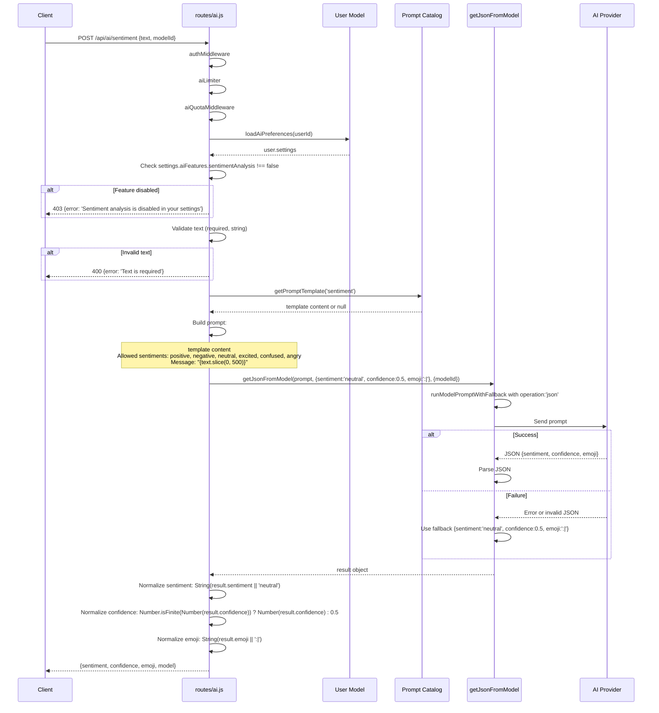
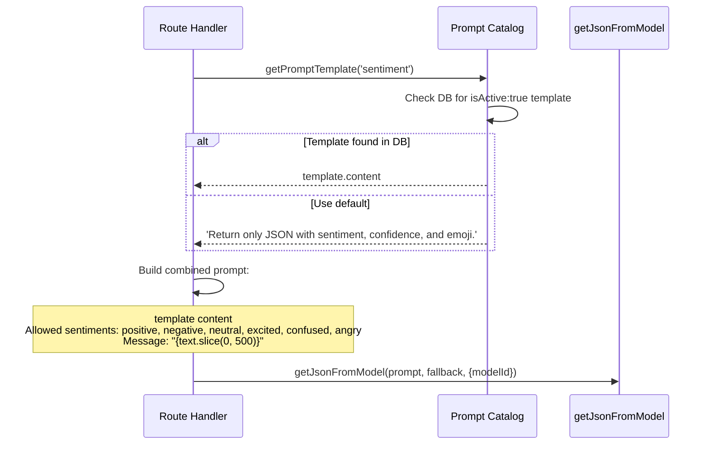
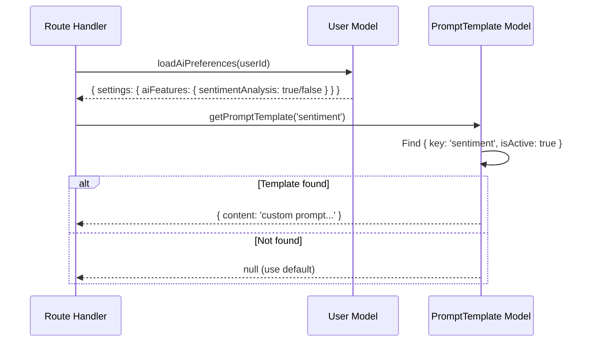
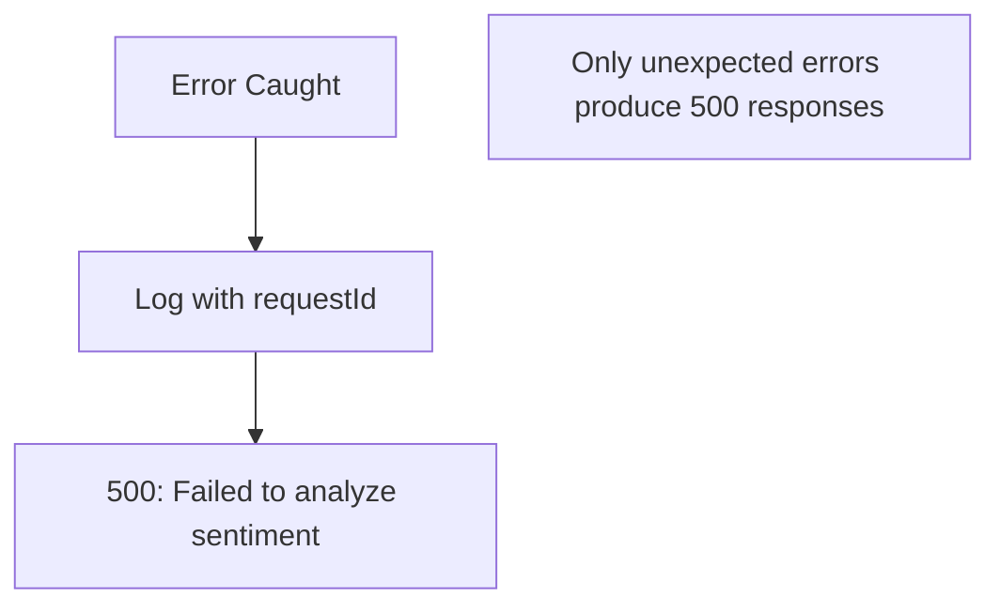

# 09. Sentiment Flow

## Purpose

The Sentiment Analysis feature classifies short text messages into emotional categories with confidence scores and emoji representations. It provides real-time sentiment detection for individual messages, enabling features like mood tracking, conversation tone analysis, and sentiment-aware UI elements. This is a lightweight, single-message classification endpoint that operates independently of conversation context.

**Purpose Statement**: Provide AI-powered sentiment classification for individual text messages with confidence scoring and emoji mapping.

---

## Source Files and References

| File | Lines | Responsibility |
|------|-------|----------------|
| `routes/ai.js` | Sentiment section | REST endpoint handler, validation, normalization |
| `services/gemini.js` | Full | `getJsonFromModel` for JSON-structured AI responses |
| `services/promptCatalog.js` | Full | Prompt template retrieval (`sentiment` key) |
| `middleware/aiQuota.js` | Full | AI usage quota enforcement per user |
| `middleware/rateLimit.js` | Full | `aiLimiter`: 15min window, max 80 requests |
| `models/User.js` | Full | User settings for feature toggles |

---

## Architecture Overview

```mermaid
graph TB
    Client[Client App] -->|POST /api/ai/sentiment| API[Express Router]
    API --> Auth[authMiddleware]
    Auth --> Limiter[aiLimiter]
    Limiter --> Quota[aiQuotaMiddleware]
    Quota --> Settings[Load User AI Settings]
    Settings --> Gate{sentimentAnalysis enabled?}
    Gate -->|No| Err403[403: Sentiment analysis disabled]
    Gate -->|Yes| Validate[Validate text input]
    Validate --> Template[Load sentiment template]
    Template --> AI[getJsonFromModel]
    AI --> Parse{JSON parsed?}
    Parse -->|Yes| Normalize[Normalize output fields]
    Parse -->|No| Fallback[Default: neutral, 0.5, :|]
    Fallback --> Normalize
    Normalize --> Response[Return sentiment result]
```

---

## Endpoint Specification

### POST /api/ai/sentiment

| Property | Value |
|----------|-------|
| **Authentication** | Required (JWT via `authMiddleware`) |
| **Rate Limiting** | `aiLimiter` (15min window, max 80) + `aiQuotaMiddleware` |
| **Content-Type** | `application/json` |
| **Idempotent** | Yes (same input produces same output with same model) |

### Request Body Schema

| Field | Type | Required | Description |
|-------|------|----------|-------------|
| `text` | string | Yes | Text to analyze for sentiment |
| `modelId` | string | No | Specific model to use for classification |

### Request Example

```json
{
  "text": "I'm so excited about the new feature launch! The team did an amazing job.",
  "modelId": "gemini-2.0-flash"
}
```

### Response Body Schema

| Field | Type | Description |
|-------|------|-------------|
| `sentiment` | string | Classified sentiment category |
| `confidence` | number | Confidence score (0.0 - 1.0) |
| `emoji` | string | Emoji representation of sentiment |
| `model` | string | Model ID used for classification |

### Allowed Sentiment Values

| Sentiment | Description | Typical Emoji |
|-----------|-------------|---------------|
| `positive` | Happy, satisfied, approving | :) |
| `negative` | Sad, disappointed, disapproving | :( |
| `neutral` | Factual, balanced, no strong emotion | :| |
| `excited` | Enthusiastic, eager, energetic | :D |
| `confused` | Uncertain, puzzled, questioning | :/ |
| `angry` | Frustrated, upset, hostile | >:( |

### Response Examples

**Positive sentiment**:
```json
{
  "sentiment": "positive",
  "confidence": 0.92,
  "emoji": ":)",
  "model": "gemini-2.0-flash"
}
```

**Excited sentiment**:
```json
{
  "sentiment": "excited",
  "confidence": 0.88,
  "emoji": ":D",
  "model": "gemini-2.0-flash"
}
```

**Confused sentiment**:
```json
{
  "sentiment": "confused",
  "confidence": 0.75,
  "emoji": ":/",
  "model": "gemini-2.0-flash"
}
```

---

## Request Lifecycle Sequence



---

## Validation Flow

```mermaid
flowchart TD
    Start[POST /api/ai/sentiment] --> Auth[authMiddleware]
    Auth --> Limiter[aiLimiter check]
    Limiter --> Quota[aiQuotaMiddleware]
    Quota --> LoadSettings[loadAiPreferences]
    LoadSettings --> CheckEnabled{sentimentAnalysis !== false?}
    CheckEnabled -->|No| Err403[403: Sentiment analysis disabled]
    CheckEnabled -->|Yes| CheckText{text is string?}
    CheckText -->|No| Err400[400: Text is required]
    CheckText -->|Yes| LoadTemplate[getPromptTemplate 'sentiment']
    LoadTemplate --> BuildPrompt[Build prompt with text.slice(0,500)]
    BuildPrompt --> CallAI[getJsonFromModel]
    CallAI --> Success{AI succeeds?}
    Success -->|Yes| Parse[Parse JSON response]
    Success -->|No| Fallback[Default fallback]
    Parse --> Normalize[Normalize fields]
    Fallback --> Normalize
    Normalize --> Return[Return sentiment result]
```

### Validation Rules

| Rule | Condition | Error Response |
|------|-----------|----------------|
| Feature enabled | `user?.settings?.aiFeatures?.sentimentAnalysis === false` | `403: Sentiment analysis is disabled in your settings` |
| Text required | `!text \|\| typeof text !== 'string'` | `400: Text is required` |
| Text length | Truncated to 500 characters (implicit) | No error, silently truncated |

---

## Prompt Construction

### Prompt Template Flow



### Default Prompt Template

```
Return only JSON with sentiment, confidence, and emoji.
Allowed sentiments: positive, negative, neutral, excited, confused, angry.
Message: "I'm so excited about the new feature launch! The team did an amazing job."
```

### Prompt Components

| Component | Source | Purpose |
|-----------|--------|---------|
| Template content | Prompt catalog (DB or default) | Instructs AI on JSON output format |
| Allowed sentiments | Hardcoded in route | Constrains AI to valid categories |
| Message text | `req.body.text` (truncated to 500 chars) | Text to classify |

### Text Truncation

```javascript
// routes/ai.js - text is truncated to 500 characters
`Message: "${text.slice(0, 500)}"`
```

| Aspect | Detail |
|--------|--------|
| Maximum input | 500 characters |
| Truncation method | `text.slice(0, 500)` |
| No validation error | Long text is silently truncated |
| Rationale | Token efficiency, most sentiment is in first 500 chars |

---

## Fallback System

### Default Fallback Values

```javascript
// routes/ai.js - fallback object
let result = { sentiment: 'neutral', confidence: 0.5, emoji: ':|' };
```

### Fallback Trigger Conditions

| Condition | Trigger |
|-----------|---------|
| AI provider timeout | Network or timeout error |
| Invalid JSON response | Parse failure in `getJsonFromModel` |
| Non-object response | Response is not a JSON object |
| Missing fields | Response lacks sentiment, confidence, or emoji |
| AI provider error | 5xx or rate limit from provider |

### Fallback Behavior

```mermaid
flowchart TD
    Start[AI Call Fails] --> UseFallback[result = {sentiment:'neutral', confidence:0.5, emoji:':|'}]
    UseFallback --> Normalize[Normalize fields]
    Normalize --> CheckSentiment{result.sentiment truthy?}
    CheckSentiment -->|No| DefaultSentiment['neutral']
    CheckSentiment -->|Yes| StringSentiment[String(result.sentiment)]
    DefaultSentiment --> CheckConf
    StringSentiment --> CheckConf
    CheckConf[Confidence is finite number?] -->|No| DefaultConf[0.5]
    CheckConf -->|Yes| NumConf[Number(result.confidence)]
    DefaultConf --> CheckEmoji
    NumConf --> CheckEmoji
    CheckEmoji[Emoji truthy?] -->|No| DefaultEmoji[':|']
    CheckEmoji -->|Yes| StringEmoji[String(result.emoji)]
    DefaultEmoji --> Return
    StringEmoji --> Return[Return normalized result]
```

---

## Response Normalization

### Normalization Pipeline

```javascript
// routes/ai.js - normalization logic
res.json({
  sentiment: String(result.sentiment || 'neutral'),
  confidence: Number.isFinite(Number(result.confidence)) ? Number(result.confidence) : 0.5,
  emoji: String(result.emoji || ':|'),
  model: resolveModel(modelId || MODEL_NAME).id,
});
```

### Field Normalization Rules

| Field | Normalization | Default |
|-------|---------------|---------|
| `sentiment` | `String(result.sentiment \|\| 'neutral')` | `"neutral"` |
| `confidence` | `Number.isFinite(Number(result.confidence)) ? Number(result.confidence) : 0.5` | `0.5` |
| `emoji` | `String(result.emoji \|\| ':|')` | `":|"` |
| `model` | `resolveModel(modelId \|\| MODEL_NAME).id` | Default model ID |

### Normalization Guarantees

| Guarantee | Implementation |
|-----------|----------------|
| Sentiment is always a string | `String(...)` conversion |
| Sentiment is never empty | Falls back to `"neutral"` |
| Confidence is always a number | `Number(...)` conversion |
| Confidence is always finite | `Number.isFinite(...)` check |
| Emoji is always a string | `String(...)` conversion |
| Emoji is never empty | Falls back to `":|"` |

### Potential Issues with Normalization

| Issue | Example | Result |
|-------|---------|--------|
| Invalid sentiment | `{sentiment: 'happy'}` | `"happy"` (not in allowed list) |
| Negative confidence | `{confidence: -0.5}` | `-0.5` (not clamped) |
| Confidence > 1 | `{confidence: 1.5}` | `1.5` (not clamped) |
| Non-string emoji | `{emoji: 123}` | `"123"` (converted to string) |
| Null sentiment | `{sentiment: null}` | `"neutral"` (fallback applied) |

---

## Database Operations

### Read Operations

| Operation | Model | Purpose |
|-----------|-------|---------|
| `loadAiPreferences(userId)` | User | Check if sentimentAnalysis feature is enabled |
| `getPromptTemplate('sentiment')` | PromptTemplate | Load custom prompt template if available |

### Write Operations

**None**. This feature is purely read-only. It does not modify any database records.

### Read Flow



---

## Error Handling

### Error Response Matrix

| Error Type | Status Code | Error Message | Additional Fields |
|------------|-------------|---------------|-------------------|
| Feature disabled | 403 | `Sentiment analysis is disabled in your settings` | - |
| Missing text | 400 | `Text is required` | - |
| AI provider failure | 500 | `Failed to analyze sentiment` | `requestId` |
| Server error | 500 | `Failed to analyze sentiment` | `requestId` |

### Error Flow



### Fallback vs Error Distinction

| Situation | Behavior | Response Code |
|-----------|----------|---------------|
| AI provider returns invalid JSON | Use default fallback values | 200 (success) |
| AI provider times out | Use default fallback values | 200 (success) |
| AI provider returns wrong shape | Use default fallback values | 200 (success) |
| Database read fails for user settings | Outer catch block | 500 (error) |
| Unexpected exception | Outer catch block | 500 (error) |

---

## Feature Toggle System

### User Settings Structure

```javascript
// Expected shape in User document
{
  settings: {
    aiFeatures: {
      sentimentAnalysis: true,    // or false to disable
      smartReplies: true,
      grammarCheck: true
    }
  }
}
```

### Toggle Check

```javascript
const user = await loadAiPreferences(req.user.id);
if (user?.settings?.aiFeatures?.sentimentAnalysis === false) {
  return res.status(403).json({ error: 'Sentiment analysis is disabled in your settings' });
}
```

### Toggle Behavior

| Setting Value | Behavior |
|---------------|----------|
| `true` | Feature enabled |
| `false` | Feature disabled (403 response) |
| `undefined` / missing | Feature enabled (defaults to on) |
| `null` | Feature enabled (defaults to on) |

---

## Sentiment Classification Details

### Allowed Sentiment Categories

```javascript
// From routes/ai.js prompt construction
'Allowed sentiments: positive, negative, neutral, excited, confused, angry.'
```

### Sentiment Mapping

| Sentiment | Emoji | Description | Example Trigger |
|-----------|-------|-------------|-----------------|
| `positive` | `:)` | Happy, satisfied | "Great job on the project!" |
| `negative` | `:(` | Sad, disappointed | "I'm not happy with the results." |
| `neutral` | `:|` | Factual, balanced | "The meeting is at 3 PM." |
| `excited` | `:D` | Enthusiastic, eager | "I can't wait for the launch!" |
| `confused` | `:/` | Uncertain, puzzled | "I don't understand what happened." |
| `angry` | `>:(` | Frustrated, hostile | "This is completely unacceptable!" |

### Confidence Score

| Range | Interpretation |
|-------|----------------|
| 0.0 - 0.3 | Low confidence, uncertain classification |
| 0.3 - 0.6 | Moderate confidence, some ambiguity |
| 0.6 - 0.8 | High confidence, clear sentiment |
| 0.8 - 1.0 | Very high confidence, unambiguous |

### No Post-Processing Validation

The current implementation does NOT validate that the returned sentiment is one of the allowed categories. The AI is instructed to use only allowed values, but there is no server-side enforcement:

```javascript
// Current: no validation of sentiment value
sentiment: String(result.sentiment || 'neutral'),

// What it could be:
const ALLOWED = ['positive', 'negative', 'neutral', 'excited', 'confused', 'angry'];
sentiment: ALLOWED.includes(result.sentiment) ? result.sentiment : 'neutral',
```

---

## Scaling Considerations

### Performance Characteristics

| Operation | Latency | Scaling Concern | Mitigation |
|-----------|---------|-----------------|------------|
| User settings read | Low (indexed query) | Minimal impact | User document is small |
| Prompt template read | Low (single query) | Template cache could help | Templates rarely change |
| AI model call | High (external API) | Primary bottleneck | Fallback provides resilience |
| Response normalization | Negligible | No concern | Simple type conversions |

### Throughput Analysis

| Metric | Estimate | Notes |
|--------|----------|-------|
| AI call duration | 200ms - 2000ms | Shorter text = faster response |
| Fallback duration | < 1ms | Pure JavaScript, no I/O |
| Request rate limit | 80 per 15 minutes | Per-user via aiLimiter |
| Text truncation | 500 chars max | Reduces token usage |

### Operational Recommendations

| Area | Recommendation | Priority |
|------|----------------|----------|
| Sentiment validation | Constrain output to allowed values | Medium |
| Confidence clamping | Clamp confidence to 0.0-1.0 range | Low |
| Fallback telemetry | Track fallback frequency | Medium |
| Caching | Cache results for identical text | Low |
| Batch processing | Allow multiple texts per request | Low |

---

## Failure Cases and Recovery

### Failure Scenarios

| Scenario | Detection | Recovery | User Impact |
|----------|-----------|----------|-------------|
| AI provider timeout | `getJsonFromModel` catch block | Default fallback (neutral, 0.5, :|) | Neutral sentiment returned |
| Invalid JSON response | JSON parse failure | Default fallback | Neutral sentiment returned |
| Non-object response | Response is not an object | Default fallback | Neutral sentiment returned |
| Missing sentiment field | `result.sentiment` is falsy | Defaults to "neutral" | Neutral sentiment returned |
| Invalid confidence | Non-numeric confidence | Defaults to 0.5 | Moderate confidence returned |
| Missing emoji field | `result.emoji` is falsy | Defaults to ":|" | Neutral emoji returned |
| User settings read failure | Outer catch block | 500 error | Feature unavailable temporarily |

### Recovery Flow

```mermaid
flowchart TD
    Start[AI Call] --> Success{Succeeds with valid JSON object?}
    Success -->|Yes| Normalize[Normalize fields with defaults]
    Success -->|No| Fallback[Use default {neutral, 0.5, :|}]
    Fallback --> Normalize
    Normalize --> Return[Return to client]
    
    Note[Note: This endpoint is designed to always succeed]
    Note[Even complete AI failure returns a valid response]
```

---

## Inconsistencies and Risks

### Identified Issues

| Issue | Severity | Description | Impact |
|-------|----------|-------------|--------|
| No sentiment validation | Medium | AI can return any string as sentiment | Non-standard sentiment values possible |
| No confidence clamping | Low | Confidence can be outside 0-1 range | Misleading confidence values |
| No text minimum length | Low | Very short text (1-2 chars) analyzed | Poor classification for tiny inputs |
| No language detection | Low | Assumes English text | Non-English text may misclassify |
| No caching | Low | Same text re-analyzed each time | Unnecessary AI calls |
| No telemetry | Medium | No tracking of sentiment distribution | Cannot analyze usage patterns |

### Improvement Areas

| Area | Current State | Proposed Improvement |
|------|---------------|---------------------|
| Sentiment validation | None | Constrain to allowed values with fallback |
| Confidence clamping | None | Clamp to 0.0-1.0 range |
| Text minimum | None | Require minimum 3 characters |
| Language support | English only | Detect language and adapt |
| Caching | None | Cache results for identical text |
| Telemetry | None | Track sentiment distribution over time |

---

## How to Rebuild From Scratch

### Step 1: Define Endpoint

```
POST /api/ai/sentiment
Auth: JWT
Rate Limit: aiLimiter + aiQuotaMiddleware
```

### Step 2: Implement Feature Toggle Check

```javascript
const user = await loadAiPreferences(req.user.id);
if (user?.settings?.aiFeatures?.sentimentAnalysis === false) {
  return res.status(403).json({ error: 'Sentiment analysis is disabled in your settings' });
}
```

### Step 3: Validate Input

```javascript
const { text, modelId } = req.body;
if (!text || typeof text !== 'string') {
  return res.status(400).json({ error: 'Text is required' });
}
```

### Step 4: Build Prompt

```javascript
const template = await getPromptTemplate('sentiment');
const prompt = [
  template?.content || 'Return only JSON with sentiment, confidence, and emoji.',
  'Allowed sentiments: positive, negative, neutral, excited, confused, angry.',
  `Message: "${text.slice(0, 500)}"`,
].join('\n\n');
```

### Step 5: Call AI with Fallback

```javascript
const fallback = { sentiment: 'neutral', confidence: 0.5, emoji: ':|' };
let result = fallback;
try {
  result = await getJsonFromModel(prompt, fallback, { modelId });
} catch (error) {
  // fallback to default
}
```

### Step 6: Normalize and Return

```javascript
res.json({
  sentiment: String(result.sentiment || 'neutral'),
  confidence: Number.isFinite(Number(result.confidence)) ? Number(result.confidence) : 0.5,
  emoji: String(result.emoji || ':|'),
  model: resolveModel(modelId || MODEL_NAME).id,
});
```

### Step 7: Test Scenarios

| Test Case | Expected Result |
|-----------|-----------------|
| Feature disabled | 403 error |
| Missing text | 400 error |
| Non-string text | 400 error |
| Positive message | sentiment: "positive", high confidence |
| Negative message | sentiment: "negative", high confidence |
| Neutral message | sentiment: "neutral", moderate confidence |
| AI provider failure | sentiment: "neutral", confidence: 0.5, emoji: ":|" |
| Very long text | Truncated to 500 chars, analyzed |
| Empty text | 400 error |

---

## Quick Reference

### Key Functions

| Function | File | Purpose |
|----------|------|---------|
| `getJsonFromModel` | `services/gemini.js` | AI call expecting JSON response |
| `getPromptTemplate` | `services/promptCatalog.js` | Load `sentiment` template |
| `loadAiPreferences` | Various | Load user AI feature settings |
| `resolveModel` | Various | Resolve model ID to actual model |

### Configuration Points

| Setting | Value | Description |
|---------|-------|-------------|
| Max text length | 500 characters | Text truncated via `slice(0, 500)` |
| Allowed sentiments | 6 categories | positive, negative, neutral, excited, confused, angry |
| Default sentiment | `"neutral"` | Fallback when AI fails |
| Default confidence | `0.5` | Fallback when AI fails |
| Default emoji | `":|"` | Fallback when AI fails |
| Rate limit | 80 per 15 min | Via aiLimiter |

### Prompt Template Key

| Key | Default Content |
|-----|-----------------|
| `sentiment` | `Return only JSON with sentiment, confidence, and emoji.` |

### Sentiment-Emoji Mapping

| Sentiment | Default Emoji |
|-----------|---------------|
| `positive` | `:)` |
| `negative` | `:(` |
| `neutral` | `:|` |
| `excited` | `:D` |
| `confused` | `:/` |
| `angry` | `>:(` |
