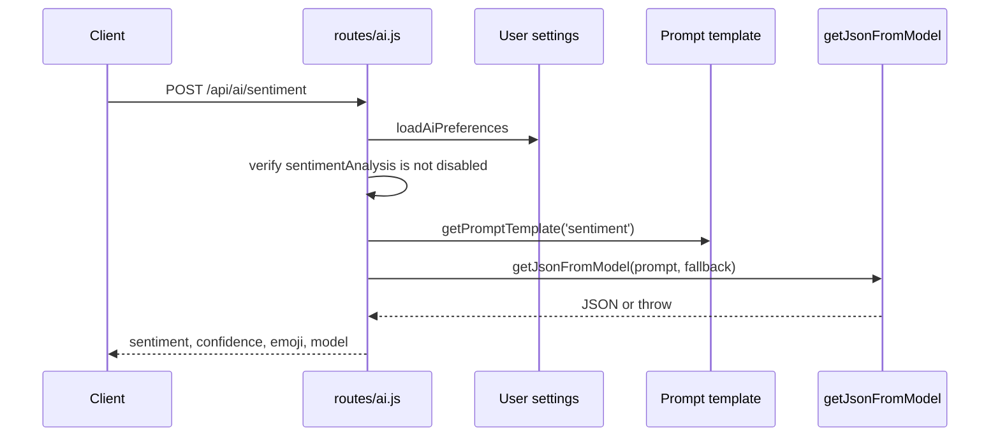

# 09. Sentiment Flow

## Purpose
This document explains the `/api/ai/sentiment` feature, which classifies short text into a lightweight sentiment response.

## Relevant Files
- `routes/ai.js`
- `services/gemini.js`
- `services/promptCatalog.js`
- `models/User.js`

## Route Summary
Endpoint:

- `POST /api/ai/sentiment`

Middleware:

- `authMiddleware`
- `aiLimiter`
- `aiQuotaMiddleware`

## Execution Path


## Fallback Behavior
If model execution or JSON parsing fails, the route falls back to:

```json
{
  "sentiment": "neutral",
  "confidence": 0.5,
  "emoji": ":|"
}
```

## Database Impact
This feature only reads:

- `User.settings.aiFeatures.sentimentAnalysis`
- `PromptTemplate`

No write occurs in the current source implementation.

## Risks
- sentiment schema is weakly enforced after model output
- label normalization is minimal
- confidence can be arbitrary if the model returns odd values
- feature defaults to disabled in `User` settings

## Improvement Opportunities
- constrain labels after generation
- record fallback rate and invalid output rate
- add deterministic local classifier for low-latency fallback

