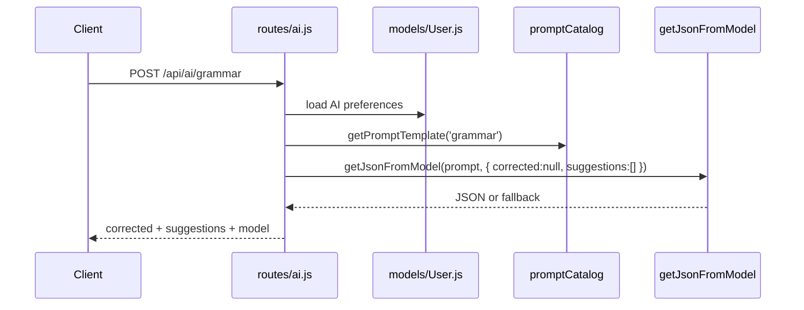

# 10. Grammar Flow

## Purpose

This document explains `POST /api/ai/grammar`, including correction behavior, fallbacks, and operational tradeoffs.

## Relevant Files

- `routes/ai.js`
- `services/gemini.js`
- `services/promptCatalog.js`
- `models/User.js`

## Request Shape

```json
{
  "text": "we has shipped the feature yesterday",
  "modelId": "auto"
}
```

## Flow



## Validation

The route requires:

- `text` to be a string
- trimmed length of at least 3 characters

## Expected Output Schema

The route expects JSON like:

```json
{
  "corrected": "We shipped the feature yesterday.",
  "suggestions": [
    "Capitalize the first word.",
    "Use the correct past-tense verb."
  ]
}
```

## Fallback Behavior

If the provider fails or the JSON cannot be parsed:

- the route logs `GRAMMAR_FALLBACK`
- it returns:
  - `corrected: original text`
  - `suggestions: []`

## Storage Impact

None. Grammar checking is stateless.

## Failure Cases

| Failure | Behavior |
| --- | --- |
| short or missing text | `400` |
| feature disabled | `403` |
| provider or JSON failure | original text returned as fallback |
| route-level crash | `500` with `requestId` |

## Risks

- correction quality is prompt-template-dependent
- suggestions are capped to 4 items after normalization
- clients cannot distinguish “no changes” from “provider failed” without logs

## `dist/` Drift Notes

In `dist/services/aiFeature.service.js`, grammar improvement returns:

- `improved`, not `corrected`
- no structured suggestion list
- settings key `grammar`, not `grammarCheck`

## Rebuild Notes

1. make fallback provenance explicit in the response
2. decide whether the product needs correction only or correction plus explanation
3. keep grammar helpers stateless unless analytics truly require persistence

