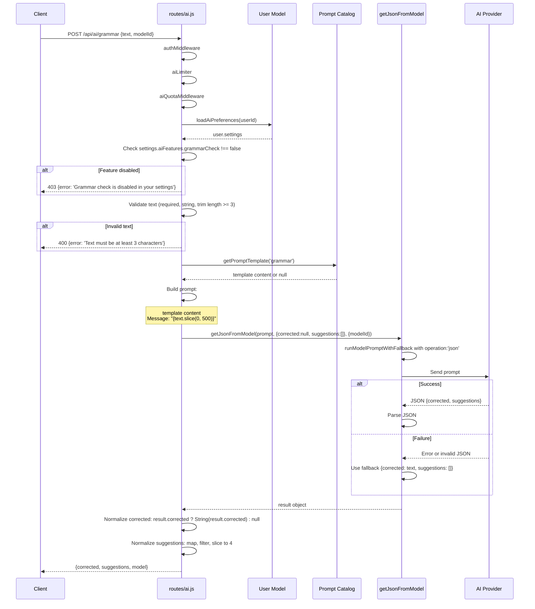
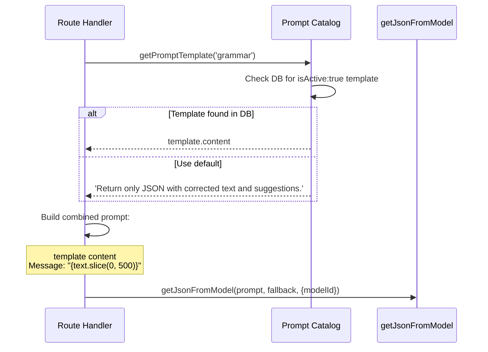
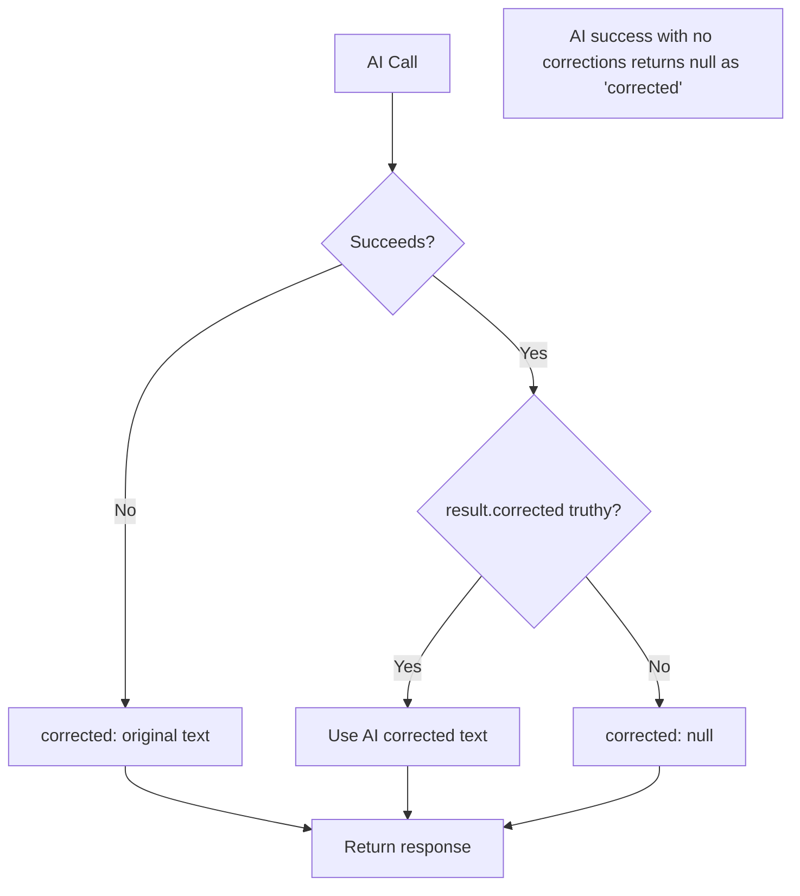
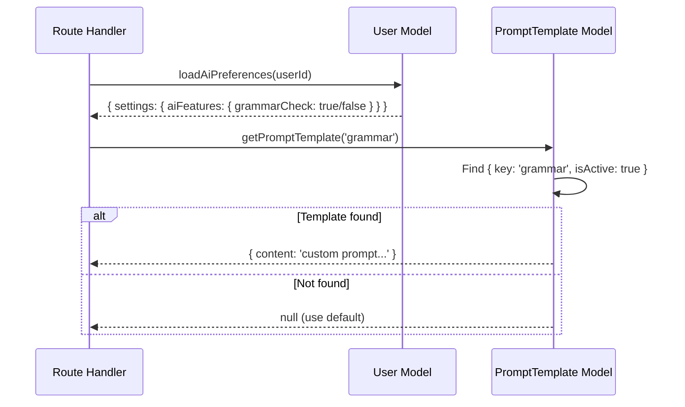
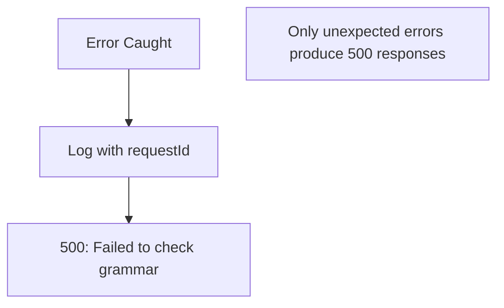
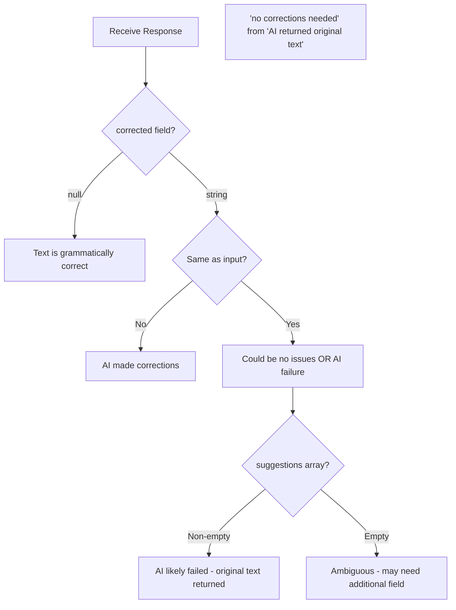
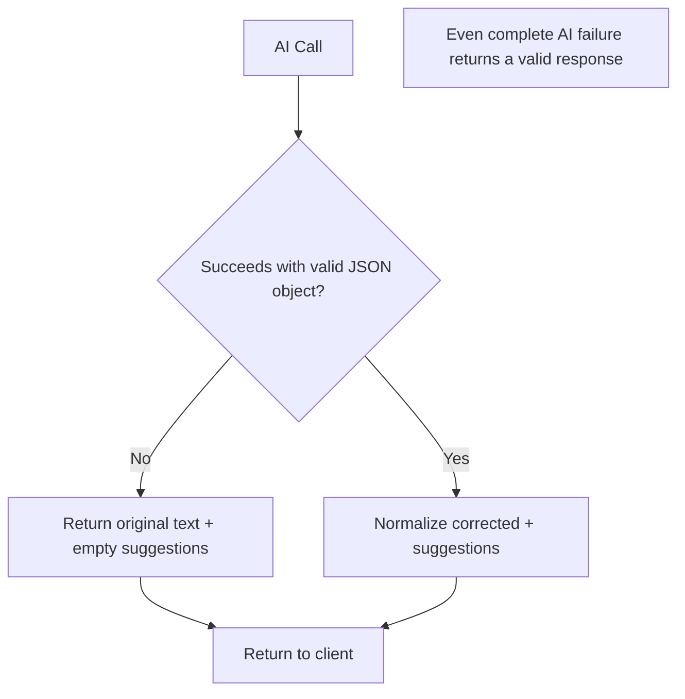

# 10. Grammar Flow

## Purpose

The Grammar Check feature analyzes text messages for grammatical errors and provides corrected versions along with specific improvement suggestions. It operates as a lightweight, single-text analysis endpoint that returns structured corrections without modifying any conversation state. This enables real-time grammar assistance for users composing messages, emails, or any text content within the ChatSphere platform.

**Purpose Statement**: Provide AI-powered grammar correction and writing improvement suggestions for individual text inputs.

---

## Source Files and References

| File | Lines | Responsibility |
|------|-------|----------------|
| `routes/ai.js` | Grammar section | REST endpoint handler, validation, normalization |
| `services/gemini.js` | Full | `getJsonFromModel` for JSON-structured AI responses |
| `services/promptCatalog.js` | Full | Prompt template retrieval (`grammar` key) |
| `middleware/aiQuota.js` | Full | AI usage quota enforcement per user |
| `middleware/rateLimit.js` | Full | `aiLimiter`: 15min window, max 80 requests |
| `models/User.js` | Full | User settings for feature toggles |

---

## Architecture Overview

```mermaid
graph TB
    Client[Client App] -->|POST /api/ai/grammar| API[Express Router]
    API --> Auth[authMiddleware]
    Auth --> Limiter[aiLimiter]
    Limiter --> Quota[aiQuotaMiddleware]
    Quota --> Settings[Load User AI Settings]
    Settings --> Gate{grammarCheck enabled?}
    Gate -->|No| Err403[403: Grammar check disabled]
    Gate -->|Yes| Validate[Validate text input]
    Validate --> CheckLen{text.trim().length >= 3?}
    CheckLen -->|No| Err400[400: Text too short]
    CheckLen -->|Yes| Template[Load grammar template]
    Template --> AI[getJsonFromModel]
    AI --> Parse{JSON parsed?}
    Parse -->|Yes| Normalize[Normalize corrected + suggestions]
    Parse -->|No| Fallback[Original text + empty suggestions]
    Fallback --> Normalize
    Normalize --> Response[Return grammar result]
```

---

## Endpoint Specification

### POST /api/ai/grammar

| Property | Value |
|----------|-------|
| **Authentication** | Required (JWT via `authMiddleware`) |
| **Rate Limiting** | `aiLimiter` (15min window, max 80) + `aiQuotaMiddleware` |
| **Content-Type** | `application/json` |
| **Idempotent** | Yes (same input produces same output with same model) |

### Request Body Schema

| Field | Type | Required | Description |
|-------|------|----------|-------------|
| `text` | string | Yes | Text to check for grammar errors (min 3 chars after trim) |
| `modelId` | string | No | Specific model to use for analysis |

### Request Example

```json
{
  "text": "Their going to the store becuz they needs some groceries for there family.",
  "modelId": "gemini-2.0-flash"
}
```

### Response Body Schema

| Field | Type | Description |
|-------|------|-------------|
| `corrected` | string \| null | Corrected version of the text, or null if no corrections needed |
| `suggestions` | string[] | Array of specific improvement suggestions (max 4) |
| `model` | string | Model ID used for analysis |

### Response Examples

**With corrections**:
```json
{
  "corrected": "They're going to the store because they need some groceries for their family.",
  "suggestions": [
    "Use 'They're' instead of 'Their' (contraction of 'they are')",
    "Use 'because' instead of 'becuz' (spelling)",
    "Use 'need' instead of 'needs' (subject-verb agreement)",
    "Use 'their' instead of 'there' (possessive pronoun)"
  ],
  "model": "gemini-2.0-flash"
}
```

**No corrections needed**:
```json
{
  "corrected": null,
  "suggestions": [],
  "model": "gemini-2.0-flash"
}
```

---

## Request Lifecycle Sequence



---

## Validation Flow

```mermaid
flowchart TD
    Start[POST /api/ai/grammar] --> Auth[authMiddleware]
    Auth --> Limiter[aiLimiter check]
    Limiter --> Quota[aiQuotaMiddleware]
    Quota --> LoadSettings[loadAiPreferences]
    LoadSettings --> CheckEnabled{grammarCheck !== false?}
    CheckEnabled -->|No| Err403[403: Grammar check disabled]
    CheckEnabled -->|Yes| CheckText{text exists and is string?}
    CheckText -->|No| Err400[400: Text must be at least 3 characters]
    CheckText -->|Yes| CheckLen{text.trim().length >= 3?}
    CheckLen -->|No| Err400Len[400: Text must be at least 3 characters]
    CheckLen -->|Yes| LoadTemplate[getPromptTemplate 'grammar']
    LoadTemplate --> BuildPrompt[Build prompt with text.slice(0,500)]
    BuildPrompt --> CallAI[getJsonFromModel]
    CallAI --> Success{AI succeeds?}
    Success -->|Yes| Parse[Parse JSON response]
    Success -->|No| Fallback[Original text + empty suggestions]
    Parse --> Normalize[Normalize fields]
    Fallback --> Normalize
    Normalize --> Return[Return grammar result]
```

### Validation Rules

| Rule | Condition | Error Response |
|------|-----------|----------------|
| Feature enabled | `user?.settings?.aiFeatures?.grammarCheck === false` | `403: Grammar check is disabled in your settings` |
| Text required | `!text \|\| typeof text !== 'string'` | `400: Text must be at least 3 characters` |
| Minimum length | `text.trim().length < 3` | `400: Text must be at least 3 characters` |
| Text length | Truncated to 500 characters (implicit) | No error, silently truncated |

---

## Prompt Construction

### Prompt Template Flow



### Default Prompt Template

```
Return only JSON with corrected text and suggestions.
Message: "Their going to the store becuz they needs some groceries for there family."
```

### Prompt Components

| Component | Source | Purpose |
|-----------|--------|---------|
| Template content | Prompt catalog (DB or default) | Instructs AI on JSON output format |
| Message text | `req.body.text` (truncated to 500 chars) | Text to check and correct |

### Text Truncation

```javascript
// routes/ai.js - text is truncated to 500 characters
`Message: "${text.slice(0, 500)}"`
```

| Aspect | Detail |
|--------|--------|
| Maximum input | 500 characters |
| Truncation method | `text.slice(0, 500)` |
| No validation error | Long text is silently truncated |
| Rationale | Token efficiency, grammar issues are usually local |

---

## Fallback System

### Default Fallback Values

```javascript
// routes/ai.js - fallback initialization
let result = { corrected: null, suggestions: [] };

// routes/ai.js - fallback on error
catch (error) {
  result = { corrected: text, suggestions: [] };
}
```

### Fallback Behavior Difference

| Scenario | Fallback Response |
|----------|-------------------|
| AI call succeeds with `corrected: null` | `corrected: null` (no corrections needed) |
| AI call fails/throws | `corrected: text` (original text returned) |
| AI call returns invalid JSON | `corrected: text` (original text returned) |

### Key Distinction



### Fallback Trigger Conditions

| Condition | Trigger |
|-----------|---------|
| AI provider timeout | Network or timeout error |
| Invalid JSON response | Parse failure in `getJsonFromModel` |
| Non-object response | Response is not a JSON object |
| AI provider error | 5xx or rate limit from provider |

---

## Response Normalization

### Normalization Pipeline

```javascript
// routes/ai.js - normalization logic
res.json({
  corrected: result.corrected ? String(result.corrected) : null,
  suggestions: Array.isArray(result.suggestions)
    ? result.suggestions.map((item) => String(item)).filter(Boolean).slice(0, 4)
    : [],
  model: resolveModel(modelId || MODEL_NAME).id,
});
```

### Field Normalization Rules

| Field | Normalization | Default |
|-------|---------------|---------|
| `corrected` | `result.corrected ? String(result.corrected) : null` | `null` if falsy |
| `suggestions` | `Array.isArray(...) ? map(String).filter(Boolean).slice(0,4) : []` | `[]` if not array |
| `model` | `resolveModel(modelId \|\| MODEL_NAME).id` | Default model ID |

### Normalization Guarantees

| Guarantee | Implementation |
|-----------|----------------|
| Corrected is string or null | Conditional: truthy → String, falsy → null |
| Suggestions is always an array | `Array.isArray(...) ? ... : []` |
| All suggestions are strings | `.map((item) => String(item))` |
| No empty suggestions | `.filter(Boolean)` |
| Maximum 4 suggestions | `.slice(0, 4)` |

### Normalization Edge Cases

| Input | Output |
|-------|--------|
| `{corrected: "", suggestions: []}` | `{corrected: null, suggestions: []}` |
| `{corrected: 0, suggestions: []}` | `{corrected: null, suggestions: []}` |
| `{corrected: "Fixed text", suggestions: null}` | `{corrected: "Fixed text", suggestions: []}` |
| `{corrected: "Fixed text", suggestions: [1, 2, 3]}` | `{corrected: "Fixed text", suggestions: ["1", "2", "3"]}` |
| `{corrected: "Fixed text", suggestions: ["", "  ", "Good tip"]}` | `{corrected: "Fixed text", suggestions: ["Good tip"]}` |
| `{corrected: "Fixed", suggestions: ["A","B","C","D","E"]}` | `{corrected: "Fixed", suggestions: ["A","B","C","D"]}` |

---

## Database Operations

### Read Operations

| Operation | Model | Purpose |
|-----------|-------|---------|
| `loadAiPreferences(userId)` | User | Check if grammarCheck feature is enabled |
| `getPromptTemplate('grammar')` | PromptTemplate | Load custom prompt template if available |

### Write Operations

**None**. This feature is purely read-only. It does not modify any database records.

### Read Flow



---

## Error Handling

### Error Response Matrix

| Error Type | Status Code | Error Message | Additional Fields |
|------------|-------------|---------------|-------------------|
| Feature disabled | 403 | `Grammar check is disabled in your settings` | - |
| Missing text | 400 | `Text must be at least 3 characters` | - |
| Text too short | 400 | `Text must be at least 3 characters` | - |
| AI provider failure | 500 | `Failed to check grammar` | `requestId` |
| Server error | 500 | `Failed to check grammar` | `requestId` |

### Error Flow



### Fallback vs Error Distinction

| Situation | Behavior | Response Code |
|-----------|----------|---------------|
| AI provider returns invalid JSON | Return original text + empty suggestions | 200 (success) |
| AI provider times out | Return original text + empty suggestions | 200 (success) |
| AI provider returns wrong shape | Return original text + empty suggestions | 200 (success) |
| Database read fails for user settings | Outer catch block | 500 (error) |
| Unexpected exception | Outer catch block | 500 (error) |

---

## Feature Toggle System

### User Settings Structure

```javascript
// Expected shape in User document
{
  settings: {
    aiFeatures: {
      grammarCheck: true,    // or false to disable
      smartReplies: true,
      sentimentAnalysis: true
    }
  }
}
```

### Toggle Check

```javascript
const user = await loadAiPreferences(req.user.id);
if (user?.settings?.aiFeatures?.grammarCheck === false) {
  return res.status(403).json({ error: 'Grammar check is disabled in your settings' });
}
```

### Toggle Behavior

| Setting Value | Behavior |
|---------------|----------|
| `true` | Feature enabled |
| `false` | Feature disabled (403 response) |
| `undefined` / missing | Feature enabled (defaults to on) |
| `null` | Feature enabled (defaults to on) |

---

## Correction vs No Correction

### Response Semantics

The `corrected` field has three possible states, each with a different meaning:

| `corrected` Value | Meaning | When It Occurs |
|-------------------|---------|----------------|
| `null` | No corrections needed; text is grammatically correct | AI successfully analyzed and found no issues |
| `string` (different from input) | Corrections were applied | AI found and fixed grammar issues |
| `string` (same as input) | AI call failed; fallback returned original text | Error in AI processing (outer catch block) |

### Distinguishing "No Issues" from "AI Failure"



### Ambiguity Issue

The current implementation has an ambiguity: when the AI returns the original text unchanged (no corrections needed), it looks identical to the fallback case where the AI failed. The only way to distinguish is:

1. Check if `suggestions` is non-empty (AI failure fallback always returns `[]`)
2. But an AI could also legitimately return no suggestions for correct text

**Recommended improvement**: Add an explicit `hasCorrections` or `status` field to disambiguate.

---

## Scaling Considerations

### Performance Characteristics

| Operation | Latency | Scaling Concern | Mitigation |
|-----------|---------|-----------------|------------|
| User settings read | Low (indexed query) | Minimal impact | User document is small |
| Prompt template read | Low (single query) | Template cache could help | Templates rarely change |
| AI model call | High (external API) | Primary bottleneck | Fallback provides resilience |
| Response normalization | Negligible | No concern | Simple type conversions |

### Throughput Analysis

| Metric | Estimate | Notes |
|--------|----------|-------|
| AI call duration | 300ms - 3000ms | Longer text = potentially slower |
| Fallback duration | < 1ms | Pure JavaScript, no I/O |
| Request rate limit | 80 per 15 minutes | Per-user via aiLimiter |
| Text truncation | 500 chars max | Reduces token usage |

### Operational Recommendations

| Area | Recommendation | Priority |
|------|----------------|----------|
| Correction tracking | Log when corrections are applied | Medium |
| Acceptance tracking | Track if users apply suggested corrections | Medium |
| Diff output | Return character-level diff instead of just corrected text | Low |
| Language detection | Auto-detect input language | Medium |
| Caching | Cache results for identical text | Low |
| Batch processing | Allow multiple texts per request | Low |

---

## Failure Cases and Recovery

### Failure Scenarios

| Scenario | Detection | Recovery | User Impact |
|----------|-----------|----------|-------------|
| AI provider timeout | `getJsonFromModel` catch block | Return original text + empty suggestions | No correction provided |
| Invalid JSON response | JSON parse failure | Return original text + empty suggestions | No correction provided |
| Non-object response | Response is not an object | Return original text + empty suggestions | No correction provided |
| Missing corrected field | `result.corrected` is falsy | Returns `null` | Indicates no corrections |
| Missing suggestions field | `result.suggestions` is not array | Returns `[]` | No suggestions provided |
| User settings read failure | Outer catch block | 500 error | Feature unavailable temporarily |
| Prompt template read failure | Returns null | Uses default template | No impact, default is adequate |

### Recovery Flow



---

## Inconsistencies and Risks

### Identified Issues

| Issue | Severity | Description | Impact |
|-------|----------|-------------|--------|
| Ambiguous corrected field | Medium | Cannot distinguish "no issues" from "AI failure" | Client may misinterpret results |
| No text minimum beyond 3 chars | Low | Very short text may not benefit from grammar check | Wasted AI calls on trivial text |
| No language detection | Low | Assumes English text | Non-English text may get incorrect corrections |
| No diff output | Low | Only returns corrected text, not what changed | User must manually compare |
| No correction tracking | Medium | No record of corrections applied | Cannot improve grammar model |
| Suggestions limit | Low | Hard-coded max of 4 suggestions | May miss important corrections |

### Improvement Areas

| Area | Current State | Proposed Improvement |
|------|---------------|---------------------|
| Disambiguation | Ambiguous corrected field | Add `hasCorrections` or `status` field |
| Diff output | Full corrected text only | Return character-level or word-level diff |
| Language support | English only | Detect language and adapt corrections |
| Correction tracking | None | Log corrections for model improvement |
| Acceptance tracking | None | Track if users apply suggested corrections |
| Suggestion quality | No validation | Validate suggestions are actionable |

---

## How to Rebuild From Scratch

### Step 1: Define Endpoint

```
POST /api/ai/grammar
Auth: JWT
Rate Limit: aiLimiter + aiQuotaMiddleware
```

### Step 2: Implement Feature Toggle Check

```javascript
const user = await loadAiPreferences(req.user.id);
if (user?.settings?.aiFeatures?.grammarCheck === false) {
  return res.status(403).json({ error: 'Grammar check is disabled in your settings' });
}
```

### Step 3: Validate Input

```javascript
const { text, modelId } = req.body;
if (!text || typeof text !== 'string' || text.trim().length < 3) {
  return res.status(400).json({ error: 'Text must be at least 3 characters' });
}
```

### Step 4: Build Prompt

```javascript
const template = await getPromptTemplate('grammar');
const prompt = [
  template?.content || 'Return only JSON with corrected text and suggestions.',
  `Message: "${text.slice(0, 500)}"`,
].join('\n\n');
```

### Step 5: Call AI with Fallback

```javascript
let result = { corrected: null, suggestions: [] };
try {
  result = await getJsonFromModel(prompt, { corrected: null, suggestions: [] }, { modelId });
} catch (error) {
  result = { corrected: text, suggestions: [] };
}
```

### Step 6: Normalize and Return

```javascript
res.json({
  corrected: result.corrected ? String(result.corrected) : null,
  suggestions: Array.isArray(result.suggestions)
    ? result.suggestions.map((item) => String(item)).filter(Boolean).slice(0, 4)
    : [],
  model: resolveModel(modelId || MODEL_NAME).id,
});
```

### Step 7: Test Scenarios

| Test Case | Expected Result |
|-----------|-----------------|
| Feature disabled | 403 error |
| Missing text | 400 error |
| Non-string text | 400 error |
| Text < 3 chars | 400 error |
| Correct text | `corrected: null`, `suggestions: []` |
| Text with errors | `corrected: "fixed text"`, suggestions array |
| AI provider failure | `corrected: original text`, `suggestions: []` |
| Very long text | Truncated to 500 chars, analyzed |
| Text with only whitespace | 400 error (trim length < 3) |

---

## Quick Reference

### Key Functions

| Function | File | Purpose |
|----------|------|---------|
| `getJsonFromModel` | `services/gemini.js` | AI call expecting JSON response |
| `getPromptTemplate` | `services/promptCatalog.js` | Load `grammar` template |
| `loadAiPreferences` | Various | Load user AI feature settings |
| `resolveModel` | Various | Resolve model ID to actual model |

### Configuration Points

| Setting | Value | Description |
|---------|-------|-------------|
| Min text length | 3 characters | After trimming whitespace |
| Max text length | 500 characters | Text truncated via `slice(0, 500)` |
| Max suggestions | 4 | `.slice(0, 4)` caps output |
| Default corrected | `null` | When no corrections needed |
| Default suggestions | `[]` | Empty array when no suggestions |
| Fallback corrected | Original text | When AI call fails |
| Rate limit | 80 per 15 min | Via aiLimiter |

### Prompt Template Key

| Key | Default Content |
|-----|-----------------|
| `grammar` | `Return only JSON with corrected text and suggestions.` |

### Response Field Semantics

| Field | Possible Values | Meaning |
|-------|-----------------|---------|
| `corrected` | `null` | No corrections needed (AI succeeded) |
| `corrected` | `string` (different) | Corrections were applied |
| `corrected` | `string` (same as input) | AI failed, fallback returned original |
| `suggestions` | `[]` | No suggestions or AI failure |
| `suggestions` | `[string, ...]` | Specific improvement suggestions |
