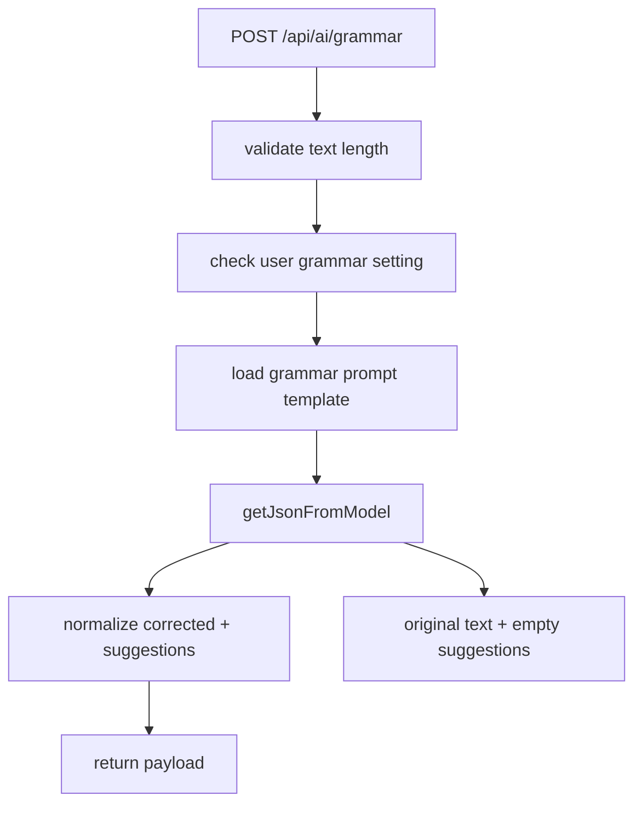

# 10. Grammar Flow

## Purpose
This document explains the `/api/ai/grammar` helper feature, which improves grammar without turning the request into a full conversation.

## Relevant Files
- `routes/ai.js`
- `services/gemini.js`
- `services/promptCatalog.js`
- `models/User.js`

## Validation Rules
The route rejects:

- missing `text`
- non-string `text`
- trimmed text shorter than 3 characters
- disabled `settings.aiFeatures.grammarCheck`

## Execution Logic
1. Load user AI settings
2. Reject if grammar is disabled
3. Load `grammar` prompt template
4. Ask the model for JSON with `corrected` and `suggestions`
5. If model call fails, use fallback with original text and empty suggestions
6. Normalize the return shape

## Flow Diagram

## Database Updates
There are no direct writes in this route. It reads:

- `User` settings
- `PromptTemplate`

## Failure Cases
| Case | Result |
|---|---|
| grammar disabled | `403` |
| text shorter than 3 chars | `400` |
| model/json failure | success with fallback response |
| unexpected route failure | `500` |

## Improvement Opportunities
- track acceptance of corrections
- offer diff-style output rather than plain suggestions
- add language detection if multilingual support is needed
- use deterministic cleanup for common typo classes before model invocation

