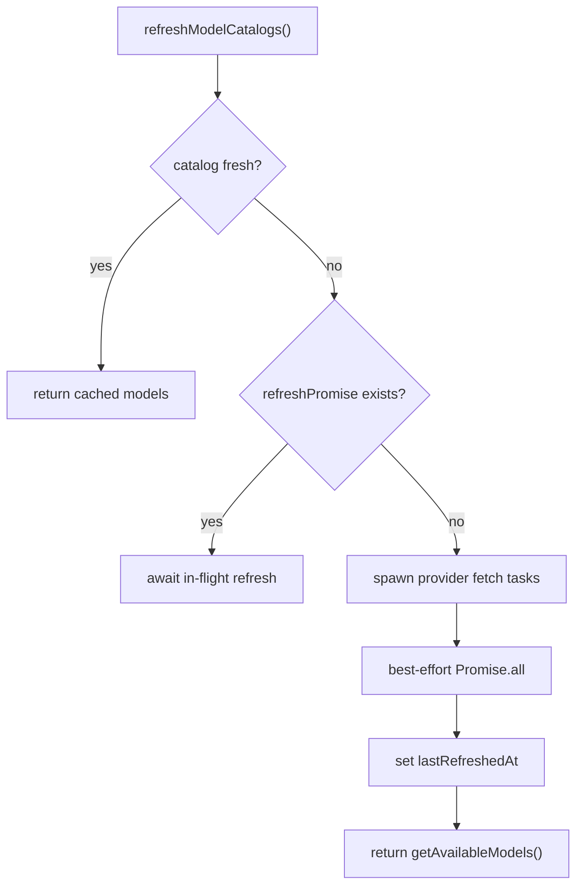

# 11. Model Catalog And Discovery

## Purpose

This document explains how the backend discovers models, caches the catalog, and exposes that catalog through `GET /api/ai/models`.

## Relevant Files

- `services/gemini.js`
- `routes/ai.js`
- `index.js`

## Core Runtime State

`services/gemini.js` keeps a process-local `runtimeModelCatalog`:

- `openrouter`
- `gemini`
- `grok`
- `together`
- `groq`
- `lastRefreshedAt`
- `refreshPromise`

This state is not stored in MongoDB or Redis.

## TTL

The catalog TTL is:

```js
Math.max(5 * 60 * 1000, Number(process.env.MODEL_CATALOG_TTL_MS || 30 * 60 * 1000))
```

Implications:

- minimum refresh interval is 5 minutes
- default refresh interval is 30 minutes
- each Node instance keeps its own refresh clock

## Provider Sources

| Provider | Discovery source |
| --- | --- |
| OpenRouter | `https://openrouter.ai/api/v1/models` |
| Gemini direct | `https://generativelanguage.googleapis.com/v1beta/models?...` |
| Grok direct | `https://api.x.ai/v1/models` |
| Together | `https://api.together.xyz/v1/models` |
| Groq | `https://api.groq.com/openai/v1/models` |
| Hugging Face | no remote catalog fetch; env-configured single model |

## Refresh Logic



## Provider Filtering

The service filters remote catalogs so only chat-capable text models survive:

- OpenRouter models must support text output
- Together models drop whisper/image/video/flux/sora-like entries
- Groq models drop prompt guards and non-chat utilities
- Gemini models drop embeddings, image/video/audio/live/deep-research variants

## Model Exposure

`GET /api/ai/models` returns:

- synthetic `auto` option
- provider-backed models from `getAvailableModels({ includeFallback: false })`
- `defaultModelId`
- `hasConfiguredModels`
- `emptyStateMessage`

## Offline Fallback

`getAvailableModels()` adds:

```json
{
  "id": "fallback/offline",
  "provider": "fallback",
  "label": "Offline fallback",
  "supportsFiles": true
}
```

But the route suppresses fallback-only exposure by requesting `includeFallback: false`.

## Operational Notes

- remote catalog refresh failures are swallowed per provider
- a partial catalog is still usable
- startup also calls refresh, but runtime requests may trigger another refresh after TTL expiry

## Risks

- each instance may advertise slightly different model lists depending on refresh timing
- provider APIs can change catalog shapes without compile-time detection
- there is no persistent catalog snapshot for debugging

## `dist/` Drift Notes

`dist/services/ai/gemini.service.js` also has catalog refresh, but:

- it is Prisma-era code with different provider defaults
- it returns a different wrapped response surface through `dist/services/aiFeature.service.js`
- it uses a separate naming scheme around fallback priority and telemetry

## Rebuild Notes

1. persist model-catalog snapshots for observability
2. move provider filters into tested, per-provider modules
3. consider separating “UI-visible models” from “internal fallback chain candidates”

