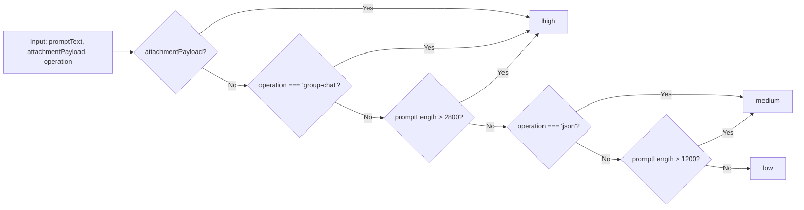
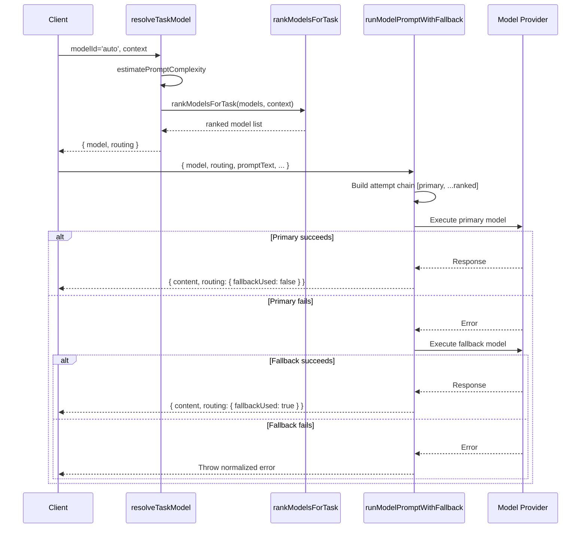

# 12. Auto Routing and Model Selection

## Table of Contents
1. [Purpose](#purpose)
2. [Relevant Source Files and Line References](#relevant-source-files-and-line-references)
3. [Architecture Overview](#architecture-overview)
4. [Prompt Complexity Estimation](#prompt-complexity-estimation)
5. [Model Ranking Algorithm](#model-ranking-algorithm)
6. [Task Model Resolution](#task-model-resolution)
7. [Preference Tables by Complexity and Operation](#preference-tables-by-complexity-and-operation)
8. [Attachment-Aware Routing](#attachment-aware-routing)
9. [Auto Mode vs Manual Mode](#auto-mode-vs-manual-mode)
10. [Routing Metadata and Observability](#routing-metadata-and-observability)
11. [Request and Response Examples](#request-and-response-examples)
12. [Integration with Fallback Chain](#integration-with-fallback-chain)
13. [Database Update Points](#database-update-points)
14. [Failure Cases and Recovery](#failure-cases-and-recovery)
15. [Scaling and Operational Implications](#scaling-and-operational-implications)
16. [Inconsistencies, Risks, and Improvement Areas](#inconsistencies-risks-and-improvement-areas)
17. [How to Rebuild From Scratch](#how-to-rebuild-from-scratch)

---

## Purpose

The Auto Routing and Model Selection subsystem determines which AI model should handle a given request when the user does not specify an explicit model (i.e., when `modelId` is `'auto'` or `null`). It analyzes the request characteristics -- prompt length, presence of attachments, and operation type -- to estimate task complexity, then ranks available models by suitability and selects the best candidate. This enables the system to automatically route simple queries to fast, cheap models and complex tasks to powerful, capable models, optimizing for both quality and cost.

The routing decision is captured in a `routing` metadata object that travels with the response, enabling observability, debugging, and cost attribution.

---

## Relevant Source Files and Line References

| File | Lines | Description |
|------|-------|-------------|
| `services/gemini.js` | 575-584 | `estimatePromptComplexity` function |
| `services/gemini.js` | 586-594 | `findFirstModelByPatterns` helper |
| `services/gemini.js` | 596-634 | `rankModelsForTask` function with preference tables |
| `services/gemini.js` | 636-666 | `resolveTaskModel` function |
| `services/gemini.js` | 1213-1313 | `runModelPromptWithFallback` -- consumes routing decisions |
| `services/gemini.js` | 1324-1344 | `sendMessage` -- passes modelId through routing |
| `services/gemini.js` | 1346-1371 | `sendGroupMessage` -- passes modelId through routing |

---

## Architecture Overview

```mermaid
flowchart TD
    A[Incoming Request with modelId] --> B{modelId specified and not 'auto'?}
    B -->|Yes| C[resolveModel explicit ID]
    B -->|No| D[estimatePromptComplexity]

    D --> E{Analyze request characteristics}
    E --> F[promptLength > 2800?]
    E --> G[has attachment?]
    E --> H[operation type?]

    F -->|Yes| I[complexity = 'high']
    G -->|Yes| I
    H -->|'group-chat'| I
    F -->|No| J[promptLength > 1200?]
    H -->|'json'| K[complexity = 'medium']
    J -->|Yes| K
    J -->|No| L[complexity = 'low']

    I --> M[rankModelsForTask]
    K --> M
    L --> M

    M --> N[Select preference table by operation]
    N --> O[Get preferred patterns for complexity]
    O --> P[Prepend attachment models if needed]
    P --> Q[Match patterns against available models]
    Q --> R[Build prioritized + remaining lists]
    R --> S[Select rankedModels[0]]

    C --> T[Resolve to model object]
    S --> T

    T --> U[resolveTaskModel returns model + routing metadata]
    U --> V[runModelPromptWithFallback executes]
```

---

## Prompt Complexity Estimation

```javascript
// services/gemini.js:575-584
function estimatePromptComplexity(promptText, attachmentPayload, operation) {
  const promptLength = String(promptText || '').length;
  if (attachmentPayload || operation === 'group-chat' || promptLength > 2800) {
    return 'high';
  }
  if (operation === 'json' || promptLength > 1200) {
    return 'medium';
  }
  return 'low';
}
```

### Complexity Classification Rules

| Condition | Complexity | Rationale |
|-----------|------------|-----------|
| `attachmentPayload` is truthy | `high` | File/image processing requires multimodal understanding |
| `operation === 'group-chat'` | `high` | Group context involves multiple participants and room state |
| `promptLength > 2800` characters | `high` | Long prompts indicate complex, multi-part questions |
| `operation === 'json'` | `medium` | Structured output requires precision but not deep reasoning |
| `promptLength > 1200` characters | `medium` | Moderately long prompts need more capable models |
| None of the above | `low` | Simple queries can be handled by lightweight models |

### Character Thresholds

| Threshold | Value | Purpose |
|-----------|-------|---------|
| High complexity boundary | 2,800 chars | ~400-500 words; indicates multi-paragraph context |
| Medium complexity boundary | 1,200 chars | ~200 words; indicates substantial but not complex input |

### Design Observations

The complexity estimator is **heuristic-based**, using simple character counts and operation type. It does not analyze:
- Semantic complexity (a short prompt could ask for deep reasoning).
- Domain specificity (medical, legal, or technical queries).
- Required output format complexity.
- Historical performance data on similar prompts.

This is a deliberate trade-off: the estimator is O(1) in time complexity and requires no external calls, making it suitable for synchronous routing decisions.

### Complexity Estimation Flowchart



---

## Model Ranking Algorithm

```javascript
// services/gemini.js:596-634
function rankModelsForTask(models, context = {}) {
  const complexity = context.complexity || 'medium';
  const operation = context.operation || 'chat';
  const hasAttachment = Boolean(context.attachmentPayload);

  const preferences = operation === 'json'
    ? {
        low: ['gpt-5.4-mini', 'gemini-2.5-flash', 'llama-3.1-8b-instant', 'qwen3-32b', 'compound-mini'],
        medium: ['gpt-5.4-mini', 'gemini-2.5-flash', 'claude-sonnet-4.6', 'qwen3-32b', 'llama-3.3-70b-versatile'],
        high: ['gpt-5.4', 'claude-sonnet-4.6', 'gemini-2.5-pro', 'claude-opus-4.6', 'llama-3.3-70b-versatile'],
      }
    : {
        low: ['gpt-5.4-mini', 'gemini-2.5-flash', 'llama-3.1-8b-instant', 'qwen3-32b', 'compound-mini'],
        medium: ['gpt-5.4-mini', 'claude-sonnet-4.6', 'gemini-2.5-flash', 'qwen3-32b', 'llama-3.3-70b-versatile'],
        high: ['gpt-5.4', 'claude-opus-4.6', 'claude-sonnet-4.6', 'gemini-2.5-pro', 'llama-3.3-70b-versatile'],
      };

  const preferredPatterns = [...(preferences[complexity] || preferences.medium)];
  if (hasAttachment) {
    preferredPatterns.unshift('gemini-2.5-flash', 'gemini-2.5-pro', 'gpt-5.4-mini');
  }

  const prioritized = [];
  const remaining = [...models];

  preferredPatterns.forEach((pattern) => {
    const match = findFirstModelByPatterns(remaining, [pattern]);
    if (!match) {
      return;
    }
    prioritized.push(match);
    const index = remaining.findIndex((model) => model.id === match.id);
    if (index !== -1) {
      remaining.splice(index, 1);
    }
  });

  return [...prioritized, ...remaining];
}
```

### Ranking Algorithm Steps

1. **Determine complexity and operation type** from context (defaults to `'medium'` and `'chat'`).
2. **Select preference table** based on operation type (`json` vs. non-json).
3. **Get preferred patterns** for the determined complexity level.
4. **Prepend attachment-preferring models** if an attachment is present.
5. **Iterate through preferred patterns**, finding the first matching model in the remaining pool for each pattern.
6. **Build prioritized list** by appending matched models in preference order.
7. **Append remaining models** (those not matching any preferred pattern) at the end.
8. **Return the ranked list** with the best candidate at index 0.

### Pattern Matching

```javascript
// services/gemini.js:586-594
function findFirstModelByPatterns(models, patterns) {
  for (const pattern of patterns) {
    const match = models.find((model) => model.id.toLowerCase().includes(pattern.toLowerCase()));
    if (match) {
      return match;
    }
  }
  return null;
}
```

Pattern matching uses **case-insensitive substring matching** on the model ID. For example:
- Pattern `'gpt-5.4-mini'` matches `'openai/gpt-5.4-mini'` (OpenRouter).
- Pattern `'gemini-2.5-flash'` matches `'gemini-2.5-flash'` (Gemini direct) and `'google/gemini-2.5-flash'` (OpenRouter).

This means the same pattern can match models from different providers, and the first match in the remaining pool wins.

---

## Task Model Resolution

```javascript
// services/gemini.js:636-666
function resolveTaskModel(requestedModelId, context = {}) {
  const availableModels = getAvailableModels({ includeFallback: false })
    .filter((model) => model.provider !== 'fallback');

  if (availableModels.length === 0) {
    return {
      model: resolveModel(requestedModelId),
      routing: {
        requestedModelId: requestedModelId || null,
        autoMode: false,
        complexity: null,
      },
    };
  }

  if (requestedModelId && requestedModelId !== 'auto') {
    const resolved = resolveModel(requestedModelId, { includeFallback: false });
    return {
      model: resolved,
      routing: {
        requestedModelId,
        selectedModelId: resolved?.id || null,
        autoMode: false,
        complexity: context.complexity || null,
      },
    };
  }

  const rankedModels = rankModelsForTask(availableModels, context);
  const selectedModel = rankedModels[0] || availableModels[0];
  return {
    model: selectedModel,
    routing: {
      requestedModelId: requestedModelId || 'auto',
      selectedModelId: selectedModel?.id || null,
      autoMode: true,
      complexity: context.complexity || null,
    },
  };
}
```

### Decision Tree

```mermaid
flowchart TD
    A[resolveTaskModel called] --> B{availableModels empty?}
    B -->|Yes| C[Return resolveModel result, autoMode: false]
    B -->|No| D{requestedModelId set and not 'auto'?}
    D -->|Yes| E[resolveModel explicit ID]
    E --> F[Return resolved model, autoMode: false]
    D -->|No| G[rankModelsForTask]
    G --> H[Select rankedModels[0]]
    H --> I[Return selected model, autoMode: true]
```

### Return Shape

```javascript
{
  model: { id, label, provider, supportsFiles },  // Selected model object
  routing: {
    requestedModelId: string | null,   // What the user requested (or 'auto')
    selectedModelId: string | null,    // What was actually selected
    autoMode: boolean,                 // Whether auto-routing was used
    complexity: string | null,         // Estimated complexity level
    fallbackUsed: boolean,             // Set later by runModelPromptWithFallback
  }
}
```

---

## Preference Tables by Complexity and Operation

### Chat Operation Preferences

| Complexity | Rank 1 | Rank 2 | Rank 3 | Rank 4 | Rank 5 |
|------------|--------|--------|--------|--------|--------|
| **Low** | gpt-5.4-mini | gemini-2.5-flash | llama-3.1-8b-instant | qwen3-32b | compound-mini |
| **Medium** | gpt-5.4-mini | claude-sonnet-4.6 | gemini-2.5-flash | qwen3-32b | llama-3.3-70b-versatile |
| **High** | gpt-5.4 | claude-opus-4.6 | claude-sonnet-4.6 | gemini-2.5-pro | llama-3.3-70b-versatile |

### JSON Operation Preferences

| Complexity | Rank 1 | Rank 2 | Rank 3 | Rank 4 | Rank 5 |
|------------|--------|--------|--------|--------|--------|
| **Low** | gpt-5.4-mini | gemini-2.5-flash | llama-3.1-8b-instant | qwen3-32b | compound-mini |
| **Medium** | gpt-5.4-mini | gemini-2.5-flash | claude-sonnet-4.6 | qwen3-32b | llama-3.3-70b-versatile |
| **High** | gpt-5.4 | claude-sonnet-4.6 | gemini-2.5-pro | claude-opus-4.6 | llama-3.3-70b-versatile |

### Key Differences Between Chat and JSON Preferences

| Aspect | Chat | JSON |
|--------|------|------|
| Medium complexity, rank 2 | claude-sonnet-4.6 | gemini-2.5-flash |
| Medium complexity, rank 3 | gemini-2.5-flash | claude-sonnet-4.6 |
| High complexity, rank 2 | claude-opus-4.6 | claude-sonnet-4.6 |
| High complexity, rank 4 | gemini-2.5-pro | claude-opus-4.6 |

The JSON operation preferences prioritize models known for structured output reliability (Gemini Flash and Claude Sonnet) over raw reasoning power. The chat preferences prioritize reasoning and conversation quality.

### Attachment-Aware Model Boosting

When an attachment is present, three models are prepended to the preference list:

```javascript
if (hasAttachment) {
  preferredPatterns.unshift('gemini-2.5-flash', 'gemini-2.5-pro', 'gpt-5.4-mini');
}
```

This ensures multimodal-capable models are tried first, regardless of the complexity level. The ordering reflects:
1. **gemini-2.5-flash**: Fast, cost-effective multimodal processing.
2. **gemini-2.5-pro**: Higher-quality multimodal understanding for complex images.
3. **gpt-5.4-mini**: OpenAI's multimodal model as a backup.

---

## Auto Mode vs Manual Mode

### Auto Mode

Auto mode is activated when:
- `modelId` is `null`, `undefined`, or the string `'auto'`.
- At least one non-fallback model is available.

In auto mode, the system:
1. Estimates prompt complexity.
2. Ranks models by suitability.
3. Selects the top-ranked model.
4. Sets `routing.autoMode = true`.

### Manual Mode

Manual mode is activated when:
- `modelId` is a specific model ID string (not `'auto'`).

In manual mode, the system:
1. Resolves the requested model ID via `resolveModel`.
2. Returns the resolved model (or the default if not found).
3. Sets `routing.autoMode = false`.

**Note**: Even in manual mode, `runModelPromptWithFallback` will build a fallback chain that includes other ranked models, so the routing preferences still influence fallback behavior.

---

## Routing Metadata and Observability

The `routing` object is attached to every AI response and contains:

| Field | Type | When Set | Description |
|-------|------|----------|-------------|
| `requestedModelId` | `string \| null` | Always | The model ID the user requested, or `'auto'` |
| `selectedModelId` | `string \| null` | Always | The model ID actually used for the request |
| `autoMode` | `boolean` | Always | Whether auto-routing determined the model |
| `complexity` | `string \| null` | Auto mode only | Estimated complexity: `'low'`, `'medium'`, or `'high'` |
| `fallbackUsed` | `boolean` | After execution | Whether a fallback model was used (set by `runModelPromptWithFallback`) |

### Logging Integration

`runModelPromptWithFallback` logs routing metadata on each attempt:

```javascript
// services/gemini.js:1246-1258
logger.info('AI_ATTEMPT', 'Running model prompt', {
  operation,
  attempt: attemptIndex + 1,
  totalAttempts: attemptChain.length,
  modelId: currentModel.id,
  provider: currentModel.provider,
  requestedModelId: modelId || routing?.requestedModelId || model.id,
  fallbackAttempt: isFallbackAttempt,
  promptLength: String(promptText || '').length,
  hasAttachment: Boolean(attachmentPayload),
  autoMode: Boolean(routing?.autoMode),
  complexity,
});
```

And on success:

```javascript
// services/gemini.js:1265-1278
logger.info('AI_SUCCESS', 'Model prompt completed', {
  operation,
  attempt: attemptIndex + 1,
  modelId: currentModel.id,
  provider: currentModel.provider,
  fallbackUsed: isFallbackAttempt,
  autoMode: Boolean(routing?.autoMode),
  complexity,
  processingMs,
  promptTokens: usage.promptTokens,
  completionTokens: usage.completionTokens,
  totalTokens: usage.totalTokens,
  contentLength: String(result?.content || '').length,
});
```

---

## Request and Response Examples

### Example 1: Auto-Routed Simple Chat

**Input:**
```javascript
resolveTaskModel('auto', {
  operation: 'chat',
  promptText: 'Hello, how are you?',
  attachmentPayload: null,
  complexity: 'low',
});
```

**Output:**
```javascript
{
  model: { id: 'openai/gpt-5.4-mini', label: 'GPT-5.4 Mini', provider: 'openrouter', supportsFiles: true },
  routing: {
    requestedModelId: 'auto',
    selectedModelId: 'openai/gpt-5.4-mini',
    autoMode: true,
    complexity: 'low',
  }
}
```

### Example 2: Auto-Routed Complex Chat with Attachment

**Input:**
```javascript
resolveTaskModel('auto', {
  operation: 'chat',
  promptText: 'Analyze this image and describe what you see in detail...',
  attachmentPayload: { fileName: 'photo.jpg', imageDataUrl: 'data:image/jpeg;base64,...' },
  complexity: 'high',
});
```

**Output:**
```javascript
{
  model: { id: 'gemini-2.5-flash', label: 'Gemini 2.5 Flash', provider: 'gemini', supportsFiles: true },
  routing: {
    requestedModelId: 'auto',
    selectedModelId: 'gemini-2.5-flash',
    autoMode: true,
    complexity: 'high',
  }
}
```

Note: `gemini-2.5-flash` is selected because attachment-aware models are prepended to the preference list, and it's the first match.

### Example 3: Manual Model Selection

**Input:**
```javascript
resolveTaskModel('anthropic/claude-opus-4.6', {
  operation: 'chat',
  promptText: 'Write a detailed analysis...',
  attachmentPayload: null,
  complexity: 'high',
});
```

**Output:**
```javascript
{
  model: { id: 'anthropic/claude-opus-4.6', label: 'Claude Opus 4.6', provider: 'openrouter', supportsFiles: true },
  routing: {
    requestedModelId: 'anthropic/claude-opus-4.6',
    selectedModelId: 'anthropic/claude-opus-4.6',
    autoMode: false,
    complexity: 'high',
  }
}
```

### Example 4: No Models Available

**Input:**
```javascript
resolveTaskModel('auto', {
  operation: 'chat',
  promptText: 'Hello',
  attachmentPayload: null,
  complexity: 'low',
});
// Called when no API keys are configured
```

**Output:**
```javascript
{
  model: { id: 'fallback/offline', provider: 'fallback', label: 'Offline fallback', supportsFiles: true },
  routing: {
    requestedModelId: 'auto',
    selectedModelId: null,
    autoMode: false,
    complexity: null,
  }
}
```

---

## Integration with Fallback Chain

Auto routing and the fallback chain are complementary systems:



The attempt chain built by `runModelPromptWithFallback` uses the primary model selected by `resolveTaskModel` as the first attempt, then appends the remaining ranked models (up to `AI_FALLBACK_MODEL_LIMIT`):

```javascript
// services/gemini.js:1233-1238
const rankedModels = rankModelsForTask(
  getAvailableModels({ includeFallback: false }).filter((entry) => entry.provider !== 'fallback'),
  { operation, promptText, attachmentPayload, complexity }
);
const attemptChain = [model, ...rankedModels.filter((entry) => entry.id !== model.id)]
  .slice(0, Math.max(1, Number(process.env.AI_FALLBACK_MODEL_LIMIT || 6)));
```

This means the fallback chain respects the same ranking preferences as the initial selection, ensuring that fallback models are also well-suited for the task.

---

## Database Update Points

The auto routing subsystem is **purely in-memory** and does not write to any database. The routing metadata is:
- Returned in the API response to the caller.
- Logged via the structured logger.
- Not persisted to any database collection.

**Implication**: There is no historical record of routing decisions. To analyze routing patterns over time, you would need to:
1. Parse structured logs.
2. Add a database write in `runModelPromptWithFallback` to persist routing metadata.
3. Implement a separate analytics pipeline.

---

## Failure Cases and Recovery

### Failure Case Matrix

| Scenario | Behavior | Recovery |
|----------|----------|----------|
| No models available | Returns fallback model with `autoMode: false` | System continues with offline fallback response |
| Requested model ID not found in catalog | `resolveModel` falls back to default model or first available | User gets a response, just not from their preferred model |
| Complexity estimation produces wrong level | Wrong model tier selected (e.g., cheap model for complex task) | Fallback chain catches failures; quality may be suboptimal |
| Attachment detection fails | Attachment-aware model boosting not applied | May route to a model that cannot process the attachment |
| Pattern matching finds no matches | Ranked list contains only remaining (unranked) models | First available model is used; may not be optimal |
| All preferred models unavailable | Remaining models (not in preference table) are used | System continues with whatever models are available |

### Edge Cases

1. **Empty preference table**: If `preferences[complexity]` is undefined, defaults to `preferences.medium`.
2. **Single model available**: `rankModelsForTask` returns that single model; no ranking possible.
3. **Model ID case sensitivity**: Pattern matching is case-insensitive, so `GPT-5.4-MINI` matches `gpt-5.4-mini`.
4. **Provider prefix matching**: Pattern `gemini-2.5-flash` matches both `gemini-2.5-flash` (direct) and `google/gemini-2.5-flash` (OpenRouter).

---

## Scaling and Operational Implications

### Cost Optimization

Auto routing directly impacts operational costs:
- **Low complexity** tasks use `gpt-5.4-mini` or `gemini-2.5-flash`, which are among the cheapest models.
- **High complexity** tasks use `gpt-5.4` or `claude-opus-4.6`, which are more expensive but necessary for quality.
- The system automatically scales model capability with task complexity, avoiding over-provisioning for simple tasks.

### Latency Impact

Model selection affects response latency:
- **Low complexity models**: Typically < 500ms response time.
- **Medium complexity models**: Typically 500ms - 2s response time.
- **High complexity models**: Typically 2s - 10s response time.

The auto-routing system implicitly optimizes for latency by preferring faster models for simpler tasks.

### Load Distribution

In a multi-provider setup, auto routing distributes load across providers:
- OpenRouter handles GPT, Claude, and Gemini models.
- Gemini direct handles Gemini models.
- Groq handles Llama and Qwen models.
- Together AI handles Llama, DeepSeek, and Qwen models.

This natural distribution reduces the risk of any single provider becoming a bottleneck.

### Observability Gaps

Without persisted routing metadata, it is difficult to:
- Track how often auto-routing selects each model.
- Measure the success rate of auto-routed vs. manually-selected models.
- Analyze cost per complexity tier.
- Detect when the preference table is producing suboptimal selections.

---

## Inconsistencies, Risks, and Improvement Areas

### Identified Issues

1. **Heuristic complexity estimation**: Character count is a poor proxy for semantic complexity. A 100-character prompt asking "Explain quantum entanglement" is more complex than a 3,000-character prompt listing grocery items.

2. **Static preference tables**: The preference tables are hardcoded and do not adapt based on actual model performance, availability, or cost changes.

3. **No cost awareness**: The routing system does not consider model pricing. It might select an expensive model when a cheaper one would suffice.

4. **No latency awareness**: The system does not track or consider model response times. A slower model might be preferred over a faster one with equivalent quality.

5. **Pattern matching ambiguity**: Substring matching can produce unexpected matches. For example, pattern `'flash'` would match `gemini-2.5-flash` and `gemini-3-flash-preview`.

6. **No user preference learning**: The system does not learn from user corrections (e.g., when a user re-runs a request with a different model).

### Suggested Improvements

| Improvement | Priority | Effort | Impact |
|------------|----------|--------|--------|
| Add semantic complexity analysis (keyword/topic-based) | Medium | Medium | Better model selection |
| Implement dynamic preference tables based on performance metrics | High | High | Adaptive routing |
| Add cost-per-token awareness to routing decisions | Medium | Low | Cost optimization |
| Persist routing metadata for analytics | Medium | Low | Observability |
| Add user preference learning from re-runs | Low | High | Personalized routing |
| Implement A/B testing for preference table tuning | Low | Medium | Data-driven optimization |

---

## How to Rebuild From Scratch

### Step 1: Define Complexity Estimation

```javascript
function estimatePromptComplexity(promptText, attachmentPayload, operation) {
  // Use character count thresholds and operation type
  // Return 'low', 'medium', or 'high'
}
```

### Step 2: Define Preference Tables

Create a mapping of `(operation, complexity)` to ordered model preference lists:

```javascript
const preferences = {
  chat: {
    low: ['fast-model-1', 'fast-model-2'],
    medium: ['balanced-model-1', 'balanced-model-2'],
    high: ['powerful-model-1', 'powerful-model-2'],
  },
  json: {
    low: ['structured-model-1'],
    medium: ['structured-model-2'],
    high: ['structured-model-3'],
  },
};
```

### Step 3: Implement Model Ranking

```javascript
function rankModelsForTask(models, context) {
  // Select preference table based on operation
  // Get preferred patterns for complexity level
  // Prepend attachment-aware models if needed
  // Match patterns against available models
  // Return ranked list
}
```

### Step 4: Implement Task Model Resolution

```javascript
function resolveTaskModel(requestedModelId, context) {
  // If explicit model ID, resolve it
  // If auto, rank models and select top
  // Return { model, routing }
}
```

### Step 5: Integrate with Fallback Chain

Ensure the fallback chain uses the same ranking preferences:

```javascript
const attemptChain = [primaryModel, ...rankedModels.filter(m => m.id !== primaryModel.id)]
  .slice(0, maxAttempts);
```

### Step 6: Add Routing Metadata to Responses

Attach routing information to every response for observability.

### Step 7: Test

- Test auto-routing with various prompt lengths and operations.
- Test manual model selection.
- Test with no models available.
- Test attachment-aware routing.
- Test fallback chain integration.
- Verify routing metadata is correct in all scenarios.
