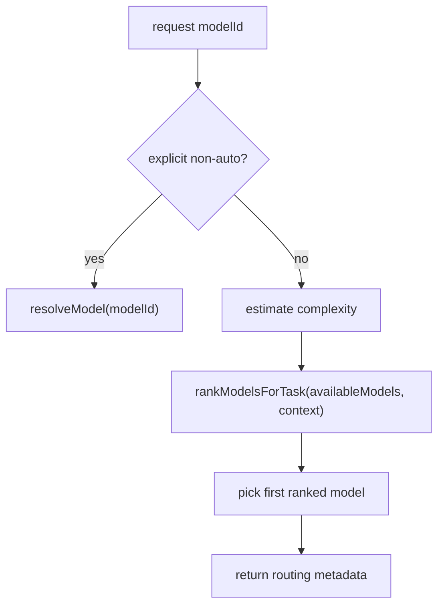

# 12. Auto Routing And Model Selection

## Purpose

This document explains how the backend chooses a model when the caller passes `modelId: "auto"` or omits `modelId`.

## Relevant Files

- `services/gemini.js`
- `routes/ai.js`
- `routes/chat.js`
- `index.js`

## Source Of Truth

Routing logic lives in `services/gemini.js`:

- `estimatePromptComplexity()`
- `rankModelsForTask()`
- `resolveTaskModel()`
- `runModelPromptWithFallback()`

## Complexity Scoring

The backend classifies prompt complexity with simple heuristics:

| Condition | Complexity |
| --- | --- |
| attachment present, `group-chat`, or prompt length > 2800 | `high` |
| JSON operation or prompt length > 1200 | `medium` |
| otherwise | `low` |

This is not learned routing. It is purely hand-written.

## Ranking Preferences

The service keeps preferred model-name patterns for:

- `json`
- non-JSON chat tasks
- `low`, `medium`, and `high` complexity

Examples:

- low/medium often prefer `gpt-5.4-mini` and `gemini-2.5-flash`
- high prefers larger models like `gpt-5.4`, `claude-opus-4.6`, `gemini-2.5-pro`
- attachments bias the preference list toward `gemini` and `gpt-5.4-mini`

## Selection Flow

## Routing Metadata

The AI layer returns:

- `requestedModelId`
- `selectedModelId`
- `autoMode`
- `complexity`
- later, after execution, `fallbackUsed`

Solo chat stores most of this on the assistant message. Room AI only exposes the final `modelId` and `provider` on the saved room message.

## Why This Is Heuristic Routing

The router does not consider:

- real token price
- current provider latency
- historical success rate
- per-provider error rates
- measured quality by task type

It only considers prompt shape and model-name preferences.

## Risks

- model-name pattern matching is brittle if providers rename models
- routing quality can drift as provider catalogs change
- JSON tasks may still land on a model with weak JSON discipline if naming matches poorly

## Rebuild Notes

1. keep heuristic routing as a bootstrap, but log actual latency/error data
2. evolve toward measured routing, not just string-pattern routing
3. make routing explainable in logs and optionally in API responses

