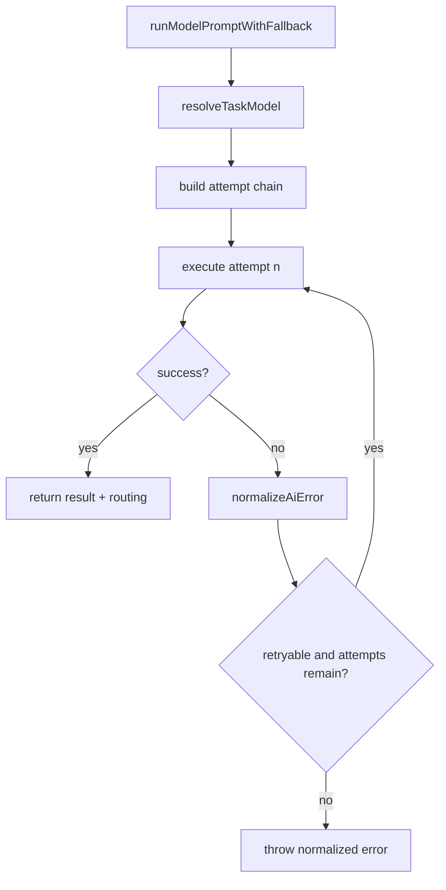

# 14. Fallback And Error Normalization

## Purpose

This document explains how the backend retries across models/providers, normalizes provider failures, and falls back when all providers fail.

## Relevant Files

- `services/gemini.js`
- `routes/chat.js`
- `routes/ai.js`
- `index.js`

## Error Normalization

`normalizeAiError(error, model)` derives:

- `code`
- `statusCode`
- `retryAfterMs`
- `isQuotaError`
- `isModelUnavailable`
- `isProviderCreditIssue`
- `isRetryable`
- `model`

## Retryable Conditions

The backend retries on errors that look like:

- rate limit / quota exhaustion
- invalid or deprecated model
- billing/credit failures
- provider `5xx`
- network or timeout failures

## Fallback Chain

At execution time:

1. select the preferred model
2. rank available models for the task
3. build `attemptChain`
4. try each model in order until success or a non-retryable/final failure

The max number of attempts is limited by `AI_FALLBACK_MODEL_LIMIT` or default `6`.

## Offline Fallback

If no provider-backed models exist:

- non-JSON operations return a generic “providers unavailable” message
- JSON operations return `'{}'`, which later parses against a route-specific fallback object if needed

## Flow

## How Routes Consume Failures

### `/api/chat`

- maps normalized rate-limit errors to `429`
- maps `AI_*` provider failures to `503`
- includes `modelId`, `provider`, `retryAfterMs`, and `requestId`

### `/api/ai/*`

- smart replies, sentiment, and grammar often swallow provider failure and return deterministic or neutral fallbacks

### `trigger_ai`

- persists a generic AI error room message if final failure escapes

## Risks

- repeated retries can increase latency sharply
- helper endpoints may hide underlying provider incidents from clients
- room AI can still create memories before the final provider failure is known

## `dist/` Drift Notes

`dist/services/ai/gemini.service.js` has its own normalization and deterministic fallback behavior, but it is a different implementation with different telemetry names and provider priority ordering.

## Rebuild Notes

1. separate “retryable” from “safe to retry under current request budget”
2. capture per-attempt telemetry centrally
3. decide which endpoints should surface fallback provenance to clients

