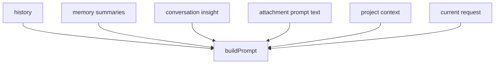

# 15. Prompt Construction

## Purpose

This document explains how the backend assembles prompts for solo chat, room AI, JSON helper tasks, memory extraction, and insight generation.

## Relevant Files

- `services/gemini.js`
- `services/promptCatalog.js`
- `services/memory.js`
- `services/conversationInsights.js`

## Core Prompt Pieces

The shared `buildPrompt()` helper combines:

- serialized conversation history
- memory context
- insight context
- attachment prompt text
- extra sections such as project context or triggering username
- current user request

## History Serialization

`serializeHistory(history)`:

- normalizes Gemini-style `{ role, parts }` entries into text
- normalizes plain `{ role, content }` entries
- keeps only the last 20 normalized entries

Output format:

```text
Recent conversation context:
user: ...
assistant: ...
```

## Memory Context

`buildMemoryContext(memoryEntries)` outputs:

```text
Relevant remembered context:
1. ...
2. ...
```

Only memory summaries are injected, not full details.

## Insight Context

`buildInsightContext(insight)` includes:

- summary
- intent
- topics
- decisions
- action items

Only non-empty fields are serialized.

## Attachment Context

`buildAttachmentPayload()` can contribute:

- file metadata text
- extracted text content
- image data URL for multimodal requests
- a PDF note that text extraction is unavailable

## Prompt Assembly By Feature

| Feature | Extra sections |
| --- | --- |
| solo chat | project context |
| room AI | `Triggered by: <username>` |
| smart replies | route-specific inline prompt, not `buildPrompt()` |
| sentiment | route-specific inline prompt |
| grammar | route-specific inline prompt |
| insight generation | custom prompt in `services/conversationInsights.js` |
| memory extraction | custom prompt in `services/memory.js` |

## Solo Chat Example Shape



## Risks

- prompt size can grow quickly when history, attachment text, and project files are all present
- only memory summaries are injected, which can discard nuance
- room AI history and room transcript are separate, so prompt context is not the same as what users see

## Rebuild Notes

1. formalize a prompt budget per context source
2. annotate prompt sections with provenance for debugging
3. test prompt serialization separately from provider calls

