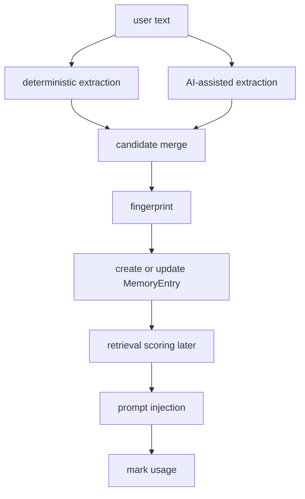

# 18. Memory System Overview

## Purpose

This document explains what the memory system is for, where it is used, and how its pieces fit together.

## Relevant Files

- `services/memory.js`
- `routes/chat.js`
- `index.js`
- `routes/memory.js`
- `services/importExport.js`
- `models/MemoryEntry.js`

## Why Memory Exists

Memory exists to give the AI durable user-specific facts that survive beyond one request. It is not a full vector database. It is a lightweight, score-based personal memory table.

## Where Memory Is Used

| Flow | How memory is used |
| --- | --- |
| solo chat | retrieves up to 5 relevant memories before model call |
| room AI | retrieves up to 5 relevant memories for the triggering user before model call |
| chat success | extracts new memories from user message |
| room AI trigger | extracts new memories from AI-triggering prompt |
| imports | extracts or upserts memories from imported conversation text |
| memory CRUD routes | lets users inspect, edit, delete, import, and export stored memories |

## Lifecycle

## Main Operations

- `buildMemoryCandidates(text)`
- `upsertMemoryEntries(...)`
- `retrieveRelevantMemories(...)`
- `markMemoriesUsed(...)`

## Memory Record Shape

Each `MemoryEntry` stores:

- `summary`
- `details`
- `tags`
- `fingerprint`
- `sourceType`
- source references such as conversation/room/message/import session
- `confidenceScore`
- `importanceScore`
- `recencyScore`
- `pinned`
- `usageCount`
- `lastObservedAt`
- `lastUsedAt`

## Design Characteristics

- deterministic extraction plus AI-assisted extraction
- query-time lexical scoring, not embeddings
- per-user uniqueness enforced by `(userId, fingerprint)`
- pinned memories bypass low-score filtering

## Risks

- regex extraction is intentionally narrow
- query scoring is token overlap only
- memory writes happen inline with user requests, so AI latency and DB latency compound

## Rebuild Notes

1. decide whether memory is “small durable profile” or “large retrieval corpus”
2. keep deterministic extraction for known high-confidence patterns
3. separate write path from retrieval path for scale

