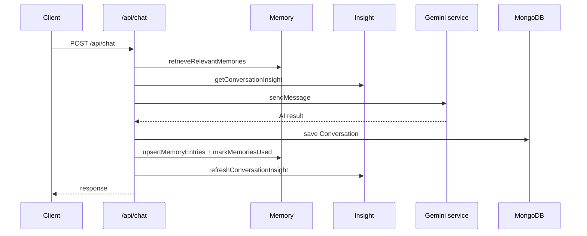
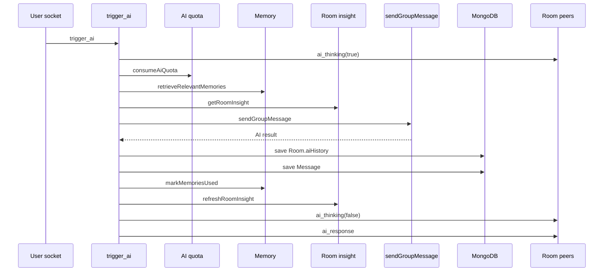
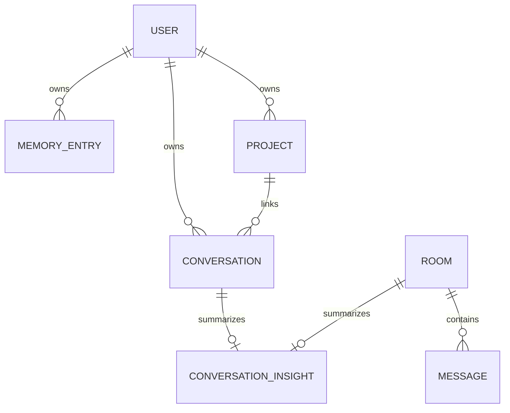
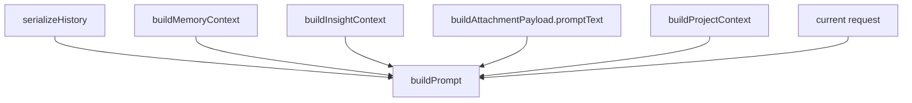

# 32. Sequence And Architecture Diagrams

## Purpose

This document collects the highest-value architecture diagrams in one place.

## Solo Chat Sequence

## Room AI Sequence

## Data Relationship Diagram

## Prompt Construction Diagram

## Rebuild Notes

1. keep diagrams close to code ownership boundaries
2. version diagrams when storage semantics change
3. prefer one diagram per real runtime path over generic “AI platform” drawings

