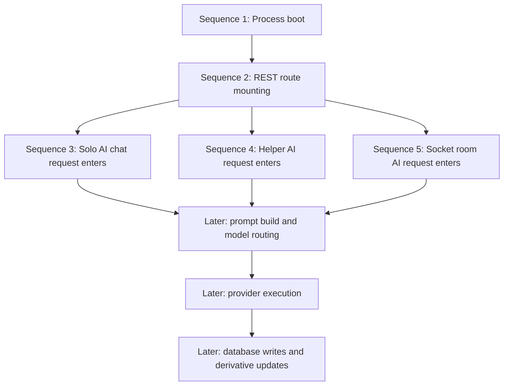
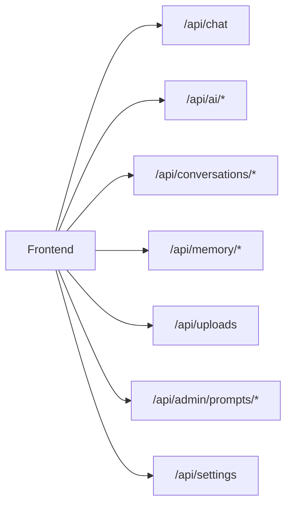

## Purpose
This file is the long-form, sequence-by-sequence deep dive for the AI features in the `backend` folder. It is intentionally designed to grow into a very large learning document. Instead of trying to dump everything at once, this file is organized as a progressive sequence log.

This first pass establishes:

- the document contract
- the reading method
- the source-of-truth rules
- the first detailed execution sequences

Future passes can extend the same file until it reaches the long-form target.

## How To Read This File
Each sequence follows the same pattern:

1. what starts the sequence
2. which files participate
3. what data enters
4. what checks happen
5. what reads happen
6. what AI work happens
7. what writes happen
8. what can fail
9. how to improve the sequence

This means you can read the file in order like an implementation story rather than a disconnected reference manual.

## Scope Rules For This Deep Dive
This document is still AI-only. It will mention non-AI code only when that code directly shapes AI behavior. Examples:

- auth middleware matters because AI routes are protected
- uploads matter because attachments become prompt context
- room membership matters because room AI uses Socket.IO and room presence rules

It will not expand unrelated product features just to make the document longer.

## Primary Source Of Truth
This deep dive treats the editable source tree as the main implementation:

- `index.js`
- `routes/chat.js`
- `routes/ai.js`
- `routes/conversations.js`
- `routes/memory.js`
- `routes/uploads.js`
- `routes/admin.js`
- `routes/settings.js`
- `services/gemini.js`
- `services/memory.js`
- `services/conversationInsights.js`
- `services/promptCatalog.js`
- `services/importExport.js`
- `services/messageFormatting.js`
- `services/aiQuota.js`
- `middleware/aiQuota.js`
- `middleware/rateLimit.js`
- `middleware/upload.js`
- `middleware/auth.js`
- `models/Conversation.js`
- `models/Message.js`
- `models/MemoryEntry.js`
- `models/ConversationInsight.js`
- `models/PromptTemplate.js`
- `models/Project.js`
- `models/Room.js`
- `models/User.js`
- `config/db.js`

`dist/` is included only when needed to explain drift.

## Why This File Exists When Other Docs Already Exist
The other AI docs are organized by subsystem. This file is different.

This file is meant to answer:

- "What exactly happens step by step when the system runs?"
- "If I start at the request edge, what chain of decisions does the code make?"
- "Where does data branch into memory, insight, storage, and provider execution?"
- "What is the easiest way to learn the project flow without jumping between 20 files?"

The rest of the docs are topic-based. This one is timeline-based.

## System Narrative In One Paragraph
The backend is an Express and Socket.IO application with MongoDB persistence. Its AI layer is not just a provider call. It combines route or socket entrypoints, auth and quota policy, prompt templates, memory retrieval, insight retrieval, attachment transformation, optional project context, heuristic model routing, multi-provider execution, fallback handling, and several post-response persistence steps. That makes the AI subsystem a small orchestration platform rather than a thin wrapper.

## Global Sequence Map


## Sequence 1. Process Boot And AI Runtime Initialization

### Goal Of This Sequence
Understand what has to happen before any AI request can work at all.

### Entry File
The process starts in `index.js`.

### Important Imports For AI
At startup the file imports:

- route handlers for `/api/chat`, `/api/ai`, `/api/conversations`, `/api/memory`, `/api/uploads`, `/api/admin`, and `/api/settings`
- socket auth middleware
- rate-limiting middleware
- Mongoose models including `Room`, `Message`, and `User`
- helper functions for room membership validation
- AI services from `services/gemini.js`
- quota service from `services/aiQuota.js`
- insight service from `services/conversationInsights.js`
- message formatting utilities
- memory services

This import set already tells us something important: AI logic is not centralized in one small folder. It is spread across routes, services, middleware, models, and the main server file.

### Environment Loading
The app loads environment variables from:

```js
require('dotenv').config({ path: path.join(__dirname, '.env') });
```

That matters because AI provider support is entirely configuration-driven. If the relevant API keys are missing, some provider branches become unavailable and the system may fall back to offline behavior.

### Database Initialization
`index.js` imports `connectDB` from `config/db.js`. That function uses:

- `mongoose.connect(process.env.MONGO_URI, ...)`
- `maxPoolSize: 10`
- `serverSelectionTimeoutMS: 5000`
- `socketTimeoutMS: 45000`

From an AI learning perspective, this matters because:

- every AI request depends on MongoDB for conversation, room, memory, insight, or prompt-template reads
- a small pool size can become a capacity bottleneck under AI-heavy concurrency
- provider latency plus database latency can compound into poor tail performance

### Startup Meaning For AI
If MongoDB fails at startup, the process exits. So unlike some systems that can run partially degraded, this backend treats the data layer as mandatory even before the first AI call.

### Passport Initialization
Passport itself is not an AI feature, but AI REST endpoints use authenticated user context. That user context becomes:

- the owner of conversations
- the owner of memories
- the subject of feature toggles
- the quota key

So identity is a dependency of the AI layer.

### Route Mounting
The main file mounts:

- `/api/chat`
- `/api/ai`
- `/api/conversations`
- `/api/memory`
- `/api/uploads`
- `/api/admin`
- `/api/settings`

From an AI feature perspective, these route mounts define the reachable HTTP surfaces.

### Request Logging Context
Before requests hit routes, `index.js` injects:

- a request id
- start/end logging
- per-request timing

This matters for AI debugging because:

- provider failures can be correlated with the original request
- rate-limit outcomes can be tied to a request id
- the logs can distinguish guest-like state from authenticated user identity

### Global API Rate Limiting
The app mounts `apiLimiter` at `/api`. That means every AI REST route is already behind a broad request limiter before feature-specific AI quota logic runs.

This creates a layered defense:

- general API limit first
- AI route-specific limit or quota later

### Socket.IO Initialization
The server creates a Socket.IO instance and applies socket auth middleware. This is significant because room AI is not an afterthought bolted onto HTTP. It is a first-class runtime path.

### In-Memory Runtime State
The file creates several `Map` instances:

- `roomUsers`
- `globalOnlineUsers`
- `typingUsers`
- `socketFlood`

These maps are operationally critical for room AI even though they are not "AI models". Room AI depends on:

- room membership truth
- flood control
- room presence state

### AI-Specific Startup Settings
Several process-level values also shape AI behavior:

- `AI_USERNAME`
- `EDIT_WINDOW_MS`
- `CLIENT_URL`

The AI-specific one here is the room-bot display name, which becomes the visible `username` for room AI messages.

### Sequence 1 Summary
By the end of startup:

- MongoDB is connected
- REST AI routes are mounted
- Socket.IO room AI support is active
- logging and rate limiting are in place
- in-memory room and flood state exists

The system is now ready to accept AI requests, but no provider-specific model call has happened yet.

### Sequence 1 Failure Cases
| Failure | What breaks | Current behavior |
|---|---|---|
| missing `MONGO_URI` or DB unreachable | all AI storage and most AI flows | process exits |
| missing provider API keys | provider execution breadth | reduced model availability or fallback |
| broken route import | affected AI surface | process startup failure |
| socket auth misconfiguration | room AI | socket path effectively broken |

### Sequence 1 Design Weaknesses
- too much responsibility lives in `index.js`
- startup does not verify provider readiness in a visible, structured way
- health checks do not expose AI provider status or model-catalog freshness

### Sequence 1 Improvement Direction
If redesigning startup, split responsibilities into:

1. config validation
2. database boot
3. REST app composition
4. socket app composition
5. AI subsystem readiness checks

## Sequence 2. REST AI Route Surfaces Become Reachable

### Goal Of This Sequence
Understand what HTTP surfaces the frontend can hit for AI behavior and what kind of work each one triggers.

### AI Route Families
The AI-related route groups are:

- `routes/chat.js`
- `routes/ai.js`
- `routes/conversations.js`
- `routes/memory.js`
- `routes/uploads.js`
- `routes/admin.js`
- `routes/settings.js`

### Why These Are Not Equal
Not every route here triggers a provider call.

Some routes are:

- direct AI generation routes
- context-management routes
- configuration routes
- storage or retrieval routes

That distinction matters when explaining project flow.

### Route Group 1: `/api/chat`
This is the primary REST AI conversation entrypoint.

It does:

- request validation
- attachment validation
- memory retrieval
- insight retrieval
- optional project loading
- provider call
- persistence of both user and assistant messages
- post-success memory and insight maintenance

This is the densest AI route in the source tree.

### Route Group 2: `/api/ai`
This group contains:

- `GET /models`
- `POST /smart-replies`
- `POST /sentiment`
- `POST /grammar`

These routes are narrower helper features. They are still AI-backed, but they do not persist conversation history the way `/api/chat` does.

### Route Group 3: `/api/conversations`
This group is mostly read-oriented from an AI perspective:

- list conversations
- fetch one conversation
- fetch an insight
- run explicit summarize/extract actions

These routes tell us how AI output is later consumed, not just how it is generated.

### Route Group 4: `/api/memory`
This is the durable memory-management surface. It matters because memory is one of the main context sources used by chat and room AI.

### Route Group 5: `/api/uploads`
Uploads matter to AI because attachment metadata is later fed into prompt construction.

### Route Group 6: `/api/admin`
Admin prompt routes matter because they can change prompt behavior without changing code.

### Route Group 7: `/api/settings`
User settings matter because some helper AI features can be disabled per user.

### REST Surface Diagram


### Middleware Layering For REST AI
Several AI routes stack middleware in this order:

1. authentication
2. route-level rate limiting
3. AI quota
4. route logic

This is different from the socket flow, where quota is enforced directly inside the event handler.

### Why This Matters For Learning
If a newcomer only reads `services/gemini.js`, they will miss:

- the feature-toggle gates
- attachment validation behavior
- route-specific error shaping
- persistence order

So understanding route surfaces is necessary before understanding model execution.

### Sequence 2 Summary
By the end of this sequence, we know:

- where the AI HTTP entrypoints are
- which routes generate AI output
- which routes only manage context or configuration
- where the backend distinguishes persistent AI flows from stateless helper features

### Sequence 2 Failure Cases
| Failure | Affected area | Consequence |
|---|---|---|
| bad JWT | all protected AI routes | request rejected before AI logic |
| route limiter hit | AI REST usage | 429 before deeper logic |
| quota hit | AI generation routes | AI work rejected even if auth succeeds |
| bad attachment metadata | chat/helper flows with files | 400 before provider call |

### Sequence 2 Improvement Direction
- add explicit OpenAPI-style contract documentation inside the repo
- move helper-feature logic from routes into dedicated services
- unify error payload shapes more strongly across all AI routes

## Sequence 3. Solo AI Chat Request Enters Through `/api/chat`

### Goal Of This Sequence
Trace the exact first part of a solo AI conversation request before provider execution begins.

### Route Signature
The route is:

```js
router.post('/', authMiddleware, aiQuotaMiddleware, async (req, res) => { ... })
```

This tells us two important things immediately:

- solo chat is authenticated
- solo chat uses AI quota directly

### Input Fields The Route Understands
The route reads:

- `message`
- `conversationId`
- `history`
- `modelId`
- `attachment`
- `projectId`

That gives us the first conceptual model of the feature:

- current prompt text
- optional existing conversation
- optional client-provided history
- optional explicit model choice
- optional file context
- optional project context

### First Validation Step
The route requires `message` to be a non-empty string. If it is missing or blank, the request is rejected with `400`.

This is a small detail, but it tells us the backend refuses "empty generation" requests. That matters when thinking about client behavior and edge cases.

### Attachment Validation
The route calls:

```js
const attachmentError = validateAttachmentPayload(attachment || {});
```

This function does not read the file body itself. It validates the metadata contract:

- `fileUrl`
- `fileName`
- `fileType`
- `fileSize`

and checks that:

- the URL starts with `/api/uploads/`
- the MIME type is allowed
- the file size is within limits

So the first phase of the solo chat route is about structural safety, not model intelligence.

### Normalizing History
The route sets:

```js
const chatHistory = Array.isArray(history) ? history : [];
```

This is simple but important:

- client-sent history is optional
- malformed history does not crash the route
- prompt assembly later has to handle an empty history case cleanly

### Memory Retrieval Begins
Before calling the model, the route asks:

```js
retrieveRelevantMemories({
  userId: req.user.id,
  query: message.trim(),
  limit: 5,
});
```

This tells us memory is retrieved from the current user prompt, not from the entire conversation state.

That design has implications:

- strong lexical overlap with the latest prompt matters
- earlier hidden context matters less unless already reflected in stored memory

### Insight Retrieval Begins
If `conversationId` exists, the route also tries to get a conversation insight.

That means a solo chat request can have two compressed context layers beyond raw history:

- memory summaries
- an AI-generated structured insight

### Conversation Loading
If `conversationId` is present, the route loads:

```js
Conversation.findOne({ _id: conversationId, userId: req.user.id })
```

This is an ownership check as well as a fetch. It prevents one user from attaching their request to another user's stored conversation.

### Project Resolution
Project selection follows a priority:

1. explicit `projectId` from request
2. existing conversation's `projectId`
3. no project

This matters because project context can become sticky once a conversation is associated with a project.

### Sequence 3 Summary
Before the model is even called, the solo chat route has already:

- authenticated the user
- enforced quota
- validated text input
- validated attachment metadata
- normalized history
- looked up relevant memory
- looked up insight
- loaded the conversation if needed
- loaded the project if needed

This is why the route is orchestration-heavy. The provider call is just one stage in a much larger sequence.

### Sequence 3 Failure Cases
| Failure | Trigger | Response |
|---|---|---|
| blank message | no usable prompt text | `400` |
| bad attachment payload | missing fields or invalid file type/URL | `400` |
| unknown project | project lookup misses | `404` |
| cross-project mismatch | request project differs from conversation project | `400` |

### Sequence 3 Design Commentary
This sequence is strong in one way: it gathers useful context before generation.

It is weaker in another way: too much of that orchestration is still embedded in the route handler rather than a dedicated application service.

## Sequence 4. Helper AI Request Enters Through `/api/ai/*`

### Goal Of This Sequence
Understand how helper features differ from full conversation chat.

### Helper Endpoints
The main helper endpoints are:

- `POST /api/ai/smart-replies`
- `POST /api/ai/sentiment`
- `POST /api/ai/grammar`

### What They Share
All three:

- require auth
- use AI limiter
- use AI quota middleware
- read user settings
- build a small prompt
- ask the model for JSON
- degrade with fallback logic

### What They Do Not Do
Unlike `/api/chat`, these helper routes do not:

- append to `Conversation`
- create `Message`
- update `Room.aiHistory`
- refresh insights
- upsert memory for the current request

That makes them cheaper, smaller, and less durable.

### Smart Replies As A Minimal AI Product
The smart-replies route takes recent messages, compresses the last few turns into a small transcript, and asks for exactly three short replies.

This is a good example of a bounded AI contract:

- input is small
- output schema is narrow
- fallback is deterministic
- storage side effects are zero

### Sentiment As A Weakly Structured AI Product
The sentiment route asks for:

- sentiment label
- confidence
- emoji

It is still bounded, but the semantic interpretation is fuzzier than smart replies.

### Grammar As A Rewrite Helper
The grammar route asks for:

- corrected text
- suggestions

It is a transformation task rather than a memory-bearing or conversation-bearing task.

### Why This Sequence Matters
These helper features show how the project uses the same provider infrastructure for smaller task-shaped AI jobs. That means `services/gemini.js` is not just a chat engine. It is also a structured-task execution layer.

### Sequence 4 Summary
The helper endpoints are lightweight AI surfaces designed for:

- narrow output contracts
- easy fallback behavior
- no durable transcript writes

They help us understand the backend's AI philosophy: use one shared model execution layer for both large and small tasks.

## Next Planned Sequences
The next extension of this file should continue with:

- Sequence 5. Room AI request enters through `trigger_ai`
- Sequence 6. Model catalogs and provider discovery initialize on demand
- Sequence 7. Prompt assembly for solo and room AI
- Sequence 8. Auto-routing and model choice
- Sequence 9. Provider execution and response normalization
- Sequence 10. Solo chat writes to MongoDB
- Sequence 11. Room AI writes to MongoDB
- Sequence 12. Memory extraction and retrieval in timeline order
- Sequence 13. Insight generation and refresh timing
- Sequence 14. Failure and fallback timelines
- Sequence 15. Scale constraints across the whole flow

## Current Status Of This Deep Dive
This file has now been started as the dedicated long-form sequence document. It is intentionally incomplete in this first pass so it can be expanded in controlled stages without becoming unstructured.

## Sequence 5. Room AI Request Enters Through `trigger_ai`

### Goal Of This Sequence
Trace how the socket-side AI feature is implemented, starting at the event boundary and ending just before provider execution returns.

### Where The Logic Lives
Unlike the REST chat flow, room AI is implemented directly in `index.js`. The important event handler is:

```js
socket.on('trigger_ai', async ({ roomId, prompt, modelId, attachment }, callback) => {
```

This is one of the most important implementation choices in the repo. It means:

- room AI orchestration is coupled to the main server file
- room AI is not hidden behind a dedicated service boundary
- understanding room AI requires reading `index.js`, not just `services/gemini.js`

### First Implementation Detail: Acknowledgement Handling
The handler begins by converting the optional callback into a safe function:

```js
const ack = getAck(callback);
```

This small helper prevents repeated `typeof callback === 'function'` checks and gives the code a consistent way to send success or failure acknowledgements.

### Second Implementation Detail: Flood Control
The handler then runs:

```js
if (isFlooded(socket, ack)) return;
```

This is not AI logic in the narrow sense, but it is a critical implementation guard. It protects the event path from repeated rapid-fire socket actions. The code does not trust the client to self-throttle.

### Third Implementation Detail: Early Model Resolution For Logging
The code resolves the requested model immediately:

```js
const requestedModel = resolveModel(modelId);
```

Even before the AI request is fully validated, the system wants a candidate model object for logging and later error reporting. This is useful because:

- the error path can still mention which model was intended
- logging stays informative even if the request fails later

### Fourth Implementation Detail: Input Validation
The route does direct prompt validation:

```js
if (!prompt || prompt.trim().length === 0) return emitSocketError(socket, ack, 'Prompt is required');
if (prompt.trim().length > 4000) return emitSocketError(socket, ack, 'Prompt must be under 4000 characters');
```

This is classic boundary validation:

- reject empty work
- cap payload size
- fail before expensive downstream operations

### Fifth Implementation Detail: Attachment Validation
The same attachment validator used by REST chat is reused:

```js
const attachmentError = validateAttachmentPayload(attachment || {});
if (attachmentError) return emitSocketError(socket, ack, attachmentError);
```

This is a good implementation pattern. It avoids drift between REST and socket rules for file metadata.

### Sixth Implementation Detail: Optimistic Room-Wide UX Signal
Before deeper checks finish, the server sends:

```js
io.to(roomId).emit('ai_thinking', { roomId, status: true });
```

This is an implementation tradeoff:

- good for responsiveness because the room sees immediate feedback
- risky because it can briefly show AI activity even if a later validation step fails

The code mitigates that by turning `ai_thinking` off on the failure paths too.

### Seventh Implementation Detail: Quota Is Enforced Inline
The room AI path uses the quota service directly:

```js
const quota = consumeAiQuota(`user:${socket.user.id}`);
```

This differs from the REST middleware pattern. The implication is important:

- REST and socket share the same quota mechanism conceptually
- but they do not share the same integration style
- quota behavior can drift over time if one path changes and the other does not

### Eighth Implementation Detail: Room Membership Check
The handler uses `loadRoomForMember(...)` and `isSocketInRoom(...)`.

This is stronger than checking only the database because it enforces both:

- the user belongs to the room logically
- the current socket has actually joined the room operationally

That dual check matters in real-time systems because database truth and socket membership truth can diverge temporarily.

### Ninth Implementation Detail: Context Loading Happens Before New Memory Upsert
The handler uses:

```js
const [memoryEntries, insight] = await Promise.all([
  retrieveRelevantMemories({ userId: socket.user.id, query: prompt.trim(), limit: 5 }),
  getRoomInsight(roomId),
]);
```

Then, after retrieval, it upserts memory from the new prompt:

```js
await upsertMemoryEntries({
  userId: socket.user.id,
  text: prompt.trim(),
  sourceType: 'room',
  sourceRoomId: roomId,
});
```

This ordering is an implementation detail worth understanding:

- the current prompt is not included in the retrieved memory set for that same request
- retrieval uses previously stored memory only
- new memory extracted from the current prompt helps future requests, not the current one

That is a sensible anti-feedback-loop design.

### Tenth Implementation Detail: Provider Call Uses `room.aiHistory`, Not Room Messages
The actual generation call is:

```js
const response = await sendGroupMessage(room.aiHistory, prompt.trim(), socket.user.username, {
  memoryEntries,
  insight,
  roomName: room.name,
  modelId,
  attachment,
});
```

This shows a core architectural decision:

- room AI prompt context comes from `room.aiHistory`
- not from replaying recent `Message` rows

That keeps prompt history smaller and more intentionally curated, but it also creates duplication with visible room messages.

## Sequence 6. Model Routing And Prompt Execution Implementation

### Goal Of This Sequence
Explain how `services/gemini.js` turns a prompt request into an actual provider call.

### Why The File Name Is Misleading
`services/gemini.js` now handles:

- model discovery
- routing heuristics
- prompt building helpers
- OpenRouter execution
- Grok execution
- Groq execution
- Together execution
- HuggingFace execution
- Gemini execution
- fallback chaining

So the file is effectively the AI execution engine, not just a Gemini wrapper.

### The Main Control Function
The most important runtime function is:

```js
runModelPromptWithFallback({ promptText, systemPrompt = '', modelId, attachment, operation = 'prompt' })
```

This function performs four major steps:

1. build attachment payload
2. estimate complexity
3. resolve task model and fallback chain
4. execute models until one succeeds or all fail

### Complexity Estimation Code
The logic is simple:

```js
function estimatePromptComplexity(promptText, attachmentPayload, operation) {
  const promptLength = String(promptText || '').length;
  if (attachmentPayload || operation === 'group-chat' || promptLength > 2800) {
    return 'high';
  }
  if (operation === 'json' || promptLength > 1200) {
    return 'medium';
  }
  return 'low';
}
```

### Coding Explanation
This function is heuristic and intentionally cheap:

- no tokenization library
- no provider-cost lookup
- no real benchmark data
- just prompt length and task shape

That makes it easy to maintain, but also easy to outgrow.

### Model Ranking Code Shape
The ranking function uses preferred model-name patterns for each task class. In implementation terms, it does:

- pick a preference list
- optionally prioritize attachment-friendly models
- find matching models by substring pattern
- preserve unmatched models afterward

This is a pragmatic implementation, not a formal scheduler.

### Fallback Chain Execution
Inside `runModelPromptWithFallback`, the code loops through candidate models and logs each attempt. The important design here is that:

- fallback is model-to-model, not provider-to-provider only
- every failure is normalized
- retryability decides whether the loop continues

### Provider Adapter Dispatch
Actual provider selection happens inside:

```js
async function executeModelRequest(model, systemPrompt, promptText, attachmentPayload, operation) {
```

The function dispatches on `model.provider`.

This is standard adapter-style coding:

- the caller does not need provider-specific branches
- the dispatch function becomes the single runtime switchboard

### Small Coding Insight: Unified Return Shape
Most provider adapter functions return:

```js
{
  content,
  usage
}
```

This is a very helpful implementation choice because the caller can treat provider results uniformly. Without that shape normalization, route logic would have to know too much about each provider.

### Implementation Risk In This File
The file is now very large and owns many concerns. That creates several risks:

- hard to test in isolation
- easy to accidentally couple unrelated features
- higher chance that future edits break multiple pathways

### Better Design If Rebuilding
A cleaner split would be:

1. `modelCatalog.service`
2. `modelRouter.service`
3. `promptBuilder.service`
4. `providerAdapters/*`
5. `fallbackPolicy.service`

The current code works, but the implementation cost of understanding and safely changing it is growing.

### Sequence 6 Summary
At this point in the deep dive, we can describe the execution story clearly:

- route or socket handler gathers context
- `services/gemini.js` estimates task complexity
- the router selects a model
- an adapter executes the request
- failures are normalized
- fallback attempts continue if allowed
