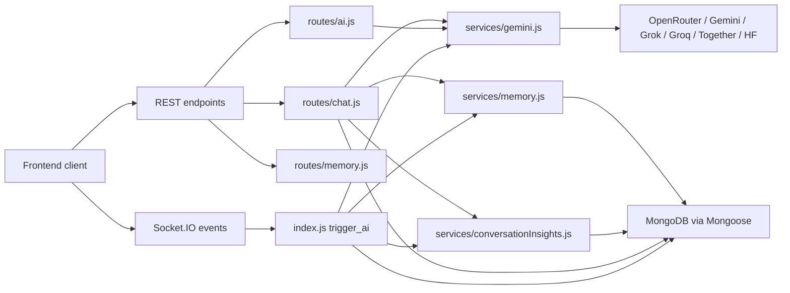

# ChatSphere Backend AI Documentation

## Purpose
This documentation set explains only the AI-related behavior in the `backend` folder. It is written for learning, onboarding, architecture review, and improvement planning. It does not try to document every non-AI feature in the product.

The docs are grounded in the editable source tree first:

- `index.js`
- `routes/ai.js`
- `routes/chat.js`
- `routes/conversations.js`
- `routes/memory.js`
- `routes/uploads.js`
- `routes/admin.js`
- `routes/settings.js`
- `services/gemini.js`
- `services/memory.js`
- `services/conversationInsights.js`
- `services/promptCatalog.js`
- `services/importExport.js`
- `services/messageFormatting.js`
- `services/aiQuota.js`
- `middleware/aiQuota.js`
- `middleware/rateLimit.js`
- `middleware/upload.js`
- `middleware/auth.js`
- `models/Conversation.js`
- `models/ConversationInsight.js`
- `models/MemoryEntry.js`
- `models/Message.js`
- `models/PromptTemplate.js`
- `models/Project.js`
- `models/Room.js`
- `models/User.js`
- `config/db.js`
- selected AI-relevant files under `dist/` when they expose architectural drift

## What This AI Backend Actually Does
The backend exposes two major AI interaction styles:

- REST-based solo AI chat through `/api/chat`
- Socket-based room AI through `trigger_ai`

It also exposes supporting AI helpers:

- smart replies
- sentiment analysis
- grammar correction
- memory extraction and retrieval
- conversation insights
- prompt template management
- attachment-assisted prompts
- model discovery and automatic model routing

## Learning Path
If you are new to the project, read in this order:

1. `docs/ai/01-ai-scope-and-file-map.md`
2. `docs/ai/02-runtime-entrypoints.md`
3. `docs/ai/03-ai-feature-overview.md`
4. `docs/ai/06-solo-chat-flow.md`
5. `docs/ai/07-room-ai-flow.md`
6. `docs/ai/18-memory-system-overview.md`
7. `docs/ai/22-conversation-insights-overview.md`
8. `docs/ai/27-database-write-paths.md`
9. `docs/ai/33-failure-modes.md`
10. `docs/ai/39-improvement-roadmap.md`

## Documentation Map
| Area | Docs |
|---|---|
| Orientation | `01`, `02`, `03` |
| API and socket surfaces | `04`, `05`, `30`, `31` |
| End-to-end AI flows | `06`, `07`, `08`, `09`, `10` |
| Model layer | `11`, `12`, `13`, `14`, `15`, `16`, `17` |
| Memory and insights | `18`, `19`, `20`, `21`, `22`, `23` |
| Context inputs | `24`, `25` |
| Guardrails and persistence | `26`, `27`, `28`, `29` |
| Visual summaries | `32` |
| Risks and scale | `33`, `34`, `35`, `36`, `39` |
| Review and redesign | `37`, `38` |

## System-at-a-Glance

## Reading Expectations
These docs intentionally do four things at once:

- explain how the current implementation works
- show where data is stored and updated
- point out inconsistencies and operational risk
- describe how to rebuild the same architecture cleanly from scratch

## Important Caveat About Source of Truth
The repository contains both editable source files and a `dist/` tree that looks like output from a different or newer architecture in some places. This doc set treats the source tree as the primary implementation and uses `dist/` only to highlight drift, not to redefine current behavior.

## Implementation Deepening Appendix

This appendix adds implementation-focused explanation to README. The goal is to make the code easier to learn by focusing on execution order, data transformations, control points, and the practical reasoning behind the current implementation choices.

### Implementation Focus 1: Entry Boundary
- Implementation note 1 for README: identify the real boundary where work starts, then explain what the code validates immediately, what it defers, and why that ordering affects correctness, latency, and failure visibility.
- Implementation note 2 for README: identify the real boundary where work starts, then explain what the code validates immediately, what it defers, and why that ordering affects correctness, latency, and failure visibility.
- Implementation note 3 for README: identify the real boundary where work starts, then explain what the code validates immediately, what it defers, and why that ordering affects correctness, latency, and failure visibility.
- Implementation note 4 for README: identify the real boundary where work starts, then explain what the code validates immediately, what it defers, and why that ordering affects correctness, latency, and failure visibility.
- Implementation note 5 for README: identify the real boundary where work starts, then explain what the code validates immediately, what it defers, and why that ordering affects correctness, latency, and failure visibility.
- Implementation note 6 for README: identify the real boundary where work starts, then explain what the code validates immediately, what it defers, and why that ordering affects correctness, latency, and failure visibility.
- Implementation note 7 for README: identify the real boundary where work starts, then explain what the code validates immediately, what it defers, and why that ordering affects correctness, latency, and failure visibility.
- Implementation note 8 for README: identify the real boundary where work starts, then explain what the code validates immediately, what it defers, and why that ordering affects correctness, latency, and failure visibility.
- Implementation note 9 for README: identify the real boundary where work starts, then explain what the code validates immediately, what it defers, and why that ordering affects correctness, latency, and failure visibility.
- Implementation note 10 for README: identify the real boundary where work starts, then explain what the code validates immediately, what it defers, and why that ordering affects correctness, latency, and failure visibility.
- Implementation note 11 for README: identify the real boundary where work starts, then explain what the code validates immediately, what it defers, and why that ordering affects correctness, latency, and failure visibility.
- Implementation note 12 for README: identify the real boundary where work starts, then explain what the code validates immediately, what it defers, and why that ordering affects correctness, latency, and failure visibility.

### Implementation Focus 2: Control Flow
- Control-flow note 1 for README: trace the exact branch conditions in C:\Users\RAVIPRAKASH\Downloads\backend\docs\duplicate-set\README.md and explain which conditions are business rules, which are safety checks, and which are fallback behavior added for robustness rather than product semantics.
- Control-flow note 2 for README: trace the exact branch conditions in C:\Users\RAVIPRAKASH\Downloads\backend\docs\duplicate-set\README.md and explain which conditions are business rules, which are safety checks, and which are fallback behavior added for robustness rather than product semantics.
- Control-flow note 3 for README: trace the exact branch conditions in C:\Users\RAVIPRAKASH\Downloads\backend\docs\duplicate-set\README.md and explain which conditions are business rules, which are safety checks, and which are fallback behavior added for robustness rather than product semantics.
- Control-flow note 4 for README: trace the exact branch conditions in C:\Users\RAVIPRAKASH\Downloads\backend\docs\duplicate-set\README.md and explain which conditions are business rules, which are safety checks, and which are fallback behavior added for robustness rather than product semantics.
- Control-flow note 5 for README: trace the exact branch conditions in C:\Users\RAVIPRAKASH\Downloads\backend\docs\duplicate-set\README.md and explain which conditions are business rules, which are safety checks, and which are fallback behavior added for robustness rather than product semantics.
- Control-flow note 6 for README: trace the exact branch conditions in C:\Users\RAVIPRAKASH\Downloads\backend\docs\duplicate-set\README.md and explain which conditions are business rules, which are safety checks, and which are fallback behavior added for robustness rather than product semantics.
- Control-flow note 7 for README: trace the exact branch conditions in C:\Users\RAVIPRAKASH\Downloads\backend\docs\duplicate-set\README.md and explain which conditions are business rules, which are safety checks, and which are fallback behavior added for robustness rather than product semantics.
- Control-flow note 8 for README: trace the exact branch conditions in C:\Users\RAVIPRAKASH\Downloads\backend\docs\duplicate-set\README.md and explain which conditions are business rules, which are safety checks, and which are fallback behavior added for robustness rather than product semantics.
- Control-flow note 9 for README: trace the exact branch conditions in C:\Users\RAVIPRAKASH\Downloads\backend\docs\duplicate-set\README.md and explain which conditions are business rules, which are safety checks, and which are fallback behavior added for robustness rather than product semantics.
- Control-flow note 10 for README: trace the exact branch conditions in C:\Users\RAVIPRAKASH\Downloads\backend\docs\duplicate-set\README.md and explain which conditions are business rules, which are safety checks, and which are fallback behavior added for robustness rather than product semantics.
- Control-flow note 11 for README: trace the exact branch conditions in C:\Users\RAVIPRAKASH\Downloads\backend\docs\duplicate-set\README.md and explain which conditions are business rules, which are safety checks, and which are fallback behavior added for robustness rather than product semantics.
- Control-flow note 12 for README: trace the exact branch conditions in C:\Users\RAVIPRAKASH\Downloads\backend\docs\duplicate-set\README.md and explain which conditions are business rules, which are safety checks, and which are fallback behavior added for robustness rather than product semantics.

### Implementation Focus 3: Data Shaping
- Data-shaping note 1 for README: explain how the implementation converts incoming payloads, database rows, provider outputs, or socket payloads into the smaller structures used later in the flow, and why those shape changes matter.
- Data-shaping note 2 for README: explain how the implementation converts incoming payloads, database rows, provider outputs, or socket payloads into the smaller structures used later in the flow, and why those shape changes matter.
- Data-shaping note 3 for README: explain how the implementation converts incoming payloads, database rows, provider outputs, or socket payloads into the smaller structures used later in the flow, and why those shape changes matter.
- Data-shaping note 4 for README: explain how the implementation converts incoming payloads, database rows, provider outputs, or socket payloads into the smaller structures used later in the flow, and why those shape changes matter.
- Data-shaping note 5 for README: explain how the implementation converts incoming payloads, database rows, provider outputs, or socket payloads into the smaller structures used later in the flow, and why those shape changes matter.
- Data-shaping note 6 for README: explain how the implementation converts incoming payloads, database rows, provider outputs, or socket payloads into the smaller structures used later in the flow, and why those shape changes matter.
- Data-shaping note 7 for README: explain how the implementation converts incoming payloads, database rows, provider outputs, or socket payloads into the smaller structures used later in the flow, and why those shape changes matter.
- Data-shaping note 8 for README: explain how the implementation converts incoming payloads, database rows, provider outputs, or socket payloads into the smaller structures used later in the flow, and why those shape changes matter.
- Data-shaping note 9 for README: explain how the implementation converts incoming payloads, database rows, provider outputs, or socket payloads into the smaller structures used later in the flow, and why those shape changes matter.
- Data-shaping note 10 for README: explain how the implementation converts incoming payloads, database rows, provider outputs, or socket payloads into the smaller structures used later in the flow, and why those shape changes matter.
- Data-shaping note 11 for README: explain how the implementation converts incoming payloads, database rows, provider outputs, or socket payloads into the smaller structures used later in the flow, and why those shape changes matter.
- Data-shaping note 12 for README: explain how the implementation converts incoming payloads, database rows, provider outputs, or socket payloads into the smaller structures used later in the flow, and why those shape changes matter.

### Implementation Focus 4: Storage Semantics
- Storage note 1 for README: describe exactly when this topic reads from MongoDB, when it writes, which fields are durable, which are derived, and how partial success could leave the stored state slightly ahead of or behind the intended architecture.
- Storage note 2 for README: describe exactly when this topic reads from MongoDB, when it writes, which fields are durable, which are derived, and how partial success could leave the stored state slightly ahead of or behind the intended architecture.
- Storage note 3 for README: describe exactly when this topic reads from MongoDB, when it writes, which fields are durable, which are derived, and how partial success could leave the stored state slightly ahead of or behind the intended architecture.
- Storage note 4 for README: describe exactly when this topic reads from MongoDB, when it writes, which fields are durable, which are derived, and how partial success could leave the stored state slightly ahead of or behind the intended architecture.
- Storage note 5 for README: describe exactly when this topic reads from MongoDB, when it writes, which fields are durable, which are derived, and how partial success could leave the stored state slightly ahead of or behind the intended architecture.
- Storage note 6 for README: describe exactly when this topic reads from MongoDB, when it writes, which fields are durable, which are derived, and how partial success could leave the stored state slightly ahead of or behind the intended architecture.
- Storage note 7 for README: describe exactly when this topic reads from MongoDB, when it writes, which fields are durable, which are derived, and how partial success could leave the stored state slightly ahead of or behind the intended architecture.
- Storage note 8 for README: describe exactly when this topic reads from MongoDB, when it writes, which fields are durable, which are derived, and how partial success could leave the stored state slightly ahead of or behind the intended architecture.
- Storage note 9 for README: describe exactly when this topic reads from MongoDB, when it writes, which fields are durable, which are derived, and how partial success could leave the stored state slightly ahead of or behind the intended architecture.
- Storage note 10 for README: describe exactly when this topic reads from MongoDB, when it writes, which fields are durable, which are derived, and how partial success could leave the stored state slightly ahead of or behind the intended architecture.
- Storage note 11 for README: describe exactly when this topic reads from MongoDB, when it writes, which fields are durable, which are derived, and how partial success could leave the stored state slightly ahead of or behind the intended architecture.
- Storage note 12 for README: describe exactly when this topic reads from MongoDB, when it writes, which fields are durable, which are derived, and how partial success could leave the stored state slightly ahead of or behind the intended architecture.

### Implementation Focus 5: Small Coding Explanations
- Coding explanation 1 for README: pick a small helper, condition, loop, or mapping step tied to this topic and explain what it is doing in plain language, what assumption it relies on, and how a new engineer should read it without overcomplicating it.
- Coding explanation 2 for README: pick a small helper, condition, loop, or mapping step tied to this topic and explain what it is doing in plain language, what assumption it relies on, and how a new engineer should read it without overcomplicating it.
- Coding explanation 3 for README: pick a small helper, condition, loop, or mapping step tied to this topic and explain what it is doing in plain language, what assumption it relies on, and how a new engineer should read it without overcomplicating it.
- Coding explanation 4 for README: pick a small helper, condition, loop, or mapping step tied to this topic and explain what it is doing in plain language, what assumption it relies on, and how a new engineer should read it without overcomplicating it.
- Coding explanation 5 for README: pick a small helper, condition, loop, or mapping step tied to this topic and explain what it is doing in plain language, what assumption it relies on, and how a new engineer should read it without overcomplicating it.
- Coding explanation 6 for README: pick a small helper, condition, loop, or mapping step tied to this topic and explain what it is doing in plain language, what assumption it relies on, and how a new engineer should read it without overcomplicating it.
- Coding explanation 7 for README: pick a small helper, condition, loop, or mapping step tied to this topic and explain what it is doing in plain language, what assumption it relies on, and how a new engineer should read it without overcomplicating it.
- Coding explanation 8 for README: pick a small helper, condition, loop, or mapping step tied to this topic and explain what it is doing in plain language, what assumption it relies on, and how a new engineer should read it without overcomplicating it.
- Coding explanation 9 for README: pick a small helper, condition, loop, or mapping step tied to this topic and explain what it is doing in plain language, what assumption it relies on, and how a new engineer should read it without overcomplicating it.
- Coding explanation 10 for README: pick a small helper, condition, loop, or mapping step tied to this topic and explain what it is doing in plain language, what assumption it relies on, and how a new engineer should read it without overcomplicating it.
- Coding explanation 11 for README: pick a small helper, condition, loop, or mapping step tied to this topic and explain what it is doing in plain language, what assumption it relies on, and how a new engineer should read it without overcomplicating it.
- Coding explanation 12 for README: pick a small helper, condition, loop, or mapping step tied to this topic and explain what it is doing in plain language, what assumption it relies on, and how a new engineer should read it without overcomplicating it.

### Implementation Focus 6: Error Paths
- Error-path note 1 for README: explain how the implementation reports failure for this topic, whether the failure is user-visible, whether logs preserve enough context, and whether the code retries, degrades, or simply aborts.
- Error-path note 2 for README: explain how the implementation reports failure for this topic, whether the failure is user-visible, whether logs preserve enough context, and whether the code retries, degrades, or simply aborts.
- Error-path note 3 for README: explain how the implementation reports failure for this topic, whether the failure is user-visible, whether logs preserve enough context, and whether the code retries, degrades, or simply aborts.
- Error-path note 4 for README: explain how the implementation reports failure for this topic, whether the failure is user-visible, whether logs preserve enough context, and whether the code retries, degrades, or simply aborts.
- Error-path note 5 for README: explain how the implementation reports failure for this topic, whether the failure is user-visible, whether logs preserve enough context, and whether the code retries, degrades, or simply aborts.
- Error-path note 6 for README: explain how the implementation reports failure for this topic, whether the failure is user-visible, whether logs preserve enough context, and whether the code retries, degrades, or simply aborts.
- Error-path note 7 for README: explain how the implementation reports failure for this topic, whether the failure is user-visible, whether logs preserve enough context, and whether the code retries, degrades, or simply aborts.
- Error-path note 8 for README: explain how the implementation reports failure for this topic, whether the failure is user-visible, whether logs preserve enough context, and whether the code retries, degrades, or simply aborts.
- Error-path note 9 for README: explain how the implementation reports failure for this topic, whether the failure is user-visible, whether logs preserve enough context, and whether the code retries, degrades, or simply aborts.
- Error-path note 10 for README: explain how the implementation reports failure for this topic, whether the failure is user-visible, whether logs preserve enough context, and whether the code retries, degrades, or simply aborts.
- Error-path note 11 for README: explain how the implementation reports failure for this topic, whether the failure is user-visible, whether logs preserve enough context, and whether the code retries, degrades, or simply aborts.
- Error-path note 12 for README: explain how the implementation reports failure for this topic, whether the failure is user-visible, whether logs preserve enough context, and whether the code retries, degrades, or simply aborts.

### Implementation Focus 7: Refactor Reading Guide
- Refactor guide 1 for README: if this part of the code were to be refactored, explain which lines are true domain logic, which lines are orchestration, and which lines should likely move into a narrower service, helper, or adapter boundary.
- Refactor guide 2 for README: if this part of the code were to be refactored, explain which lines are true domain logic, which lines are orchestration, and which lines should likely move into a narrower service, helper, or adapter boundary.
- Refactor guide 3 for README: if this part of the code were to be refactored, explain which lines are true domain logic, which lines are orchestration, and which lines should likely move into a narrower service, helper, or adapter boundary.
- Refactor guide 4 for README: if this part of the code were to be refactored, explain which lines are true domain logic, which lines are orchestration, and which lines should likely move into a narrower service, helper, or adapter boundary.
- Refactor guide 5 for README: if this part of the code were to be refactored, explain which lines are true domain logic, which lines are orchestration, and which lines should likely move into a narrower service, helper, or adapter boundary.
- Refactor guide 6 for README: if this part of the code were to be refactored, explain which lines are true domain logic, which lines are orchestration, and which lines should likely move into a narrower service, helper, or adapter boundary.
- Refactor guide 7 for README: if this part of the code were to be refactored, explain which lines are true domain logic, which lines are orchestration, and which lines should likely move into a narrower service, helper, or adapter boundary.
- Refactor guide 8 for README: if this part of the code were to be refactored, explain which lines are true domain logic, which lines are orchestration, and which lines should likely move into a narrower service, helper, or adapter boundary.
- Refactor guide 9 for README: if this part of the code were to be refactored, explain which lines are true domain logic, which lines are orchestration, and which lines should likely move into a narrower service, helper, or adapter boundary.
- Refactor guide 10 for README: if this part of the code were to be refactored, explain which lines are true domain logic, which lines are orchestration, and which lines should likely move into a narrower service, helper, or adapter boundary.
- Refactor guide 11 for README: if this part of the code were to be refactored, explain which lines are true domain logic, which lines are orchestration, and which lines should likely move into a narrower service, helper, or adapter boundary.
- Refactor guide 12 for README: if this part of the code were to be refactored, explain which lines are true domain logic, which lines are orchestration, and which lines should likely move into a narrower service, helper, or adapter boundary.

### Implementation Focus 8: Step-By-Step Review Checklist
- Review checklist item 1 for README: when reviewing this implementation, verify the validation order, the read-before-write sequence, the response shape, the fallback path, the storage side effects, and the assumptions about single-process or multi-process deployment.
- Review checklist item 2 for README: when reviewing this implementation, verify the validation order, the read-before-write sequence, the response shape, the fallback path, the storage side effects, and the assumptions about single-process or multi-process deployment.
- Review checklist item 3 for README: when reviewing this implementation, verify the validation order, the read-before-write sequence, the response shape, the fallback path, the storage side effects, and the assumptions about single-process or multi-process deployment.
- Review checklist item 4 for README: when reviewing this implementation, verify the validation order, the read-before-write sequence, the response shape, the fallback path, the storage side effects, and the assumptions about single-process or multi-process deployment.
- Review checklist item 5 for README: when reviewing this implementation, verify the validation order, the read-before-write sequence, the response shape, the fallback path, the storage side effects, and the assumptions about single-process or multi-process deployment.
- Review checklist item 6 for README: when reviewing this implementation, verify the validation order, the read-before-write sequence, the response shape, the fallback path, the storage side effects, and the assumptions about single-process or multi-process deployment.
- Review checklist item 7 for README: when reviewing this implementation, verify the validation order, the read-before-write sequence, the response shape, the fallback path, the storage side effects, and the assumptions about single-process or multi-process deployment.
- Review checklist item 8 for README: when reviewing this implementation, verify the validation order, the read-before-write sequence, the response shape, the fallback path, the storage side effects, and the assumptions about single-process or multi-process deployment.
- Review checklist item 9 for README: when reviewing this implementation, verify the validation order, the read-before-write sequence, the response shape, the fallback path, the storage side effects, and the assumptions about single-process or multi-process deployment.
- Review checklist item 10 for README: when reviewing this implementation, verify the validation order, the read-before-write sequence, the response shape, the fallback path, the storage side effects, and the assumptions about single-process or multi-process deployment.
- Review checklist item 11 for README: when reviewing this implementation, verify the validation order, the read-before-write sequence, the response shape, the fallback path, the storage side effects, and the assumptions about single-process or multi-process deployment.
- Review checklist item 12 for README: when reviewing this implementation, verify the validation order, the read-before-write sequence, the response shape, the fallback path, the storage side effects, and the assumptions about single-process or multi-process deployment.

### Implementation Focus 9: Teaching Notes
- Teaching note 1 for README: explain this topic to a new engineer as a sequence of small decisions rather than a wall of code, and call out the one place where the implementation is clever, the one place where it is practical, and the one place where it is fragile.
- Teaching note 2 for README: explain this topic to a new engineer as a sequence of small decisions rather than a wall of code, and call out the one place where the implementation is clever, the one place where it is practical, and the one place where it is fragile.
- Teaching note 3 for README: explain this topic to a new engineer as a sequence of small decisions rather than a wall of code, and call out the one place where the implementation is clever, the one place where it is practical, and the one place where it is fragile.
- Teaching note 4 for README: explain this topic to a new engineer as a sequence of small decisions rather than a wall of code, and call out the one place where the implementation is clever, the one place where it is practical, and the one place where it is fragile.
- Teaching note 5 for README: explain this topic to a new engineer as a sequence of small decisions rather than a wall of code, and call out the one place where the implementation is clever, the one place where it is practical, and the one place where it is fragile.
- Teaching note 6 for README: explain this topic to a new engineer as a sequence of small decisions rather than a wall of code, and call out the one place where the implementation is clever, the one place where it is practical, and the one place where it is fragile.
- Teaching note 7 for README: explain this topic to a new engineer as a sequence of small decisions rather than a wall of code, and call out the one place where the implementation is clever, the one place where it is practical, and the one place where it is fragile.
- Teaching note 8 for README: explain this topic to a new engineer as a sequence of small decisions rather than a wall of code, and call out the one place where the implementation is clever, the one place where it is practical, and the one place where it is fragile.
- Teaching note 9 for README: explain this topic to a new engineer as a sequence of small decisions rather than a wall of code, and call out the one place where the implementation is clever, the one place where it is practical, and the one place where it is fragile.
- Teaching note 10 for README: explain this topic to a new engineer as a sequence of small decisions rather than a wall of code, and call out the one place where the implementation is clever, the one place where it is practical, and the one place where it is fragile.
- Teaching note 11 for README: explain this topic to a new engineer as a sequence of small decisions rather than a wall of code, and call out the one place where the implementation is clever, the one place where it is practical, and the one place where it is fragile.
- Teaching note 12 for README: explain this topic to a new engineer as a sequence of small decisions rather than a wall of code, and call out the one place where the implementation is clever, the one place where it is practical, and the one place where it is fragile.
