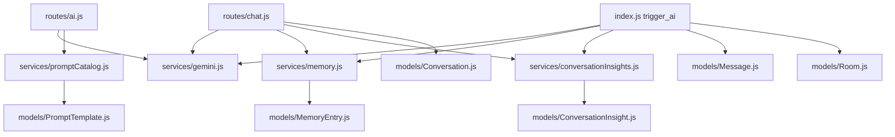

# 01. AI Scope and File Map

## Purpose
This document defines exactly what counts as an AI-related part of the backend and why each file matters. It is the boundary document for the rest of the documentation set.

## AI Scope
In this backend, "AI features" means more than model calls. The complete AI surface includes:

- route handlers that accept AI requests
- socket handlers that trigger room AI replies
- provider integration and model selection logic
- prompt construction and prompt template storage
- memory extraction, retrieval, and lifecycle management
- conversation insight generation and refresh
- file attachment ingestion used to enrich prompts
- project context injection into prompts
- quota and rate-limiting applied to AI actions
- storage of AI responses, metadata, and memory references

## Primary AI Files
| File | Why it matters |
|---|---|
| `index.js` | Starts the app and contains the socket-side room AI flow |
| `routes/chat.js` | Main REST solo-chat endpoint |
| `routes/ai.js` | Smart replies, sentiment, grammar, and model list endpoints |
| `routes/conversations.js` | Reads AI conversation history and insight actions |
| `routes/memory.js` | Memory CRUD, preview import, import, export |
| `routes/uploads.js` | File upload and file serving for prompt attachments |
| `routes/admin.js` | Admin prompt-template management |
| `routes/settings.js` | User-level AI feature toggles |
| `services/gemini.js` | Provider adapters, model catalog, routing, prompt execution |
| `services/memory.js` | Durable memory extraction, scoring, and retrieval |
| `services/conversationInsights.js` | Structured summary generation and persistence |
| `services/promptCatalog.js` | Default prompts plus DB overrides |
| `services/importExport.js` | Import/export path that can produce memories and insights |
| `services/messageFormatting.js` | Attachment validation and memory reference formatting |
| `services/aiQuota.js` | In-memory AI quota accounting |
| `middleware/aiQuota.js` | AI quota enforcement on REST endpoints |
| `middleware/rateLimit.js` | Express-level route throttling |
| `middleware/upload.js` | Allowed file types and upload size limits |
| `middleware/auth.js` | Auth gate for AI REST endpoints |
| `models/Conversation.js` | Stores solo AI chat transcripts and response metadata |
| `models/Message.js` | Stores room AI outputs and memory refs |
| `models/MemoryEntry.js` | Durable user memory records |
| `models/ConversationInsight.js` | Persisted summaries, topics, action items |
| `models/PromptTemplate.js` | Prompt override storage |
| `models/Project.js` | Optional project context injected into AI prompts |
| `models/Room.js` | Stores room-level `aiHistory` |
| `models/User.js` | User AI settings toggles |
| `config/db.js` | MongoDB connection and pool sizing |

## AI-Relevant `dist/` Files
These are not treated as the main implementation, but they are useful when analyzing drift:

- `dist/routes/ai.routes.js`
- `dist/routes/memory.routes.js`
- `dist/services/aiFeature.service.js`
- `dist/services/memory.service.js`
- `dist/services/promptCatalog.service.js`
- `dist/services/ai/gemini.service.js`
- `dist/socket/index.js`

## Relationship Map

## Key Observations
- The source tree uses Mongoose end to end for AI storage.
- The room AI path lives directly in `index.js`, not in a dedicated service or socket module.
- Model execution is centralized in `services/gemini.js`, even though the file now handles far more than Gemini.
- Memory and insight systems are AI-adjacent data products that shape prompts and persist AI-derived structure.

## Rebuild Guidance
If rebuilding from scratch, preserve this layered boundary:

1. entrypoints for REST and socket
2. request policy and validation
3. prompt/context building
4. model routing and provider execution
5. persistence and post-processing
6. operational controls such as quota, logging, and fallbacks

## Implementation Deepening Appendix

This appendix adds implementation-focused explanation to 01-ai-scope-and-file-map. The goal is to make the code easier to learn by focusing on execution order, data transformations, control points, and the practical reasoning behind the current implementation choices.

### Implementation Focus 1: Entry Boundary
- Implementation note 1 for 01-ai-scope-and-file-map: identify the real boundary where work starts, then explain what the code validates immediately, what it defers, and why that ordering affects correctness, latency, and failure visibility.
- Implementation note 2 for 01-ai-scope-and-file-map: identify the real boundary where work starts, then explain what the code validates immediately, what it defers, and why that ordering affects correctness, latency, and failure visibility.
- Implementation note 3 for 01-ai-scope-and-file-map: identify the real boundary where work starts, then explain what the code validates immediately, what it defers, and why that ordering affects correctness, latency, and failure visibility.
- Implementation note 4 for 01-ai-scope-and-file-map: identify the real boundary where work starts, then explain what the code validates immediately, what it defers, and why that ordering affects correctness, latency, and failure visibility.
- Implementation note 5 for 01-ai-scope-and-file-map: identify the real boundary where work starts, then explain what the code validates immediately, what it defers, and why that ordering affects correctness, latency, and failure visibility.
- Implementation note 6 for 01-ai-scope-and-file-map: identify the real boundary where work starts, then explain what the code validates immediately, what it defers, and why that ordering affects correctness, latency, and failure visibility.
- Implementation note 7 for 01-ai-scope-and-file-map: identify the real boundary where work starts, then explain what the code validates immediately, what it defers, and why that ordering affects correctness, latency, and failure visibility.
- Implementation note 8 for 01-ai-scope-and-file-map: identify the real boundary where work starts, then explain what the code validates immediately, what it defers, and why that ordering affects correctness, latency, and failure visibility.
- Implementation note 9 for 01-ai-scope-and-file-map: identify the real boundary where work starts, then explain what the code validates immediately, what it defers, and why that ordering affects correctness, latency, and failure visibility.
- Implementation note 10 for 01-ai-scope-and-file-map: identify the real boundary where work starts, then explain what the code validates immediately, what it defers, and why that ordering affects correctness, latency, and failure visibility.
- Implementation note 11 for 01-ai-scope-and-file-map: identify the real boundary where work starts, then explain what the code validates immediately, what it defers, and why that ordering affects correctness, latency, and failure visibility.
- Implementation note 12 for 01-ai-scope-and-file-map: identify the real boundary where work starts, then explain what the code validates immediately, what it defers, and why that ordering affects correctness, latency, and failure visibility.

### Implementation Focus 2: Control Flow
- Control-flow note 1 for 01-ai-scope-and-file-map: trace the exact branch conditions in C:\Users\RAVIPRAKASH\Downloads\backend\docs\duplicate-set\ai\01-ai-scope-and-file-map.md and explain which conditions are business rules, which are safety checks, and which are fallback behavior added for robustness rather than product semantics.
- Control-flow note 2 for 01-ai-scope-and-file-map: trace the exact branch conditions in C:\Users\RAVIPRAKASH\Downloads\backend\docs\duplicate-set\ai\01-ai-scope-and-file-map.md and explain which conditions are business rules, which are safety checks, and which are fallback behavior added for robustness rather than product semantics.
- Control-flow note 3 for 01-ai-scope-and-file-map: trace the exact branch conditions in C:\Users\RAVIPRAKASH\Downloads\backend\docs\duplicate-set\ai\01-ai-scope-and-file-map.md and explain which conditions are business rules, which are safety checks, and which are fallback behavior added for robustness rather than product semantics.
- Control-flow note 4 for 01-ai-scope-and-file-map: trace the exact branch conditions in C:\Users\RAVIPRAKASH\Downloads\backend\docs\duplicate-set\ai\01-ai-scope-and-file-map.md and explain which conditions are business rules, which are safety checks, and which are fallback behavior added for robustness rather than product semantics.
- Control-flow note 5 for 01-ai-scope-and-file-map: trace the exact branch conditions in C:\Users\RAVIPRAKASH\Downloads\backend\docs\duplicate-set\ai\01-ai-scope-and-file-map.md and explain which conditions are business rules, which are safety checks, and which are fallback behavior added for robustness rather than product semantics.
- Control-flow note 6 for 01-ai-scope-and-file-map: trace the exact branch conditions in C:\Users\RAVIPRAKASH\Downloads\backend\docs\duplicate-set\ai\01-ai-scope-and-file-map.md and explain which conditions are business rules, which are safety checks, and which are fallback behavior added for robustness rather than product semantics.
- Control-flow note 7 for 01-ai-scope-and-file-map: trace the exact branch conditions in C:\Users\RAVIPRAKASH\Downloads\backend\docs\duplicate-set\ai\01-ai-scope-and-file-map.md and explain which conditions are business rules, which are safety checks, and which are fallback behavior added for robustness rather than product semantics.
- Control-flow note 8 for 01-ai-scope-and-file-map: trace the exact branch conditions in C:\Users\RAVIPRAKASH\Downloads\backend\docs\duplicate-set\ai\01-ai-scope-and-file-map.md and explain which conditions are business rules, which are safety checks, and which are fallback behavior added for robustness rather than product semantics.
- Control-flow note 9 for 01-ai-scope-and-file-map: trace the exact branch conditions in C:\Users\RAVIPRAKASH\Downloads\backend\docs\duplicate-set\ai\01-ai-scope-and-file-map.md and explain which conditions are business rules, which are safety checks, and which are fallback behavior added for robustness rather than product semantics.
- Control-flow note 10 for 01-ai-scope-and-file-map: trace the exact branch conditions in C:\Users\RAVIPRAKASH\Downloads\backend\docs\duplicate-set\ai\01-ai-scope-and-file-map.md and explain which conditions are business rules, which are safety checks, and which are fallback behavior added for robustness rather than product semantics.
- Control-flow note 11 for 01-ai-scope-and-file-map: trace the exact branch conditions in C:\Users\RAVIPRAKASH\Downloads\backend\docs\duplicate-set\ai\01-ai-scope-and-file-map.md and explain which conditions are business rules, which are safety checks, and which are fallback behavior added for robustness rather than product semantics.
- Control-flow note 12 for 01-ai-scope-and-file-map: trace the exact branch conditions in C:\Users\RAVIPRAKASH\Downloads\backend\docs\duplicate-set\ai\01-ai-scope-and-file-map.md and explain which conditions are business rules, which are safety checks, and which are fallback behavior added for robustness rather than product semantics.

### Implementation Focus 3: Data Shaping
- Data-shaping note 1 for 01-ai-scope-and-file-map: explain how the implementation converts incoming payloads, database rows, provider outputs, or socket payloads into the smaller structures used later in the flow, and why those shape changes matter.
- Data-shaping note 2 for 01-ai-scope-and-file-map: explain how the implementation converts incoming payloads, database rows, provider outputs, or socket payloads into the smaller structures used later in the flow, and why those shape changes matter.
- Data-shaping note 3 for 01-ai-scope-and-file-map: explain how the implementation converts incoming payloads, database rows, provider outputs, or socket payloads into the smaller structures used later in the flow, and why those shape changes matter.
- Data-shaping note 4 for 01-ai-scope-and-file-map: explain how the implementation converts incoming payloads, database rows, provider outputs, or socket payloads into the smaller structures used later in the flow, and why those shape changes matter.
- Data-shaping note 5 for 01-ai-scope-and-file-map: explain how the implementation converts incoming payloads, database rows, provider outputs, or socket payloads into the smaller structures used later in the flow, and why those shape changes matter.
- Data-shaping note 6 for 01-ai-scope-and-file-map: explain how the implementation converts incoming payloads, database rows, provider outputs, or socket payloads into the smaller structures used later in the flow, and why those shape changes matter.
- Data-shaping note 7 for 01-ai-scope-and-file-map: explain how the implementation converts incoming payloads, database rows, provider outputs, or socket payloads into the smaller structures used later in the flow, and why those shape changes matter.
- Data-shaping note 8 for 01-ai-scope-and-file-map: explain how the implementation converts incoming payloads, database rows, provider outputs, or socket payloads into the smaller structures used later in the flow, and why those shape changes matter.
- Data-shaping note 9 for 01-ai-scope-and-file-map: explain how the implementation converts incoming payloads, database rows, provider outputs, or socket payloads into the smaller structures used later in the flow, and why those shape changes matter.
- Data-shaping note 10 for 01-ai-scope-and-file-map: explain how the implementation converts incoming payloads, database rows, provider outputs, or socket payloads into the smaller structures used later in the flow, and why those shape changes matter.
- Data-shaping note 11 for 01-ai-scope-and-file-map: explain how the implementation converts incoming payloads, database rows, provider outputs, or socket payloads into the smaller structures used later in the flow, and why those shape changes matter.
- Data-shaping note 12 for 01-ai-scope-and-file-map: explain how the implementation converts incoming payloads, database rows, provider outputs, or socket payloads into the smaller structures used later in the flow, and why those shape changes matter.

### Implementation Focus 4: Storage Semantics
- Storage note 1 for 01-ai-scope-and-file-map: describe exactly when this topic reads from MongoDB, when it writes, which fields are durable, which are derived, and how partial success could leave the stored state slightly ahead of or behind the intended architecture.
- Storage note 2 for 01-ai-scope-and-file-map: describe exactly when this topic reads from MongoDB, when it writes, which fields are durable, which are derived, and how partial success could leave the stored state slightly ahead of or behind the intended architecture.
- Storage note 3 for 01-ai-scope-and-file-map: describe exactly when this topic reads from MongoDB, when it writes, which fields are durable, which are derived, and how partial success could leave the stored state slightly ahead of or behind the intended architecture.
- Storage note 4 for 01-ai-scope-and-file-map: describe exactly when this topic reads from MongoDB, when it writes, which fields are durable, which are derived, and how partial success could leave the stored state slightly ahead of or behind the intended architecture.
- Storage note 5 for 01-ai-scope-and-file-map: describe exactly when this topic reads from MongoDB, when it writes, which fields are durable, which are derived, and how partial success could leave the stored state slightly ahead of or behind the intended architecture.
- Storage note 6 for 01-ai-scope-and-file-map: describe exactly when this topic reads from MongoDB, when it writes, which fields are durable, which are derived, and how partial success could leave the stored state slightly ahead of or behind the intended architecture.
- Storage note 7 for 01-ai-scope-and-file-map: describe exactly when this topic reads from MongoDB, when it writes, which fields are durable, which are derived, and how partial success could leave the stored state slightly ahead of or behind the intended architecture.
- Storage note 8 for 01-ai-scope-and-file-map: describe exactly when this topic reads from MongoDB, when it writes, which fields are durable, which are derived, and how partial success could leave the stored state slightly ahead of or behind the intended architecture.
- Storage note 9 for 01-ai-scope-and-file-map: describe exactly when this topic reads from MongoDB, when it writes, which fields are durable, which are derived, and how partial success could leave the stored state slightly ahead of or behind the intended architecture.
- Storage note 10 for 01-ai-scope-and-file-map: describe exactly when this topic reads from MongoDB, when it writes, which fields are durable, which are derived, and how partial success could leave the stored state slightly ahead of or behind the intended architecture.
- Storage note 11 for 01-ai-scope-and-file-map: describe exactly when this topic reads from MongoDB, when it writes, which fields are durable, which are derived, and how partial success could leave the stored state slightly ahead of or behind the intended architecture.
- Storage note 12 for 01-ai-scope-and-file-map: describe exactly when this topic reads from MongoDB, when it writes, which fields are durable, which are derived, and how partial success could leave the stored state slightly ahead of or behind the intended architecture.

### Implementation Focus 5: Small Coding Explanations
- Coding explanation 1 for 01-ai-scope-and-file-map: pick a small helper, condition, loop, or mapping step tied to this topic and explain what it is doing in plain language, what assumption it relies on, and how a new engineer should read it without overcomplicating it.
- Coding explanation 2 for 01-ai-scope-and-file-map: pick a small helper, condition, loop, or mapping step tied to this topic and explain what it is doing in plain language, what assumption it relies on, and how a new engineer should read it without overcomplicating it.
- Coding explanation 3 for 01-ai-scope-and-file-map: pick a small helper, condition, loop, or mapping step tied to this topic and explain what it is doing in plain language, what assumption it relies on, and how a new engineer should read it without overcomplicating it.
- Coding explanation 4 for 01-ai-scope-and-file-map: pick a small helper, condition, loop, or mapping step tied to this topic and explain what it is doing in plain language, what assumption it relies on, and how a new engineer should read it without overcomplicating it.
- Coding explanation 5 for 01-ai-scope-and-file-map: pick a small helper, condition, loop, or mapping step tied to this topic and explain what it is doing in plain language, what assumption it relies on, and how a new engineer should read it without overcomplicating it.
- Coding explanation 6 for 01-ai-scope-and-file-map: pick a small helper, condition, loop, or mapping step tied to this topic and explain what it is doing in plain language, what assumption it relies on, and how a new engineer should read it without overcomplicating it.
- Coding explanation 7 for 01-ai-scope-and-file-map: pick a small helper, condition, loop, or mapping step tied to this topic and explain what it is doing in plain language, what assumption it relies on, and how a new engineer should read it without overcomplicating it.
- Coding explanation 8 for 01-ai-scope-and-file-map: pick a small helper, condition, loop, or mapping step tied to this topic and explain what it is doing in plain language, what assumption it relies on, and how a new engineer should read it without overcomplicating it.
- Coding explanation 9 for 01-ai-scope-and-file-map: pick a small helper, condition, loop, or mapping step tied to this topic and explain what it is doing in plain language, what assumption it relies on, and how a new engineer should read it without overcomplicating it.
- Coding explanation 10 for 01-ai-scope-and-file-map: pick a small helper, condition, loop, or mapping step tied to this topic and explain what it is doing in plain language, what assumption it relies on, and how a new engineer should read it without overcomplicating it.
- Coding explanation 11 for 01-ai-scope-and-file-map: pick a small helper, condition, loop, or mapping step tied to this topic and explain what it is doing in plain language, what assumption it relies on, and how a new engineer should read it without overcomplicating it.
- Coding explanation 12 for 01-ai-scope-and-file-map: pick a small helper, condition, loop, or mapping step tied to this topic and explain what it is doing in plain language, what assumption it relies on, and how a new engineer should read it without overcomplicating it.

### Implementation Focus 6: Error Paths
- Error-path note 1 for 01-ai-scope-and-file-map: explain how the implementation reports failure for this topic, whether the failure is user-visible, whether logs preserve enough context, and whether the code retries, degrades, or simply aborts.
- Error-path note 2 for 01-ai-scope-and-file-map: explain how the implementation reports failure for this topic, whether the failure is user-visible, whether logs preserve enough context, and whether the code retries, degrades, or simply aborts.
- Error-path note 3 for 01-ai-scope-and-file-map: explain how the implementation reports failure for this topic, whether the failure is user-visible, whether logs preserve enough context, and whether the code retries, degrades, or simply aborts.
- Error-path note 4 for 01-ai-scope-and-file-map: explain how the implementation reports failure for this topic, whether the failure is user-visible, whether logs preserve enough context, and whether the code retries, degrades, or simply aborts.
- Error-path note 5 for 01-ai-scope-and-file-map: explain how the implementation reports failure for this topic, whether the failure is user-visible, whether logs preserve enough context, and whether the code retries, degrades, or simply aborts.
- Error-path note 6 for 01-ai-scope-and-file-map: explain how the implementation reports failure for this topic, whether the failure is user-visible, whether logs preserve enough context, and whether the code retries, degrades, or simply aborts.
- Error-path note 7 for 01-ai-scope-and-file-map: explain how the implementation reports failure for this topic, whether the failure is user-visible, whether logs preserve enough context, and whether the code retries, degrades, or simply aborts.
- Error-path note 8 for 01-ai-scope-and-file-map: explain how the implementation reports failure for this topic, whether the failure is user-visible, whether logs preserve enough context, and whether the code retries, degrades, or simply aborts.
- Error-path note 9 for 01-ai-scope-and-file-map: explain how the implementation reports failure for this topic, whether the failure is user-visible, whether logs preserve enough context, and whether the code retries, degrades, or simply aborts.
- Error-path note 10 for 01-ai-scope-and-file-map: explain how the implementation reports failure for this topic, whether the failure is user-visible, whether logs preserve enough context, and whether the code retries, degrades, or simply aborts.
- Error-path note 11 for 01-ai-scope-and-file-map: explain how the implementation reports failure for this topic, whether the failure is user-visible, whether logs preserve enough context, and whether the code retries, degrades, or simply aborts.
- Error-path note 12 for 01-ai-scope-and-file-map: explain how the implementation reports failure for this topic, whether the failure is user-visible, whether logs preserve enough context, and whether the code retries, degrades, or simply aborts.

### Implementation Focus 7: Refactor Reading Guide
- Refactor guide 1 for 01-ai-scope-and-file-map: if this part of the code were to be refactored, explain which lines are true domain logic, which lines are orchestration, and which lines should likely move into a narrower service, helper, or adapter boundary.
- Refactor guide 2 for 01-ai-scope-and-file-map: if this part of the code were to be refactored, explain which lines are true domain logic, which lines are orchestration, and which lines should likely move into a narrower service, helper, or adapter boundary.
- Refactor guide 3 for 01-ai-scope-and-file-map: if this part of the code were to be refactored, explain which lines are true domain logic, which lines are orchestration, and which lines should likely move into a narrower service, helper, or adapter boundary.
- Refactor guide 4 for 01-ai-scope-and-file-map: if this part of the code were to be refactored, explain which lines are true domain logic, which lines are orchestration, and which lines should likely move into a narrower service, helper, or adapter boundary.
- Refactor guide 5 for 01-ai-scope-and-file-map: if this part of the code were to be refactored, explain which lines are true domain logic, which lines are orchestration, and which lines should likely move into a narrower service, helper, or adapter boundary.
- Refactor guide 6 for 01-ai-scope-and-file-map: if this part of the code were to be refactored, explain which lines are true domain logic, which lines are orchestration, and which lines should likely move into a narrower service, helper, or adapter boundary.
- Refactor guide 7 for 01-ai-scope-and-file-map: if this part of the code were to be refactored, explain which lines are true domain logic, which lines are orchestration, and which lines should likely move into a narrower service, helper, or adapter boundary.
- Refactor guide 8 for 01-ai-scope-and-file-map: if this part of the code were to be refactored, explain which lines are true domain logic, which lines are orchestration, and which lines should likely move into a narrower service, helper, or adapter boundary.
- Refactor guide 9 for 01-ai-scope-and-file-map: if this part of the code were to be refactored, explain which lines are true domain logic, which lines are orchestration, and which lines should likely move into a narrower service, helper, or adapter boundary.
- Refactor guide 10 for 01-ai-scope-and-file-map: if this part of the code were to be refactored, explain which lines are true domain logic, which lines are orchestration, and which lines should likely move into a narrower service, helper, or adapter boundary.
- Refactor guide 11 for 01-ai-scope-and-file-map: if this part of the code were to be refactored, explain which lines are true domain logic, which lines are orchestration, and which lines should likely move into a narrower service, helper, or adapter boundary.
- Refactor guide 12 for 01-ai-scope-and-file-map: if this part of the code were to be refactored, explain which lines are true domain logic, which lines are orchestration, and which lines should likely move into a narrower service, helper, or adapter boundary.

### Implementation Focus 8: Step-By-Step Review Checklist
- Review checklist item 1 for 01-ai-scope-and-file-map: when reviewing this implementation, verify the validation order, the read-before-write sequence, the response shape, the fallback path, the storage side effects, and the assumptions about single-process or multi-process deployment.
- Review checklist item 2 for 01-ai-scope-and-file-map: when reviewing this implementation, verify the validation order, the read-before-write sequence, the response shape, the fallback path, the storage side effects, and the assumptions about single-process or multi-process deployment.
- Review checklist item 3 for 01-ai-scope-and-file-map: when reviewing this implementation, verify the validation order, the read-before-write sequence, the response shape, the fallback path, the storage side effects, and the assumptions about single-process or multi-process deployment.
- Review checklist item 4 for 01-ai-scope-and-file-map: when reviewing this implementation, verify the validation order, the read-before-write sequence, the response shape, the fallback path, the storage side effects, and the assumptions about single-process or multi-process deployment.
- Review checklist item 5 for 01-ai-scope-and-file-map: when reviewing this implementation, verify the validation order, the read-before-write sequence, the response shape, the fallback path, the storage side effects, and the assumptions about single-process or multi-process deployment.
- Review checklist item 6 for 01-ai-scope-and-file-map: when reviewing this implementation, verify the validation order, the read-before-write sequence, the response shape, the fallback path, the storage side effects, and the assumptions about single-process or multi-process deployment.
- Review checklist item 7 for 01-ai-scope-and-file-map: when reviewing this implementation, verify the validation order, the read-before-write sequence, the response shape, the fallback path, the storage side effects, and the assumptions about single-process or multi-process deployment.
- Review checklist item 8 for 01-ai-scope-and-file-map: when reviewing this implementation, verify the validation order, the read-before-write sequence, the response shape, the fallback path, the storage side effects, and the assumptions about single-process or multi-process deployment.
- Review checklist item 9 for 01-ai-scope-and-file-map: when reviewing this implementation, verify the validation order, the read-before-write sequence, the response shape, the fallback path, the storage side effects, and the assumptions about single-process or multi-process deployment.
- Review checklist item 10 for 01-ai-scope-and-file-map: when reviewing this implementation, verify the validation order, the read-before-write sequence, the response shape, the fallback path, the storage side effects, and the assumptions about single-process or multi-process deployment.
- Review checklist item 11 for 01-ai-scope-and-file-map: when reviewing this implementation, verify the validation order, the read-before-write sequence, the response shape, the fallback path, the storage side effects, and the assumptions about single-process or multi-process deployment.
- Review checklist item 12 for 01-ai-scope-and-file-map: when reviewing this implementation, verify the validation order, the read-before-write sequence, the response shape, the fallback path, the storage side effects, and the assumptions about single-process or multi-process deployment.

### Implementation Focus 9: Teaching Notes
- Teaching note 1 for 01-ai-scope-and-file-map: explain this topic to a new engineer as a sequence of small decisions rather than a wall of code, and call out the one place where the implementation is clever, the one place where it is practical, and the one place where it is fragile.
- Teaching note 2 for 01-ai-scope-and-file-map: explain this topic to a new engineer as a sequence of small decisions rather than a wall of code, and call out the one place where the implementation is clever, the one place where it is practical, and the one place where it is fragile.
- Teaching note 3 for 01-ai-scope-and-file-map: explain this topic to a new engineer as a sequence of small decisions rather than a wall of code, and call out the one place where the implementation is clever, the one place where it is practical, and the one place where it is fragile.
- Teaching note 4 for 01-ai-scope-and-file-map: explain this topic to a new engineer as a sequence of small decisions rather than a wall of code, and call out the one place where the implementation is clever, the one place where it is practical, and the one place where it is fragile.
- Teaching note 5 for 01-ai-scope-and-file-map: explain this topic to a new engineer as a sequence of small decisions rather than a wall of code, and call out the one place where the implementation is clever, the one place where it is practical, and the one place where it is fragile.
- Teaching note 6 for 01-ai-scope-and-file-map: explain this topic to a new engineer as a sequence of small decisions rather than a wall of code, and call out the one place where the implementation is clever, the one place where it is practical, and the one place where it is fragile.
- Teaching note 7 for 01-ai-scope-and-file-map: explain this topic to a new engineer as a sequence of small decisions rather than a wall of code, and call out the one place where the implementation is clever, the one place where it is practical, and the one place where it is fragile.
- Teaching note 8 for 01-ai-scope-and-file-map: explain this topic to a new engineer as a sequence of small decisions rather than a wall of code, and call out the one place where the implementation is clever, the one place where it is practical, and the one place where it is fragile.
- Teaching note 9 for 01-ai-scope-and-file-map: explain this topic to a new engineer as a sequence of small decisions rather than a wall of code, and call out the one place where the implementation is clever, the one place where it is practical, and the one place where it is fragile.
- Teaching note 10 for 01-ai-scope-and-file-map: explain this topic to a new engineer as a sequence of small decisions rather than a wall of code, and call out the one place where the implementation is clever, the one place where it is practical, and the one place where it is fragile.
- Teaching note 11 for 01-ai-scope-and-file-map: explain this topic to a new engineer as a sequence of small decisions rather than a wall of code, and call out the one place where the implementation is clever, the one place where it is practical, and the one place where it is fragile.
- Teaching note 12 for 01-ai-scope-and-file-map: explain this topic to a new engineer as a sequence of small decisions rather than a wall of code, and call out the one place where the implementation is clever, the one place where it is practical, and the one place where it is fragile.
