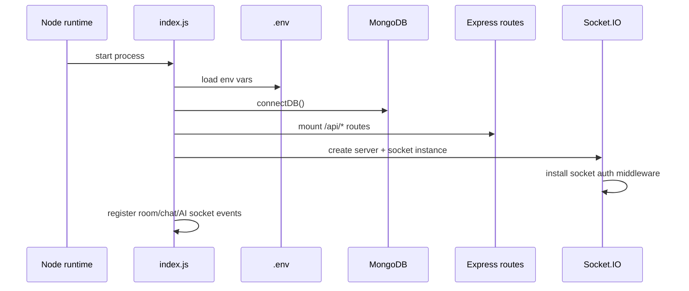
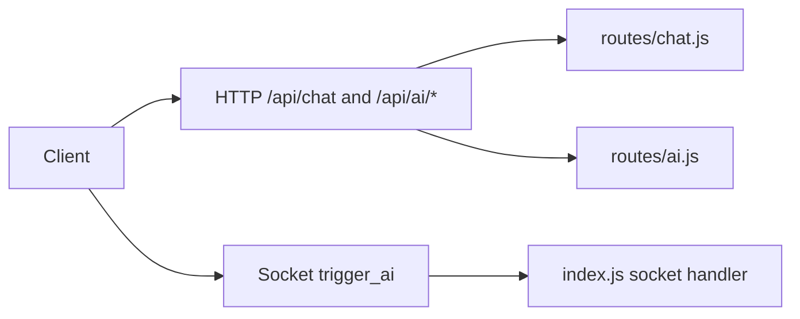

# 02. Runtime Entrypoints

## Purpose
This document explains how the backend starts, where the AI features are mounted, and how AI requests enter the system through REST and Socket.IO.

## Main Entry File
The runtime starts in `index.js`. This file:

- loads environment variables
- connects to MongoDB
- mounts API routes
- initializes Socket.IO
- registers socket auth middleware
- stores in-memory room presence and typing state
- implements room AI directly inside the socket event handlers

## Boot Flow

## REST Entry Points Relevant to AI
| Mounted path | Handler file | AI role |
|---|---|---|
| `/api/chat` | `routes/chat.js` | solo AI conversation |
| `/api/ai` | `routes/ai.js` | smart replies, sentiment, grammar |
| `/api/conversations` | `routes/conversations.js` | AI conversation retrieval and insight actions |
| `/api/memory` | `routes/memory.js` | memory admin and import/export |
| `/api/uploads` | `routes/uploads.js` | attachment upload used by AI prompts |
| `/api/admin` | `routes/admin.js` | prompt template editing |
| `/api/settings` | `routes/settings.js` | AI feature toggles |

## Socket Entry Point Relevant to AI
The room AI flow is implemented in the Socket.IO portion of `index.js` under:

- `socket.on('trigger_ai', ...)`

## In-Memory Runtime State
The process stores several maps in memory:

- `roomUsers`
- `globalOnlineUsers`
- `typingUsers`
- `socketFlood`

These are not AI-specific, but the AI room flow depends on them for membership and throttling behavior.

## Where the Database Gets Updated
At the entrypoint level:

- REST solo AI writes through `routes/chat.js` into `Conversation`, `MemoryEntry`, and `ConversationInsight`
- socket room AI writes through `index.js` into `Room`, `Message`, `MemoryEntry`, and `ConversationInsight`

## Example: REST and Socket Split

## Improvement Opportunities
- move socket AI logic into a dedicated module or service
- expose AI operational health beyond the basic DB check
- unify REST and socket AI request handling around a shared orchestration layer

## Implementation Deepening Appendix

This appendix adds implementation-focused explanation to 02-runtime-entrypoints. The goal is to make the code easier to learn by focusing on execution order, data transformations, control points, and the practical reasoning behind the current implementation choices.

### Implementation Focus 1: Entry Boundary
- Implementation note 1 for 02-runtime-entrypoints: identify the real boundary where work starts, then explain what the code validates immediately, what it defers, and why that ordering affects correctness, latency, and failure visibility.
- Implementation note 2 for 02-runtime-entrypoints: identify the real boundary where work starts, then explain what the code validates immediately, what it defers, and why that ordering affects correctness, latency, and failure visibility.
- Implementation note 3 for 02-runtime-entrypoints: identify the real boundary where work starts, then explain what the code validates immediately, what it defers, and why that ordering affects correctness, latency, and failure visibility.
- Implementation note 4 for 02-runtime-entrypoints: identify the real boundary where work starts, then explain what the code validates immediately, what it defers, and why that ordering affects correctness, latency, and failure visibility.
- Implementation note 5 for 02-runtime-entrypoints: identify the real boundary where work starts, then explain what the code validates immediately, what it defers, and why that ordering affects correctness, latency, and failure visibility.
- Implementation note 6 for 02-runtime-entrypoints: identify the real boundary where work starts, then explain what the code validates immediately, what it defers, and why that ordering affects correctness, latency, and failure visibility.
- Implementation note 7 for 02-runtime-entrypoints: identify the real boundary where work starts, then explain what the code validates immediately, what it defers, and why that ordering affects correctness, latency, and failure visibility.
- Implementation note 8 for 02-runtime-entrypoints: identify the real boundary where work starts, then explain what the code validates immediately, what it defers, and why that ordering affects correctness, latency, and failure visibility.
- Implementation note 9 for 02-runtime-entrypoints: identify the real boundary where work starts, then explain what the code validates immediately, what it defers, and why that ordering affects correctness, latency, and failure visibility.
- Implementation note 10 for 02-runtime-entrypoints: identify the real boundary where work starts, then explain what the code validates immediately, what it defers, and why that ordering affects correctness, latency, and failure visibility.
- Implementation note 11 for 02-runtime-entrypoints: identify the real boundary where work starts, then explain what the code validates immediately, what it defers, and why that ordering affects correctness, latency, and failure visibility.
- Implementation note 12 for 02-runtime-entrypoints: identify the real boundary where work starts, then explain what the code validates immediately, what it defers, and why that ordering affects correctness, latency, and failure visibility.

### Implementation Focus 2: Control Flow
- Control-flow note 1 for 02-runtime-entrypoints: trace the exact branch conditions in C:\Users\RAVIPRAKASH\Downloads\backend\docs\duplicate-set\ai\02-runtime-entrypoints.md and explain which conditions are business rules, which are safety checks, and which are fallback behavior added for robustness rather than product semantics.
- Control-flow note 2 for 02-runtime-entrypoints: trace the exact branch conditions in C:\Users\RAVIPRAKASH\Downloads\backend\docs\duplicate-set\ai\02-runtime-entrypoints.md and explain which conditions are business rules, which are safety checks, and which are fallback behavior added for robustness rather than product semantics.
- Control-flow note 3 for 02-runtime-entrypoints: trace the exact branch conditions in C:\Users\RAVIPRAKASH\Downloads\backend\docs\duplicate-set\ai\02-runtime-entrypoints.md and explain which conditions are business rules, which are safety checks, and which are fallback behavior added for robustness rather than product semantics.
- Control-flow note 4 for 02-runtime-entrypoints: trace the exact branch conditions in C:\Users\RAVIPRAKASH\Downloads\backend\docs\duplicate-set\ai\02-runtime-entrypoints.md and explain which conditions are business rules, which are safety checks, and which are fallback behavior added for robustness rather than product semantics.
- Control-flow note 5 for 02-runtime-entrypoints: trace the exact branch conditions in C:\Users\RAVIPRAKASH\Downloads\backend\docs\duplicate-set\ai\02-runtime-entrypoints.md and explain which conditions are business rules, which are safety checks, and which are fallback behavior added for robustness rather than product semantics.
- Control-flow note 6 for 02-runtime-entrypoints: trace the exact branch conditions in C:\Users\RAVIPRAKASH\Downloads\backend\docs\duplicate-set\ai\02-runtime-entrypoints.md and explain which conditions are business rules, which are safety checks, and which are fallback behavior added for robustness rather than product semantics.
- Control-flow note 7 for 02-runtime-entrypoints: trace the exact branch conditions in C:\Users\RAVIPRAKASH\Downloads\backend\docs\duplicate-set\ai\02-runtime-entrypoints.md and explain which conditions are business rules, which are safety checks, and which are fallback behavior added for robustness rather than product semantics.
- Control-flow note 8 for 02-runtime-entrypoints: trace the exact branch conditions in C:\Users\RAVIPRAKASH\Downloads\backend\docs\duplicate-set\ai\02-runtime-entrypoints.md and explain which conditions are business rules, which are safety checks, and which are fallback behavior added for robustness rather than product semantics.
- Control-flow note 9 for 02-runtime-entrypoints: trace the exact branch conditions in C:\Users\RAVIPRAKASH\Downloads\backend\docs\duplicate-set\ai\02-runtime-entrypoints.md and explain which conditions are business rules, which are safety checks, and which are fallback behavior added for robustness rather than product semantics.
- Control-flow note 10 for 02-runtime-entrypoints: trace the exact branch conditions in C:\Users\RAVIPRAKASH\Downloads\backend\docs\duplicate-set\ai\02-runtime-entrypoints.md and explain which conditions are business rules, which are safety checks, and which are fallback behavior added for robustness rather than product semantics.
- Control-flow note 11 for 02-runtime-entrypoints: trace the exact branch conditions in C:\Users\RAVIPRAKASH\Downloads\backend\docs\duplicate-set\ai\02-runtime-entrypoints.md and explain which conditions are business rules, which are safety checks, and which are fallback behavior added for robustness rather than product semantics.
- Control-flow note 12 for 02-runtime-entrypoints: trace the exact branch conditions in C:\Users\RAVIPRAKASH\Downloads\backend\docs\duplicate-set\ai\02-runtime-entrypoints.md and explain which conditions are business rules, which are safety checks, and which are fallback behavior added for robustness rather than product semantics.

### Implementation Focus 3: Data Shaping
- Data-shaping note 1 for 02-runtime-entrypoints: explain how the implementation converts incoming payloads, database rows, provider outputs, or socket payloads into the smaller structures used later in the flow, and why those shape changes matter.
- Data-shaping note 2 for 02-runtime-entrypoints: explain how the implementation converts incoming payloads, database rows, provider outputs, or socket payloads into the smaller structures used later in the flow, and why those shape changes matter.
- Data-shaping note 3 for 02-runtime-entrypoints: explain how the implementation converts incoming payloads, database rows, provider outputs, or socket payloads into the smaller structures used later in the flow, and why those shape changes matter.
- Data-shaping note 4 for 02-runtime-entrypoints: explain how the implementation converts incoming payloads, database rows, provider outputs, or socket payloads into the smaller structures used later in the flow, and why those shape changes matter.
- Data-shaping note 5 for 02-runtime-entrypoints: explain how the implementation converts incoming payloads, database rows, provider outputs, or socket payloads into the smaller structures used later in the flow, and why those shape changes matter.
- Data-shaping note 6 for 02-runtime-entrypoints: explain how the implementation converts incoming payloads, database rows, provider outputs, or socket payloads into the smaller structures used later in the flow, and why those shape changes matter.
- Data-shaping note 7 for 02-runtime-entrypoints: explain how the implementation converts incoming payloads, database rows, provider outputs, or socket payloads into the smaller structures used later in the flow, and why those shape changes matter.
- Data-shaping note 8 for 02-runtime-entrypoints: explain how the implementation converts incoming payloads, database rows, provider outputs, or socket payloads into the smaller structures used later in the flow, and why those shape changes matter.
- Data-shaping note 9 for 02-runtime-entrypoints: explain how the implementation converts incoming payloads, database rows, provider outputs, or socket payloads into the smaller structures used later in the flow, and why those shape changes matter.
- Data-shaping note 10 for 02-runtime-entrypoints: explain how the implementation converts incoming payloads, database rows, provider outputs, or socket payloads into the smaller structures used later in the flow, and why those shape changes matter.
- Data-shaping note 11 for 02-runtime-entrypoints: explain how the implementation converts incoming payloads, database rows, provider outputs, or socket payloads into the smaller structures used later in the flow, and why those shape changes matter.
- Data-shaping note 12 for 02-runtime-entrypoints: explain how the implementation converts incoming payloads, database rows, provider outputs, or socket payloads into the smaller structures used later in the flow, and why those shape changes matter.

### Implementation Focus 4: Storage Semantics
- Storage note 1 for 02-runtime-entrypoints: describe exactly when this topic reads from MongoDB, when it writes, which fields are durable, which are derived, and how partial success could leave the stored state slightly ahead of or behind the intended architecture.
- Storage note 2 for 02-runtime-entrypoints: describe exactly when this topic reads from MongoDB, when it writes, which fields are durable, which are derived, and how partial success could leave the stored state slightly ahead of or behind the intended architecture.
- Storage note 3 for 02-runtime-entrypoints: describe exactly when this topic reads from MongoDB, when it writes, which fields are durable, which are derived, and how partial success could leave the stored state slightly ahead of or behind the intended architecture.
- Storage note 4 for 02-runtime-entrypoints: describe exactly when this topic reads from MongoDB, when it writes, which fields are durable, which are derived, and how partial success could leave the stored state slightly ahead of or behind the intended architecture.
- Storage note 5 for 02-runtime-entrypoints: describe exactly when this topic reads from MongoDB, when it writes, which fields are durable, which are derived, and how partial success could leave the stored state slightly ahead of or behind the intended architecture.
- Storage note 6 for 02-runtime-entrypoints: describe exactly when this topic reads from MongoDB, when it writes, which fields are durable, which are derived, and how partial success could leave the stored state slightly ahead of or behind the intended architecture.
- Storage note 7 for 02-runtime-entrypoints: describe exactly when this topic reads from MongoDB, when it writes, which fields are durable, which are derived, and how partial success could leave the stored state slightly ahead of or behind the intended architecture.
- Storage note 8 for 02-runtime-entrypoints: describe exactly when this topic reads from MongoDB, when it writes, which fields are durable, which are derived, and how partial success could leave the stored state slightly ahead of or behind the intended architecture.
- Storage note 9 for 02-runtime-entrypoints: describe exactly when this topic reads from MongoDB, when it writes, which fields are durable, which are derived, and how partial success could leave the stored state slightly ahead of or behind the intended architecture.
- Storage note 10 for 02-runtime-entrypoints: describe exactly when this topic reads from MongoDB, when it writes, which fields are durable, which are derived, and how partial success could leave the stored state slightly ahead of or behind the intended architecture.
- Storage note 11 for 02-runtime-entrypoints: describe exactly when this topic reads from MongoDB, when it writes, which fields are durable, which are derived, and how partial success could leave the stored state slightly ahead of or behind the intended architecture.
- Storage note 12 for 02-runtime-entrypoints: describe exactly when this topic reads from MongoDB, when it writes, which fields are durable, which are derived, and how partial success could leave the stored state slightly ahead of or behind the intended architecture.

### Implementation Focus 5: Small Coding Explanations
- Coding explanation 1 for 02-runtime-entrypoints: pick a small helper, condition, loop, or mapping step tied to this topic and explain what it is doing in plain language, what assumption it relies on, and how a new engineer should read it without overcomplicating it.
- Coding explanation 2 for 02-runtime-entrypoints: pick a small helper, condition, loop, or mapping step tied to this topic and explain what it is doing in plain language, what assumption it relies on, and how a new engineer should read it without overcomplicating it.
- Coding explanation 3 for 02-runtime-entrypoints: pick a small helper, condition, loop, or mapping step tied to this topic and explain what it is doing in plain language, what assumption it relies on, and how a new engineer should read it without overcomplicating it.
- Coding explanation 4 for 02-runtime-entrypoints: pick a small helper, condition, loop, or mapping step tied to this topic and explain what it is doing in plain language, what assumption it relies on, and how a new engineer should read it without overcomplicating it.
- Coding explanation 5 for 02-runtime-entrypoints: pick a small helper, condition, loop, or mapping step tied to this topic and explain what it is doing in plain language, what assumption it relies on, and how a new engineer should read it without overcomplicating it.
- Coding explanation 6 for 02-runtime-entrypoints: pick a small helper, condition, loop, or mapping step tied to this topic and explain what it is doing in plain language, what assumption it relies on, and how a new engineer should read it without overcomplicating it.
- Coding explanation 7 for 02-runtime-entrypoints: pick a small helper, condition, loop, or mapping step tied to this topic and explain what it is doing in plain language, what assumption it relies on, and how a new engineer should read it without overcomplicating it.
- Coding explanation 8 for 02-runtime-entrypoints: pick a small helper, condition, loop, or mapping step tied to this topic and explain what it is doing in plain language, what assumption it relies on, and how a new engineer should read it without overcomplicating it.
- Coding explanation 9 for 02-runtime-entrypoints: pick a small helper, condition, loop, or mapping step tied to this topic and explain what it is doing in plain language, what assumption it relies on, and how a new engineer should read it without overcomplicating it.
- Coding explanation 10 for 02-runtime-entrypoints: pick a small helper, condition, loop, or mapping step tied to this topic and explain what it is doing in plain language, what assumption it relies on, and how a new engineer should read it without overcomplicating it.
- Coding explanation 11 for 02-runtime-entrypoints: pick a small helper, condition, loop, or mapping step tied to this topic and explain what it is doing in plain language, what assumption it relies on, and how a new engineer should read it without overcomplicating it.
- Coding explanation 12 for 02-runtime-entrypoints: pick a small helper, condition, loop, or mapping step tied to this topic and explain what it is doing in plain language, what assumption it relies on, and how a new engineer should read it without overcomplicating it.

### Implementation Focus 6: Error Paths
- Error-path note 1 for 02-runtime-entrypoints: explain how the implementation reports failure for this topic, whether the failure is user-visible, whether logs preserve enough context, and whether the code retries, degrades, or simply aborts.
- Error-path note 2 for 02-runtime-entrypoints: explain how the implementation reports failure for this topic, whether the failure is user-visible, whether logs preserve enough context, and whether the code retries, degrades, or simply aborts.
- Error-path note 3 for 02-runtime-entrypoints: explain how the implementation reports failure for this topic, whether the failure is user-visible, whether logs preserve enough context, and whether the code retries, degrades, or simply aborts.
- Error-path note 4 for 02-runtime-entrypoints: explain how the implementation reports failure for this topic, whether the failure is user-visible, whether logs preserve enough context, and whether the code retries, degrades, or simply aborts.
- Error-path note 5 for 02-runtime-entrypoints: explain how the implementation reports failure for this topic, whether the failure is user-visible, whether logs preserve enough context, and whether the code retries, degrades, or simply aborts.
- Error-path note 6 for 02-runtime-entrypoints: explain how the implementation reports failure for this topic, whether the failure is user-visible, whether logs preserve enough context, and whether the code retries, degrades, or simply aborts.
- Error-path note 7 for 02-runtime-entrypoints: explain how the implementation reports failure for this topic, whether the failure is user-visible, whether logs preserve enough context, and whether the code retries, degrades, or simply aborts.
- Error-path note 8 for 02-runtime-entrypoints: explain how the implementation reports failure for this topic, whether the failure is user-visible, whether logs preserve enough context, and whether the code retries, degrades, or simply aborts.
- Error-path note 9 for 02-runtime-entrypoints: explain how the implementation reports failure for this topic, whether the failure is user-visible, whether logs preserve enough context, and whether the code retries, degrades, or simply aborts.
- Error-path note 10 for 02-runtime-entrypoints: explain how the implementation reports failure for this topic, whether the failure is user-visible, whether logs preserve enough context, and whether the code retries, degrades, or simply aborts.
- Error-path note 11 for 02-runtime-entrypoints: explain how the implementation reports failure for this topic, whether the failure is user-visible, whether logs preserve enough context, and whether the code retries, degrades, or simply aborts.
- Error-path note 12 for 02-runtime-entrypoints: explain how the implementation reports failure for this topic, whether the failure is user-visible, whether logs preserve enough context, and whether the code retries, degrades, or simply aborts.

### Implementation Focus 7: Refactor Reading Guide
- Refactor guide 1 for 02-runtime-entrypoints: if this part of the code were to be refactored, explain which lines are true domain logic, which lines are orchestration, and which lines should likely move into a narrower service, helper, or adapter boundary.
- Refactor guide 2 for 02-runtime-entrypoints: if this part of the code were to be refactored, explain which lines are true domain logic, which lines are orchestration, and which lines should likely move into a narrower service, helper, or adapter boundary.
- Refactor guide 3 for 02-runtime-entrypoints: if this part of the code were to be refactored, explain which lines are true domain logic, which lines are orchestration, and which lines should likely move into a narrower service, helper, or adapter boundary.
- Refactor guide 4 for 02-runtime-entrypoints: if this part of the code were to be refactored, explain which lines are true domain logic, which lines are orchestration, and which lines should likely move into a narrower service, helper, or adapter boundary.
- Refactor guide 5 for 02-runtime-entrypoints: if this part of the code were to be refactored, explain which lines are true domain logic, which lines are orchestration, and which lines should likely move into a narrower service, helper, or adapter boundary.
- Refactor guide 6 for 02-runtime-entrypoints: if this part of the code were to be refactored, explain which lines are true domain logic, which lines are orchestration, and which lines should likely move into a narrower service, helper, or adapter boundary.
- Refactor guide 7 for 02-runtime-entrypoints: if this part of the code were to be refactored, explain which lines are true domain logic, which lines are orchestration, and which lines should likely move into a narrower service, helper, or adapter boundary.
- Refactor guide 8 for 02-runtime-entrypoints: if this part of the code were to be refactored, explain which lines are true domain logic, which lines are orchestration, and which lines should likely move into a narrower service, helper, or adapter boundary.
- Refactor guide 9 for 02-runtime-entrypoints: if this part of the code were to be refactored, explain which lines are true domain logic, which lines are orchestration, and which lines should likely move into a narrower service, helper, or adapter boundary.
- Refactor guide 10 for 02-runtime-entrypoints: if this part of the code were to be refactored, explain which lines are true domain logic, which lines are orchestration, and which lines should likely move into a narrower service, helper, or adapter boundary.
- Refactor guide 11 for 02-runtime-entrypoints: if this part of the code were to be refactored, explain which lines are true domain logic, which lines are orchestration, and which lines should likely move into a narrower service, helper, or adapter boundary.
- Refactor guide 12 for 02-runtime-entrypoints: if this part of the code were to be refactored, explain which lines are true domain logic, which lines are orchestration, and which lines should likely move into a narrower service, helper, or adapter boundary.

### Implementation Focus 8: Step-By-Step Review Checklist
- Review checklist item 1 for 02-runtime-entrypoints: when reviewing this implementation, verify the validation order, the read-before-write sequence, the response shape, the fallback path, the storage side effects, and the assumptions about single-process or multi-process deployment.
- Review checklist item 2 for 02-runtime-entrypoints: when reviewing this implementation, verify the validation order, the read-before-write sequence, the response shape, the fallback path, the storage side effects, and the assumptions about single-process or multi-process deployment.
- Review checklist item 3 for 02-runtime-entrypoints: when reviewing this implementation, verify the validation order, the read-before-write sequence, the response shape, the fallback path, the storage side effects, and the assumptions about single-process or multi-process deployment.
- Review checklist item 4 for 02-runtime-entrypoints: when reviewing this implementation, verify the validation order, the read-before-write sequence, the response shape, the fallback path, the storage side effects, and the assumptions about single-process or multi-process deployment.
- Review checklist item 5 for 02-runtime-entrypoints: when reviewing this implementation, verify the validation order, the read-before-write sequence, the response shape, the fallback path, the storage side effects, and the assumptions about single-process or multi-process deployment.
- Review checklist item 6 for 02-runtime-entrypoints: when reviewing this implementation, verify the validation order, the read-before-write sequence, the response shape, the fallback path, the storage side effects, and the assumptions about single-process or multi-process deployment.
- Review checklist item 7 for 02-runtime-entrypoints: when reviewing this implementation, verify the validation order, the read-before-write sequence, the response shape, the fallback path, the storage side effects, and the assumptions about single-process or multi-process deployment.
- Review checklist item 8 for 02-runtime-entrypoints: when reviewing this implementation, verify the validation order, the read-before-write sequence, the response shape, the fallback path, the storage side effects, and the assumptions about single-process or multi-process deployment.
- Review checklist item 9 for 02-runtime-entrypoints: when reviewing this implementation, verify the validation order, the read-before-write sequence, the response shape, the fallback path, the storage side effects, and the assumptions about single-process or multi-process deployment.
- Review checklist item 10 for 02-runtime-entrypoints: when reviewing this implementation, verify the validation order, the read-before-write sequence, the response shape, the fallback path, the storage side effects, and the assumptions about single-process or multi-process deployment.
- Review checklist item 11 for 02-runtime-entrypoints: when reviewing this implementation, verify the validation order, the read-before-write sequence, the response shape, the fallback path, the storage side effects, and the assumptions about single-process or multi-process deployment.
- Review checklist item 12 for 02-runtime-entrypoints: when reviewing this implementation, verify the validation order, the read-before-write sequence, the response shape, the fallback path, the storage side effects, and the assumptions about single-process or multi-process deployment.

### Implementation Focus 9: Teaching Notes
- Teaching note 1 for 02-runtime-entrypoints: explain this topic to a new engineer as a sequence of small decisions rather than a wall of code, and call out the one place where the implementation is clever, the one place where it is practical, and the one place where it is fragile.
- Teaching note 2 for 02-runtime-entrypoints: explain this topic to a new engineer as a sequence of small decisions rather than a wall of code, and call out the one place where the implementation is clever, the one place where it is practical, and the one place where it is fragile.
- Teaching note 3 for 02-runtime-entrypoints: explain this topic to a new engineer as a sequence of small decisions rather than a wall of code, and call out the one place where the implementation is clever, the one place where it is practical, and the one place where it is fragile.
- Teaching note 4 for 02-runtime-entrypoints: explain this topic to a new engineer as a sequence of small decisions rather than a wall of code, and call out the one place where the implementation is clever, the one place where it is practical, and the one place where it is fragile.
- Teaching note 5 for 02-runtime-entrypoints: explain this topic to a new engineer as a sequence of small decisions rather than a wall of code, and call out the one place where the implementation is clever, the one place where it is practical, and the one place where it is fragile.
- Teaching note 6 for 02-runtime-entrypoints: explain this topic to a new engineer as a sequence of small decisions rather than a wall of code, and call out the one place where the implementation is clever, the one place where it is practical, and the one place where it is fragile.
- Teaching note 7 for 02-runtime-entrypoints: explain this topic to a new engineer as a sequence of small decisions rather than a wall of code, and call out the one place where the implementation is clever, the one place where it is practical, and the one place where it is fragile.
- Teaching note 8 for 02-runtime-entrypoints: explain this topic to a new engineer as a sequence of small decisions rather than a wall of code, and call out the one place where the implementation is clever, the one place where it is practical, and the one place where it is fragile.
- Teaching note 9 for 02-runtime-entrypoints: explain this topic to a new engineer as a sequence of small decisions rather than a wall of code, and call out the one place where the implementation is clever, the one place where it is practical, and the one place where it is fragile.
- Teaching note 10 for 02-runtime-entrypoints: explain this topic to a new engineer as a sequence of small decisions rather than a wall of code, and call out the one place where the implementation is clever, the one place where it is practical, and the one place where it is fragile.
- Teaching note 11 for 02-runtime-entrypoints: explain this topic to a new engineer as a sequence of small decisions rather than a wall of code, and call out the one place where the implementation is clever, the one place where it is practical, and the one place where it is fragile.
- Teaching note 12 for 02-runtime-entrypoints: explain this topic to a new engineer as a sequence of small decisions rather than a wall of code, and call out the one place where the implementation is clever, the one place where it is practical, and the one place where it is fragile.
