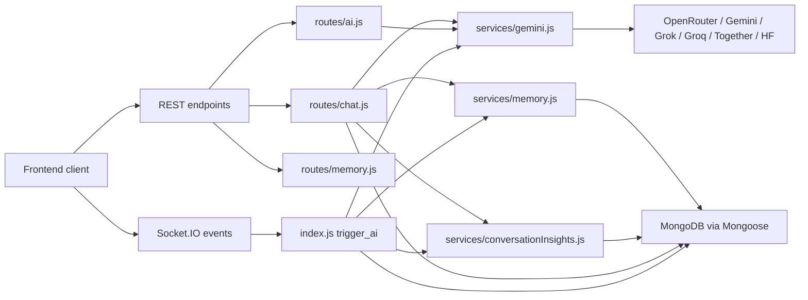

# ChatSphere Backend AI Documentation

## Purpose
This documentation set explains only the AI-related behavior in the `backend` folder. It is written for learning, onboarding, architecture review, and improvement planning. It does not try to document every non-AI feature in the product.

The docs are grounded in the editable source tree first:

- `index.js`
- `routes/ai.js`
- `routes/chat.js`
- `routes/conversations.js`
- `routes/memory.js`
- `routes/uploads.js`
- `routes/admin.js`
- `routes/settings.js`
- `services/gemini.js`
- `services/memory.js`
- `services/conversationInsights.js`
- `services/promptCatalog.js`
- `services/importExport.js`
- `services/messageFormatting.js`
- `services/aiQuota.js`
- `middleware/aiQuota.js`
- `middleware/rateLimit.js`
- `middleware/upload.js`
- `middleware/auth.js`
- `models/Conversation.js`
- `models/ConversationInsight.js`
- `models/MemoryEntry.js`
- `models/Message.js`
- `models/PromptTemplate.js`
- `models/Project.js`
- `models/Room.js`
- `models/User.js`
- `config/db.js`
- selected AI-relevant files under `dist/` when they expose architectural drift

## What This AI Backend Actually Does
The backend exposes two major AI interaction styles:

- REST-based solo AI chat through `/api/chat`
- Socket-based room AI through `trigger_ai`

It also exposes supporting AI helpers:

- smart replies
- sentiment analysis
- grammar correction
- memory extraction and retrieval
- conversation insights
- prompt template management
- attachment-assisted prompts
- model discovery and automatic model routing

## Learning Path
If you are new to the project, read in this order:

1. `docus/ai/01-ai-scope-and-file-map.md`
2. `docus/ai/02-runtime-entrypoints.md`
3. `docus/ai/03-ai-feature-overview.md`
4. `docus/ai/06-solo-chat-flow.md`
5. `docus/ai/07-room-ai-flow.md`
6. `docus/ai/18-memory-system-overview.md`
7. `docus/ai/22-conversation-insights-overview.md`
8. `docus/ai/27-database-write-paths.md`
9. `docus/ai/33-failure-modes.md`
10. `docus/ai/39-improvement-roadmap.md`

## Documentation Map
| Area | Docs |
|---|---|
| Orientation | `01`, `02`, `03` |
| API and socket surfaces | `04`, `05`, `30`, `31` |
| End-to-end AI flows | `06`, `07`, `08`, `09`, `10` |
| Model layer | `11`, `12`, `13`, `14`, `15`, `16`, `17` |
| Memory and insights | `18`, `19`, `20`, `21`, `22`, `23` |
| Context inputs | `24`, `25` |
| Guardrails and persistence | `26`, `27`, `28`, `29` |
| Visual summaries | `32` |
| Risks and scale | `33`, `34`, `35`, `36`, `39` |
| Review and redesign | `37`, `38` |

## System-at-a-Glance

## Important Caveat About Source of Truth
The repository contains both editable source files and a `dist/` tree that looks like output from a different or newer architecture in some places. This doc set treats the source tree as the primary implementation and uses `dist/` only to highlight drift, not to redefine current behavior.

