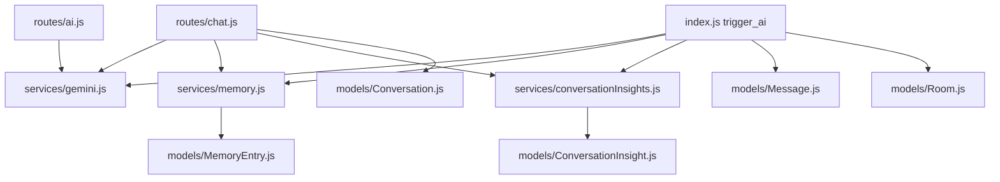

# 01. AI Scope and File Map

## Purpose
This document defines exactly what counts as an AI-related part of the backend and why each file matters.

## AI Scope
In this backend, AI features include:

- route handlers that accept AI requests
- socket handlers that trigger room AI replies
- provider integration and model selection logic
- prompt construction and prompt template storage
- memory extraction, retrieval, and lifecycle management
- conversation insight generation and refresh
- file attachment ingestion used to enrich prompts
- project context injection into prompts
- quota and rate-limiting applied to AI actions
- storage of AI responses, metadata, and memory references

## Primary AI Files
| File | Why it matters |
|---|---|
| `index.js` | socket-side room AI flow |
| `routes/chat.js` | solo chat endpoint |
| `routes/ai.js` | helper AI endpoints |
| `routes/conversations.js` | AI conversation reads and insight actions |
| `routes/memory.js` | memory CRUD, import, export |
| `routes/uploads.js` | attachment upload |
| `routes/admin.js` | prompt-template admin API |
| `routes/settings.js` | user AI toggles |
| `services/gemini.js` | model routing and provider calls |
| `services/memory.js` | memory extraction and retrieval |
| `services/conversationInsights.js` | summary generation |
| `services/promptCatalog.js` | prompt defaults and overrides |
| `services/importExport.js` | import/export workflows touching AI data |
| `models/Conversation.js` | solo AI history |
| `models/Message.js` | room AI messages |
| `models/MemoryEntry.js` | durable memory |
| `models/ConversationInsight.js` | persisted insight |
| `models/PromptTemplate.js` | prompt storage |
| `models/Project.js` | project context |
| `models/Room.js` | room `aiHistory` |
| `models/User.js` | AI settings |

## AI-Relevant `dist/` Files
These are useful for drift analysis:

- `dist/routes/ai.routes.js`
- `dist/routes/memory.routes.js`
- `dist/services/aiFeature.service.js`
- `dist/services/memory.service.js`
- `dist/services/promptCatalog.service.js`
- `dist/services/ai/gemini.service.js`
- `dist/socket/index.js`

## Relationship Map

## Rebuild Guidance
If rebuilding from scratch, preserve this layered boundary:

1. entrypoints for REST and socket
2. request policy and validation
3. prompt/context building
4. model routing and provider execution
5. persistence and post-processing
6. operational controls such as quota, logging, and fallbacks

