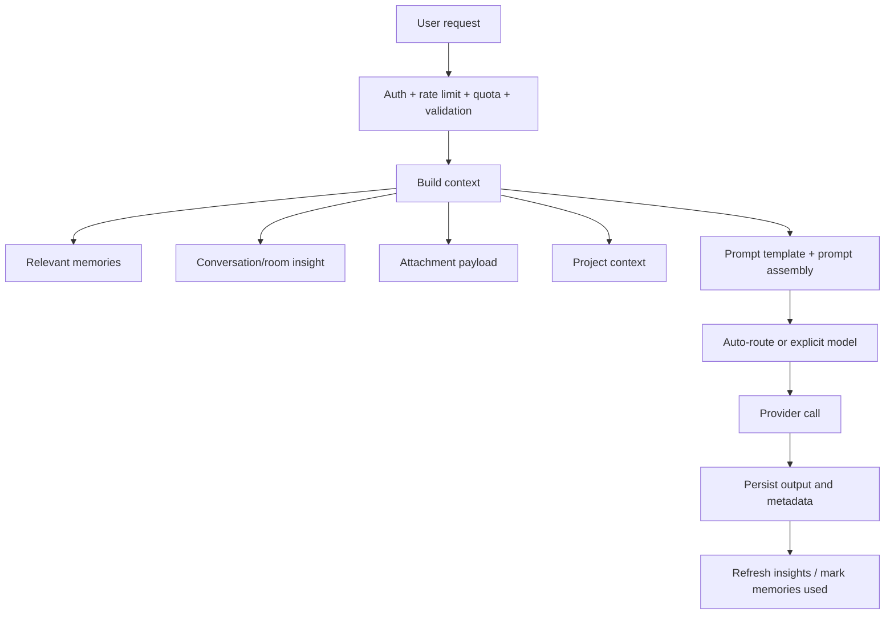

# 03. AI Feature Overview

## Purpose
This document gives a high-level map of every AI feature in the backend and explains how the pieces fit together.

## Feature Matrix
| Feature | Entry point | Main service path | Storage touched | Primary output |
|---|---|---|---|---|
| Solo AI chat | `POST /api/chat` | `services/gemini.js` | `Conversation`, `MemoryEntry`, `ConversationInsight` | assistant message |
| Room AI chat | `trigger_ai` socket event | `services/gemini.js` | `Room`, `Message`, `MemoryEntry`, `ConversationInsight` | AI room message |
| Smart replies | `POST /api/ai/smart-replies` | `getJsonFromModel` | none | 3 suggestions |
| Sentiment | `POST /api/ai/sentiment` | `getJsonFromModel` | none | sentiment payload |
| Grammar | `POST /api/ai/grammar` | `getJsonFromModel` | none | corrected text |
| Memory extraction | implicit in flows | `services/memory.js` | `MemoryEntry` | durable memory |
| Insights | implicit refresh and explicit actions | `services/conversationInsights.js` | `ConversationInsight` | structured summary |
| Prompt templates | admin routes + runtime reads | `services/promptCatalog.js` | `PromptTemplate` | prompt overrides |

## Core Pipeline

## Main Inconsistencies
- `services/gemini.js` does multi-provider work beyond Gemini
- source and `dist/` show different service layering
- room AI orchestration is embedded in `index.js`

