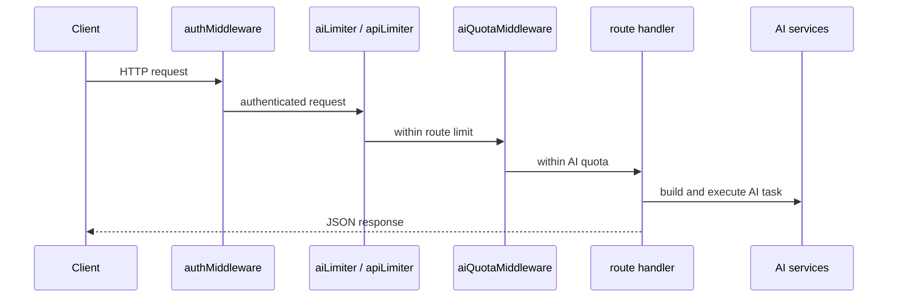

# 04. REST API Overview

## Purpose
This document explains the AI-related HTTP API surface, authentication rules, request/response patterns, and common behaviors shared across routes.

## AI REST Endpoints
| Method | Path | File | Purpose |
|---|---|---|---|
| `POST` | `/api/chat` | `routes/chat.js` | solo assistant conversation |
| `GET` | `/api/ai/models` | `routes/ai.js` | list configured/discovered models |
| `POST` | `/api/ai/smart-replies` | `routes/ai.js` | generate 3 reply suggestions |
| `POST` | `/api/ai/sentiment` | `routes/ai.js` | sentiment analysis |
| `POST` | `/api/ai/grammar` | `routes/ai.js` | grammar improvement |
| `GET` | `/api/conversations/:id/insights` | `routes/conversations.js` | fetch insight |
| `POST` | `/api/conversations/:id/actions/:action` | `routes/conversations.js` | summarize or extract |
| `GET` | `/api/memory` | `routes/memory.js` | list memories |
| `POST` | `/api/memory/import` | `routes/memory.js` | preview or import bundle |
| `GET` | `/api/memory/export` | `routes/memory.js` | export AI-related bundle |

## Authentication
`middleware/auth.js` expects:

```http
Authorization: Bearer <jwt>
```

## Common Request Pattern


## Risks
- helper endpoints perform AI work inside route handlers rather than dedicated services
- no strict schema validator beyond manual checks in source routes
- quota is per-process memory

